# 009：概率分布 📊

在本节课中，我们将要学习概率分布。概率分布是自动驾驶汽车用来表示其对世界内部信念的一种数学方式。通过理解概率分布，我们可以更好地掌握车辆如何表示不确定性，并利用传感器信息来更新其信念。

---

## 概述

上一节我们介绍了自动驾驶汽车如何感知环境并利用信息降低不确定性。本节中，我们来看看汽车如何用数学方法——即概率分布——来具体表示这种不确定性。

概率分布是一种数学工具，用于表示所有可能结果的不确定性。例如，在定位车辆时，可能的结果就是车辆所有可能的位置。

---

## 初始不确定性

当一辆车刚启动时，它完全不知道自己在哪。如何用数学表示这种初始的不确定性呢？

如果你完全不知道车辆位于世界何处，那么其位置的概率分布将看起来是完全平坦的。车辆在旧金山或在东京的概率是完全相同的。车辆位于任何特定位置的概率都是一个恒定值，在所有位置都相同。

因此，这个概率分布可以用一条水平的直线来表示，它显示了所有可能结果的概率。

---

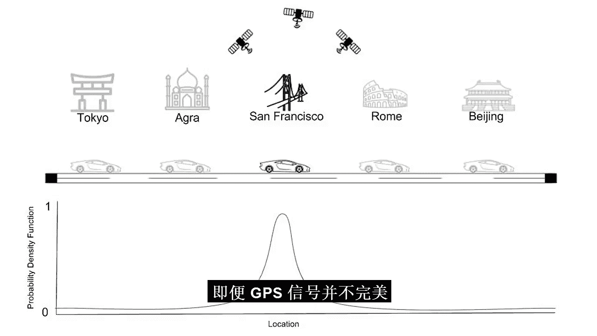

## 更新信念

但随着我们收集到更多信息，这个分布会发生变化。

假设我们获得了一个GPS传感器读数，它告诉我们车辆更靠近旧金山，而不是东京。那么，在GPS测量值附近的位置概率会上升，而远离GPS测量值的区域概率会下降。

即使GPS信号并不完美，你现在对车辆的可能位置也有了更多信息。车辆永远无法100%确定其位置，但通过感知，车辆增加了其确定性。概率分布的形状告诉你车辆最可能和最不可能的位置。

---

## 概率分布的应用

概率分布是一种非常有用的可视化并表示不确定性的方法，不仅适用于单车定位，也适用于跟踪车辆周围行人、自行车和其他移动车辆的位置。这些分布也用于表示传感器测量的不确定性。

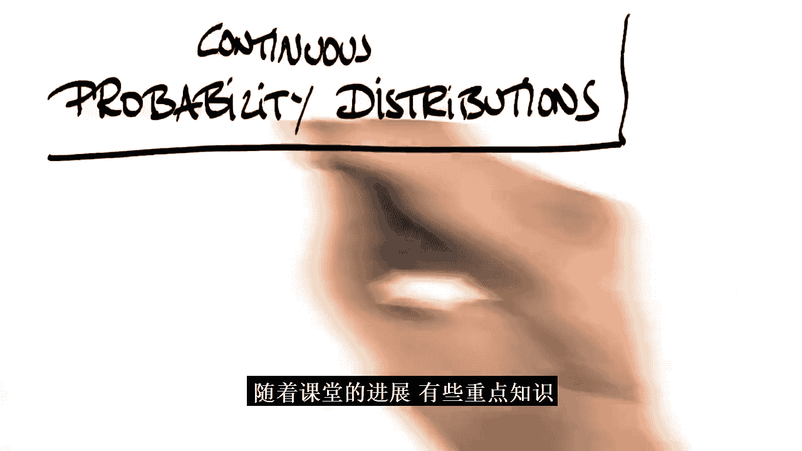

请记住，自动驾驶汽车是轮子上的机器人，因此从感知、测量到移动的一切过程都涉及某种不确定性。

在本课中，你将学习如何绘制和解释概率分布。这将为你学习车辆定位和物体跟踪做好准备。

---

## 连续分布

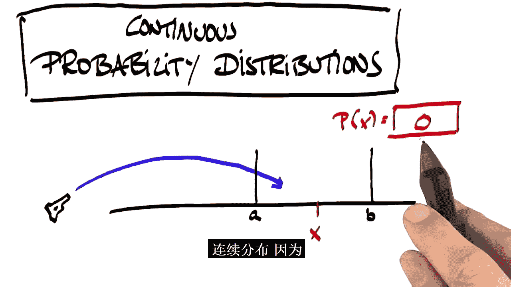

今天，我想更深入地谈谈概率分布，特别是所谓的连续分布，因为在本课程后续学习中，有一些注意事项你需要了解。

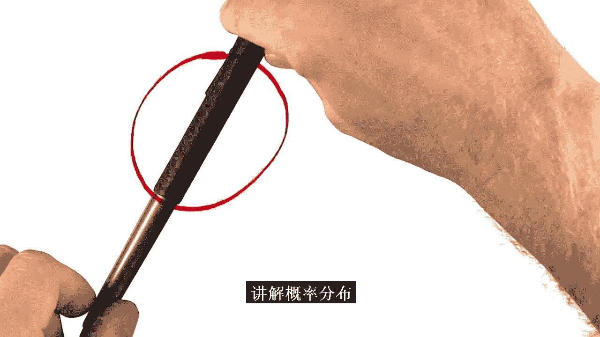

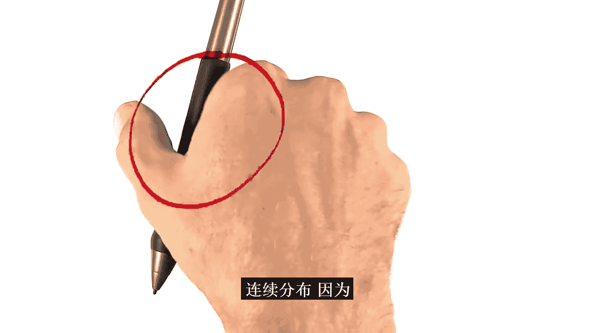

以下是一个新道具：一把Nerf枪。我想做一个实验：我发射一个抛射物，它会击中地面，比方说在A点和B点之间的某个位置，但我不知道具体是哪里。

考虑任意位置X。假设Nerf枪的角度和抛射物背后的压力都是随机的。那么，你选择的任何特定X点是正确位置的概率是多少？

答案是0，只能是0。因为这里的任何特定值都极其、极其不可能，其可能性小到我们无法赋予它一个非零的概率。

---

## 轮盘赌示例

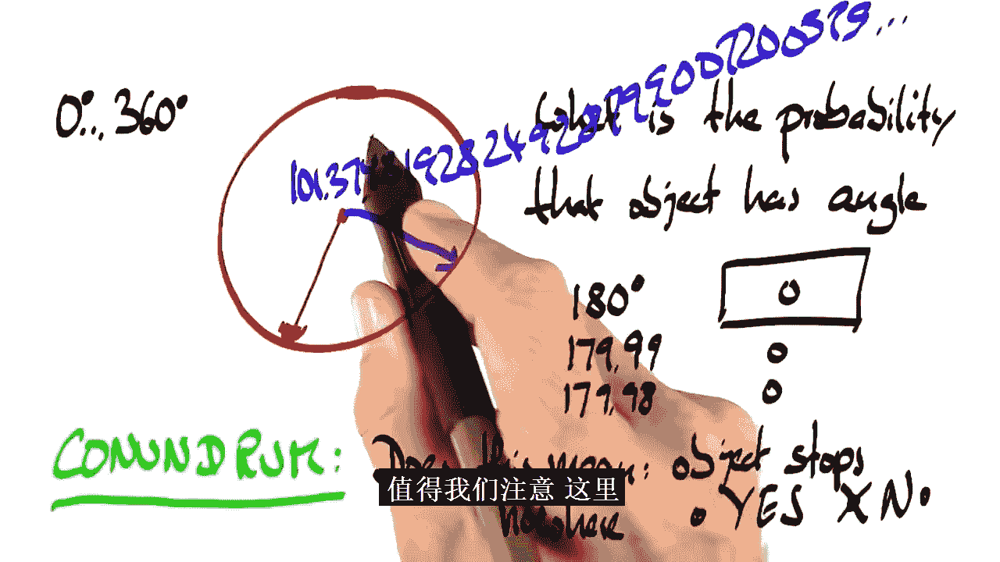

这是一个更常见的例子，叫做“命运之轮”。我们旋转一个物体，比如一个瓶子或一支笔，然后它会停在一个特定的角度。

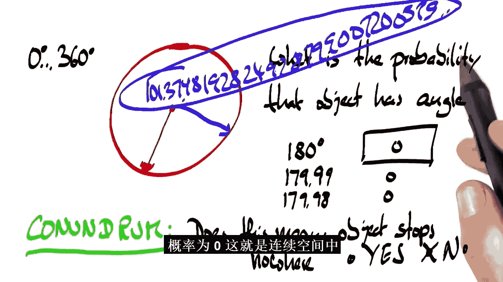

我们都知道角度在0到360度之间。那么，选择一个特定的角度，比如精确的180度，我们的物体停在这个精确角度的概率是多少？答案还是0。对于任何其他数字，如1、179.99、179.98等，每个角度的概率都是0。这是因为，要恰好得到那个精确到小数点后数位的角度，你几乎不可能做到。

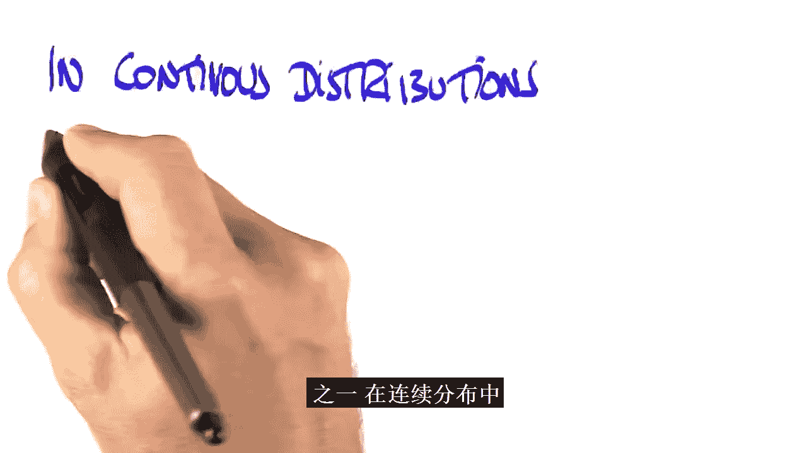

---

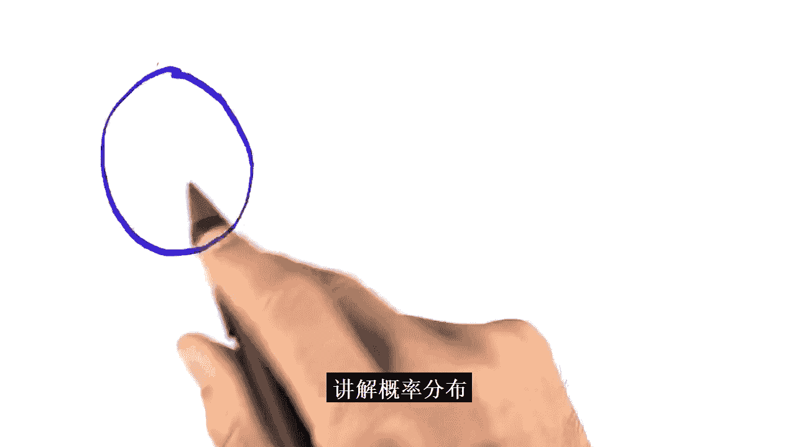

## 连续空间的悖论

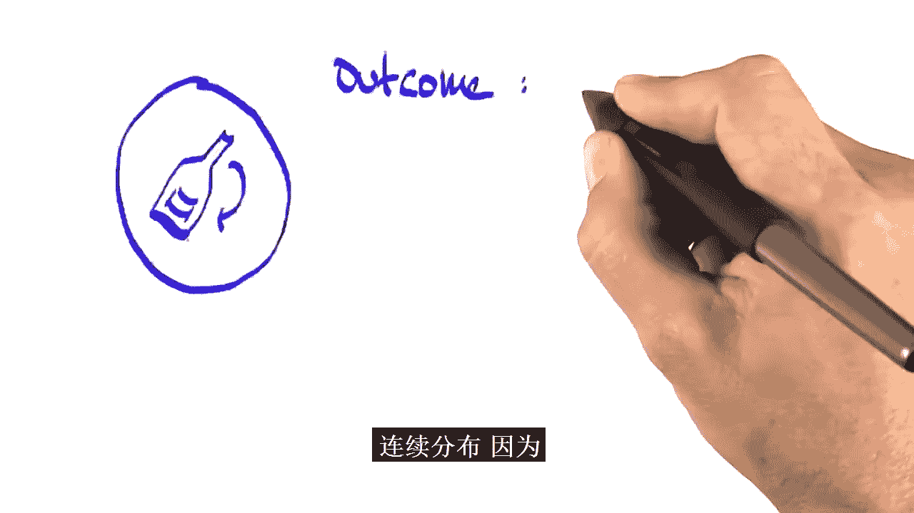

这就引出了一个难题：这是否意味着物体不会停在任何地方？是的，如果你认为它不停在任何地方。但显然，它会停下来。所以正确答案是“不”。

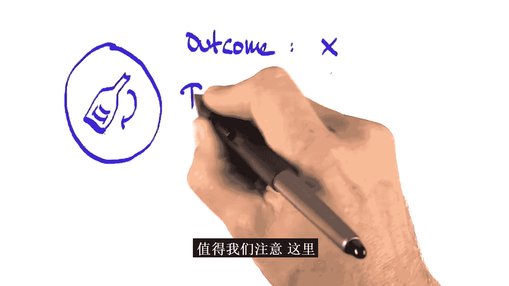

但奇怪的是，它会停在一个像这样的角度，比如101.374819度等等。而这个具体的数字，其概率确实是0。所以，无论结果是什么，那个特定的结果都极不可能，其概率为0。这是当你进入连续空间和连续分布时，概率论中一个奇特的现象：每个结果的概率都是0。这听起来完全违反直觉，也确实如此，但理解这一点很重要。

---

## 重新定义连续分布的处理方式

让我们重新定义如何处理连续分布。

再次以我们的圆盘和旋转的瓶子为例。称结果为X，即瓶子最终停下的角度。

问：X在0到180度之间的概率是多少？你猜对了，是二分之一，即50%的概率在0-180度之间，50%的概率在180-360度之间。

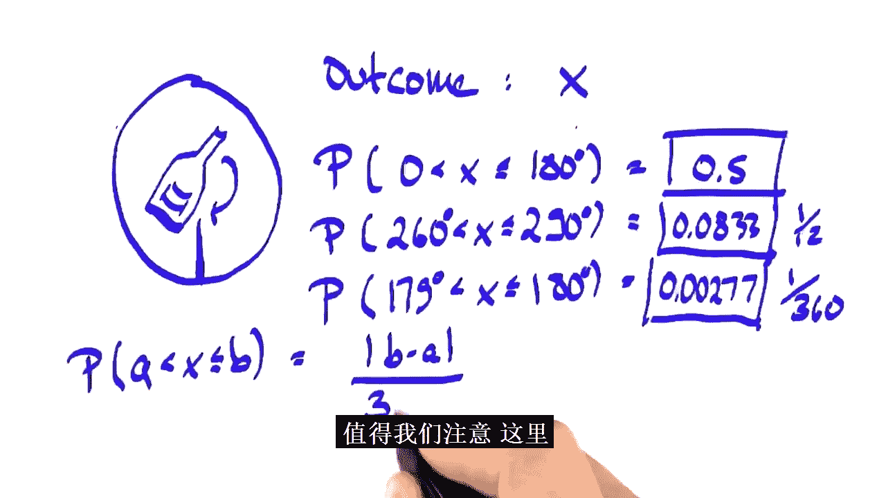

那么，在260度到290度这个区间内的概率是多少？这实际上是1/12，约等于0.0833。

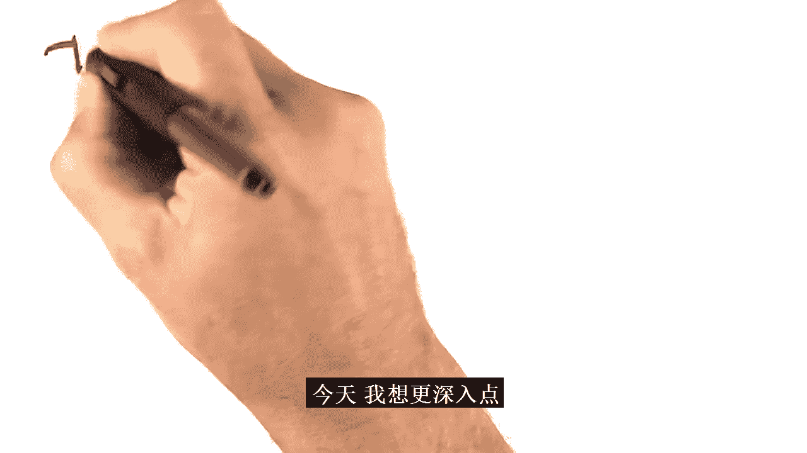

现在，让我们把这个区间变得非常非常小。假设我们从179度到180度，这是一个仅1度宽的微小范围。概率是多少？是0.002777，也就是1/360。

显然，对于任何由A和B定义的区间，其概率等于区间大小除以360。如果你答对了这些，你就理解了核心概念。

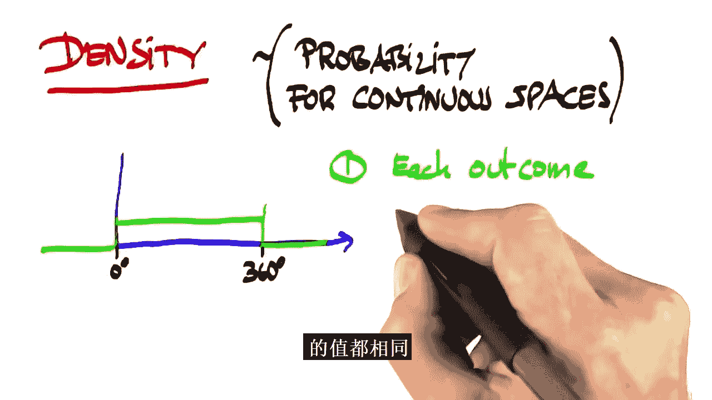

---

## 概率密度

现在，我要教你一个非常深刻的概念——概率密度。在连续空间中，我们可以把密度看作是概率的一种“代理”，但它并不完全等同于概率。

以瓶子为例。我们知道旋转瓶子的结果在0到360度之间。根据所学，你想把0概率分配给这个范围之外的任何值。但在这个范围内，我们希望赋予一个值，并表示：看，这里有一个函数，它使得这个区间内的每个结果都**同等可能**。

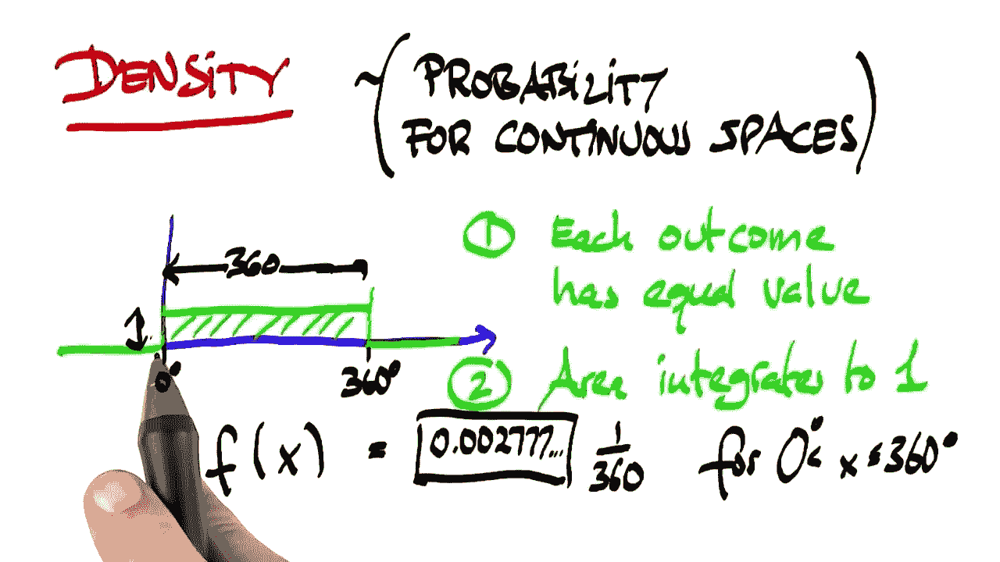

那么，请为我构造这个函数。我给你两个约束条件：
1.  在0到360的范围内，每个结果具有相同的值。
2.  这个函数下方的面积总和（积分）为1。

告诉我，对于介于0和360度之间的X，这个函数的值是多少？这里需要填入一个单一的数值。

答案是0.002777...，也就是1/360。理解方式是：这个区间的宽度是360，我们不知道高度（即我让你猜的值）。但如果我们将360乘以1/360，那么这个矩形的面积就变成了1。

---

## 另一个例子：出生时间

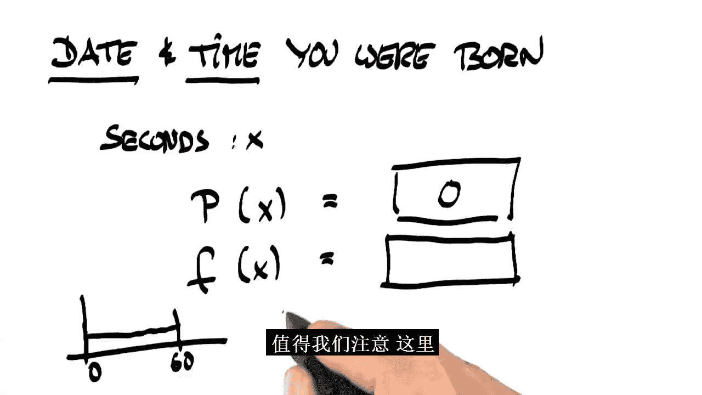

假设我们观察一个人的出生日期和时间，但具体只看时间中的“秒”部分。它可能正好在分钟开始时（即0秒），也可能在59.282秒，等等。

我们假设这是完全均匀的，没有偏好出生在分钟的前段或后段。现在问你两个问题：对于任何这样的时间戳秒数X，这个特定X的概率是多少？这个特定X的密度又是多少？

请注意，这是两个不同的问题。正确答案是：任何特定连续值的**概率**是0。但对于这个均匀分布，我们发现讨论的区间在0到60秒之间。因此，**密度**是1/60，即0.01666。

---

## 非均匀密度测验

在这个测验中，我们将研究非均匀密度。具体来说，我们观察人们一天中的出生时间。假设在这个练习中，在中午之前出生的可能性是下午或晚上的两倍。

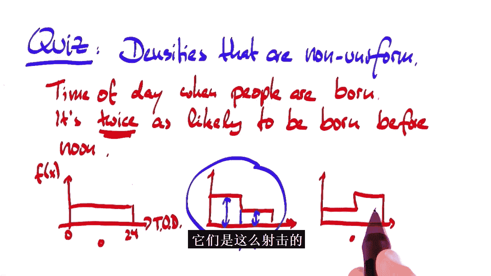

那么，观察一天中的时间及其密度，你认为形状最可能是以下哪种？
1.  上午密度高，下午密度低。
2.  全天均匀。
3.  上午密度低，下午密度高。

我会选择第一个。原因是：如果在中午之前出生的可能性是两倍，那么上午的密度应该是下午的两倍，这最好由第一个图描述。第二个图是均匀的，忽略了“两倍可能”的条件。第三个图则更糟，它强调下午而非上午。

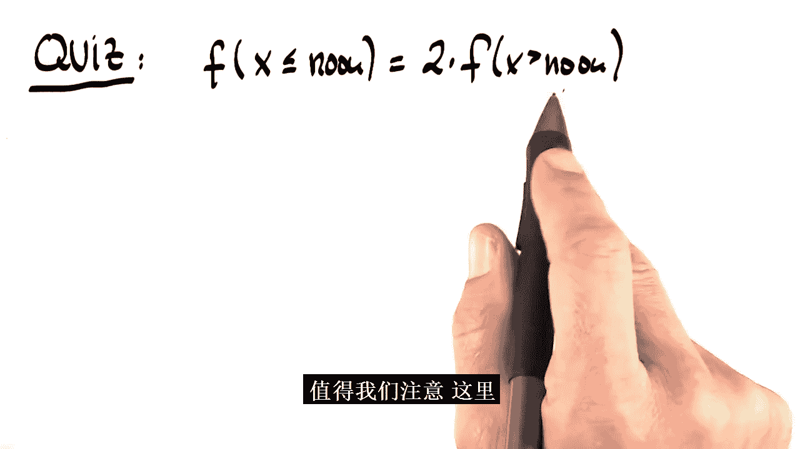

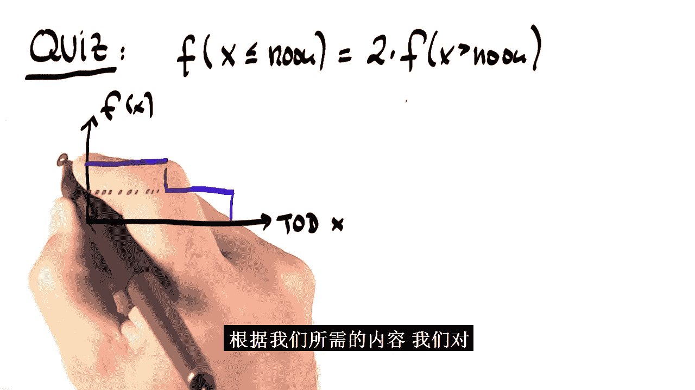

---

## 计算非均匀密度

现在进入困难部分：我想让你计算实际的密度。

我们知道，在中午之前出生的密度是中午之后的两倍。这是我的密度函数：`f(x)`，其中x是一天中的时间。你已经识别出了形状，现在有两个参数A和B（分别代表上午和下午的密度高度）。

我想让你算出A和B是多少，假设这里的基本单位是小时，水平区间总共有24小时。提示：确保下方的总面积总和为1。

我的计算方法是：这三个矩形的面积必须相同。因为它们加起来必须等于1，所以每个的面积正好是1/3。

从右边开始：如果面积是1/3，并且我们要覆盖12小时，那么 `B = (1/3) / 12 = 1/36 ≈ 0.0277`。
左边的面积完全相同，`A = (2/3) / 12 = 1/18 ≈ 0.0555`。

如果我们计算 `A * 12 + B * 12`，结果应该是1。因为 `(1/18)*12 = 2/3`，`(1/36)*12 = 1/3`，`2/3 + 1/3 = 1`。这只是个交叉验证。

这是一个你能够计算的非均匀密度的例子。如你所见，每个特定的出生时间概率恰好为0，这只是一个密度。

---

## 密度可以大于1

这里还有一个测验：我们从飞机上投下一个包裹，它需要3到3.5分钟落到地面。假设在这之间的概率密度是均匀的，再次问你同样的问题。

显然，3分钟之前和3.5分钟之后的密度是0。在3到3.5之间是均匀的，有一个值A。告诉我A是多少？

在我的计算中，A是2。原因是这里的归一化因子是0.5（从3到3.5）。用0.5乘以2得到面积为1，这正是我们想要的密度。

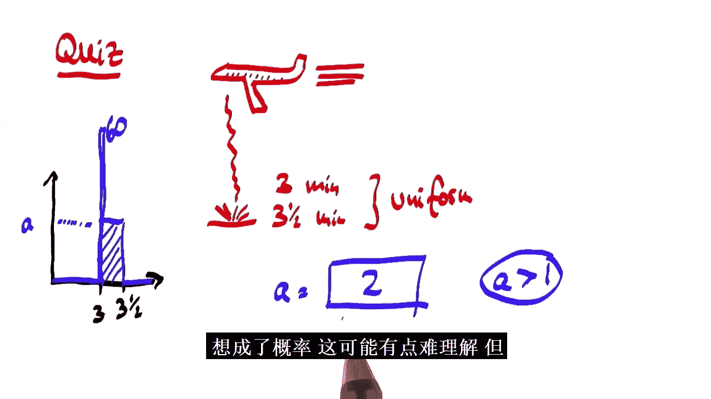

这里有趣的是：A大于1。概率永远不会大于1，它们以1为上界。但**密度可以大于1**。事实上，如果这个包裹在3分钟到3分01秒之间到达，那么这个密度将是60（因为一分钟有60秒，区间宽度是1/60小时，密度高度=1/(1/60)=60）。

所以，密度有可能大于1。如果你把它想象成概率，这可能会有点令人困惑。但你应该知道情况就是如此。

---

## 密度函数的条件

让我问另一个棘手的问题：对于一个函数F要成为（概率）密度函数，必须满足以下哪些条件？
-   必须处处为正
-   必须非负
-   必须连续
-   必须小于或等于1

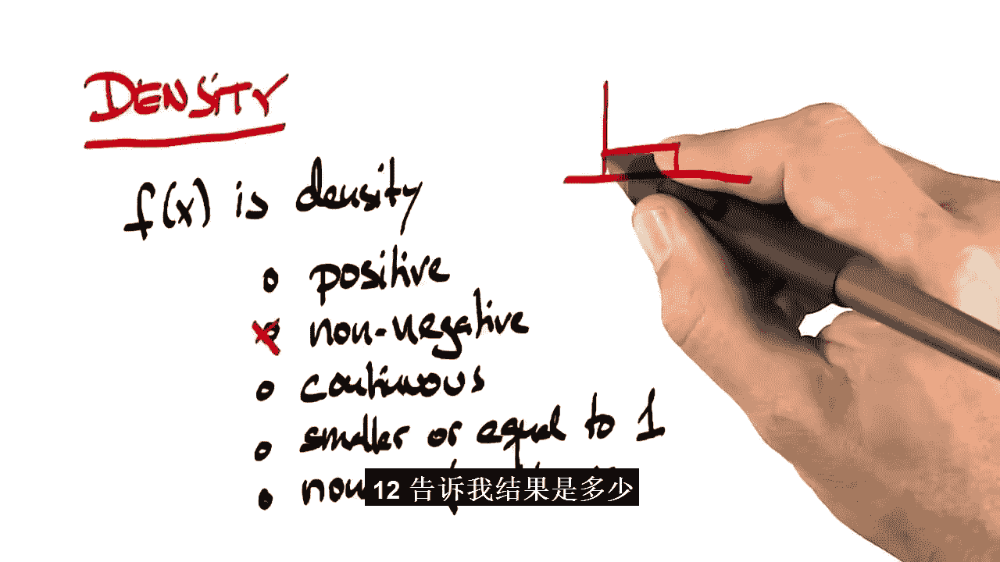

这是一个非常棘手的问题。显然，密度不必处处为正，只要非负就足够了。我举过在某个区间外密度为0的例子，0不是正数，只是非负数。

密度不必连续。我举过一个密度像这样的例子，在跳跃点处存在不连续性。所以“连续”是不正确的。

“小于或等于1”也非常棘手。我认为这是不正确的。原因如下：假设你有一个密度，它只给0到0.1之间的值赋予均匀概率。那么这个密度的高度可能是10（即1/0.1）。因此，密度有可能超过1。这是密度与概率的一个关键区别：概率总是小于或等于1，而密度可以大于1。

---

## 总结

本节课中，我们一起学习了概率分布和概率密度的概念。你现在知道了什么是均匀密度，也遇到了一种中间有“台阶”的新型密度。在后续课程中，我们将会看到形状更奇特的密度，比如高斯分布（又称正态分布）。在我们讨论大数定律和被称为中心极限定理的有趣内容之后，会再回到这个话题。

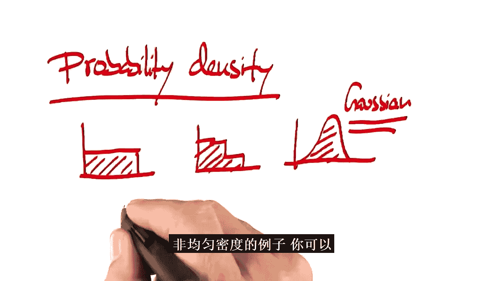

概率分布是自动驾驶汽车表示和推理不确定性的基石，掌握它对于理解车辆的定位、感知和决策过程至关重要。