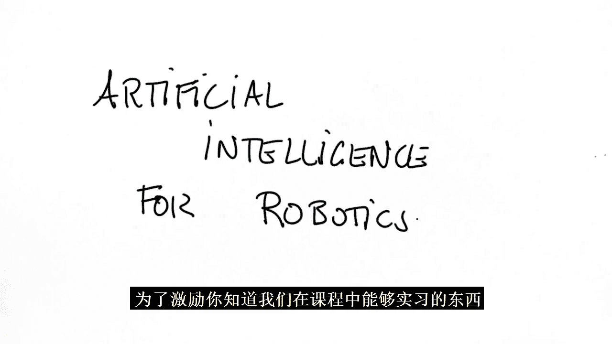
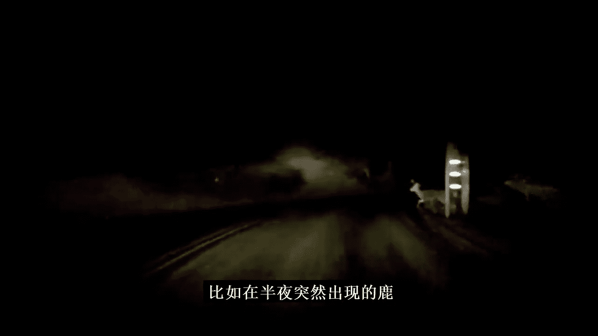
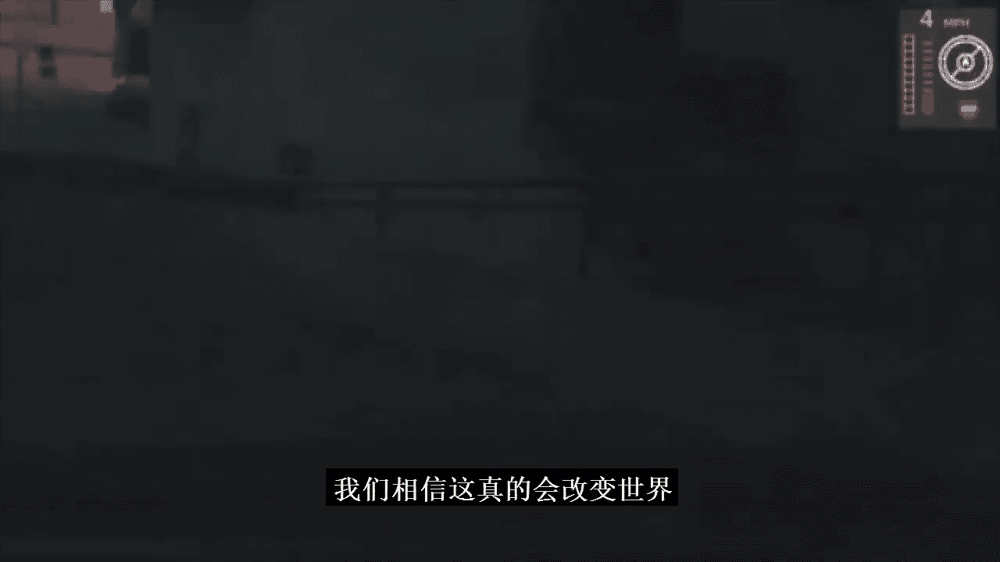
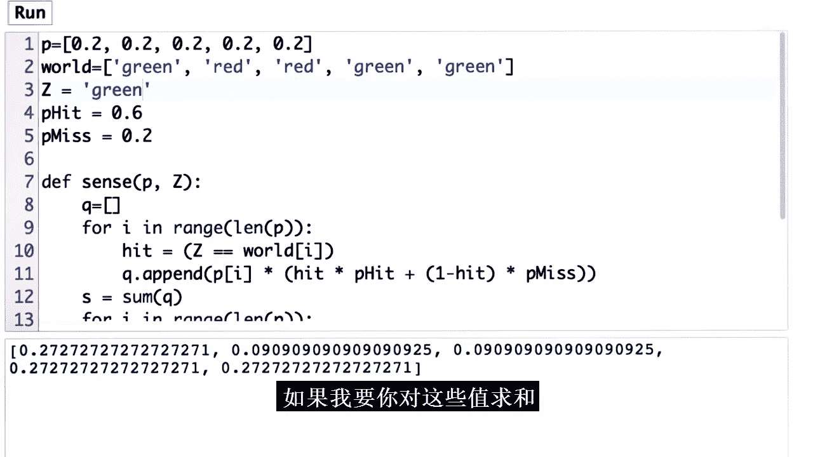
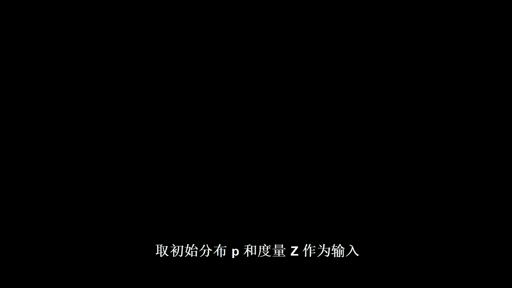
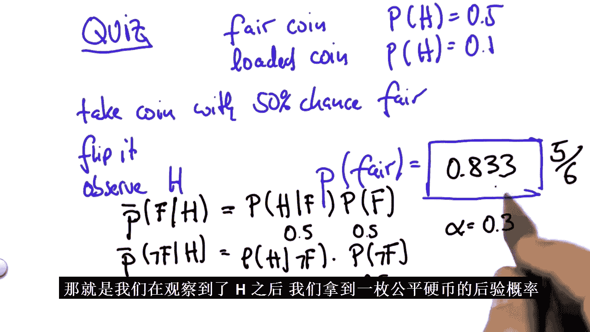

# 012：机器人定位 🧭

在本节课中，我们将要学习机器人定位的核心概念。定位是让机器人或自动驾驶汽车在环境中确定自身精确位置的关键技术。我们将从直观理解开始，逐步深入到数学原理和编程实现，最终你将能够编写一个基础的定位算法。

---

## 课程概述与动机 🚗

我大约六年前开始在优达学城工作，我的第一个项目就是帮助制作一门名为“如何编程一辆自动驾驶汽车”的课程。这门课程后来更名为“机器人人工智能”。你现在要观看的课程正是那门课程的第一课。在过去的六年里，我学习了大量关于自动驾驶汽车的知识，远超这门课程所涵盖的内容。但我仍然会反复观看这些课程，每次都能学到新东西。到目前为止，我可能已经看过你即将观看的这节课大约十次了。所以，如果你是优达学城的老学员，你可能会认出这节课以及在本纳米学位中会遇到的其他几节课。当然，如果你不想重看，可以跳过任何课程。但我怀疑，如果你选择观看，你很可能会学到一些新东西。无论如何，祝你学习愉快。

欢迎来到“机器人人工智能”课程。你将进入一个激动人心的七周课程，学习如何为自动驾驶汽车编程。

为了激发我们在这门课程中想要实现的目标，让我先展示一些视频。我对自动驾驶汽车的兴趣始于2004年的DARPA大挑战赛。当时，我在斯坦福大学的团队开发了Stanley，一个能够在莫哈韦沙漠中自主行驶的机器人。这辆车基于一辆大众途锐，配备了各种传感器，如GPS和激光雷达，并且能够在没有任何人工输入的情况下自主决策。

DARPA大挑战赛是2005年举行的一场政府赞助的比赛。我们看到机器人Stanley在沙漠中完全无人驾驶地移动。任务是沿着约130英里的沙漠小径行驶，最先完成比赛的队伍获胜。在比赛进行到约110英里时，我们超过了卡内基梅隆大学的另一辆机器人。我们的机器人能够导航非常陡峭的山路，并能够避免与岩石碰撞或坠崖。这一切都基于我将在本课程中教给你的能力。经过近7小时和131英里的行驶，我们的机器人第一个返回了起点，赢得了斯坦福大学200万美元的奖金，而Stanley也被收藏于美国史密森尼国家历史博物馆。

这项工作引领了城市挑战赛，我们建造了另一个名为Junior的机器人，最终获得了第二名。城市挑战赛是DARPA的后续比赛，要求汽车在交通中行驶。如果说大挑战赛是在静止的沙漠地面上进行，那么这次则是在一个模拟的城市环境中，机器人需要与其他交通参与者互动，并遵守交通规则，例如这里的左转。它必须能够以非常高的精度保持在车道内，适应对向交通，并像在一个小城市中一样自信地驾驶。

这促使谷歌进行了一系列被称为“谷歌自动驾驶汽车”的实验。我相信这些是目前最好的机器人汽车。我们看到其中一辆车在帕洛阿尔托的大学大道上行驶，就像人类司机一样，但这辆车是自动驾驶的。我们的汽车已经能够在加利福尼亚州和内华达州的部分地区行驶数十万英里，包括旧金山等市中心区域和繁忙的高速公路。在加利福尼亚的沿海小城蒙特雷，有大量的行人，这些都是完全自动驾驶的时刻，汽车能够应对诸如深夜车灯前的鹿，甚至是旧金山蜿蜒的伦巴底街等情况。

这就是我日常工作的一部分。我和我的团队非常热爱建造自动驾驶汽车。我们相信这将改变世界。而在这门课程中，我希望能够让你也具备这样的能力。那么，让我们开始吧。

---

## 定位问题与GPS的局限性 🗺️

我们要解决的第一个问题叫做“定位”。它涉及一个在空间中迷失的机器人。这可能是一辆汽车，也可能是一个移动机器人。这里有一个环境，而这个可怜的机器人对自己在哪里一无所知。同样，我们可能有一辆在高速公路上行驶的汽车，这辆车想知道它的位置：它是在车道内，还是在跨越车道线？

解决这个问题的传统方法是使用卫星。这些卫星发射信号，汽车可以感知到这些信号。这就是GPS（全球定位系统）。如果你的汽车有GPS，它会在仪表盘上显示地图和你的位置。然而，不幸的是，GPS的问题在于它并不十分精确。汽车认为自己在这里，但实际上可能有高达10米的误差，这是很常见的。如果你试图在10米误差的情况下保持在车道内，你会偏离很远，可能会在这里行驶并发生事故。因此，为了让我们的自动驾驶汽车能够使用定位技术保持在车道内，我们需要大约2到10厘米的误差精度，然后我们才能使用GPS在车道内行驶。

那么，问题来了：我们如何才能以10厘米的精度知道自己的位置？这就是定位问题。在谷歌自动驾驶汽车中，定位起着关键作用。我们记录道路表面的图像，然后使用我即将教给你的技术来精确找出车辆的位置，精度可达几厘米。这使得即使车道标记缺失，汽车也能保持在车道内。

定位涉及很多数学知识。但在深入数学细节之前，我想让你对基本原理有一个直观的理解。我想给你讲一个关于机器人如何定位的故事，然后我们可以一起学习数学，以便理解它。我还想让你编写自己的定位器，这样你就可以为自动驾驶汽车编程了。

---

## 定位的直观理解：一个故事 📖

让我从一个机器人所在的世界开始我的故事。我们假设机器人完全不知道自己在哪。我们将用一个函数来建模这种情况，我将在这个图表中画出这个函数。纵轴是这个世界中任何位置的概率，横轴对应这个一维世界中的所有地点。我将通过一个均匀函数来建模机器人当前对自己可能在哪里的信念（即它的困惑状态），这个函数为世界中的每个可能位置分配相等的权重。这就是最大困惑状态。

现在，为了定位，世界必须有一些独特的特征。我们假设世界上有三个不同的地标：这里有一扇门，这里有一扇门，后面还有一扇门。为了论证方便，我们假设它们看起来都一样，所以无法区分彼此，但你可以区分门和非门区域（墙壁）。现在，让我们看看机器人如何通过感知来定位自己。假设它感知到，并且感知到自己正站在一扇门旁边。所以它现在只知道自己很可能在一扇门旁边。这将如何影响我们的信念？

这是定位的关键一步。如果你理解了这一步，你就理解了定位。对门的测量将我们定义在可能位置上的信念函数，转换成一个新的函数，它看起来很像这样。对于三个与门相邻的位置，我们现在有更高的信念认为自己在那里，而所有其他位置的信念则降低了。这是一个概率分布，它为靠近门的位置分配了更高的概率，这被称为后验信念。“后验”这个词意味着这是在测量之后。

这个信念的关键方面是，我们仍然不知道自己在哪。有三个可能的位置。实际上，传感器可能出错，我们可能意外地在没有门的地方看到了门。所以，在这些地方仍然存在剩余的概率。但这三个凸起共同表达了我们当前对自己位置的最佳信念。这种表示是概率和移动定位绝对核心的部分。

现在假设机器人移动了。假设它向右移动了一定的距离。那么我们可以根据运动来移动信念。这可能看起来像这样。所以，这里的这个凸起移动到了这里，这个凸起移动到了这里，而这个凸起移动到了这里。显然，这是一个机器人。它知道自己的前进方向。在这个例子中，它正在向右移动。它大致知道自己移动了多远。然而，机器人运动有些不确定。我们永远无法确定机器人是否移动了。所以，这些凸起会比之前的那些稍微平坦一些。将信念向右移动的过程在技术上称为“卷积”。

现在让我们假设机器人再次感知。为了论证方便，我们假设它再次看到自己在一扇门旁边。所以测量结果和之前一样。现在，最神奇的事情发生了。我们最终将我们的信念（现在是第二次测量之前的先验信念）乘以一个看起来很像这里的函数，这个函数在每个门处都有一个峰值。结果产生了一个如下所示的信念。有几个小的凸起，但唯一真正大的凸起是这里的这个。这个凸起对应先验中的这个凸起。它是这个概率分布中唯一真正与门的测量结果相符的地方，而其他门的位置的先验信念都很低。因此，这个函数非常有趣。它是一个分布，将其大部分权重集中在“机器人在第二个门处”的正确假设下，而对远离门的位置赋予非常少的信念。此时，机器人已经定位了自己。

如果你理解了这一点，你就理解了概率和定位。所以恭喜你，你理解了概率和定位。你可能还不知道，但这确实是理解我今天将在课程中教你的一系列内容的核心方面。

---

## 编程练习：初始化信念 🧑‍💻

现在让我们进入第一个编程练习，一起编写机器人定位的第一个版本。

这里有一段程序代码，一个空列表。我希望你编程一个包含五个不同单元格或位置的世界，每个单元格具有相同的概率，即机器人可能位于该单元格。所以概率加起来等于一。这里有一个关于单元格 x1 到 x5 的简单测验。这些 x 中任何一个的概率是多少？索引 i 从 1 到 5。答案是 0.2，也就是总概率 1 除以 5 个网格单元格。

所以，在我们的 Python 界面中，我希望你获取这里的这段代码，它给 P 分配了一个空列表，然后修改代码，使 P 成为 5 个网格单元格上的均匀分布，表示为一个包含五个概率的向量。

这里有一个最简单的解决方案：你只需用五个 0.2 初始化向量。让我们看看你能否修改它，以生成一个长度为 n 的向量，其中 n 的值可以变化。对于宽度为 5 的情况，应该得到与之前相同的结果。但对于宽度为 10 的情况，我应该得到一个长度为 10 的向量，每个元素的值为 0.1。答案很简单，使用一个 for 循环，如下所示。你向列表追加 n 个元素，每个元素的大小为 1/n。这里的点非常重要，它给你浮点数版本。不幸的是，如果我们省略它，结果将只是零，这不是你想要的。

现在，我们能够初始化车辆在这个世界上的初始信念了。

---

## 测量更新：整合感知信息 📡

让我们看看这个机器人在其世界中的测量情况，这个世界有五个不同的网格单元格，x1 到 x5。假设其中两个单元格是红色的，另外三个是绿色的。和之前一样，我们为每个单元格分配 0.2 的均匀概率。现在我们的机器人可以进行感知，它看到的是红色。这将如何影响我对不同位置的信念？显然，x2 和 x3 的概率应该上升，而 x1、x4 和 x5 的概率应该下降。

现在我将告诉你如何用一个非常简单的规则——乘法，将这个测量结果整合到我们的信念中。对于颜色正确的单元格（任何红色单元格），将乘以一个相对较大的数字，比如 0.6。这个数字看起来小，但正如我们稍后将看到的，它实际上是一个大数字。而所有绿色单元格将乘以 0.2。我们看看这些数字的比例。那么，在红色单元格中的可能性似乎大约是在绿色单元格中的三倍，因为 0.6 是 0.2 的三倍。

让我们为这五个单元格中的每一个进行乘法运算。你能告诉我结果会是什么吗？按照我所说的方式乘以测量结果。请为这五个框填写数字。答案很明显，对于红色单元格，我们得到 0.12，而对于绿色单元格，我们得到 0.04，这是 0.2 乘以 0.6 与 0.2 乘以 0.2 的结果。原则上，这就是我们的下一个信念。但它有一个问题：它不是一个有效的概率分布。原因是概率分布的总和必须始终为 1。所以，如果你问所有这些值的总和是多少，你会发现它加起来不等于 1。请键入所有这些值的总和。如果我们把这些值加起来，得到 0.36。

为了将其变回概率分布，我们现在将每个数字除以 0.36。换句话说，我们进行归一化。所以，请在这五个字段中输入将 0.04 或 0.12 除以 0.36 的结果，并请检查这些数字的总和是否确实为 1。0.12 除以 0.36 等于 12 除以 36，也就是三分之一，或 0.333。0.04 除以 36 等于 4 除以 36，也就是 1/9。如果你看这些数字，三分之一加三分之一再加三个九分之一（即另一个三分之一）正好等于一。所以这是一个概率分布，通常写成以下形式：在观察到测量 Z 后，每个单元格 i（i 可以从 1 到 5）的概率。概率学家也称之为给定测量 Z 后位置 X_i 的后验分布。

让我们来实现这一切。这是我们的初始分布。同样，这是我们颜色正确或错误的因子。让我们首先从一个未归一化的版本开始。编写一段代码，输出在相应位置乘以因子后的 P。

一种方法是显式地遍历这五个不同的情况（从 0 到 4），并手动乘以未命中或命中的情况。这并不特别优雅，但可以完成工作。当我点击运行按钮时，我们得到了正确的答案。这是未归一化的。我的下一个问题是：你能打印出这些值的总和以便归一化它们吗？修改程序，让你得到所有 P 的总和。事实证明，Python 提供了一个名为 `sum` 的函数。如果你现在点击运行按钮，你会得到正确的答案。

我想让这更美观一些。我将引入一个变量 `world`。对于五个单元格中的每一个，`world` 指定单元格的颜色：绿、红、红、绿、绿。此外，我将测量 Z 定义为红色。你能定义一个名为 `sense` 的函数吗？这是一个测量更新函数，它以初始分布 P 和测量 Z 以及其他全局变量作为输入，并输出一个归一化的分布 Q，其中 Q 反映了我们的输入概率（将是 0.2 等）与相应的命中或未命中因子的非归一化乘积，具体取决于这里的颜色是否一致。

所以，调用 `sense(p, Z)`，我期望得到与之前相同的向量作为输出，但现在是以函数的形式。我希望这里有一个函数的原因是，稍后当我们构建定位器时，我们将对每个测量反复应用这个函数。所以这个函数应该真正响应任何任意的 P 和任意的 Z（无论是绿色还是红色），并给我非归一化的 Q，也就是向量 0.04, 0.12 等等。

这是我的解决方案：我从一个空列表开始，并使用 `append` 命令随时间构建它，通过迭代我的输入概率 P 中的所有元素来实现。我设置一个二进制标志 `hit`，判断我接收到的测量结果是否与我从那个列表中预期的第 i 个网格单元格的颜色相同。如果是这种情况，`hit` 为正（True），我们将 P 乘以 `p_hit`。如果为假，则 `hit` 值为 0，`1 - hit` 将为 1，所以你将 P 乘以 `p_miss`。我构建列表，返回它并运行它。输出是预期的 0.04, 0.12, 0.12, 0.04 和 0.04。

让我们采用相同的代码片段，修改它以给我一个有效的概率分布。请修改此代码，使其对函数 `sense` 的输出进行归一化，使其总和为一。这是我用来编程的三行代码：首先，我使用 `sum` 函数计算向量 Q 的总和，这使其变得非常容易。然后我遍历 Q 中的所有元素，并将其除以 S（即归一化因子）。当我运行它时，我得到 1/9, 1/3, 1/3, 1/9 和 1/9。

我刚刚实现了定位的绝对关键功能，称为测量更新。让我们回到我们的例子，看看你刚刚编程的惊人之处。我们有一个位置上的均匀分布。每个位置的概率为 0.2。然后你编写了一段代码，使用测量结果将这个先验转化为后验，其中两个红色单元格的概率是绿色单元格的三倍。你做的正是我一开始直观地告诉你的定位秘诀：你通过整合测量结果，将一个位置上的概率分布操作成一个新的分布。

事实上，让我们回到代码中，测试当我们将测量变量中的红色替换为绿色时，你的代码是否能得到好的结果。所以请将你的测量变量改为绿色，并重新运行你的代码，看看是否得到正确的结果。我现在将这里的红色替换为绿色。我重新运行我的代码，输出这些有趣的数字。其中某处是除以 44 的结果。但你可以看到，第一个、第四个和第五个网格单元格的值比中间的网格单元格大得多。

---

## 处理多个测量 🔄

让我们深入研究。事实上，我希望你稍微修改一下这段代码，以便我们能够处理多个测量。所以，我们将用一个名为 `measurements` 的测量向量来代替 Z。我假设我们先感知红色，然后感知绿色。你能修改代码，使其更新概率两次，并在整合了这两个测量后给我后验概率吗？事实上，你能修改它以处理任意长度的任何测量序列吗？

修改很简单。我们将多次调用 `sense` 过程。实际上，我们有多少次测量就调用多少次，也就是这里的 for 循环。我们获取测量列表的元素，将其应用于当前的信念，然后递归地将该信念更新到自身。在这种情况下，我们运行两次，打印输出。对于这个具体的例子，我们得到了均匀分布。这些都大约是 0.2。原因是，我们为每个单元格向上乘以了一次 0.6，向下乘以了一次 0.2，这些影响对每个单元格总体上是相同的。因此，我们在这里得到了相同的输出。这非常了不起。

---

## 机器人运动：精确与不精确移动 🚶

在我们完成定位之前，我想谈谈机器人运动。假设我们有一个在这些单元格上的分布，比如这个：1/9, 1/3, 1/3, 1/9, 1/9。即使我们不知道机器人在哪里，它移动了，并且它向右移动。实际上，我们处理这个问题的方式是假设世界是循环的。所以如果它从最右边的单元格掉下来，它会发现自己回到最左边的单元格。假设我们确切地知道，世界正好向右移动了一个网格单元格。考虑到循环运动，你能告诉我在这运动之后，所有这五个值的后验概率是多少吗？答案是，所有这些都向右移动了。所以最左边的 1/9 移动到这里，1/3 移动到这里，最后，最右边的 1/9 发现自己到了左边。在精确运动的情况下，我们有一个完美的机器人。我们只是将概率按实际运动量移动。这是一个退化的情况，但它是首先编程的好例子。让我们来编程这个。

我将定义一个函数 `move`，输入为分布 P 和一个运动数字 U，其中 U 是向右或向左移动的网格单元格数。我希望你编写一个函数，在移动后返回新的分布 Q，其中如果 u 等于 0，Q 与 P 相同；如果 u 等于 1，所有值都严格向右移动 1；如果 u 等于 3，则移动 3；如果 u 等于 -1，则向左移动。

请用参数 P 和向右移动 1 来调用该函数。我已经注释掉了我的测量部分，因为现在我只想做运动更新，不做测量更新。除此之外，我将使用一个非常简单的 P，它在第二个位置为 1，其他地方为 0。否则，如果你使用均匀的 P，我们甚至无法看出运动是否被正确编程。

这是解决方案：我们从一个空列表开始。我们遍历 P 中的所有元素。这是关键的一行：我们将通过访问相应的 P 来逐个元素地构造 Q，而 P 被移动了 U。如果这个移动超出了 P 在左侧的范围，我们应用以状态数（本例中为 5）为参数的模运算符。这里有一个减号的原因是，为了将分布向右移动（U=1），我们需要在 P 中找到左边一个位置的元素。所以，与其直接向右移动 P，我所做的是通过搜索机器人可能来自哪里来构造 Q，这当然是从左边来的。因此，这里有一个减号。思考一下，这有点不简单，但当你继续定义概率卷积并将其推广到有噪声的情况时，这将很重要。

---

## 不精确的世界运动模型 📉

现在让我们谈谈不精确的世界运动。我们再次给定五个网格单元格。假设机器人执行其动作时，有很高的概率（0.8）正确完成，但有 0.1 的概率发现自己未达到预期动作，还有 0.1 的概率发现自己超出了目标。你可以为其他 U 值定义相同的情况。假设 U 等于 1，那么有 0.8 的机会，它会到达这里；0.1 的机会，它停留在同一个元素；0.1 的机会，它向前跳了两个元素。这是一个不精确世界运动的模型。这个机器人试图移动 U 个网格单元格，但偶尔会达不到目标或超出目标。这是一个更常见的情况。机器人移动时会积累不确定性。建模这一点非常重要，因为这是定位困难的主要原因，因为机器人不是很精确。

现在我们将首先从数学方面研究这个问题。我将给你一个先验分布，我们将使用 U 等于 2 的值。对于恰好移动两步的运动模型，我们相信有 0.8 的机会，我们为机器人欠冲或过冲恰好一步的情况分配 0.1 的概率。这有点像用这个公式写的，其中“2”得到 0.8 的概率，“1”和“3”最终得到 0.1 的概率。所以我现在要问你，对于我在这里写出的初始分布，你能给我运动后的分布吗？答案是我们预期的字段（位置 2）有 0.8，两个邻居（位置 1 和 3）有 0.1，而这里（位置 0 和 4）是 0 和 0。做得好。

让我们用不同的初始分布再做一次。假设我们在这个单元格中有 0.5，在这个单元格中有 0.5。记住，这是一个循环运动模型。所以任何从右边掉下来的东西，你都会在左边找到。你能再次为 U=2 填写后验分布吗？这是一个相当棘手的问题，我将分两个阶段回答。让我们看看这里的 0.5。其中的 0.8，也就是 0.4，最终到达这里。其中的 0.1，也就是 0.05，最终到达这里。我写得这么小的原因是，这还不是完全正确的答案。

让我们看看另一个 0.5。0.4 移动两步（1, 2）最终到达这里的左边，但 0.1 未达到目标，使得这里有 0.05，第二个网格单元格有 0.05。有趣的是，对于右边的单元格，有两种可能的方式可以到达那里：要么通过过冲（从第二个单元格开始），要么通过欠冲（从右边的单元格开始）。所以这里的总概率是这两项之和，0.1。所以最终答案是 0.4, 0.05, 0.05, 0.4 和 0.1。

让我给你最后一个例子，我假设一个均匀分布，我希望你为我填写运动后的分布。答案，结果证明，到处都是 0.2。原因是，每个网格单元格的可能性相同，应用这个运动模型仍然会使每个网格单元格的可能性相同。所以让我们选其中一个，比如这里的这个。我们可能通过三种不同的方式到达这里：也许我们从下一个（位置 2）开始，并且我们的运动顺利。这给我们 0.2 乘以 0.8。也许我们从 x1 开始并且我们过冲，这给我们 x1 单元格的 0.2 乘以过冲的 0.1。或者也许我们从下一个（位置 3）开始并且我们欠冲，这是 0.2 乘以 0.1。当我们把这些加起来，我们发现它等于 0.2 乘以 1，因为这里的因子加起来正好是 1，得到 0.2，结果是 0.2。你可以将相同的逻辑应用于所有其他单元格。这里的这个可能来自这个、这个和这个，其中这个是 0.8，另外两个是 0.1。这被称为卷积。正如我们稍后将看到的，有一种非常好的数学方法来写这个，叫做全概率定理。但就目前而言，我想编程实现它。

所以我要给我们一个精确概率 0.8，过冲概率 0.1，欠冲概率 0.1，我希望你修改 `move` 过程以适应这些额外的概率。这是实现的一种方法：我们引入辅助变量 `s`，我们在三个不同的步骤中构建它。我们像以前一样乘以精确设置的 P 值乘以 `p_exact`。然后我们再加上另外两项，乘以 `p_overshoot` 或 `p_undershoot`，其中我们通过比 U 多走一步来过冲，或者通过少走一步来欠冲。然后我们把它们加起来，最后将这些的总和附加到我们的输出概率 Q 中。当我们运行这个时，对于我们的示例先验 [0, 1, 0, 0, 0]，我们得到答案 [0, 0.1, 0.8, 0.1, 0]。

---

## 极限分布与平衡性质 ⚖️

这里有一个有点复杂的问题给你，你可能想检查一下你的直觉。假设我们有五个网格单元格，初始分布为第一个网格单元格分配 1，其他所有单元格分配 0。让我们假设我们执行 U=1，这意味着在每个动作中，有 0.8 的机会我们向右定位 1，有 0.1 的机会我们根本不移动，还有 0.1 的机会我们跳过并移动两步。再次假设世界是循环的，所以每次我从右边掉下来，我都会发现自己回到左边。问题是：假设我运行了无限多次运动步骤。那么我实际上得到了一个所谓的极限分布。所以，如果我的机器人从不感知，但一直执行动作“向右移动 1”，在我们的小环境中，最终会发生什么？最终所谓的极限或平稳分布会是什么？你可能已经猜对了，是均匀分布。这背后有一个直观的推理：每次我们移动，我们都会丢失信息。也就是说，在初始分布中，我们确切地知道我们在哪里。一步之后，我们有 0.8 的机会，但 0.8 会随着我们继续移动而下降到更小的值，比如 0.64，依此类推。绝对信息量最少的分布是均匀分布，它没有任何偏好。这确实是移动很多很多次的结果。有一种数学推导方法，但我可以证明一个高度相关的性质，即平衡性质。假设我们取 x4，我们想理解某个时间 t 的 x4 如何对应于前一个时间对所有变量的分布。为了使这个分布平稳，它必须相同。换句话说，x4 的概率必须等于 0.8 乘以 x2 的概率加上 0.1 乘以 x1 的概率加上 0.1 乘以 x3 的概率。这正是我们之前做的计算，我们问：在 x4 的机会是多少？嗯，你可能来自 x2、x1 或 x3。这些概率 0.8、0.1 和 0.1 决定了你来自那里的可能性。当分布不再移动时，这些必须在极限情况下成立。现在，你可能认为有很多不同的方法来解决这个问题，而 0.2 只是一个解，但事实证明 0.2 是唯一的解。所以如果我们在这里代入 0.2，这里代入 0.2，这里代入 0.2，我们得到 1 乘以 0.2，右边是 0.2，所以很明显，这里的这些 0.2 满足定义有效极限解所必需的平衡。

然后让我们回到我们的代码，并移动很多次。让我们移动两次。所以请编写一段代码，让机器人移动两次，从如下所示的初始分布开始 [0, 1, 0, 0, 0]。这是一段移动两次相同距离的代码。现在的输出是一个向量，其中 0.66 是最大值，不再是 0.8。让我们移动一千次。编写一段移动 1000 步并给我最终分布的代码。这是我的代码：我们有一个 1000 步的循环。我们移动 1000 次，然后打印相应的分布。正如预期的那样，每个情况都是 0.2。

---

## 完整的定位循环：感知与移动 🔁

哇，你基本上已经编程实现了谷歌自动驾驶汽车的定位，尽管你可能还不知道。让我告诉你我们现在的位置。我们讨论了测量更新，讨论了运动，并编写了这两个例程 `sense` 和 `move`。现在，定位无非就是 `sense` 和 `move` 的迭代。有一个初始信念。它被投入这个循环。如果你先感知，它进入左侧。然后定位循环到这个移动、感知、移动、感知、移动、感知、移动、感知、移动、感知的循环。每次机器人移动时，它都会丢失关于世界在哪里的信息。这是因为远程运动不精确。每次它感知时，它都会获得信息。这表现在运动后概率分布稍微平坦一些，更分散一些；感知后则更集中一些。事实上，作为脚注，有一种称为“熵”的信息度量。这里，你可以写它的多种方式之一是每个网格单元格概率的期望对数似然。不深入细节，这是分布所拥有的信息量的度量，并且可以证明，更新步骤（运动步骤）使熵减少，而测量步骤使其增加。所以你实际上是在丢失和获取信息。

我现在很想在我们的代码中实现这个。所以，除了我们之前有的两个测量（红色和绿色）之外，我将给你两个运动：1 和 1，这意味着世界向右移动，然后再向右移动。你能计算后验分布吗？如果它们先感知到红色，然后向右移动 1，然后感知到绿色，然后再向右移动。让我们从均匀先验分布开始。这里的例程很短：它遍历测量。它假设有与测量一样多的运动。它首先像以前一样应用测量，然后应用运动。完成后打印输出，输出很有趣。世界有一个绿色、一个红色、一个红色、一个绿色和一个绿色字段。机器人看到了红色，接着是向右移动，然后是绿色。这表明它很可能从网格单元格 3 开始，这是两个红色单元格中最右边的一个。它正确地读取了红色，然后向右移动了一个，所以正确地看到了绿色，再次向右移动，现在发现自己最有可能在最右边的单元格。这只是看这里的这些值，没有任何概率数学和任何想象。让我们看看输出：0.02, 0.1, 0.08, 0.16, 0.38。非常正确，它们最有可能将这个位置分配给最右边的单元格，考虑到这里的这个观察序列，这是应该的。

让我们选一个不同的地方。假设机器人看到了两次红色。所以它感知红色，移动，感知红色，再次移动。最可能的单元格是哪个？运行程序，我们发现最可能的单元格是第四个单元格。这是有道理的，因为红色-红色与世界的最佳匹配就在这里和这里。在看到第二个红色后，世界仍然向右移动了一个，发现自己位于第四个单元格，如这里所示。

---

## 庆祝与总结 🎉

现在，我想和你一起庆祝你刚刚编写的代码。这是一段实现了谷歌自动驾驶汽车定位方法精髓的软件。正如我一开始所说，汽车确切知道其相对于道路地图的位置是绝对关键的。为什么道路不是涂成绿色和红色？那里有车道标记。代替这里的这些绿色和红色单元格，我们插入了车道标记相对于路面颜色的颜色。每个时间步不仅仅是一个观察，而是整个观察流，整个相机图像。但你可以用相机图像做同样的事情。所以，只要你能将模型中的相机图像与测量中的相机图像对应起来，然后，一段代码，并不比你刚才自己编写的代码复杂多少，就负责定位谷歌自动驾驶汽车。所以你刚刚实现了一个让谷歌汽车能够自动驾驶的主要、主要功能。

所以我认为你应该真的感到高兴和自豪。你应该对自己说：我刚刚实现了定位。那么，谷歌为什么要花这么长时间来制造一个能够自动驾驶的产品呢？嗯，我认为情况有点困难。有时道路会被覆盖和改变，我们正在努力解决这个问题。但你实现的是谷歌自动驾驶汽车定位的核心。

让我总结一下我们学到的基本要点。我们了解到，定位维护着一个覆盖机器人可能所在的所有可能位置的函数，其中每个单元格都有一个相关的概率值。测量更新函数或 `sense` 无非是一个乘积，我们取这些概率值并根据具体测量结果将其乘以上下调整的因子。因为乘积可能违反概率和为 1 的事实，所以是乘积后跟归一化。运动是卷积。这个词本身可能听起来很神秘，但它真正的意思是，对于运动后的每个可能位置，我们逆向推导情况，猜测可能来自哪里，然后收集并添加相应的概率。所以，像乘法和加法这样简单的东西解决了所有的定位问题，并且是自动驾驶的基础。

---

## 形式化定义：概率、贝叶斯规则与全概率 📚

我想花几分钟时间回顾一下定位的形式化定义。我将介绍概率，并问你很多问题。形式上，我们定义一个概率函数为 P(x)。它是一个值，下界为 0，上界为 1。X 通常可以取多个值。我们有五个网格单元格的情况。假设只能取两个值。只有两个网格单元格，X1 和 X2。如果 X1 的概率是 0.2，那么 X2 的概率是多少？请以测验形式输入数字，显然答案是 0.8，因为概率总是加起来等于 1。让我问第二个问题，我知道这并不特别难。如果 P(x1) 等于 0，那么 P(x2) 是多少？答案是 1，你答对了。

对于我们有五个不同网格单元格的世界，我们知道前四个的概率是 0.1。第五个也是最后一个网格单元格的概率是多少？答案是 0.6。它们必须加起来等于 1。我们减去四次 0.1，即 0.4，得到 0.6。所以这是一个有效的概率。

让我们看看测量，它们会导致一种叫做贝叶斯规则的东西。你可能以前听说过贝叶斯规则。它是概率推理中最基本的考虑因素。但贝叶斯规则真的非常简单。假设 X 是我的网格单元格，Z 是我的测量。那么测量更新试图计算在看到测量后对我位置的信念。这是如何计算的？嗯，在我们的定位例子中计算起来真的很容易。现在我要让它更正式一些。事实证明，贝叶斯规则看起来像这样。这可能有点令人困惑。但它所做的是取我的先验分布 P(X)，并为每个可能的位置乘以看到红色或绿色瓦片的几率，然后输出，如果我们只看分母，就是我们之前有的未归一化的后验分布。认出这个：这是我们的先验，这是我们的测量概率。如果我们对所有网格单元格都这样做，我们在这里加上小索引 i。那么，先验网格单元格乘以测量概率的乘积，如果测量对应于正确的颜色，这个乘积就大；如果对应于错误的颜色，就小。这个乘积给了我们网格单元格的未归一化后验分布。你记得这个，因为你编程实现了它：你编程实现了先验概率分布和一个数字之间的乘积。

归一化现在是这里的常数 P(Z)。从技术上讲，那是在没有任何位置信息的情况下看到测量的概率。但让我们不要混淆自己。理解正在发生什么的最简单方法是认识到，这里的这个函数为每个网格单元格分配一个数字，而 P(Z) 没有网格单元格作为索引。所以无论你考虑哪个网格单元格，P(Z) 都是相同的。这里的技巧是：无论 P(Z) 是什么，因为最终的后验必须是一个分布，通过归一化这些未归一化的乘积，我们将精确计算出 P(Z)。换句话说，P(Z) 是所有 i 的这个乘积的总和。所以这使得贝叶斯规则非常简单。它是我们的先验分布与测量概率的乘积，我们知道测量概率在颜色正确时大，否则小。我们这样做，并将其分配给所谓的未归一化概率，我用 P 上面的一个小横杠表示。然后我计算归一化因子，我称之为 alpha，它是所有这些的总和。然后我只是归一化。所以我的最终概率将是未归一化概率的 1/alpha。这正是我们所做的，这正是贝叶斯规则。

让我在一个完全不同的例子中问你贝叶斯规则，看看你是否理解如何应用贝叶斯规则。这次是关于癌症检测。这是一个统计学课程中常研究的例子。假设存在某种类型的癌症。但这种癌症很罕见，只有千分之一的人患有这种癌症，而千分之九百九十九的人没有。用癌症的概率和非癌症的概率来说明。假设我们有一个测试，测试结果可以是阳性或阴性。如果患有癌症，测试呈阳性的概率是 0.8；如果没有癌症，测试呈阳性的概率只有 0.1。所以很明显，测试与是否患有癌症有很强的相关性。这是一个非常困难的问题。你能为我计算一下，在我刚刚收到阳性测试结果的情况下，患有癌症的概率吗？让我强调一下，这不是一个简单的问题，但基于我教给你的知识，你应该能够计算出这个结果。把癌症/非癌症想象成机器人的位置，把阳性想象成观察到的颜色是否正确。

答案是 0.0079，换句话说，尽管测试结果呈阳性，但你患有癌症的机会只有 0.79%，即千分之七点九。你将应用与我们之前完全相同的机制。根据贝叶斯规则，C（癌症）给定阳性（Pos）的未归一化结果简单地是我的先验概率 0.001 乘以 0.8（癌症状态下阳性结果的概率）的乘积，结果是 0.0008。相反事件（非癌症事件）给定阳性测试的未归一化概率是 0.999 乘以 0.1，显然是 0.0999。我们的归一化因子是这两者的总和，即 0.1007（只需把这两个包加在这里）。所以，将未归一化概率 0.0008 除以 0.1007，得到 0.0079。我们刚刚应用贝叶斯规则计算了在看到测试结果后患有癌症的一个非常复杂的概率。

---

## 运动：全概率定理 🎲

让我们看看运动，结果将是我们称之为全概率的东西。你记得我们关心一个网格单元格 X_i，我们问在运动之后，位于 X_i 的机会是多少。为了表示前后，让我添加一个时间索引。所以这里的 T 是时间的索引，我用大写字母写它，以免与索引 i（网格单元格）混淆。你可能记得我们计算这个的方式是查看机器人可能来自的所有网格单元格，这些单元格由时间 T-1 的索引 j 表示。我们查看这些网格单元格在时间 T-1 的先验概率，并将其乘以我们的运动命令将我们从 X_j 带到 X_i 的概率，这写成一个条件分布，如下所示。

这正是我们实现的。如果这里有我们的网格单元格，我们问一个时间步后关于这里的一个特定单元格，我们会将这里的 0.8、这里的 0.1 和这里的 0.1 组合到这个网格单元格的概率中，这与这里的公式相同。这是 X_i。我们找到 X_i 的先验概率的方法是，遍历所有我们可能来自的可能位置（所有不同的 j），查看先验概率乘以给定我的运动命令（在这种情况下是向右移动 1）我从 j 转移到 i 的概率。在概率术语中，人们经常这样写：P(A) 等于对所有 B 求和，P(A|B) 乘以 P(B)。这只是你在教科书中找到的方式。你可以直接看到 A 对应于时间 T 的位置 i，而所有不同的 B