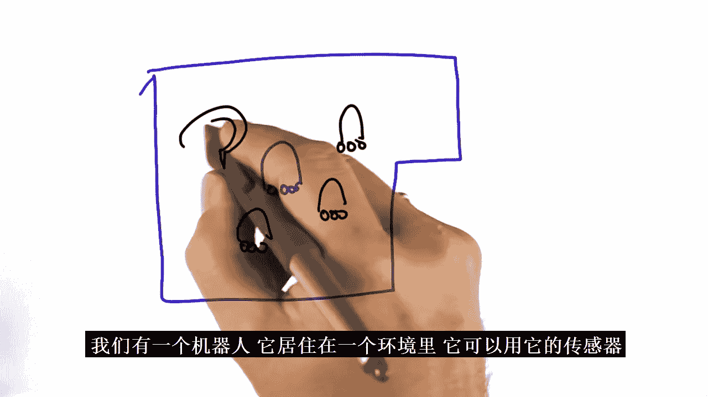
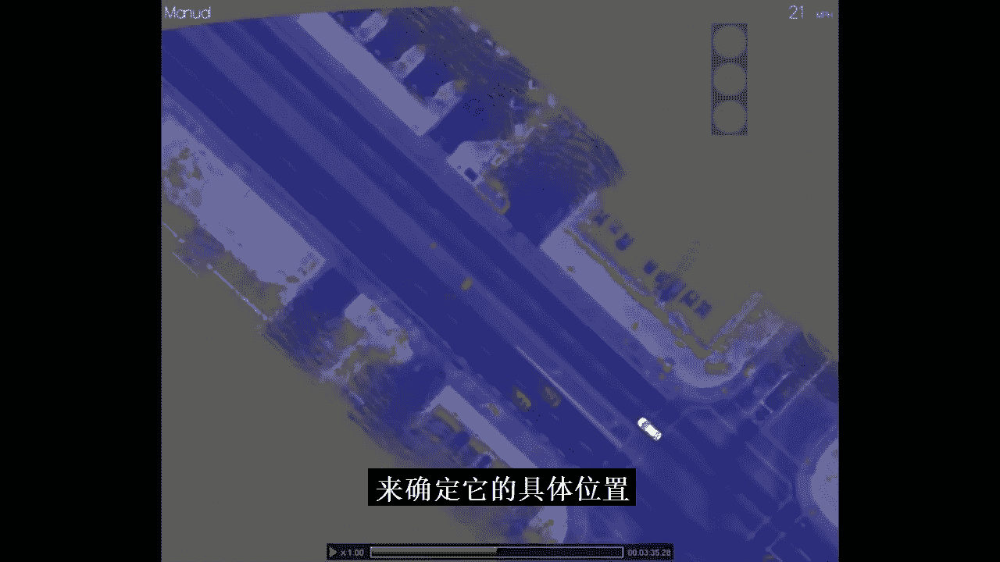
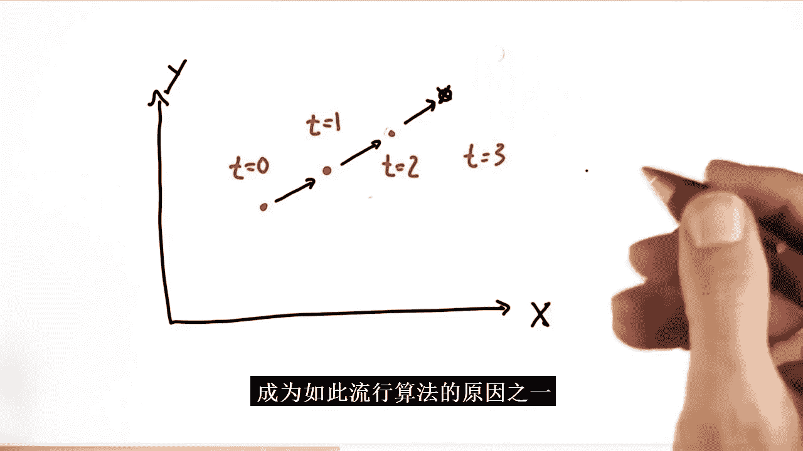

# 015：卡尔曼滤波器简介 🚗

在本节课中，我们将要学习卡尔曼滤波器。这是一种用于估计系统状态的极其流行的技术，在无人驾驶汽车中，它被广泛应用于追踪其他车辆的位置和速度，从而避免碰撞。我们将从基础概念开始，逐步理解其工作原理，并最终用代码实现一个一维的卡尔曼滤波器。

## 从斯坦福的自动驾驶汽车说起

上一节我们介绍了定位的概念，本节中我们来看看如何追踪其他车辆。



课程始于对斯坦福大学自动驾驶汽车“Junior”的介绍。这辆车装备了多种传感器，使其能够实现自动驾驶。



以下是使这辆车能够自动驾驶的关键设备：

*   **激光雷达**：一个旋转的激光测距仪，每秒扫描10次，产生约一百万个数据点。它的主要功能是探测其他车辆，防止碰撞。这些距离测量数据是卡尔曼滤波器的重要输入。
*   **立体摄像头系统**：用于视觉感知。
*   **GPS天线**：用于全球定位，与本地传感器数据结合，估计车辆在世界中的位置。

这些传感器共同感知环境，为卡尔曼滤波器提供原始数据。

## 为什么需要追踪？

在定位中，我们让机器人确定自己在环境中的位置。但在自动驾驶中，我们还需要知道其他车辆在哪里，以及它们移动得有多快。

仅仅知道其他车辆的当前位置是不够的。为了安全驾驶，避免未来的碰撞，我们必须能够预测它们将要去往何处。这对于车辆、行人和自行车骑行者都至关重要。

因此，本节课我们将讨论**追踪**技术，而核心方法就是**卡尔曼滤波器**。

## 卡尔曼滤波器概览

卡尔曼滤波器与我们上一节课讨论的概率定位方法（蒙特卡洛定位）非常相似。

它们的主要区别在于：
*   **卡尔曼滤波器**估计的是**连续**状态，并用**单峰**分布（高斯分布）来表示不确定性。
*   **蒙特卡洛定位**将世界划分为离散位置，可以处理**多峰**分布。

两者都适用于机器人定位和车辆追踪。后续课程中我们还会学习**粒子滤波器**，它是另一种能处理连续、多峰分布问题的方法。但目前，我们专注于卡尔曼滤波器。

让我们从一个简单例子开始理解其思想。

## 一个直观的例子

假设我们通过传感器观测一个物体的位置，在时间 T=0, 1, 2, 3 分别得到如下测量点。


基于这些观测，你会预测该物体在 T=4 时刻的位置在哪里？你可能会预测它在这里。


这是因为你从观测中估计出了物体的速度方向。假设速度没有剧烈变化，你就会预测下一个位置在此处。

卡尔曼滤波器正是这样工作的：它接收像这样（可能带有噪声和不确定性）的观测点，自动估计物体的未来位置和速度。谷歌自动驾驶汽车就使用类似的方法，基于雷达和激光数据来理解其他交通参与者的状态。

## 高斯分布：卡尔曼滤波器的核心

在蒙特卡洛定位中，我们用离散网格的直方图来表示概率分布。卡尔曼滤波器则使用**高斯分布**（又称正态分布）来表示连续空间中的概率。

高斯分布是一个关于位置空间的连续函数，其曲线下面积为1。在二维平面上，它看起来像一个钟形曲线。

对于一个一维空间变量 `x`，高斯分布由两个参数定义：
*   **均值（μ）**：分布的中心点。
*   **方差（σ²）**：分布的宽度，衡量不确定性。

其数学公式如下：

`f(x) = (1 / √(2πσ²)) * exp(-0.5 * (x - μ)² / σ²)`

其中，`exp` 是指数函数。公式中的常数项是为了确保总概率为1，但在理解原理时我们可以暂时忽略它。核心部分是 `exp(-0.5 * (x - μ)² / σ²)`，它描述了概率随 `x` 偏离 `μ` 的程度呈指数衰减。

**方差 σ² 是衡量不确定性的关键**：σ² 越大，分布越宽，我们对真实状态越不确定；σ² 越小，分布越窄，我们越确定。

在追踪其他车辆时，我们显然更希望得到一个方差小、更确定的分布，因为这意味着我们更了解目标车辆的位置，碰撞风险更低。

## 编程实现高斯函数

让我们通过编程来巩固对高斯函数的理解。我们需要实现一个函数，给定 `mu`, `sigma2`（方差）, 和 `x`，返回高斯函数值。

```python
def f(mu, sigma2, x):
    '''一维高斯函数'''
    return 1 / (sqrt(2 * pi * sigma2)) * exp(-0.5 * (x - mu)**2 / sigma2)
```

测试：当 `mu=10`, `sigma2=4`, `x=8` 时，计算结果约为 `0.12`。当 `x=mu=10` 时，函数取得最大值。

## 卡尔曼滤波器的两个步骤

与定位问题类似，卡尔曼滤波器循环执行两个步骤：
1.  **测量更新**：利用传感器测量值来修正当前估计。
2.  **运动预测**：根据系统的运动模型来预测下一个状态。

这两个步骤分别对应概率论中的：
*   **测量更新 → 贝叶斯规则 → 乘法（乘积）**
*   **运动预测 → 全概率定理 → 卷积（加法）**

我们将首先探讨更复杂的测量更新步骤。

## 测量更新：融合高斯分布

假设我们有一个关于车辆位置的**先验分布**（Prior），它是一个较宽的高斯分布（不确定性大）。然后我们得到一个**测量值**，它也是一个高斯分布，但更窄、更精确（不确定性小）。

测量更新的目标是计算一个**后验分布**（Posterior），它融合了先验信息和新的测量信息。这通过将两个高斯分布**相乘**来实现。

结果会怎样呢？
*   **新的均值（μ‘）**：是先验均值（μ）和测量均值（ν）的加权平均。**不确定性更小的分布权重更大**。因此，新的均值会偏向于更确定的那个均值。
*   **新的方差（σ²‘）**：满足公式 `1/σ²‘ = 1/σ² + 1/r²`，其中 `r²` 是测量方差。**新的方差比任何一个输入分布的方差都小**。这意味着融合后我们获得了更多信息，估计变得更加确定！

这是一个关键且反直觉的结论：融合两个信息源（即使其中一个不太确定）总能得到一个比任一单独信息源更确定的估计。

计算公式如下：

```
新均值 μ‘ = (r² * μ + σ² * ν) / (σ² + r²)
新方差 σ²‘ = 1 / (1/σ² + 1/r²)
```

让我们通过编程实现这个更新步骤。

```python
def update(mean1, var1, mean2, var2):
    '''测量更新：融合两个高斯分布（相乘）'''
    new_mean = (var2 * mean1 + var1 * mean2) / (var1 + var2)
    new_var = 1 / (1/var1 + 1/var2)
    return new_mean, new_var
```

测试这个函数，例如输入先验 `(10, 8)` 和测量 `(13, 2)`，得到后验约为 `(12.4, 1.6)`。可以看到均值偏向更确定的测量值13，且方差（1.6）小于先验方差（8）和测量方差（2）。

## 运动预测：叠加高斯分布

预测步骤要简单得多。假设我们当前有一个位置估计的高斯分布，然后我们执行一个运动（例如向右移动一定距离），这个运动本身也有不确定性（由高斯分布建模）。

预测的结果是：
*   **新的均值（μ‘）** = 旧均值（μ） + 运动均值（u）
*   **新的方差（σ²‘）** = 旧方差（σ²） + 运动方差（r²）

直观上，移动后你的预期位置增加了，但由于运动不精确，你的不确定性也增加了。

计算公式非常简单：

```
新均值 μ‘ = μ + u
新方差 σ²‘ = σ² + r²
```

编程实现如下：

```python
def predict(mean1, var1, mean2, var2):
    '''运动预测：叠加两个高斯分布（加法）'''
    new_mean = mean1 + mean2
    new_var = var1 + var2
    return new_mean, new_var
```

测试：当前状态 `(8, 4)`，运动 `(10, 6)`，预测新状态为 `(18, 10)`。

## 构建一维卡尔曼滤波器

现在，我们可以将更新和预测函数组合起来，形成一个完整的一维卡尔曼滤波器。它将处理一系列的测量值和运动命令。

以下是主程序逻辑的示例：

```python
# 初始估计 (可以非常不确定)
mu = 0
sig = 10000

# 测量和运动序列
measurements = [5, 6, 7, 9, 10]
motions = [1, 1, 2, 1, 1]

# 测量和运动的不确定性
measurement_sig = 4
motion_sig = 2

# 卡尔曼滤波循环
for i in range(len(measurements)):
    # 测量更新
    mu, sig = update(mu, sig, measurements[i], measurement_sig)
    print(f‘更新后: [{mu}, {sig}]‘)
    # 运动预测
    mu, sig = predict(mu, sig, motions[i], motion_sig)
    print(f‘预测后: [{mu}, {sig}]‘)
```

运行这个程序，滤波器会逐步处理数据。即使初始估计很差（例如位置为0），随着更多测量信息的融入，估计值也会被“拉”向真实值。最终，在经历一系列移动后，它能准确估计出最终位置（例如从位置0开始，经过移动和测量，最终估计位置接近11）。

## 扩展到高维：追踪位置与速度

现实世界中的状态空间通常是多维的。例如，我们可能想同时追踪一辆车的二维位置（x, y）和二维速度（vx, vy）。这才是卡尔曼滤波器真正强大的地方。

考虑一个场景：传感器（如雷达）只提供位置观测（x, y）。
*   在时间 T=0，观测到目标在点A。
*   在时间 T=1，观测到目标在点B。
*   在时间 T=2，观测到目标在点C。

一个多维卡尔曼滤波器能够做一件非常神奇的事情：**即使它从未直接测量速度，它也能通过连续的位置观测推断出目标的速度（vx, vy）**。然后，它利用这个估计的速度，对未来位置做出更准确的预测。


这种从间接观测中推断隐藏状态（如速度）并用于预测的能力，是卡尔曼滤波器在人工智能和控制理论中如此受欢迎的重要原因之一。

## 总结

本节课中我们一起学习了卡尔曼滤波器的基础知识。

我们了解到：
1.  **卡尔曼滤波器**是一种用于估计系统状态（如位置、速度）的递归算法，特别擅长处理带有噪声的传感器数据。
2.  其核心是用**高斯分布**来表示状态的不确定性。
3.  算法循环执行两个步骤：**测量更新**（利用新数据修正估计，使用乘法）和**运动预测**（根据模型预测未来状态，使用加法）。
4.  测量更新的一个关键结果是**融合信息会减少不确定性**。
5.  我们成功**编程实现了一个一维卡尔曼滤波器**，它能够处理序列化的测量和运动数据。
6.  卡尔曼滤波器可以扩展到高维，从而能够**推断未直接测量的变量（如速度）**，并进行更准确的预测。



通过本节课的学习，你已经掌握了卡尔曼滤波器的基本原理和实现方法，这是理解现代自动驾驶和机器人追踪技术的重要基石。