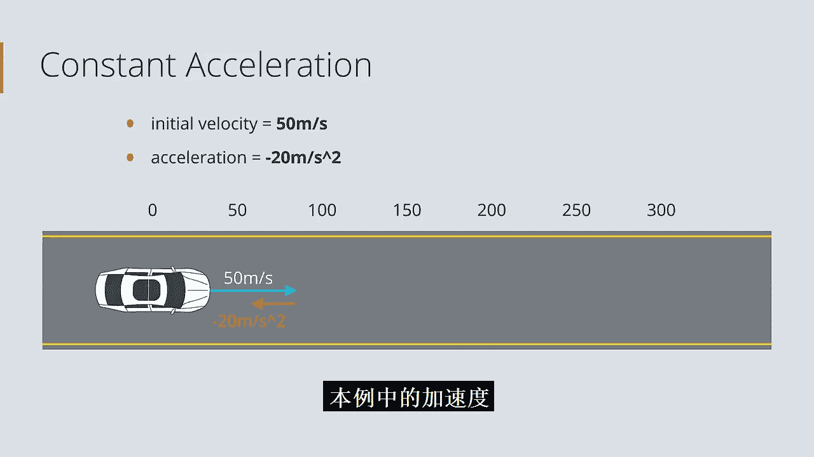
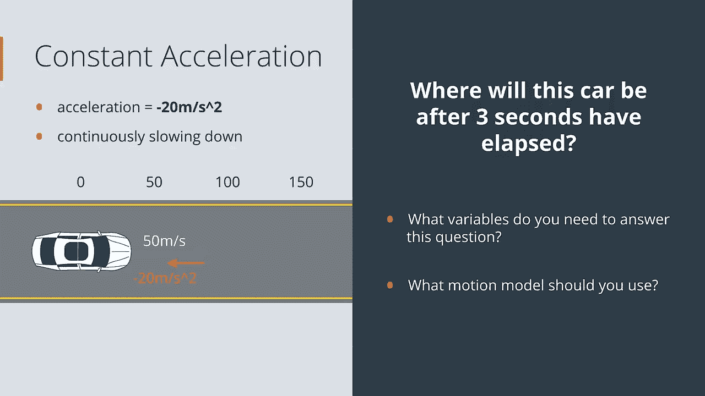
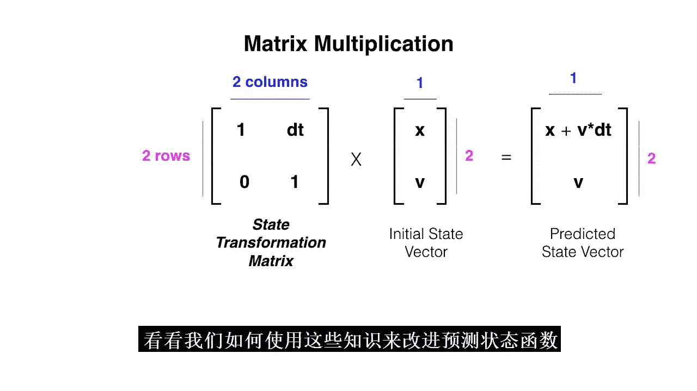

# 016：状态与面向对象编程 🚗

在本节课中，我们将学习如何表示和预测汽车的运动状态。我们将从回顾常见的定位步骤开始，然后深入探讨如何用代码和数学来描述状态及其变化。

---

## 概述

自动驾驶汽车通常遵循一系列步骤来安全导航。您一直在学习第一步：**定位**。在汽车能够安全行驶之前，它首先需要使用传感器和其他收集到的数据来估计自己在世界中的位置。本节课，我们将讨论如何表示和预测汽车的运动。在此之前，我们先回顾一下常见滤波器定位汽车所采取的所有步骤。

## 定位步骤回顾

一个常见的滤波器通过以下步骤来定位汽车：

首先，我们从对汽车位置的初始预测开始，并用一个概率分布来描述对该预测的不确定性。

以下是一个一维示例：我们知道汽车在这条单车道上，但不知道其确切位置。因此，我们的先验概率分布是均匀的。

然后，我们感知汽车周围的世界。这被称为**测量更新**步骤，我们在此步骤中收集更多关于汽车周围环境的信息，并优化我们的位置预测。

假设我们测量到汽车大约在停车标志前两个网格单元的位置。我们的测量并不完美，但我们对汽车的位置有了更好的了解。

下一步是**移动**，也称为**时间更新**或**预测**步骤。我们根据已知的汽车速度和当前位置来预测汽车将如何移动，并相应地移动我们的概率分布以反映这种运动。

这个例子展示了一个向右移动一个单元格的情况。这为我们提供了汽车位置的新状态估计。

常见滤波器简单地重复**感知**和**移动**（测量和预测）步骤，以在汽车移动时对其进行定位。

常见滤波器的优点在于，它们将有一定误差的传感器测量值与有一定误差的运动预测结合起来，从而得到一个比仅来自传感器读数或仅来自运动知识的任何估计都要好的**滤波位置估计**。这就是为什么常见滤波器是一种强大的定位方法。

## 什么是状态？

当您定位一辆汽车时，您只关心汽车的位置和运动。这通常被称为汽车的**状态**。任何系统的状态都是我们关心的一组值。在您一直处理的情况下，汽车的状态包括汽车的当前位置 `x` 和速度 `v`。

在代码中，这看起来像这样：

```python
state = [x, v]
```

汽车的状态为我们提供了预测汽车未来位置所需的大部分信息。在本课中，我们将看到如何表示状态以及它如何随时间变化。

## 预测状态：一个简单例子

例如，假设我们的世界是一条单车道，我们知道汽车的当前位置在这条路的起点，即 0 米标记处。我们还知道汽车的速度：它正以每秒 50 米的速度向前行驶。这些值就是它的**初始状态**。

您认为 3 秒后汽车的状态会是什么？

让我们仔细看看最后一个例子。汽车的初始状态是位置 0 米，并以每秒 50 米的速度向前移动。我们假设汽车继续以恒定速度向前移动。

每秒，它移动 50 米。所以 3 秒后，它将到达 150 米标记处，其速度不会改变。这就是恒定速度的含义。它的新预测状态将是位置 150 米，速度仍为每秒 50 米。

这是一个合理的预测，我们仅使用以下两点就做出了这个预测：
1.  汽车的初始状态。
2.  汽车以恒定速度运动的假设。



最后一个假设可以用物理方程数学表示：**行驶距离 = 速度 × 时间**。这个方程也被称为**运动模型**。有很多方法可以建模运动。

## 运动模型

这个模型假设速度恒定。在我们的例子中，我们以每秒 50 米的恒定速度运动了 3 秒，我们使用恒定速度方程形成了新的位置估计：**150 米 = 50 米/秒 × 3 秒**。



为了预测汽车在未来某个时间点的位置，您必须依赖一个运动模型。需要注意的是，没有运动模型是完美的。考虑外部因素（如风、海拔，甚至轮胎打滑和其他不确定性）是一个挑战。但这些模型对于定位仍然非常重要。

接下来，您将被要求编写一个使用运动模型来预测新状态的函数。

## 更复杂的运动模型

现在，如果我给您一个更复杂的运动示例呢？我告诉您，我们的汽车从同一点（0 米标记处）开始，以每秒 50 米的速度向前移动，但它也以每秒 20 米/秒² 的速率减速。这意味着每秒速度减少 20 米/秒。

这个值被称为**加速度**。在这种情况下，加速度等于 **-20 米/秒²**。这个加速度意味着，如果汽车以 50 米/秒的速度开始，下一秒它将变为 50 - 20 = 30 米/秒。再下一秒，它将变为 30 - 20 = 10 米/秒。

这种减速也是连续的，这意味着它是随时间逐渐发生的。

在接下来的几个测验中，我希望您记住这个问题：在这种初始状态下，3 秒后汽车将在哪里？我还想问您：您需要哪些变量来回答这个问题？换句话说，状态中应包含什么值？我们应该使用什么运动模型来解决这个问题？

## 状态与运动模型的关系

现在您已经看到了两个汽车运动模型的例子。在第一个例子中，我们假设汽车以恒定速度运动。但在第二个例子中，我们说汽车以恒定加速度减速。

经过 3 秒后，我们根据所依赖的运动模型，得出了不同的汽车状态估计。

在汽车减速的情况下，我们必须在计算中包含一个加速度值才能预测它的移动位置。因此，我们也将这个值添加到了汽车的状态中。

事实上，我们的汽车状态包含多少变量取决于我们使用的运动模型。对于恒定速度模型，位置和速度就足够了。但对于恒定加速度，您还需要包含一个加速度值。

这些都只是模型。对于任何状态，您都应该始终选择与所选运动模型配合所需的最小值集合。

## 本课的两个主线

本课的一个统一主题是表示和预测状态，但我们将通过两条主线来探索这个想法：
*   **编程方面**：我们将使用一种称为**面向对象编程**的方法来表示状态和代码。我们将使用变量来表示状态值，并创建函数来更改这些值。
*   **数学方面**：我们将使用**向量**和**矩阵**来跟踪状态并改变它。随着我们对预测汽车状态的更多了解，我们将学习所有必要的数学符号和代码。

## 使用函数跟踪状态

您一直在使用一个 `predict_state` 函数，它接收一个当前状态和一些时间变化 `dt`，并基于恒定速度运动模型输出一个新的状态估计。

事实证明，恒定速度模型实际上是一个很好的简单模型，尤其是在时间变化非常小的情况下。

现在，为了在汽车移动时跟踪其随时间变化的状态，您必须重复调用此函数，在每个时间步传入新的状态估计。

例如，假设我们有这个初始状态：位置 `x = 0`，速度 `v = 50` 米/秒。我将这两个值放入一个列表（我们的初始状态）并打印出来。

接下来，我想知道 2 秒后的下一个状态。因此，我将使用我的 `predict_state` 函数，传入初始状态和 2 秒的时间差，并将状态称为 `s1`（第一个状态估计），然后打印这个结果。

我们的位置 `x` 现在在 100 米处，速度保持 50 米/秒。

然后，假设又过了 3 秒。我再次调用 `predict_state` 函数。这次我传入我们最新的状态估计 `s1` 和一个 3 秒的时间差，并打印这个值。

我们的位置现在是 250 米，速度保持恒定的 50 米/秒。再过 3 秒呢？我必须传入我们最新的状态估计 `s2` 和又一个 3 秒的时间差，然后打印结果。

如您所见，我们基本上是在一遍又一遍地调用同一行代码，但修改状态输入为最新的状态估计。这种重复充其量是乏味的，而且代码质量不佳。作为程序员，您应该始终尽量避免不必要的重复。

## 引入对象

如果我们可以直接告诉汽车移动，并让它自动更新其状态，而不是手动编写相同的代码行并一遍又一遍地跟踪状态，那该多好？

我们可以借助**对象**来自动跟踪状态。对象持有状态。它们持有一组变量（也称为**属性**）和函数。您可以把对象想象成一个盒子。在那个盒子里，有定义对象状态的变量，比如汽车对象的位置和速度。对象也持有告诉我们对象能做什么的函数，比如汽车能否移动、转弯等等。

但我们现在有点超前了。让我们先看一个对象在运行中的例子。

## 与汽车对象交互

这里，我将向您展示如何与一个能够跟踪自身状态的汽车对象交互。首先，您会看到一些导入语句和一些代码，我们很快会详细讲解。但在深入研究构成对象的代码之前，我们将学习如何与它交互。

接下来，您会看到一些初始变量：首先是一个 `world`，然后是一些应该看起来很熟悉的变量：初始位置和速度。这次，位置是二维的（`y` 和 `x`），速度也分解为垂直和水平分量（`v_y` 和 `v_x`）。

然后，为了创建一辆名为 `Carla` 的汽车，我必须说 `Car.Car` 并传入一些初始状态。我传入一些 `y, x` 位置和速度。最后，我传入一个 `world`（只是一个二维数组）。然后我打印出 Carla 的初始状态。

您会注意到，我可以通过 `carla.state` 访问 Carla 的状态。我们看到初始位置是 `(0, 0)`，初始速度是 `(0, 1)`，这意味着它有一些向右的水平速度。

现在，这个汽车对象 Carla 也有一些可视化代码。我们可以使用 `display_world` 函数在任何给定点看到汽车的位置。

现在，Carla 还能做什么？我们可以告诉 Carla 移动，说 `carla.move()`。Carla 将沿着初始速度的方向移动一个网格单元，在这种情况下是向右。让我们通过再次显示世界来测试这个移动。

我们可以看到 Carla 向右移动了一个空格。在这次移动之后，我们还可以跟踪 Carla 状态的变化，我可以再次使用 `carla.state` 打印出它的值。我们可以看到状态确实更新了：位置向右移动了一个网格单元，速度保持不变。

所以，Carla 以某种方式在跟踪她自己的状态。如果我们再移动几次呢？让我们跟踪状态的变化。我们看到我们又向右移动了两个位置，到了 `(0, 3)`。我们可以通过再次调用 `carla.display_world()` 在世界地图上看到移动。

我们知道汽车的状态会自动更新。Carla 也可以左转。所以，让我们告诉 Carla 左转并移动一个空格，然后显示世界。我们可以看到 Carla 在这个位置左转，实际上在世界中绕了一圈。

如果我们通过 `str(carla.state)` 打印出 Carla 的状态，我们看到位置和速度都发生了变化。我们的位置是 `(3, 3)`，这反映在我们的网格中。`v_y` 现在是 `-1`，`v_x` 是 `0`。这意味着没有水平速度，只有负的垂直速度，这意味着 Carla 正在我们的网格世界中向上移动。

目前，移动和左转是 Carla 仅有的能力。但我们很快就会看到如何扩展她的能力列表。

## 查看汽车类代码

这里是我们的 `car.py` 文件。让我们逐行查看这里的代码。

首先，您会注意到红色的部分，它们只是描述类的注释。它描述了类的作用以及它具有哪些属性。像这样的注释是很好的做法，特别是如果您希望其他开发人员理解您的代码。

现在，如果我们向下滚动一点，首先看到的是我们的 `class Car`。这看起来有点像函数声明，但 `class` 这个词让 Python 知道后面的代码应该描述汽车对象的状态和功能。对象名称也总是大写，所以我们看到这里的 `Car` 是大写的。

接下来，我们看到 `__init__` 函数，它负责创建空间和内存来制作一个特定的汽车对象，比如 Carla。因此，当您运行像 `Car.Car()` 并传入一些初始参数的代码时，调用的就是这个函数。这是根据传入的位置和速度变量创建初始状态的地方。我们还看到了汽车的 `world`、`color` 和 `path` 的变量。我们知道 `world` 只是一个二维网格。`color` 我们稍后会再谈。但现在要知道，这就是为什么我们的汽车在网格中显示为红色。`path` 将只是汽车访问过的位置列表，我们可以将其可视化。所以，这里最重要的代码行是 `state` 和 `world`。这里的所有变量都是汽车对象跟踪的内容。

接下来，如果我们向下滚动，是 `move` 函数。描述说，`move` 函数使汽车沿速度方向移动并更新状态。这可能看起来与我们的 `predict_state` 函数很相似。`move` 使用恒定速度模型使汽车沿其速度方向（`v_y` 和 `v_x`）移动。

如果我们看这个方程的一部分，我们可以看到它是我们的恒定速度模型。它说：`y`（初始位置）加上 `y` 速度乘以时间变化 `dt` 成为我们新的预测位置。最后，我们更新在 `__init__` 中初始化的汽车状态变量。这就是我们在移动时跟踪汽车状态的方式。

接下来，我们看到我们的 `turn_left` 函数，它只是将速度值向左旋转。这个函数再次用新的速度更新我们的状态。

最后，在末尾，我们有这个 `display_world` 函数，您不应该更改它，但可以随意阅读。它负责显示网格世界和其中的汽车，并使用 `pyplot` 进行可视化。

接下来，将由您来阅读这段代码，理解像 Carla 这样的汽车对象如何跟踪自己的状态。我们将一起帮助在这个 `Car` 类中编写一些额外的函数。

## 修改对象：添加颜色变量

我们回到了我们的 `car.py` 文件。让我们看看如何实际修改这个汽车对象并添加一个颜色变量。

在我们的类代码内部，我们可以看到汽车有一个默认颜色，红色，由字符 `'R'` 表示。那么您认为我们如何自定义它呢？就像我们的状态变量和世界一样，我们可以在初始化参数中传入它。要做到这一点，通常我们只需在 `__init__` 函数中添加一个额外的参数。

我将称这个参数为 `color`。我还可以为 `color` 指定一个默认值，等于红色，等于字符 `'R'`。`color='R'` 意味着当且仅当在创建汽车对象时没有指定 `color` 参数，它才会默认为红色。我们的其他变量都没有默认值。

然后我们还必须更改另一行代码。与其说 `self.color = 'R'`，不如说 `self.color = color`（这是传入的变量）。

现在，我们的 `__init__` 函数初始化了汽车的状态，为汽车提供了一个二维世界来遍历，并指定了汽车的颜色。

剩下的就是在可执行代码中测试这个。所以让我们进入一个新的笔记本。

## 测试自定义颜色

以下是通常的导入语句，我们在这里导入我们的汽车类文件。

接下来，我将创建汽车对象。这里我定义了初始参数，并以通常的方式创建了 Carla。然后我将定义一些新的初始参数，并创建一个新的汽车对象。这次，我将这辆汽车命名为 Jeanette。传入一个初始状态、一个世界和一种颜色。

我将说 `jeanette = Car.Car()` 并传入我们的初始状态变量 `position2` 和 `velocity2`，传入同一个 `world`，并且我还传入一个颜色，指定 Jeanette 具有黄色，字符 `'Y'` 作为我们最后传入的变量。

这里的顺序很重要。这应该与我们的汽车类文件中的顺序匹配。所以现在我应该有两辆汽车，Carla 和 Jeanette。

现在，如果在此步骤出现错误，请确保在更改后保存了您的汽车类文件，并通过单击“内核”->“重启并清除输出”来重启内核。

由于我没有收到任何错误，我的下一步将是为这两辆汽车编写一些移动代码。这只是为了好玩和可视化。

首先，我要移动 Carla，告诉 Carla 移动、左转、再移动，然后显示 Carla 的世界。我们可以看到 Carla 的移动：向前移动，然后左转并在世界中循环。我们看到 Carla 是红色的。红色是默认颜色，因为我们在创建 Carla 时没有指定颜色。

接下来，我要移动 Jeanette，左转、移动、再左转、再移动一些，然后显示 Jeanette 的世界。我们可以看到 Jeanette 从一个不同的点开始，并循环绕行，创建了一条不同的路径。我们看到 Jeanette 是黄色的，包括路径。

这很酷。添加更多变量（如汽车颜色）可能只需要几行代码。函数也是如此。您可以将它们的定义添加到类中，然后就能够访问它们。

## 状态向量与矩阵

到目前为止，您已经看到汽车的状态包含多个值，我们一直将其放入 Python 列表中，但这些值通常包含在一种数据类型中：**状态向量**。向量类似于 Python 中的列表，因为它包含多个值，但它们在数学上非常不同。

向量是矩阵的一种，现在您可以将其视为数字网格。矩阵是一种数学数据类型，类似于整数或浮点数。与整数或浮点数类似，我们可以对矩阵进行乘法、缩放、相加等操作。这被称为**线性代数**。线性代数在自动驾驶汽车系统中会反复出现，从汽车运动到深度学习算法和图像分析，无处不在。

在本节中，我们将看到状态向量和矩阵如何一起使用，以帮助我们有效地预测新状态并定位汽车。

## 向量在数学中的应用

我们一直表示状态的方式是作为一个值列表，它只有一个长度（在这种情况下是两个值的长度）。但状态向量是一个值列，其维度是宽度为 1，高度为 `m`（同样，在这种情况下 `m` 是 2）。这使得状态向量成为一种特殊的矩阵，我们很快就会看到为什么列向量很重要。

让我们再想想我们的 `predict_state` 函数。它接收一个初始状态，我们存储位置 `x` 和速度 `v`，然后我们有几行代码基于恒定速度运动模型预测下一个状态。

我们计算新位置 `new_x`，并将两个值（新位置和速度）放入一个新的预测状态（一个新的两个值的列表）中。但是，对于一个包含这两个值 `x` 和 `v` 的状态向量，我们不需要将它们分开来执行这个计算。我们实际上可以在一个乘法步骤中执行相同的计算。

这个步骤是**矩阵乘法**步骤。矩阵乘法将两个数字网格相乘，比如这个 2x2 矩阵和这个 2x1 状态向量（它有一个位置 `x` 和一个速度 `v`）。以下是这个乘法的工作原理：

这个操作首先将第一个矩阵中的行乘以第二个矩阵中的列。所以这些维度（第一个矩阵的列数和第二个矩阵的行数）必须相同。

逐步来看，这看起来像是 `1 * x`（就是 `x`），然后 `v * dt`。所以现在我们有了第一个矩阵的第一行乘以第二个矩阵的列。

下一步是将这两个值相加以形成这个新矩阵中的一个新值：`x + v * dt`。然后我们对下一行做同样的事情。我们得到 `0 * x + 1 * v`。将这些值相加得到 `v`。

就是这样。您可以看到，这创建了一个新的 2x1 向量，其中包含两个可能看起来很熟悉的值。事实上，这些正是我们恒定速度运动模型的方程。

经过一些时间变化后，`x` 变为 `x + 速度 * 时间变化`，而 `v` 保持不变。因此，矩阵乘法让我们只需一个乘法步骤就能创建一个新的预测状态向量。

这是一种如此常见的预测新状态的方法，以至于这个 2x2 矩阵通常被称为**状态转移矩阵**。

接下来，我们将测试您关于矩阵乘法的知识，并看看我们如何使用这些知识来改进 `predict_state` 函数。

## 总结



到目前为止做得很好。现在您已经看到，我们可以使用矩阵乘法来转换汽车的状态。这种线性代数可以用于仅用一行代码更新多个状态变量，当您处理大数据集和代表我们三维世界的变量时，这变得非常有用。

接下来，您将看到线性代数如何用于创建二维常见滤波器。在这个过程中，您将学习更多关于矩阵运算和符号的知识，并且您将离创建实际用于定位自动驾驶汽车的算法更近一步。

在本节课中，我们一起学习了：
1.  自动驾驶汽车定位的基本步骤（感知与移动）。
2.  如何定义和表示汽车的**状态**。
3.  如何使用**运动模型**（如恒定速度模型）预测未来状态。
4.  如何利用**面向对象编程**创建能自动跟踪和更新自身状态的对象。
5.  状态如何用**向量**表示，以及如何使用**矩阵乘法**高效地进行状态预测。
6.  状态的内容（如是否包含加速度）取决于所选的**运动模型**。

这些概念是构建更复杂定位和导航算法的基础。