# 017：矩阵与状态变换 🚗➡️📊

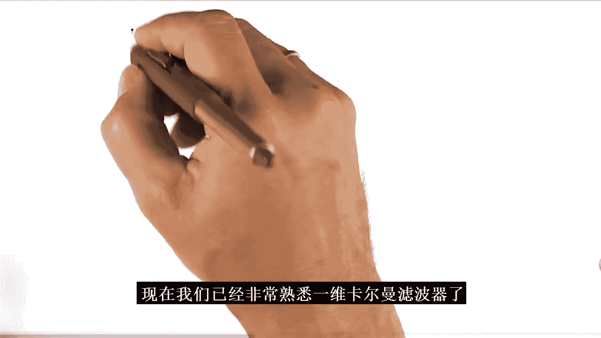


在本节课中，我们将学习卡尔曼滤波器如何扩展到多维空间，以及矩阵和向量如何成为描述状态变换的核心工具。我们将从一维卡尔曼滤波器的回顾开始，逐步理解为什么在跟踪车辆等物体时，我们需要处理包含位置和速度等多维状态，以及矩阵运算如何实现这一过程。


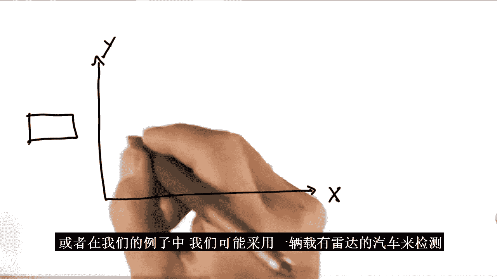

---

## 从一维到多维卡尔曼滤波器

上一节我们介绍了一维卡尔曼滤波器，它能够通过高斯分布来估计单一变量（如位置）并融合测量与运动预测。本节中我们来看看，当我们需要同时跟踪物体的位置和速度时，情况会变得如何不同。

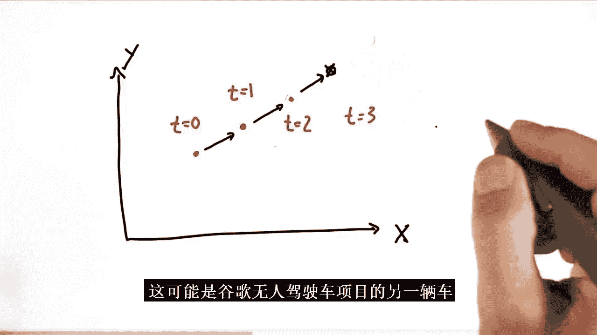

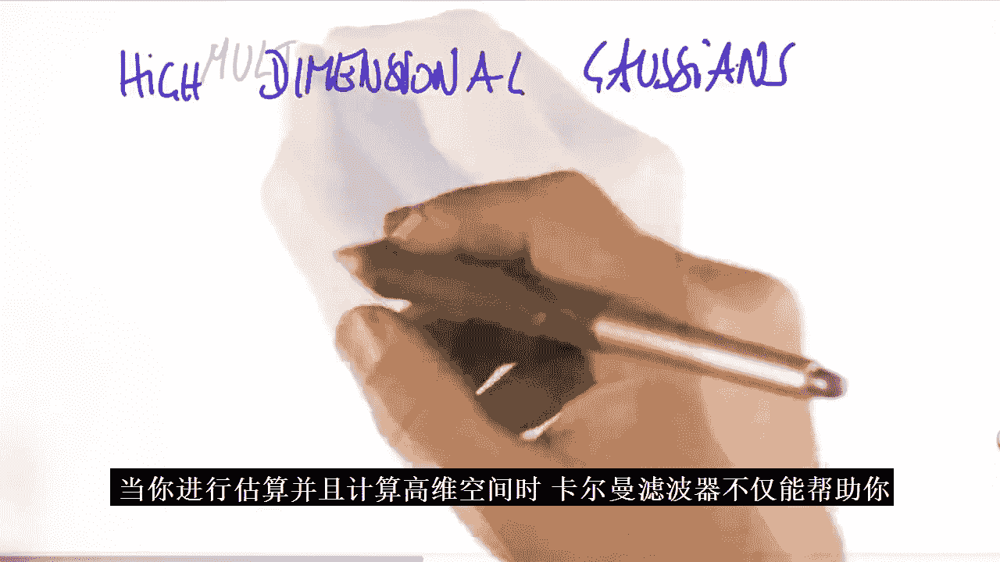


在现实世界中，例如使用雷达检测车辆位置时，我们通常需要处理二维（X和Y坐标）甚至更高维的状态空间。多维卡尔曼滤波器的一个强大之处在于，它能够从仅观测位置的数据中，推断出从未直接测量过的速度信息。

假设在时间点 T0、T1、T2 观测到物体分别位于三个不同的位置点。仅凭这些离散的位置点，人类直觉也能推断出物体具有向右运动的速度，从而预测它在 T3 时刻最可能的位置。卡尔曼滤波器通过数学方式自动化了这一推理过程。

其核心在于，它将状态从单一的位置 `x`，扩展为一个包含位置和速度的**状态向量**。例如，状态可以表示为：
`x = [位置, 速度]`

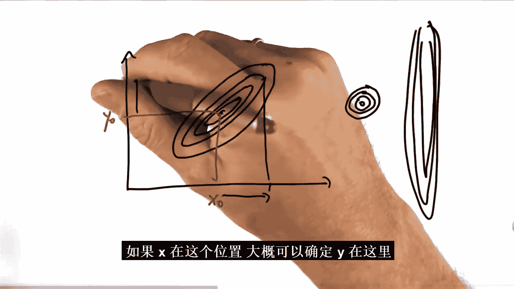

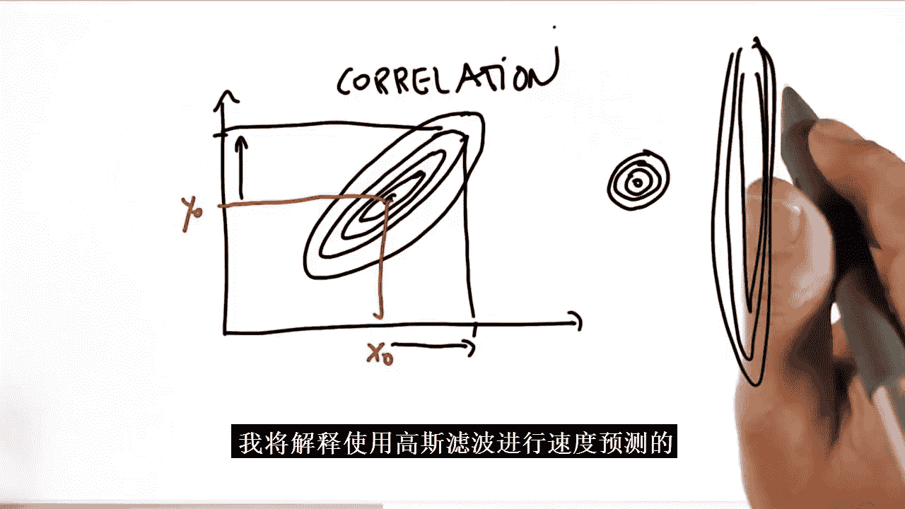

即使传感器只测量位置，滤波器也能通过状态内部变量（位置与速度）之间的物理关系（新位置 = 旧位置 + 速度），从连续的位置观测中“学习”到速度信息。

---

## 高维高斯分布

为了在数学上处理多维状态，我们需要使用**多维高斯分布**（也称为多元高斯分布）。

*   **均值（Mean）**：从一个数值变为一个**向量**，向量的每个元素对应状态的一个维度。例如 `μ = [μ_x, μ_v]`。
*   **方差（Variance）**：从一个数值扩展为一个**协方差矩阵**。这是一个 D×D 的矩阵（D 是状态维度），它描述了各个维度自身的不确定性以及不同维度之间的相关性。

一个二维高斯分布可以在平面上用等高线表示。等高线的形状揭示了不确定性：
*   圆形轮廓表示在X和Y方向上的不确定性相同。
*   椭圆形轮廓表示在一个方向上的不确定性大于另一个方向。
*   倾斜的椭圆形轮廓则表明两个变量（如位置和速度）是**相关**的。这意味着，如果我们获得了关于变量X（如位置）的新信息，它也会影响我们对变量Y（如速度）的信念。

这种相关性是多维卡尔曼滤波器能够从位置观测中推断速度的关键。

---

## 状态变换与矩阵

为了设计一个多维卡尔曼滤波器，我们需要定义两个核心函数，它们通常用矩阵来表示：

1.  **状态转移函数（State Transition Function）**：描述状态如何随时间演变。例如，对于一维运动（状态为 `[位置， 速度]`），其物理规律是：
    *   新位置 = 旧位置 + 速度
    *   新速度 = 旧速度（假设速度暂时不变）
    这可以用一个矩阵 **F** 来表示：
    ```
    F = [[1, 1],
         [0, 1]]
    ```
    状态更新通过矩阵乘法实现：`新状态向量 = F * 旧状态向量`。

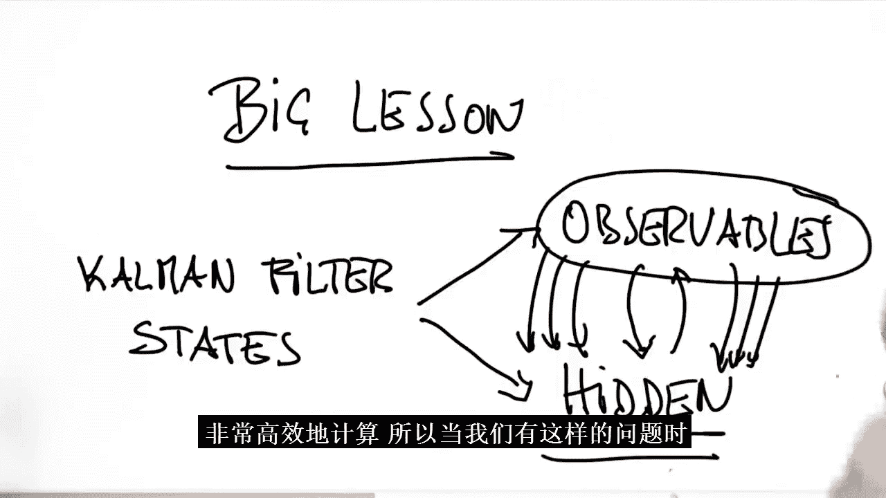

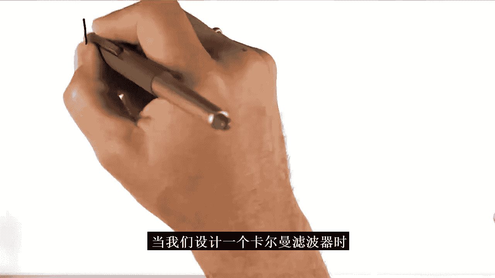

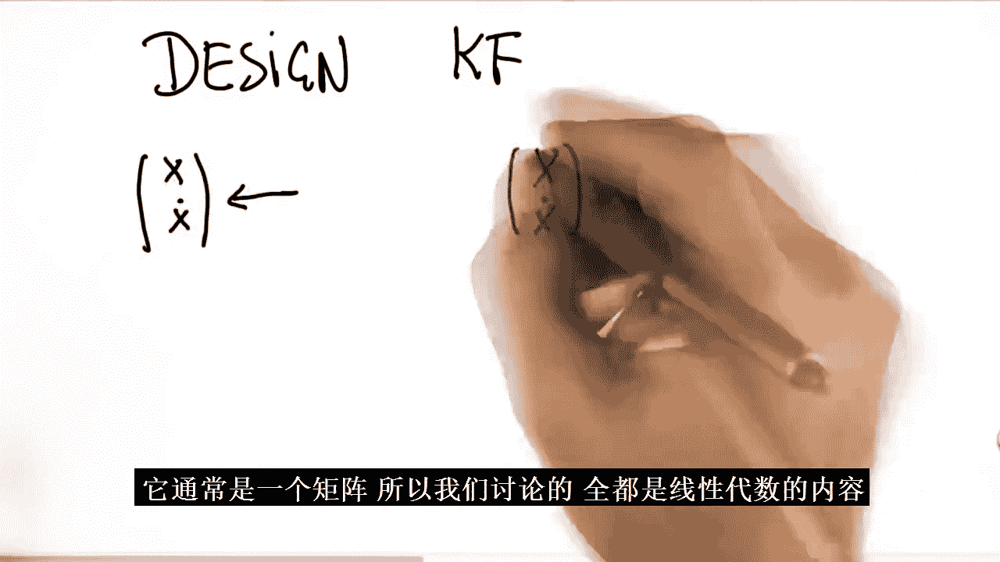

2.  **测量函数（Measurement Function）**：描述如何从状态中得到观测值。例如，如果我们只观测位置，不观测速度，那么测量函数可以用一个矩阵 **H** 表示：
    ```
    H = [[1, 0]]
    ```
    它从状态向量 `[位置， 速度]` 中提取出位置分量：`观测值 = H * 状态向量`。

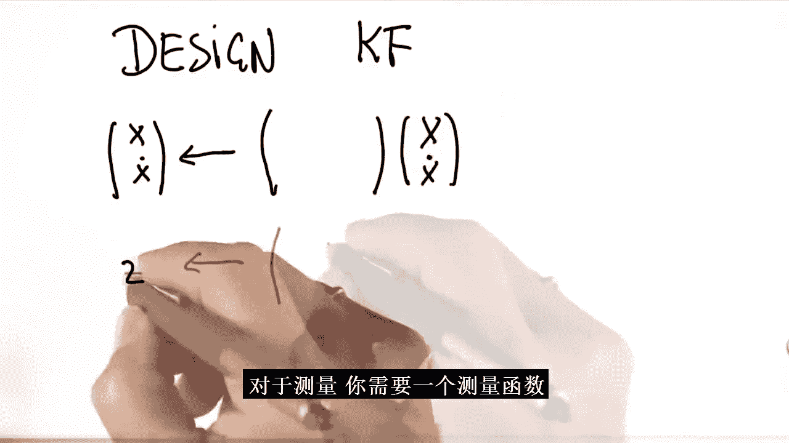

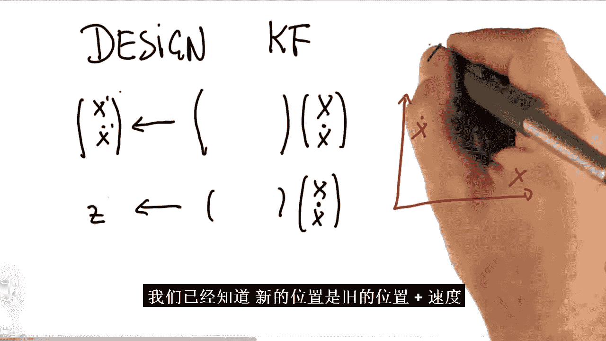

---

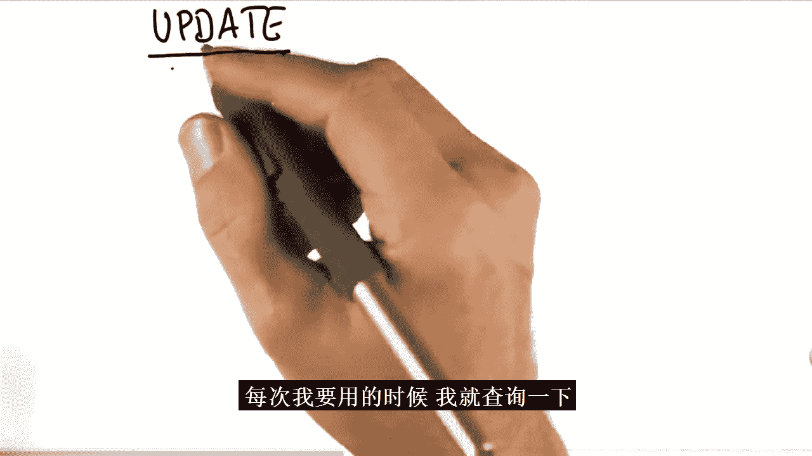

## 多维卡尔曼滤波器方程

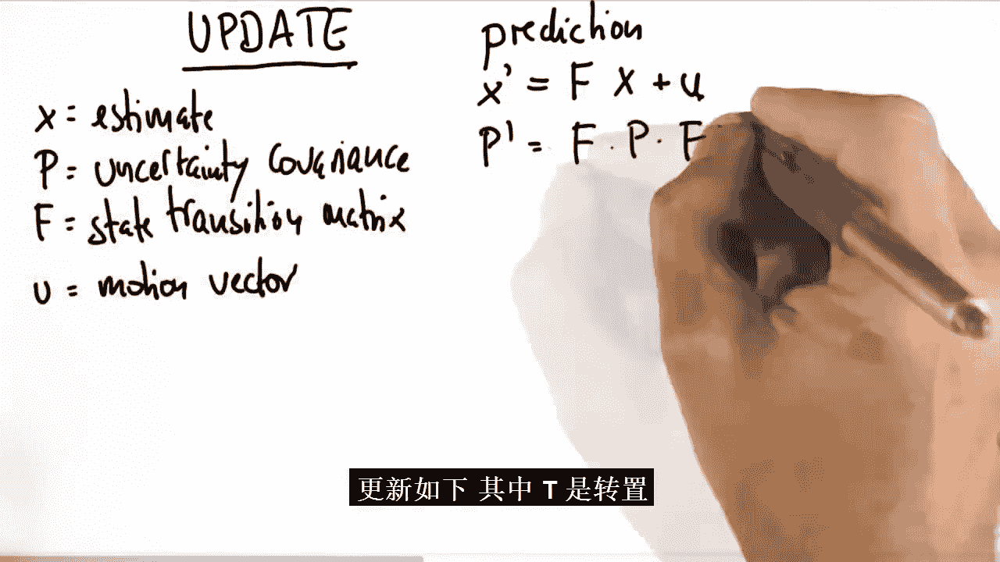

多维卡尔曼滤波器的完整方程涉及矩阵运算，看起来比一维情况复杂得多。以下是其核心步骤的简化表示：

**预测步骤（Predict）**：
*   `x' = F * x` （预测新状态）
*   `P' = F * P * F^T + Q` （预测新不确定性，其中 `^T` 表示矩阵转置，Q是过程噪声）

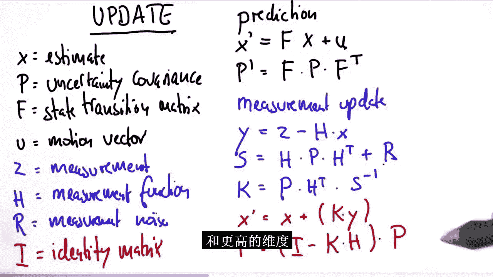

**更新步骤（Update）**：
*   `y = z - H * x'` （计算测量残差）
*   `S = H * P' * H^T + R` （将状态不确定性映射到测量空间，R是测量噪声）
*   `K = P' * H^T * S^(-1)` （计算卡尔曼增益，其中 `^(-1)` 表示矩阵求逆）
*   `x = x' + K * y` （更新状态估计）
*   `P = (I - K * H) * P‘` （更新不确定性估计，其中 I 是单位矩阵）

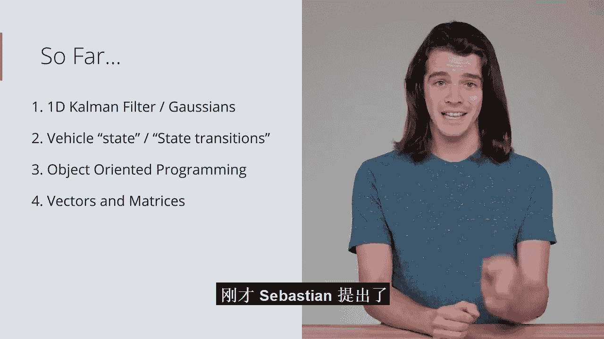

**请注意**：你不需要记忆这些公式。关键在于理解它们的作用——它们是**一维卡尔曼滤波器公式在多维空间中的推广**，其核心思想（预测、比较测量、更新信念）是完全一致的。矩阵只是处理多个相互关联变量的数学工具。

---

## 线性代数：实践所需的工具

既然我们不需要死记硬背公式，那么作为工程师，我们需要掌握什么？我们需要的是**将数学公式转化为有效代码的能力**。这意味着我们需要对线性代数（矩阵数学）有基本的、实用的了解。

当我们未来需要实现一个卡尔曼滤波器时，很可能会去查阅维基百科等资料，看到上面那些充满矩阵和运算符号的方程。我们的目标是能够理解并实现它们。

以下是实现这些方程所必需的核心线性代数概念：

*   **向量与矩阵**：理解其表示和区别。通常小写字母（如 `x`）表示向量，大写字母（如 `F`, `P`）表示矩阵。
*   **矩阵加法与乘法**：掌握其运算规则，尤其是矩阵乘法不满足交换律（`A*B ≠ B*A`）。
*   **单位矩阵**：一种特殊的矩阵，相当于标量乘法中的“1”。
*   **矩阵转置（T）**：将矩阵的行和列互换。
*   **矩阵求逆（-1）**：类似于标量的倒数，但并非所有矩阵都可逆。

学习这些概念的目的不是进行理论推导，而是获得一种“功能性的熟悉感”，以便在遇到时知道如何查找、理解并使用代码库（如NumPy）来实现相应的运算。

---

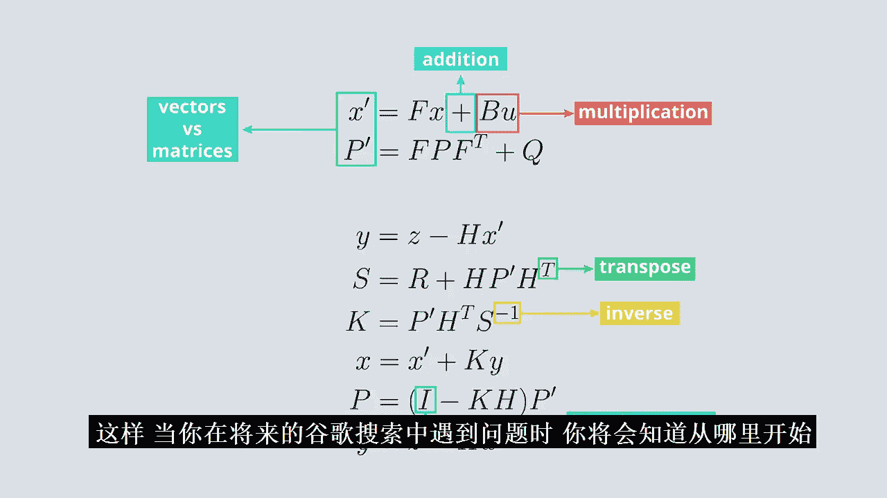

## 总结

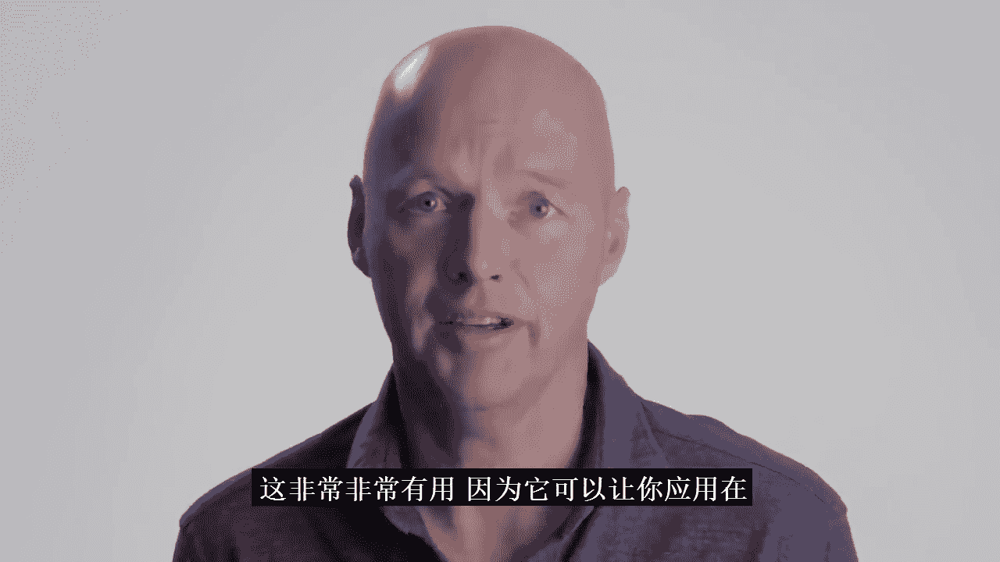

本节课中我们一起学习了卡尔曼滤波器从一维到多维的扩展。我们了解到，通过将状态定义为包含可观测变量（如位置）和隐藏变量（如速度）的向量，并利用描述它们之间物理关系的矩阵（状态转移矩阵 **F** 和测量矩阵 **H**），卡尔曼滤波器能够从间接观测中推断出隐藏状态。虽然多维卡尔曼滤波器的方程看起来复杂，但其核心思想与一维情况一脉相承。作为工程师，我们的重点是掌握将矩阵数学转化为代码的实践能力，为后续在真实多维场景（如车辆跟踪）中实现卡尔曼滤波器打下基础。