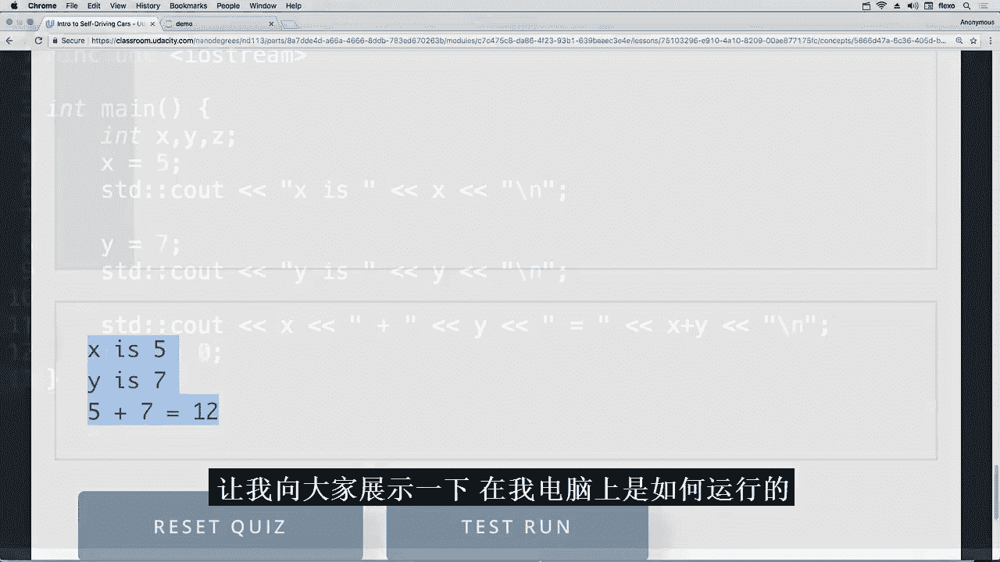
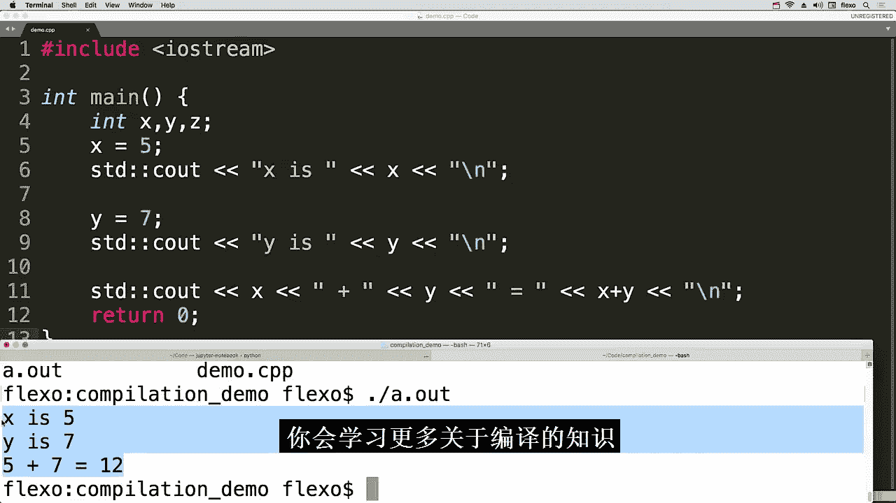

# 021：无人驾驶汽车纳米学位项目-十位大牛亲授自动驾驶技术，硅谷前沿科技（计算机视觉⧸车道识别⧸感知控制⧸人工智能⧸谷歌） p21 21. Part 04-Module 01-Lesson 03_Practical C++ [BV1Vd4y1r7QG_p21]

## 概述

在本节课中，我们将要学习Python与C++之间的一个核心区别：解释型语言与编译型语言。我们将了解C++代码如何在本地计算机上运行，并初步接触编译过程。

---

## 课程内容

### 4.1.3：解释型语言与编译型语言 🖥️

到目前为止，你一直在优达学城的课堂环境中编写代码，环境界面如下所示。

但你也会希望能在自己的计算机上本地运行你的程序。

这引出了Python和C++之间的另一个重要区别。

你在上一课开始时学习了第一个主要区别。

那就是Python是**动态类型**语言，而C++是**静态类型**语言。

这就是为什么你必须在C++中编写诸如 `int` 这样的类型声明。

另一个主要区别是，Python被称为**解释型语言**。

而C++是一种**编译型语言**。

关键在于，当你用Python或C++编写代码时。

计算机无法直接理解你写的内容。

代码首先需要被翻译成计算机能理解的语言。

对于Python代码。

有一个被称为**解释器**的翻译器，它会逐行进行翻译。

先翻译，然后执行每一行代码。翻译这一行，执行它。

翻译这一行，执行它。这个翻译、执行、翻译、执行的过程会一直持续。

直到你到达文件的末尾。或者在这种情况下，到达代码的末尾。

因此，运行单元格会得到预期的结果。

实际情况比我描述的要复杂一些。

但这就是像Python这样的解释型语言的大致原理。

对于像C++这样的编译型语言。

所有代码在**任何部分被执行之前**，都会被翻译成编译器能理解的语言。

这个步骤被称为**编译**。

只有在程序被编译之后，它才能被后续执行或运行。

直到现在，我们一直在向你隐藏这个编译步骤。

当你在浏览器中编写代码，然后向下滚动并按下“测试运行”按钮时。

我们一直在后台秘密地编译并执行代码。

所以到目前为止，这门语言对你来说感觉像是解释型的。

但当你在自己的计算机上编写C++代码时，你将需要自己完成编译步骤。

让我向你展示一下这在我的计算机上是什么样子。

这里我有同一个文件，我把它命名为 `demo.cpp`。

如果我确实想在我的计算机上运行这段代码。

我必须先打开一个叫做**终端**的东西。

现在不要太担心这个终端是什么。

我只想向你展示的是，当我输入 `ls` 命令时。

这是一个列出我当前目录中所有文件的命令。

目前我只看到这个 `demo.cpp` 文件。所以现在，在我运行这段代码之前。

我需要先编译它。对于我的计算机，我通过输入 `g++` 命令来完成。

后面跟上文件名，在这个例子中是 `demo.cpp`。我按回车键。然后什么也没发生。

但如果我再执行一次 `ls` 命令。我现在看到了第二个名为 `a.out` 的文件。

这是 `demo.cpp` 中代码的翻译版或编译版。

如果我输入 `./a.out` 并按回车键。我得到了我期望的输出。

在本课的剩余部分。

你将学习更多关于编译的知识，并开始在你自己的计算机上使用C++代码。

---

## 总结

本节课中我们一起学习了Python（解释型语言）与C++（编译型语言）在代码执行流程上的根本区别。我们了解到，C++代码需要先经过**编译**步骤，生成一个可执行文件（如 `a.out`），然后才能运行。我们还初步接触了在终端中使用 `g++` 编译器进行编译和运行的基本命令。这是将C++代码从课堂环境迁移到本地计算机进行开发的第一步。