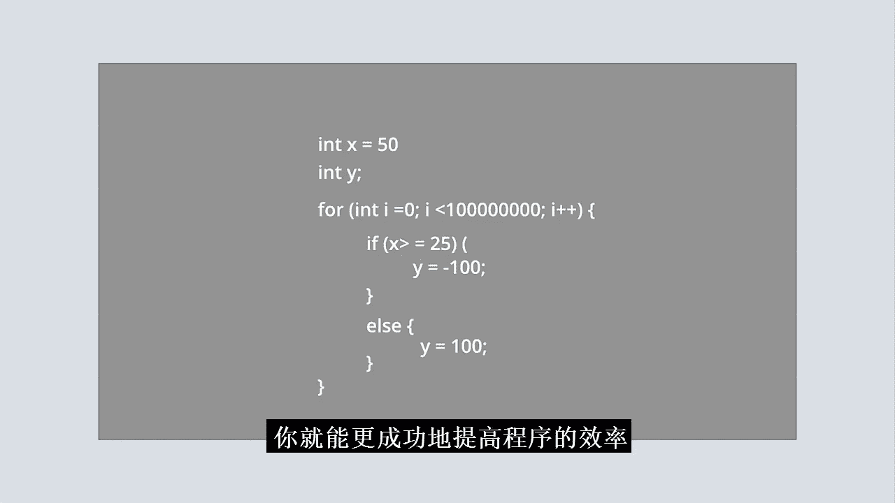
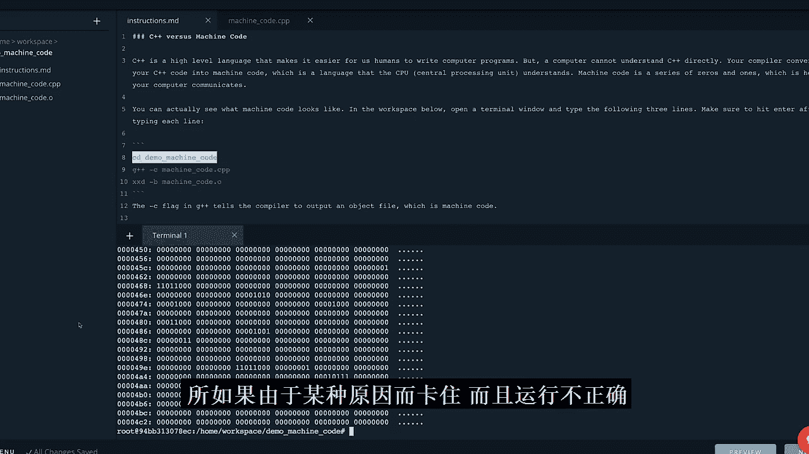
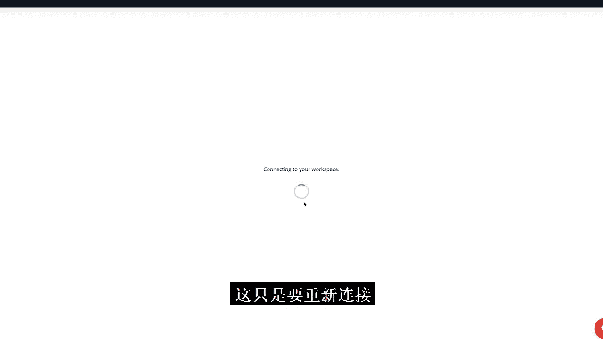
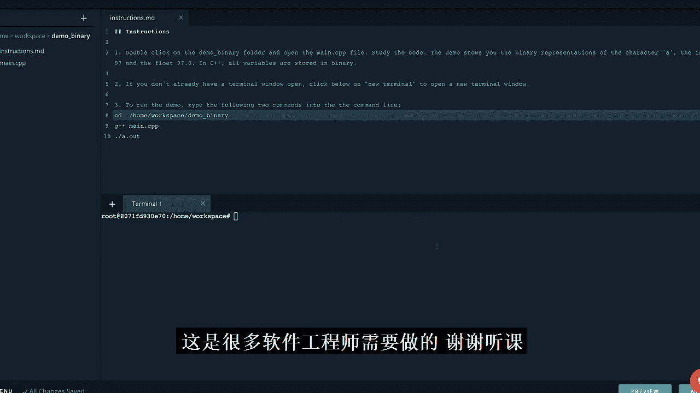
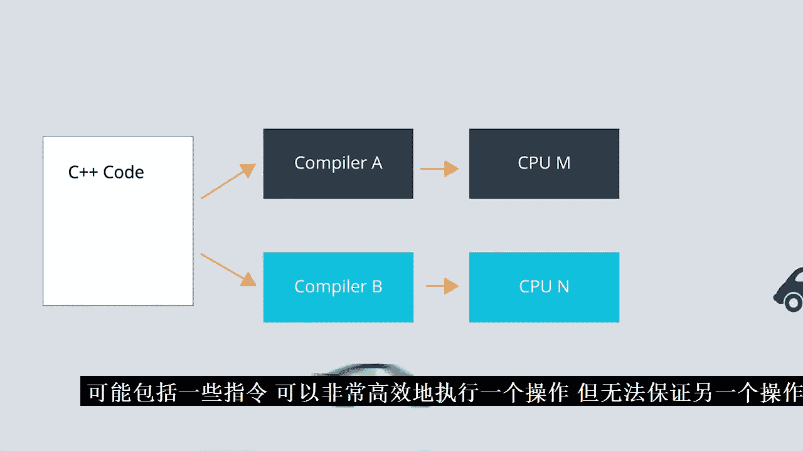

# 024：第 01 章

## 概述

在本节课中，我们将学习 C++ 代码优化的基础知识。我们将探讨计算机如何执行程序，理解内存和 CPU 的工作原理，并学习如何通过减少不必要的指令和内存访问来提升代码效率。课程分为两部分：首先介绍计算机内部工作原理，然后应用这些知识进行实际代码优化。

## 计算机如何执行程序

上一节我们完成了从 Python 到 C++ 的代码翻译。本节中，我们来深入了解计算机执行 C++ 程序时的内部机制。

优化代码的核心在于消除不必要的指令，同时确保程序输出正确结果。程序访问内存和进行计算操作的次数越少，效率就越高。优化不仅仅是让代码通过某个“黑箱”来提高性能，更是要理解计算机如何工作并执行你的代码，并利用这些知识。

除了硬盘等存储介质，计算机运行程序主要涉及两个部分：**中央处理器** 和 **随机存取存储器**。

*   **中央处理器** 包含一个**控制单元**，负责执行代码中的指令；以及一个**算术逻辑单元**，负责计算数学和逻辑表达式。
*   **随机存取存储器** 是程序用来存储变量和指令以支持程序执行的地方。它是一种类似硬盘的存储介质，但读写速度更快，并且是**易失性**的，这意味着关闭计算机时，其中的所有数据都会消失。

本质上，CPU 中的控制单元会读取代码中的下一条指令，并通过向 RAM 写入数据、从 RAM 读取数据或让算术逻辑单元执行计算来执行它。

与 Python 不同，在 C++ 中编写完程序后，需要先**编译**才能执行。编译器会将你的代码重写为 CPU 可以理解的一组指令，称为**机器码**，这基本上是 CPU 的语言。因此，编译器充当了你理解和编写代码的方式与 CPU 理解和读取代码的方式之间的翻译器。

例如，你可能会写一行代码 `int x = 5;`。编译器会将这行代码转换成类似这样的内容：
```
store the value of 5 to a specific location in RAM that can be accessed with an address tied to the variable x.
```
CPU 会理解这意味着将值 5 存储到 RAM 中一个特定位置，该位置可以通过与变量 `x` 绑定的地址访问。另一条指令可以通过向 CPU 发送查询与 `x` 绑定的地址处存储的值的指令来检索 `x` 的值。还有一条指令可以获取存储在 `x` 地址处的值，将其增加 10，然后将新值更新到内存中。

所有这些指令都需要时间执行，而某些操作，如三角函数和 `if` 语句的分支，已知效率特别低。

让我们看一系列 `if` 语句的例子：
```cpp
if (x == 0) {
    y = 0;
}
if (x != 0) {
    y = 10;
}
```
这段代码效率低下，因为它导致 CPU 对 `x` 的值进行两次比较。然而，如果第一个条件为假，第二个条件自动为真。因此，一个优化方案是使用 `if-else` 语句重写：
```cpp
if (x == 0) {
    y = 0;
} else {
    y = 10;
}
```
这个版本的代码只需要进行一次比较。你可能会认为这样微小的改变对速度影响不大，对于单次出现的情况，可能确实如此。但想象一下，如果这些语句位于一个运行数千次或数百万次的 `for` 循环内部，微小的低效就会开始累积。

理解计算机如何运行有助于你确定哪些计算可能拖慢程序。你对计算机内部发生的事情了解得越多，就越能成功地提高程序的效率。

## 课堂命令行工具介绍

在“C++ 优化入门”和接下来的“C++ 优化实践”课程中，你将使用一个之前未见过的新课堂功能。



当你进入课程的下一部分时，会加载一个嵌入式命令行工具。通常，当你使用计算机时，是通过鼠标和图形用户界面来移动文件、打开文件、创建新文件和打开程序。还有另一种使用计算机的方式，那就是通过键盘直接向计算机输入命令。这正是我们在课堂中为你设置的功能。当你打开这个部分时，课堂的这一部分实际上连接到一个远程计算机，该计算机包含文件并允许你运行 C++ 程序。

在 Mac 或 Linux 机器上，有一个名为“终端”的程序，可以让你执行我们将在这里做的相同类型的事情。在 Windows 中的等效程序称为“控制台窗口”。

当你进入课程的下一部分“演示机器码”时，这个工具会打开。你会看到有三个主要部分，加上底部和顶部的菜单。顶部的菜单用于导航课堂，你应该已经很熟悉了。这部分显示远程计算机上的所有文件。因为我们在课程的“演示机器码”部分，所以它自动设置为进入 `demo_machine_code` 文件夹，并为你自动打开这两个文件。你可以用鼠标在这里导航，查看工作空间和本课程中的所有演示。双击文件或文件夹会将其打开，你可以看到其中的文件。点击返回按钮会带你回到之前的位置，你可以像在计算机上习惯的那样进行导航。

如果你右键点击，会看到一些选项，如“打开”、“移动”（将文件移动到不同文件夹）、“重命名”、“复制”、“下载”、“删除”。这个加号按钮用于添加文件、添加文件夹或从你的桌面上传内容。请注意这里显示“Lchan 已保存”，所以你在这里做的所有事情都会自动保存，你在这里输入的任何内容也会自动保存，因此你无需担心保存问题。

这部分是一个文本编辑器。你可以看到这个 `instructions.md` 文件实际上是一个解释演示内容的文本文件。然后你还有 `machine_code.cpp`，这是一个 C++ 文件。你可以关闭这些文件，也可以通过双击左侧来打开它们，它的工作方式类似于你的常规计算机。

接下来是底部这个大块区域，显示“新终端 - 无打开的终端”。这是你实际能够直接向远程计算机写入命令的地方。如果我点击这里的“新终端”或这个加号，它会打开一个新窗口。这里显示 `/home/workspace`，这告诉我实际上在 `workspace` 文件夹中。请注意，点击这个部分与点击那个部分实际上并不相连。如果你想在终端中切换到不同的文件夹，必须实际输入命令来实现。

说明文件实际上会告诉你需要在这里输入什么命令以及按什么顺序。你可以直接来这里复制这些命令并粘贴，它们会显示出来，然后你按回车键，它们就会运行。或者，你也可以手动输入。

以下是使用该工具运行 C++ 代码的示例步骤：

1.  输入 `cd demo_machine_code` 命令。这表示“更改目录”。现在你可以在终端中看到已经切换了文件夹，进入了 `demo_machine_code` 文件夹。
2.  输入 `g++ -c machine_code.cpp` 命令来编译 C++ 代码。编译后，你可以看到这里出现了一个 `.o` 文件。
3.  按照说明文件输入后续命令来查看演示结果。

另一个需要提及的部分是底部的这个菜单。如果由于某种原因工具冻结或运行不正常，你可以随时点击这里的“刷新工作空间”。它只是重新连接，你的工作将保持不变，所有内容都已保存，但它让你可以重新开始。如果你想重置一切并恢复到我们为你提供的原始代码，你必须点击“重置数据”，这会打开一个窗口，提示“重置数据将清除你所有的工作，将项目恢复到原始状态”。然后你输入“重置数据”并点击。我强烈建议除非你已经将所有工作外部保存并下载，否则不要重置数据。例如，如果你只想重置这些文件而点击了重置数据，它将重置所有内容，你将丢失所有工作。因此，请确保如果需要重置数据，你已经右键点击了所有内容并下载了所有代码到桌面或其他地方，以便在重置后可以重新上传。

再次强调，每一个这样的课程部分，例如这里的“演示二进制”，都会为你打开文件，提供说明并告诉你该做什么。如果你想查看与此相关的所有代码，只需点击这里“演示二进制”，你就会看到 `instructions.md` 文件和 `main.cpp` 文件。所以，你将始终执行的操作是：打开这个工具，阅读说明，打开一个新终端，逐个输入这些命令，按回车，一切就会运行。我会提供一个关于所有这些命令是什么以及你能做什么的链接，但这不是你现在需要的。不过，如果你想更深入地学习，并了解如何在课堂外为自己在计算机上使用终端，这是非常有帮助的，也是许多软件工程师需要掌握的技能。

## 二进制与内存表示





从高层次来看，你已经了解到限制 CPU 指令可以使代码运行得更快。作为人类，我们通过 C++ 这样的编程语言来思考与计算机的交互。然而，计算机只理解二进制指令，所以你写的所有内容在计算机看来都是一系列的 0 和 1。

让我们更深入地探讨计算机如何使用二进制在内存中存储信息。理解你的 C++ 程序如何存储信息可以帮助你避免不必要的内存访问，从而浪费宝贵的 CPU 周期。

让我们思考如何用二进制表示一个变量。二进制依靠 2 的幂次方来描述一个值，最低有效位通常在右侧。对于二进制表示中的每个位置，你取该位置的二进制值 1 或 0，乘以与该位置相关的 2 的幂次方（使用从 0 开始的编号），最后将结果相加得到十进制值。

现在，通过查看数字 1 到 5 的二进制表示来举几个例子：



*   十进制数 0 在二进制中也是 0。计算方法是 `0 * 2^0 = 0`。
*   十进制数 1 在二进制中是 1。计算方法是 `1 * 2^0 = 1`。
*   二进制中的 10 等于十进制数 2。计算方法是 `1 * 2^1 + 0 * 2^0 = 2`。
*   遵循相同规则，二进制中的 11 是十进制中的 3。计算方法是 `1 * 2^1 + 1 * 2^0 = 3`。
*   二进制中的 100 是十进制中的 4。计算方法是 `1 * 2^2 + 0 * 2^1 + 0 * 2^0 = 4`。
*   最后，二进制中的 101 是十进制中的 5。计算方法是 `1 * 2^2 + 0 * 2^1 + 1 * 2^0 = 5`。

你可以使用二进制表示任何十进制数字。例如，数字 25 将是 11001。你可以看到如何计算得到这个结果。

计算机用二进制表示所有变量，不仅仅是整数。这意味着即使是字符和浮点数也用二进制表示。但你的计算机不能一次存储任意数量的 0 和 1。相反，内存以八个二进制数字的集合形式存储，其中每个数字称为一个**位**。你可以将计算机的内存想象成这些 8 位槽。每个 8 位槽称为 1 个**字节**。

在 C++ 中，最小的变量是 8 位或 1 字节的字符。一个 16 位整数占用 2 个字节，一个 32 位整数使用 4 个字节。一个浮点数也使用 4 个字节。在 C++ 中，你的变量将始终使用变量类型指定的内存量。

例如，数字 3378 只需要 12 位。但表示为 16 位整数时，它将需要两个字节，并在左侧填充额外的零。作为 32 位整数，它将有更多的零填充，这基本上意味着最高有效位将是零。

在 C++ 中，你可以声明 16 位、32 位甚至 64 位整数。这仅仅意味着该整数使用 2、4 或 8 个字节的内存。你可以开始体会到可用位数成为一个限制。如果一个整数只能使用 32 位，那么最大值将是所有位都等于 1。十进制等效值是 4,294,967,295。这个数字是 32 位整数可以存储的最大值，如果你使用有符号数，这个值会更小。

## C++ 如何使用内存

现在你已经了解了如何用二进制表示变量，接下来将学习 C++ 如何存储和提取这些信息。请记住，优化代码的一部分涉及限制程序读写内存的次数。你需要深入了解这些读写操作何时以及为何发生。

让我们详细了解一下 C++ 如何使用 RAM。你可以将 RAM 视为一组可以存储信息的槽。当你的程序执行数据时，数据通常存储在 RAM 中。这些数据可以被覆盖，事实上，当你关闭计算机时，RAM 中的数据会被擦除，因为 RAM 是易失性的，因此 RAM 用于临时存储。

举一个简单的例子，比如声明一个字符变量：
```cpp
char x = 'a';
```
当变量 `x` 被声明时，你的程序会进入计算机的 RAM 并预留空间。预留多少空间取决于变量的类型。对于字符变量，会预留一个字节。然后当变量 `x` 被定义时，该字符的二进制值被存储在 RAM 中。在 C++ 中，你的程序可以跟踪的最小内存单位是一个字节。

那么，如果你的程序定义了另一个字符变量会发生什么？编译器会将这个字符分配给下一个可用的字节。那么一个整数变量呢？一个 32 位整数将占用 4 个字节的内存。因此，一个整数变量将占用 RAM 中的四个空间。编译器和计算机架构将精确确定每个变量需要多少空间，以优化程序。通常，下一个变量被放置在前一个变量之上。每个字节也有一个地址，以便程序知道在哪里找到变量。

C++ 放置变量值的整个区域有一个特殊的名称，称为**栈**。C++ 使用栈来高效地为你管理内存的读写。当一个函数终止且变量超出作用域时，编译器会释放这些内存位置，并反向工作。

除了栈，编译器还为不同的任务提供其他内存部分，比如存储代码文本和为全局变量预留空间。C++ 还提供了一个称为**堆**的内存区域，你可以在其中手动控制变量何时从内存中移除。

## 优化实践与总结

那么，这一切与代码优化有什么关系呢？从内存读取和向内存写入都需要时间，因此可能使你的程序变慢。如果你声明并定义了一个实际上不需要的变量，你的程序可能会变慢。如果你不必要地复制一个变量，你的程序也可能会变慢。栈往往比堆更高效，因此你声明变量的方式最终会影响程序的性能。因此，你越理解每一行代码的后果，就越能更好地进行优化。这就是我们谈论“与计算机共情”时的意思。理解硬件的限制有助于做出更好的编码决策。

至此，你已经看到了低效代码如何通过执行不必要的 CPU 操作和内存访问导致程序变慢。接下来我们将讨论优化代码的实用性。

代码优化是一个涉及分析算法、理解计算机如何执行指令以及学习你所使用的编程语言和编译器细微差别的大主题。代码效率还取决于你使用的编译器和硬件。许多编译器会尝试为你优化代码，不同的编译器可能以不同的方式优化。在一个案例中运行良好的代码在另一个应用程序中可能效率不高，并且一种 CPU 架构的指令集可能有非常高效地执行某个操作的指令，而另一种可能没有。

因此，在优化代码时不能只依赖直觉。你需要测试你的代码，找出对 CPU 要求高的地方，无论是与时间、内存使用还是功耗相关。然后，你对代码所做的任何更改都需要进行测试，以确保一切确实如你预期的那样运行得更高效。



接下来，你将有机会优化 C++ 直方图滤波器。你可能还记得在 C++ 入门课程中，当 Andy 向 Alicia 展示他的代码时，Andy 已经将他的 Python 直方图滤波器代码翻译成了 C++。Alicia 指出他的代码有一些低效之处。我们将为你提供那段低效的代码，你的任务是让它尽可能快地运行。


## 总结

在本节课中，我们一起学习了 C++ 代码优化的基础。我们探讨了计算机执行程序时 CPU 和内存的协作机制，理解了二进制表示和内存存储的原理。我们认识到，优化本质上是减少不必要的指令和内存访问。通过理解计算机的“思维方式”，我们可以做出更明智的编码决策，从而提升程序性能。在接下来的实践中，你将应用这些知识来优化一个具体的 C++ 程序。