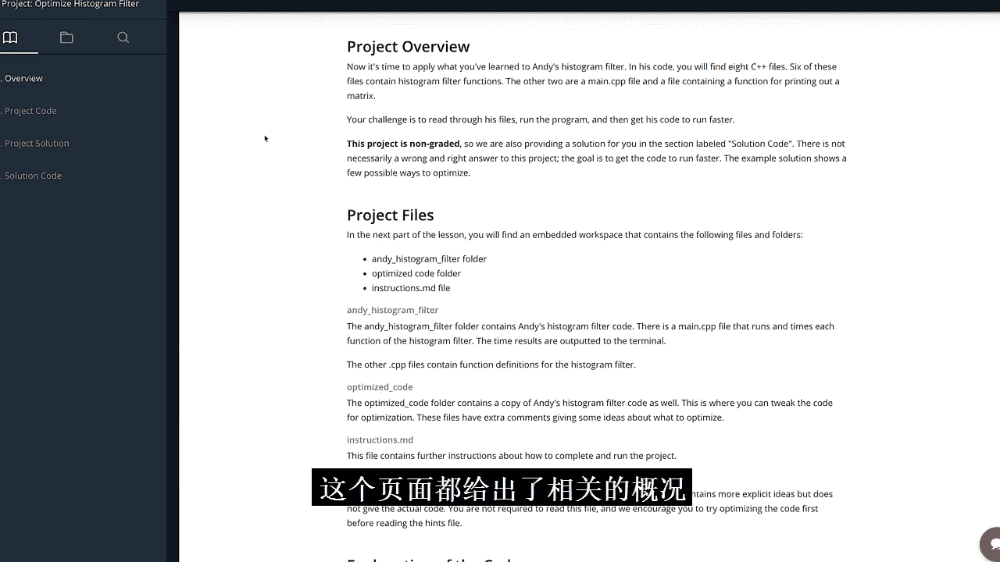
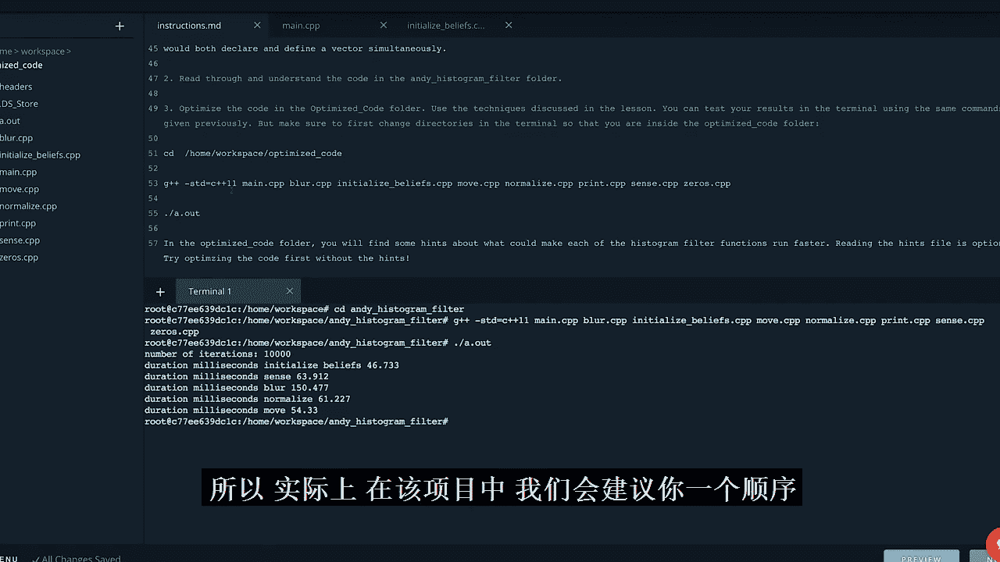
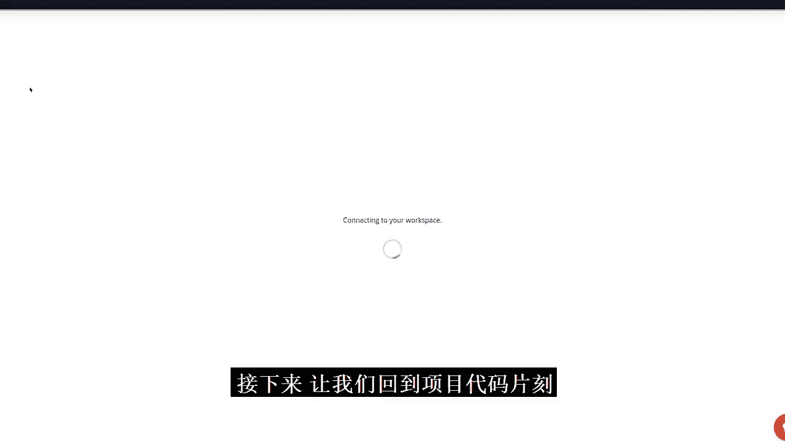
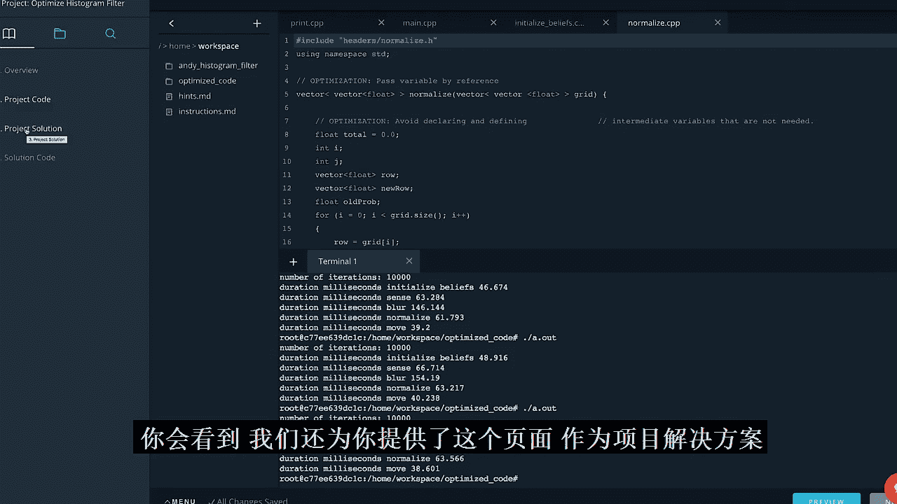
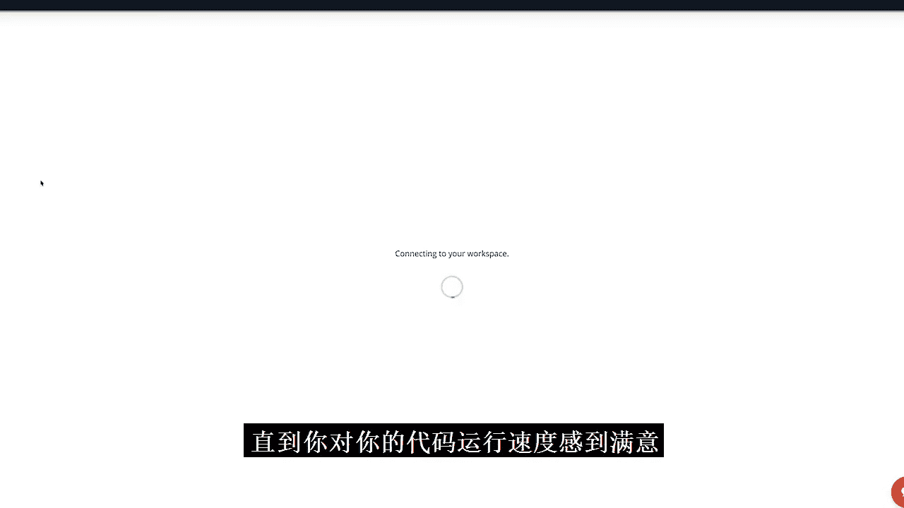
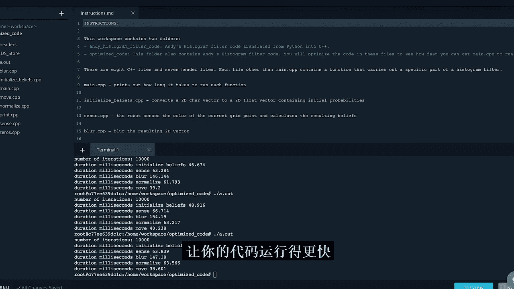

# 026：直方图滤波器代码优化教程 🚗💻

在本教程中，我们将学习如何优化一个功能完整但效率不高的C++直方图滤波器代码。我们将应用课程中学到的优化技巧，通过减少内存读写、优化循环结构等方法，显著提升代码的运行速度。



---

## 项目概述 📋

本项目提供了一个已能正常运行的C++直方图滤波器代码。代码功能正确，但存在多处效率低下的问题。你的任务就是应用所学的优化知识，让这段代码运行得更快。项目本身不计分，但提供了一个最终解决方案供你对比。完成项目后，欢迎到Slack的C++频道分享你的成果，与其他学员一较高下。

## 项目结构与说明 🗂️

打开项目后，你会看到两个文件夹：
*   `Andy_histogram_filter`： 包含原始的、未优化的代码。
*   `optimized_code`： 用于放置你优化后的代码。

我们提供两份相同代码，是为了让你始终保留一份原始版本，方便对比。此外，还有一个 `hints.md` 文件，在你遇到困难时提供优化思路。

`main.cpp` 是程序的入口。它定义了迭代次数 `iterations = 10000`，并依次测试 `sense`、`blur`、`normalize`、`move` 等函数的运行时间。你的工作就是深入这些函数对应的文件，找出并解决导致程序缓慢的原因。

以下是编译和运行代码的命令：
```bash
cd Andy_histogram_filter
g++ -std=c++11 *.cpp -o a.out
./a.out
```

## 优化顺序建议 🔧



我们建议按以下顺序对文件进行优化：
1.  `zeros.cpp`
2.  `initialize_beliefs.cpp`
3.  `sense.cpp`
4.  `blur.cpp`
5.  `normalize.cpp`
6.  `move.cpp`

这个顺序的依据是：`zeros.cpp` 代码量小，优化简单，适合热身；并且 `blur.cpp` 等函数会调用 `zeros.cpp`，先优化它能为后续优化带来即时收益。



## 优化实战：以 `zeros.cpp` 为例 🛠️

上一节我们介绍了项目的整体情况和优化顺序，本节中我们来看看如何具体优化第一个文件 `zeros.cpp`。

`zeros.cpp` 的功能是初始化一个指定高度和宽度的二维零向量。原始代码中可能存在效率问题。

打开 `zeros.cpp`，你可能会看到类似以下的提示：
*   **优化：为向量预留内存空间**
*   **优化：不需要嵌套循环，因为矩阵的每一行完全相同**

基于第一点提示，我们可以进行优化。在C++中，如果事先知道向量的大小，使用 `reserve()` 方法预先分配内存可以避免向量在动态增长时多次重新分配和复制数据，从而提升性能。

优化前的代码可能没有预留空间。优化后，我们可以这样做：
```cpp
std::vector<std::vector<float> > newGrid;
newGrid.reserve(height); // 为外层向量预留空间
std::vector<float> newRow;
newRow.reserve(width); // 为内层行向量预留空间

for (int i = 0; i < height; ++i) {
    newRow.clear();
    for (int j = 0; j < width; ++j) {
        newRow.push_back(0.0);
    }
    newGrid.push_back(newRow);
}
```

**重要：每次修改后都必须测试！** 优化不能只凭感觉。编译并运行代码，比较优化前后的耗时。你会发现，即使只是这样一个简单的改动，也可能让调用 `zeros` 函数的 `move` 操作显著提速。

## 核心优化流程 🔄

对于每个需要优化的文件，请遵循以下流程：
1.  **分析代码**：仔细阅读代码，结合文件中的提示，思考可能的瓶颈（如不必要的变量、未预留内存的向量、低效的嵌套循环等）。
2.  **实施修改**：应用你认为可行的优化策略。
3.  **编译测试**：重新编译并运行程序，记录耗时。
4.  **对比验证**：与修改前的运行时间进行对比，确认优化是否有效。有时修改可能适得其反，测试是唯一的检验标准。

以下是其他需要注意的文件：
*   `blur.cpp`， `initialize_beliefs.cpp`， `move.cpp`， `normalize.cpp`， `sense.cpp`： 这些是主要的优化目标文件，内部都有明确的优化提示。
*   `print.cpp` 和 `main.cpp`： 你**不需要**修改这两个文件。`main.cpp` 负责测试，`print.cpp` 是提供的调试工具。

## 项目资源与总结 🏁



在本教程中，我们一起学习了如何分析并优化一段既有的C++代码。我们了解了预留内存、简化循环等基础但有效的优化手段，并强调了“修改-测试-验证”这一核心工作流程。



项目还提供了额外资源：
*   **提示文件** (`hints.md`)： 提供更详细的优化思路。
*   **解决方案**： 在项目界面的“Project Solution”部分，我们提供了一个优化后的代码版本，其中用注释标明了所有修改点。建议你先独立完成优化，满意后再进行参考。



完成优化后，你可以获得巨大的成就感，并深刻理解如何通过洞察CPU和内存的工作方式，用一些小改动换来程序性能的大幅提升。祝你优化愉快，并在Slack上晒出你的傲人成绩！