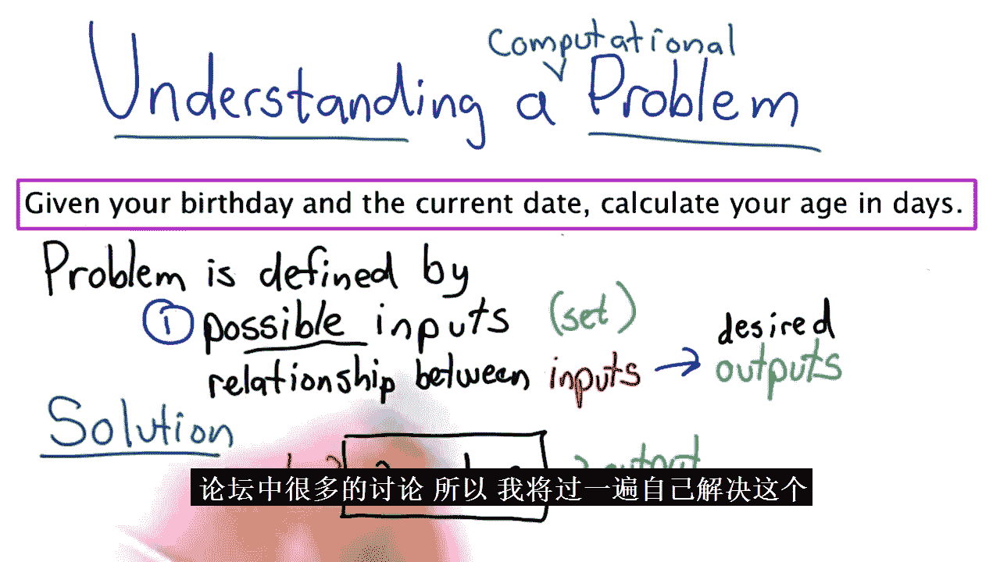
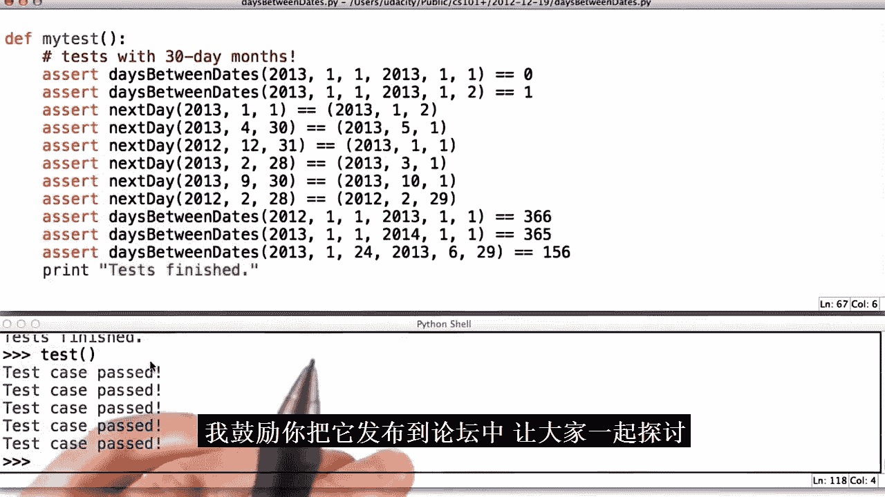

# 027：无人驾驶汽车纳米学位项目-十位大牛亲授自动驾驶技术，硅谷前沿科技（计算机视觉⧸车道识别⧸感知控制⧸人工智能⧸谷歌） p27 27. Part 06-Module 01-Lesson 01_How to Solve Problems


在本节课中，我们将要学习如何系统地解决复杂的编程问题。我们将通过一个具体的实践案例——“计算两个日期之间的天数”——来学习一套通用的问题解决框架。这套方法将帮助你理解问题、分解问题，并最终编写出正确且高效的代码。

## 1️⃣：理解问题




上一节我们介绍了本节课的目标，本节中我们来看看解决问题的第一步：理解问题。

在开始编写任何代码之前，我们必须确保自己完全理解问题。所有计算问题都包含**输入**和**期望的输出**。一个问题的解决方案，就是一个能够接受任何有效输入并产生符合预期关系的输出的过程。

对于我们的案例，输入是两个日期（生日和当前日期），输出是这两个日期之间的天数。

以下是理解问题的关键步骤：

*   **明确输入**：输入是两个日期，每个日期由年、月、日三个整数表示。我们假设第二个日期不早于第一个日期（即“没有时间旅行”），且日期都是公历中的有效日期。
*   **明确输出**：输出是一个整数，代表两个日期之间的天数。我们选择“返回”这个数字，而不是“打印”它，这样结果可以被用于后续计算。
*   **通过例子验证理解**：通过手动计算几个简单例子，可以验证我们对输入输出关系的理解是否正确。

## 2️⃣：构思解决方案

上一节我们明确了问题的输入和输出，本节中我们来看看如何构思一个解决方案。

在理解了问题之后，下一步是思考如何以系统化的方式解决问题。我们可以先尝试像人类一样手动计算。

例如，计算2013年1月24日到2013年6月29日之间的天数。我们可能会这样算：1月剩余7天，加上2月全月28天，加上3月31天，加上4月30天，加上5月31天，再加上6月的29天。总和是156天。

基于这个思路，我们可以写出一个初步的算法（伪代码）：
```python
days = 当月总天数 - 起始日
while 当前月份 < 目标月份:
    days += 当前月份的天数
    当前月份 += 1
days += 目标日
```
然而，这个算法存在很多未处理的特殊情况（如同一个月、跨年、闰年等），会使得代码变得复杂且容易出错。

## 3️⃣：追求简单方案

上一节我们构思了一个初步但复杂的算法，本节中我们来看看一个更简单、更“笨”但更可靠的方法。

对于计算机而言，最直接的方法往往是最可靠的。我们可以从一个日期开始，一天一天地往后数，直到到达第二个日期，每数一天计数器就加一。

伪代码如下：
```python
days = 0
while date1 < date2:
    date1 = next_day(date1) # 跳到下一天
    days += 1
return days
```
这个方法对人类来说很繁琐，但对现代计算机来说完全可行。即使计算100年的间隔（约36500天），也只需要几十毫秒。在不确定是否需要优化性能之前，优先选择简单、易于实现和调试的方案。

## 4️⃣：分步实现与测试

上一节我们确定了一个简单的“逐日计数”方案，本节中我们来看看如何将其转化为代码，并采用分步开发的策略。

我们不应该一次性编写所有代码。相反，应该将大问题分解成小部分，逐个实现和测试。对于我们的方案，核心是`next_day`函数（计算下一天）和`date_is_before`函数（比较日期先后）。

以下是推荐的实现顺序：

1.  **实现`next_day`函数（简化版）**：先假设每个月都是30天，快速实现一个能工作的版本。
2.  **实现`date_is_before`函数**：用于判断循环何时停止。
3.  **实现`days_between_dates`函数**：利用上面两个函数完成主逻辑。
4.  **用桩函数替换假设**：创建一个`days_in_month`函数（桩函数），总是返回30，并让`next_day`调用它。
5.  **完善`days_in_month`函数**：使其能返回正确的月份天数（暂不考虑闰年）。
6.  **实现`is_leap_year`函数**：判断闰年。
7.  **最终完善`days_in_month`函数**：结合闰年判断，正确处理二月的天数。

每一步完成后，都应编写相应的测试用例进行验证。这种增量开发的方式能让你快速定位错误，并随着每一步的成功获得信心。

## 5️⃣：课程总结

本节课中我们一起学习了解决复杂编程问题的系统方法。

我们通过“计算日期差”这个具体例子，实践了以下核心步骤：
1.  **不要慌张**。
2.  **理解输入和输出**。
3.  **通过手动计算例子来厘清关系**。
4.  **构思一个简单、机械的解决方案**（通常暴力法对计算机很友好）。
5.  **采用增量式开发，分步实现并测试**。



掌握这套问题解决框架，将帮助你在未来面对任何编程挑战时，都能有条不紊地分析、拆解并最终攻克它们。解决问题的技能需要终身练习，希望本节课的内容能成为你一个良好的起点。