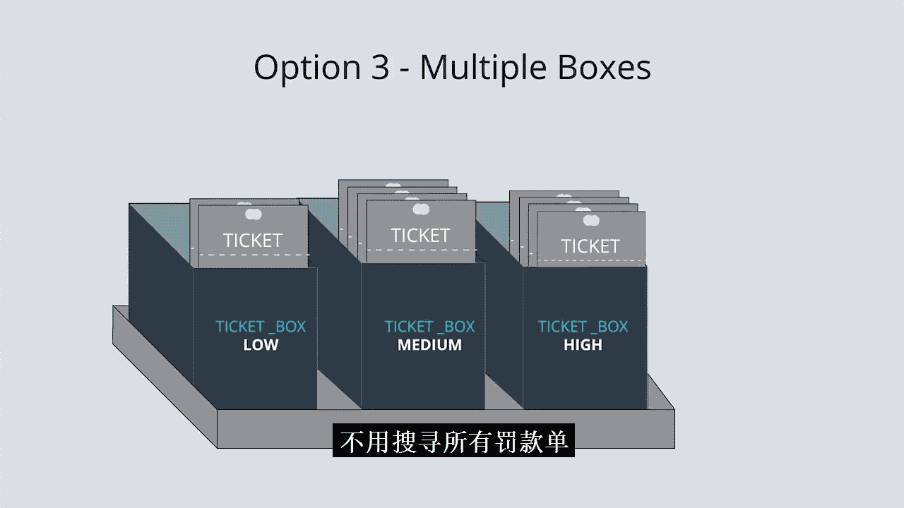
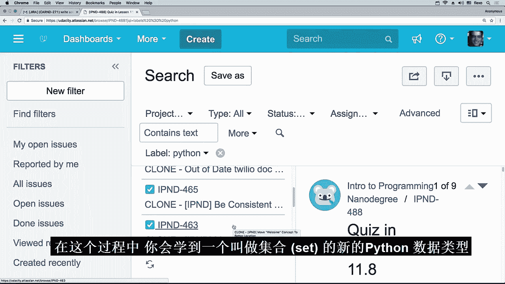

# 028：数据结构 🧱

在本节课中，我们将要学习两种新的Python数据结构：字典和集合。我们将探讨它们与列表的区别，理解如何根据数据的特性选择合适的数据结构，并学习如何运用它们来编写更易读、更高效、更简洁的代码。

## 从列表到更多选择

到目前为止，在纳米学位项目中，你已经大量使用了Python列表。你曾用列表表示一维和二维世界，以及矩阵和向量。在后续的标准课程中，你还会看到图像也可以表示为列表。

列表非常有用，尤其是当它们包含的数据具有某种有意义的顺序时。

但列表并非你唯一可用的数据结构。在本课中，你将学习另外两种数据结构：字典和集合。学会正确使用这些数据结构，将使你编写的代码更易阅读、更易编写，并且运行效率更高。这些数据结构在编程面试中也经常出现，因此多了解它们总是有益的。

## 理解数据结构的意义

在深入探讨新数据结构之前，我们先来理解“数据结构”的含义。

当你加入一个自动驾驶汽车团队时，你最终需要进入车辆并实际观察其驾驶行为。当车辆出现任何意外情况时，你可能需要提交一份“工单”。

在实际工作中，这通常是在电脑上完成的。但思考一个模拟的工单追踪系统，有助于我们理解数据结构的概念。

在这个模拟系统中，工单是一个物理实体。如图所示，工单包含多个字段：日期、优先级和描述。

填写完工单后，你需要将其归档，可能放入一个存放待处理工单的盒子中。这个盒子很可能按日期排序，最旧的工单在后面，最新的在前面。因此，你可以直接将新工单放在盒子的最前面。

需要注意的是，选择按日期顺序将工单存储在单个盒子中，是一个设计决策。这是规划此工单追踪系统时做出的决定，但并非唯一的设计方式。

## 设计权衡与思考

现在，请思考这个特定设计及其带来的一些权衡。

我们之前讨论的工单系统使得查找最旧的工单变得非常容易。我们只需取出盒子最后面的工单即可。这是该系统的一个优点。处理工单的人可能希望按时间顺序处理问题，以确保最旧的问题优先得到解决。

但是，如果我们想优先处理最重要的问题呢？该系统没有提供任何好的方法来实现这一点。

因此，请花些时间思考你将如何设计这样的系统。

当我思考这个问题时，我想到了三个方案。我考虑了它们的优缺点，并最终选定了我认为最好的一个。接下来，我将带你了解我的思考过程，因为我们在设计工单系统时的思考方式，与编程时选择数据结构的思考方式几乎完全相同。

### 方案一：按优先级分袋

我的第一个尝试是直面问题：如果我只关心工单的优先级而不关心其他，那么我可以准备三个袋子。

填写完每张工单后，我只需将其扔进相应的袋子。例如，高优先级、中优先级或低优先级。

这并非一个糟糕的解决方案。事实上，如果工单的优先级确实是我们唯一关心的数据结构，那么这是一个很好的方案。但很可能并非如此，我们可能也关心工单的提交时间。

### 方案二：插入时按优先级排序

这种想法引出了第二个方案：在插入时按优先级排序。

在这个方案中，我们重新使用一个盒子。但现在的目标是确保这些工单首先按优先级排序，然后按日期排序。因此，所有高优先级工单都在后面，中间是中优先级工单，前面是低优先级工单。

现在，让我们思考如何使用这个系统。例如，当我去提交一份高优先级工单时，我首先需要找到它应该放置的位置。在这个例子中，我需要搜索盒子中已有的所有工单，直到找到第一份高优先级工单，然后我必须将这份新工单放在它的前面。

起初，我确实很喜欢这个解决方案。但提交工单所需的额外时间开始让我感到困扰。当我在车辆中时，我应该专注于车辆，而不是提交工单。因此，当我提交工单时，这个过程应该尽可能快。

### 方案三：多个盒子（最终选择）

这引出了第三个方案，也是我最终选择的方案：使用多个盒子。

在这个方案中，我将一个工单盒子替换为三个盒子，每个优先级一个。例如，一个低优先级盒子、一个中优先级盒子和一个高优先级盒子。为了保持整洁，我将这三个盒子放在一个小箱子内。

现在，当我想提交工单时，我只需将其放在相应盒子的最前面，无需翻阅旧工单。

## 从物理世界回到数字世界

到目前为止，我们一直在讨论使用盒子和袋子在物理世界中存储多个工单的系统。现在，我们将回到数字世界，思考如何表示单个工单。

请记住，物理工单看起来像这样。但我们想讨论数字工单，这意味着我们只关心这张工单包含的数据，在本例中是文本。

但这不仅仅是文本，使用字符串在这里感觉并不合适。因为这里实际上有两种不同类型的文本。在左侧，我们有各个字段的名称：每个工单都有名为“日期”、“优先级”和“描述”的字段。而右侧的文本则因工单而异。

此时，我想指出关于这些数据的一点：正如我所展示的，日期的字符串出现在优先级之前，优先级又出现在描述之前。但这种排序背后并没有真正的意义。事实上，我们同样可以很容易地将描述放在第一位。

当数据本身没有任何固有的顺序时，这通常（但不总是）意味着我们应该使用列表以外的数据结构。

在下一节中，我们将探讨与各种数据结构相关的权衡。最终，我们将确定使用Python字典作为存储无序但相关数据的首选方式。

## 字典：键值对结构

你刚刚看到了字典如何通过允许我们使用像“日期”或“优先级”这样的键来访问数据，从而提高代码可读性并帮助我们避免错误。这个键与一个值相关联。因此，工单的“描述”键可能与值“车辆在绿灯时意外停止”相关联。

## 集合：仅存储键

但有时，我们实际上并不希望将键与任何值相关联。有时键本身就足够了，例如，如果我们想为工单添加标签。

让我展示一下Udacity实际上如何使用名为Jira的工单追踪软件来处理工单。

这是Jira的“创建问题”对话框，他们使用的“问题”一词就像我们一直使用的“工单”一样。如你所见，一个问题有一个关联的项目、一个问题类型（在本例中，我们称之为“缺陷”）、一个摘要（在本例中，可能是“所有功能都坏了”）。

这是一个相当严重的缺陷。我将忽略这里的一些字段，但我会将其优先级设为“最高”。让我们给它添加一些标签。也许我认为这个问题出在Python代码中，所以我输入“pyt”，我可以看到自动补全建议“Python”作为标签，我可以点击它。也许我还想给它添加“book”标签。这也是一个建议。

现在，让我们看看如果我不假思索地尝试再次添加“Python”会发生什么。没有匹配项。不知何故，Jira确保这个数据结构不会包含重复的相同标签。

在Python中，有一种数据结构正是做这件事的，它叫做“集合”，这就是我接下来要教你的内容。

但在我们继续之前，让我们创建我们的问题并点击这个Python标签。如你所见，这是Jira支持的功能，它向我展示了所有带有“Python”标签的内容，并显示了每个关联了该标签的问题。

在下一个笔记本中，你将为我们一直在研究的工单追踪器实现类似的功能，在此过程中，你将学习一种新的Python数据类型：集合。

## 总结与鼓励

选择一个好的数据结构来解决难题，实际上需要你做好很多事情。首先，你必须很好地定义问题。然后，你必须了解你可用的数据结构，如列表、字典和集合，以及它们的权衡和局限性。接着，你必须选择一个好的数据结构来实际表示问题，以便你能编写一个好的算法来解决它。

这需要很多练习才能变得容易。

随着你继续学习这个纳米学位，我真诚地鼓励你积极思考你编写的算法和你选择使用的数据结构。当你感到不确定时，与他人讨论这些事情非常有帮助。因此，请使用纳米学位的Slack频道，提出问题，并参与关于你正在学习的所有新概念的讨论。