# 029：搜索问题


在本节课中，我们将要学习问题求解的理论与技术，特别是如何构建能够提前规划以解决问题的智能体。课程的核心在于理解搜索问题，其复杂性源于存在大量可能的状态，智能体需要从中选择一系列正确的动作序列来达成目标。

## 问题定义

上一节我们介绍了搜索问题的概念，本节中我们来看看如何形式化地定义一个搜索问题。一个搜索问题可以分解为以下几个核心组件：

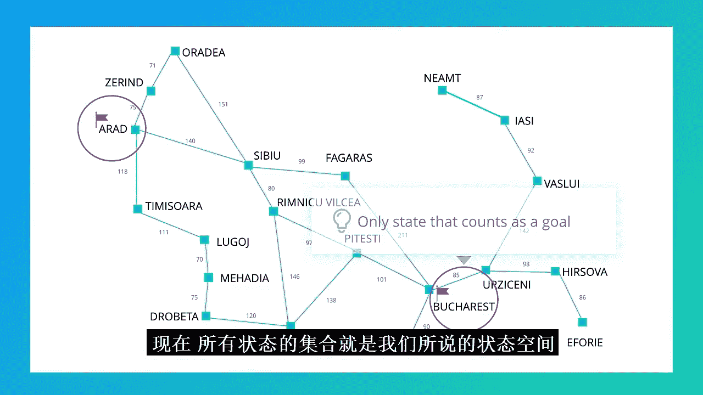

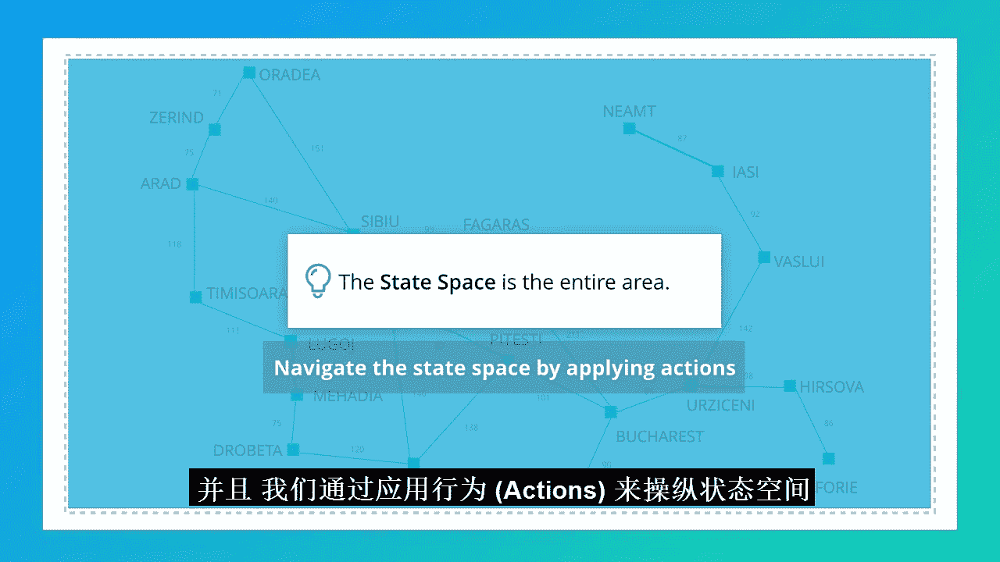

*   **初始状态**：智能体开始时所处的状态。在路线查找问题中，初始状态是智能体位于城市Arad。
*   **动作函数**：`actions(state)`。该函数接收一个状态作为输入，返回在该状态下智能体可以执行的所有可能动作的集合。在路线查找问题中，动作取决于当前所在的城市。
*   **转移函数**：`result(state, action)`。该函数接收一个状态和一个动作作为输入，输出执行该动作后到达的新状态。例如，在Arad状态执行“沿E671公路前往Timisoara”的动作，结果状态是Timisoara。
*   **目标测试函数**：`goal_test(state)`。该函数接收一个状态，返回布尔值（True或False），判断该状态是否为目标状态。在路线查找问题中，只有位于Bucharest市的状态会返回True。
*   **路径成本函数**：`path_cost(path)`。该函数接收一个由状态-动作转移构成的路径（序列），返回一个表示该路径总成本的数字。通常，路径成本是各步骤成本的累加和，因此我们常用一个**步骤成本函数** `step_cost(state, action, result_state)` 来定义单次行动的成本，例如行驶的公里数或分钟数。

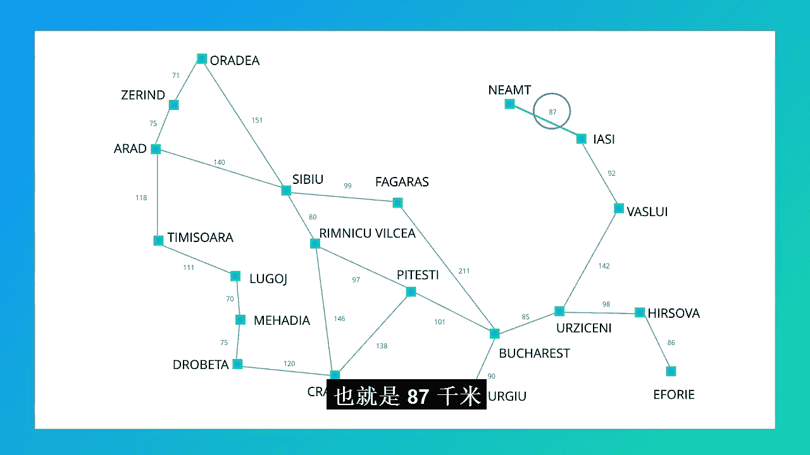

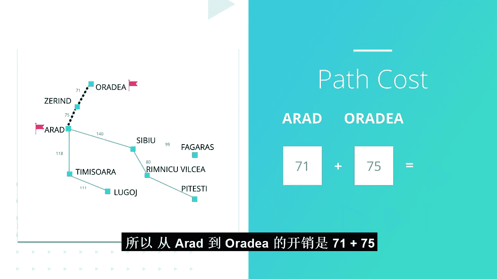

## 搜索空间与算法框架

理解了问题的构成后，我们需要在由所有可能状态构成的**状态空间**中进行导航。搜索算法通过在状态空间上叠加一棵**搜索树**来工作。

以下是搜索算法的通用框架，称为**树搜索**：

```python
function tree_search(problem):
    frontier = [Path(problem.initial_state)]  # 初始化边界，仅包含初始状态路径
    while frontier is not empty:
        path = remove_choice(frontier)        # 从边界中选择一条路径（选择策略不同，算法不同）
        s = path.end_state
        if problem.goal_test(s):
            return path                       # 找到目标，返回路径
        for action in problem.actions(s):
            new_path = path.extend(action, problem.result(s, action))
            add new_path to frontier          # 扩展路径，将新路径加入边界
    return failure                            # 边界为空，无解
```

这个框架是一个算法家族，其核心区别在于从边界（frontier）中选择下一条扩展路径的策略。

## 无信息搜索算法

首先，我们来看几种不利用问题领域特定知识的搜索算法，它们仅根据路径的基本属性（如长度或成本）进行选择。

### 广度优先搜索

广度优先搜索总是优先扩展边界中**最短**（步数最少）的路径。

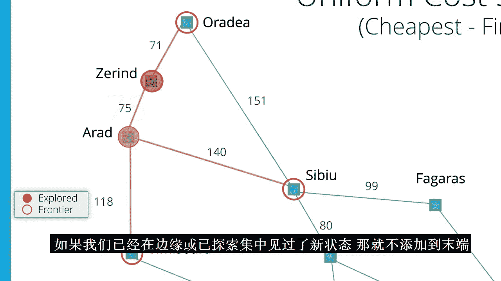

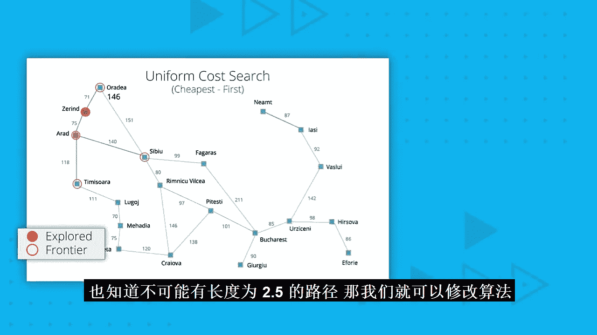


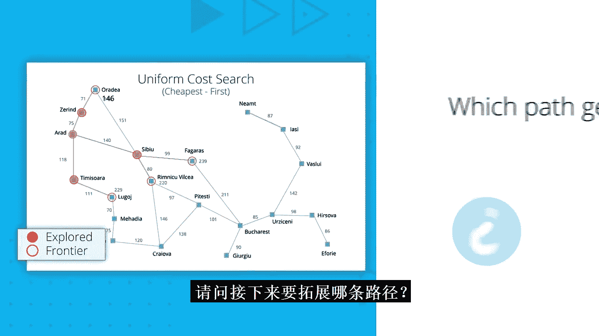


*   **特点**：如果解存在，它能找到步数最少的解（对于步数成本最优）。在状态空间无限但解位于有限深度时，它也是完备的。
*   **空间复杂度**：在最坏情况下，需要存储与搜索树最宽层节点数成比例的空间，对于分支因子为b、解在深度d的情况，约为 O(b^d)。

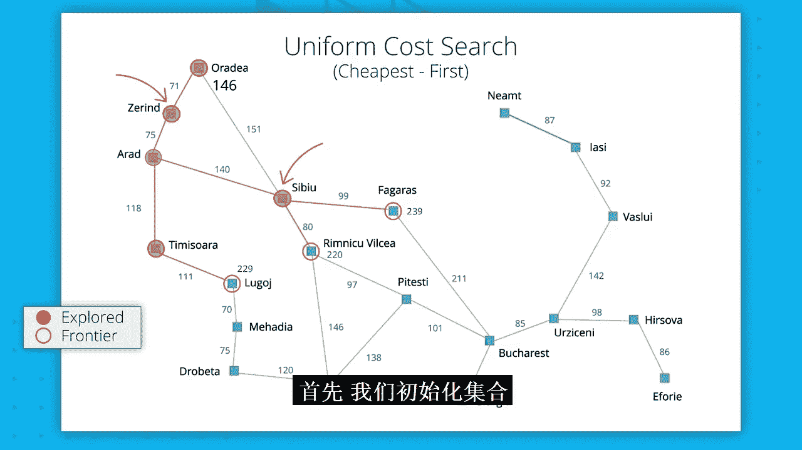


### 深度优先搜索

深度优先搜索总是优先扩展边界中**最长**的路径，即尽可能深入搜索树的一条分支。

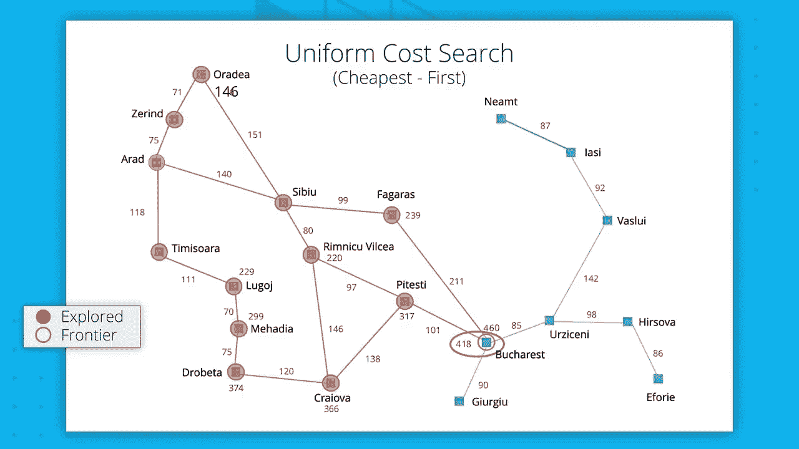

*   **特点**：不能保证找到最短路径（非最优）。在存在无限路径的状态空间中，可能永远找不到解（不完备）。
*   **空间复杂度**：优势在于空间需求小，只需要存储从根节点到当前叶节点的路径，约为 O(b*m)，其中m是最大搜索深度。

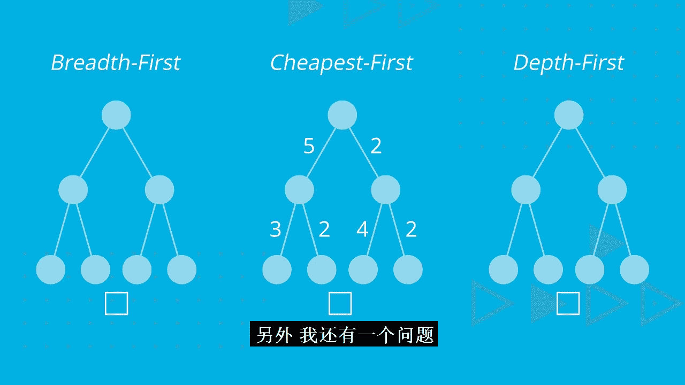

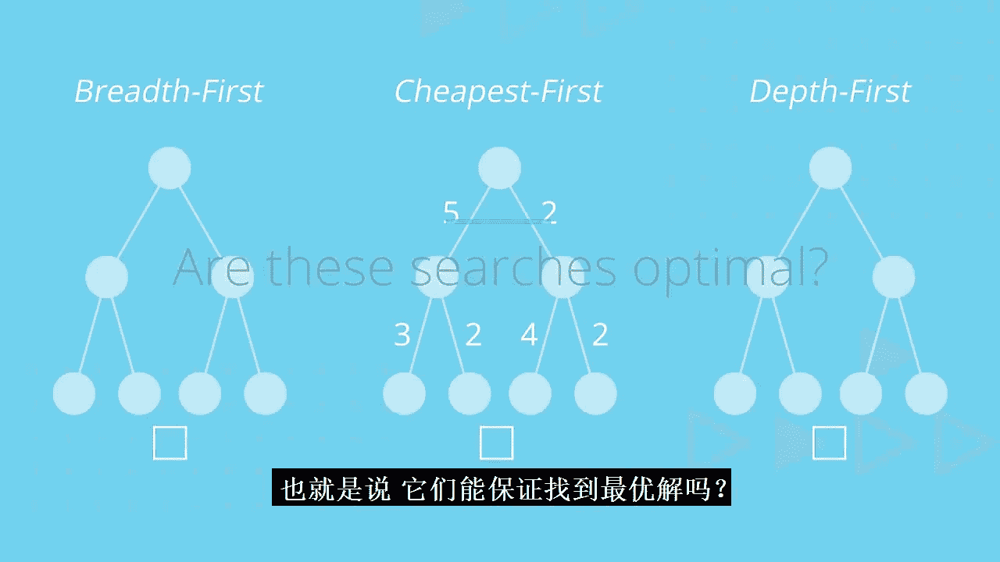

### 一致代价搜索（ cheapest-first ）

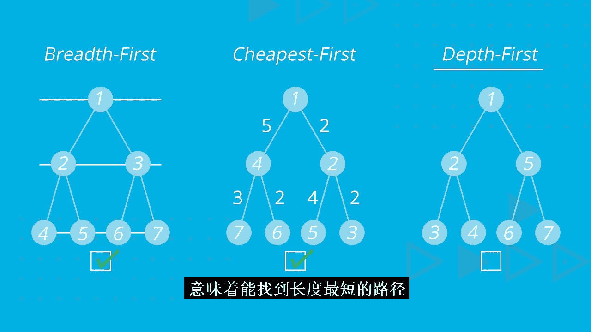

一致代价搜索总是优先扩展边界中**总路径成本最低**的路径。它使用步骤成本函数 `step_cost` 来计算累计成本。

*   **特点**：当所有单步成本为非负时，它能保证找到总成本最低的解（最优）。它也是完备的。
*   **搜索方式**：它的搜索边界类似于在地图上按成本从低到高画出的“等高线”，逐步向外均匀扩展，直到触及目标。


## 有信息（启发式）搜索算法

无信息搜索在大型状态空间中可能效率低下。为了更有效地导向目标，我们可以利用问题领域的知识，即**启发函数** `h(state)`，它估计从某个状态到目标的剩余成本。

### 贪婪最佳优先搜索


贪婪最佳优先搜索总是优先扩展边界中**启发值 `h(state)` 最小**（即看起来离目标最近）的路径。

*   **特点**：通常能快速找到解，因为它直接朝向目标努力。但它**不保证找到最优解**，甚至可能因为局部最优而陷入困境（例如遇到障碍时选择绕远路）。

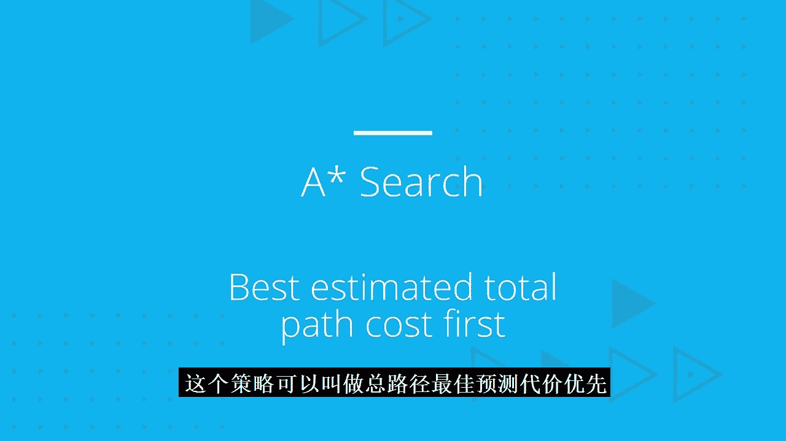

### A* 搜索

A* 搜索结合了路径实际成本和对目标距离的估计，它扩展边界中 **`f = g + h` 值最小**的路径，其中：
*   `g(path)` 是从起点到当前状态的**实际路径成本**。
*   `h(state)` 是从当前状态到目标的**估计成本**（启发值）。

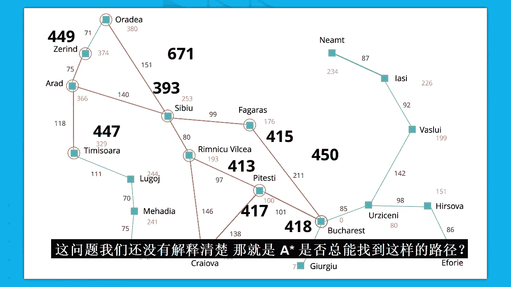

*   **特点**：在启发函数 `h` **可采纳**（即永不高估到达目标的实际成本）且**一致**的条件下，A* 搜索既能保证找到最优解，又通常比一致代价搜索更高效。
*   **为什么有效**：`g` 保证了路径的成本最优性倾向，`h` 将搜索导向目标，两者结合实现了在保证最优性的前提下最小化搜索范围。

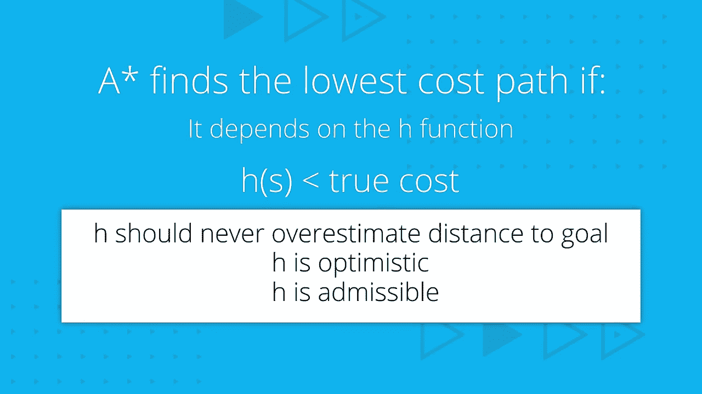

#### 启发函数与可采纳性

一个好的启发函数能显著提升A*的效率。例如，对于15数码问题：
*   **`h1` = 错位方块数**：可采纳，因为每个错位方块至少需要移动一次。
*   **`h2` = 曼哈顿距离和**（每个方块到其目标位置的水平和垂直距离之和）：也可采纳，且通常比 `h1` 更准确（值更大），能引导A*扩展更少的节点。

我们可以通过**松弛问题**的方法自动生成可采纳的启发函数，例如移除原问题定义中的某些约束条件（如“目标方格必须为空”），从而得到一个更容易求解的问题，其最优解成本即为原问题的一个可采纳启发值。

## 搜索的适用范围与实现

搜索技术非常强大，但它适用于满足以下条件的**规划问题**：
1.  **完全可观测**：智能体能获知初始状态。
2.  **已知领域**：智能体知晓所有可用的动作。
3.  **离散**：状态和动作的数量是有限的。
4.  **确定**：执行动作的结果是确定的、可知的。
5.  **静态**：除了智能体自身的动作，没有其他因素会改变世界状态。

### 算法实现要点

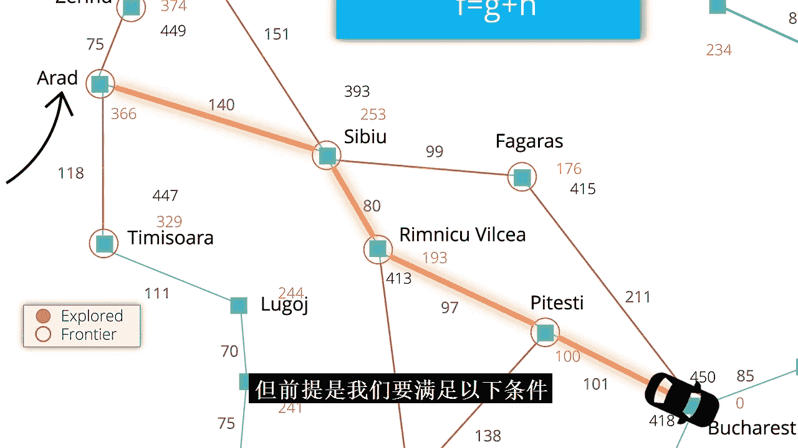


在计算机中，我们使用**节点**数据结构来表示路径：
```python
class Node:
    state:    # 路径末端的状态
    action:   # 导致此状态的行动
    cost:     # 到达此状态的总路径成本
    parent:   # 指向父节点的指针
```
主要的数据结构包括：
*   **边界**：通常实现为**优先队列**（用于快速获取最佳节点）并结合**集合**（用于快速检查成员资格）。
*   **已探索集**：通常实现为一个**集合**（哈希表或树），用于记录已访问过的状态，避免重复探索。

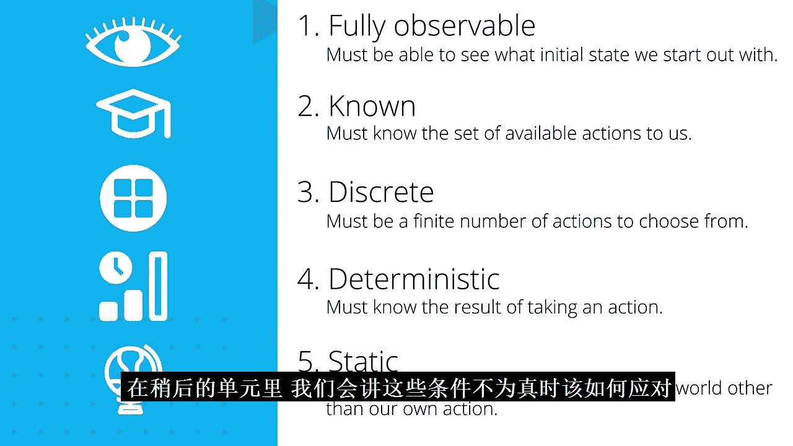

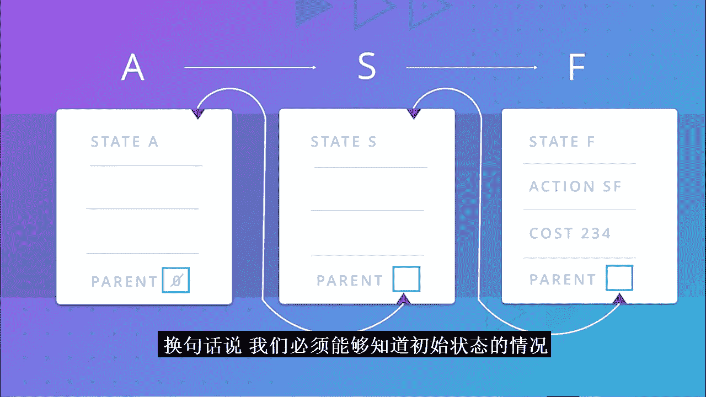

## 总结

本节课中我们一起学习了搜索问题的核心框架与多种算法。我们从形式化定义问题开始，了解了状态空间和搜索树的概念。接着，我们探讨了**广度优先**、**深度优先**和**一致代价**这三种无信息搜索策略，分析了它们的最优性、完备性和空间需求。然后，我们引入了启发式信息，学习了**贪婪最佳优先搜索**和强大的**A*搜索**，理解了可采纳启发函数对保证A*最优性的关键作用，以及如何生成启发函数。最后，我们明确了搜索技术适用的五大条件，并简要了解了搜索算法在计算机中的实现方式。掌握这些搜索原理，是构建能自主规划的问题求解智能体的重要基础。