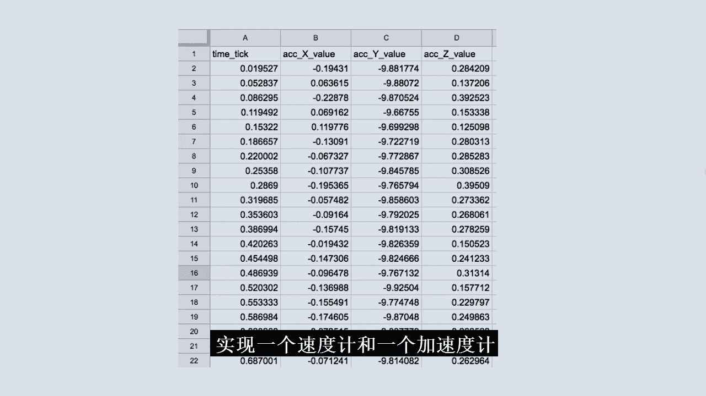

# 032：里程计、速度计与导数

在本节课中，我们将学习车辆运动的基本概念，特别是如何通过测量位置变化来计算速度和加速度。我们将从里程计和速度计的工作原理入手，逐步引入微积分中的核心概念——导数，并理解它如何描述运动的瞬时变化率。

---

## 企业家与自动驾驶的愿景

我的名字是 Sha Maximoff，我是 Phantommatoto 公司的首席执行官。我创立 Phantommatoto 是为了为无人驾驶汽车提供远程操作服务。

我人生中有三样热爱的事物：游戏、通信和汽车。真正困扰我的是交通问题，我们都面临着通勤的难题。我认为自动驾驶汽车真正解决了这个问题。我对汽车、通信和游戏的热情，恰好在此交汇。

当时的情况是，我正坐在一个带有 VR 头显的赛车模拟器中。我突然意识到，如果能通过虚拟现实设备驾驶一辆真实的汽车会怎样？就像你有一个方向盘和踏板，如果你转动方向盘，汽车就会随之移动。这个想法能有什么用呢？这就是我们支持自动驾驶汽车并在它们需要帮助时提供远程协助的想法的起源。

这是远程操作控制台，是我们通过蜂窝信号远程控制汽车的方式。你可以看到我有三个屏幕，显示 180 度的视野，并且可以看到车内情况以观察乘客并与他们交谈。要控制汽车，我可以启动线控驾驶。

一旦汽车启动，你可以看到我对方向盘施加的任何动作都会转化为汽车的运动。这样，驾驶员就可以解放双手，利用通勤时间发送短信或电子邮件，成为社会中富有成效的一员，而不是仅仅坐在车里。

你可以看到 Ben 正在实时转动方向盘，即远程操作员。我们还有一个带有 GPS 位置的地图，可以进行导航。

我正在构建一项服务，并希望与所有制造这些汽车的大公司合作。因此，优达学城是进入这个行业、学习一切工作原理的基础知识、然后编写一些代码进行实践并了解挑战的绝佳方式。之后，我就可以立即围绕它创办自己的初创公司。

对我来说，自动驾驶汽车确实是下一个重大事件。

---

## 欢迎回来：里程计简介

欢迎回来，同学们。很高兴今天再次见到你们。我们来谈谈里程计。

里程计听起来很复杂，它是机器人整合内部测量数据（如车轮旋转等）以计算其行驶距离的能力。在深入探讨之前，我想和你做一个人类里程计实验。

请站起来，闭上眼睛。向前走 5 步。转身 180 度，再向前走 5 步。睁开眼睛。你成功回到原点了吗？

当你这样做时，你的大脑执行了里程计功能，它整合了来自肌肉和传感器的运动信息，从而判断你的位置。和我一样，你并不完美，可能有一点偏差。机器人也不完美。但机器人会持续从内部获取传感器数据，并计算它们行驶了多远。

机器人使用的数据略有不同，它们使用车轮的旋转、惯性测量数据。惯性测量包括磁力计、陀螺仪和加速度计。将这些数据整合成一个连贯的、关于我们行驶了多远的信念，正是下一课的全部内容。

---

## 车辆运动与控制入门

想象你闭着眼睛、堵住耳朵坐在一辆汽车的乘客座位上。你能知道关于自己运动的哪些信息？你可能能感觉到汽车何时快速加速、突然停止或急转弯。但这种知识的极限是什么？你能重建整个驾驶路径吗？如果能，如何做到？

本课程是关于车辆运动的速成课程。在这个过程中，你将探索这个确切的问题。同时，你也会学习微积分和三角学的基础知识，这些数学工具在自动驾驶汽车中被广泛使用。

我喜欢驾驶，但有时会觉得有点无聊。在我上次的公路旅行中，我决定记录一些关于我驾驶的数据。我在旅行开始时将行程里程表重置为 0，然后开始驾驶。

下午 2 点整，我注意到我的行程里程表刚好达到 30 英里。后来，在 3 点整，我再次查看，注意到里程表刚好达到 80 英里。

你能告诉我下午 2 点到 3 点之间我的平均速度是多少吗？

---

## 计算平均速度

计算下午 2 点到 3 点之间的平均速度。

平均速度等于行驶距离除以经过时间。用更数学化的术语来说，行驶距离由 Δx（位置变化）给出，经过时间由 Δt（时间变化）给出。

这个三角形符号是大写希腊字母 Delta，通常表示“变化”。当你看到像 Δx 这样的符号时，不应将其视为 Δ 乘以 x，而应将其视为一个名为 Δx 的变量。

计算 Δx 的方法是：最终位置减去初始位置。同样，计算时间变化 Δt。在这个例子中，就是 (80 - 30) / (3 - 2)，即 50 / 1，也就是每小时 50 英里。

这应该很容易理解：要知道下午 2 点到 3 点之间的平均速度，我需要知道在那段时间内我移动了多远（Δx），以及实际经过了多长时间（Δt）。

关于这个计算，有几点需要说明。首先，我们在这里计算的是**平均速度**。这不是你看速度计时测量的速度，我们稍后会进一步探讨。其次，我想引入“位移”这个术语。我将交替使用“位移”、“行驶距离”或 Δx。

之前，我告诉了你 2 点和 3 点的里程数，你可以计算出我的平均速度为 50 英里/小时。在那个例子中，我们可以说在 1 小时间隔内对我的位置或位移进行了两次测量。

本节课和下一课我们将要探索的是，当我们将这个时间间隔变得越来越小时会发生什么。

---

## 位置与时间图

数据常常讲述一个故事，而一个好的图表可以帮助揭示这个故事。现在，我想向你展示我如何思考这些位置-时间图，以理解数据讲述的故事。

这里我们有两条轴。在这个例子中，时间是横轴（x 轴），位置是纵轴（y 轴）。首先，我们从故事的最简单版本开始，添加两个数据点：一个代表下午 2 点 30 英里的起始位置，另一个代表下午 3 点 80 英里的结束位置。

每当我看到这样的数据时，想象甚至实际绘制一条连接这些点的线通常很有帮助。这条线代表了如果汽车在整个时间段内以单一恒定速度行驶，那么在 2 点到 3 点之间的每一刻汽车所在的位置。

这样的线对于理解这些图表非常有帮助，因为一旦有了这条线，就更容易看到位置变化 Δx（即两点之间的垂直距离）和时间变化 Δt（即两点的水平距离）。正如你之前所见，你也可以通过 Δx 除以 Δt 来计算平均速度。

现在我想指出一点，这对微积分有着相当深远的影响。计算 V_平均 与计算这条线的斜率是相同的计算。如果你还记得代数，斜率是图表的垂直变化除以水平变化来计算。或者像我学的那样，斜率等于上升量除以前进量，在这种情况下就是 Δx 除以 Δt。

所以你可以看到，这条线的斜率给出了这两点之间的平均速度。当斜率更陡时，意味着平均速度更快。

我们必须小心记住，这条线实际上只是我们画出来的东西，它不一定反映整个旅程中汽车的真实位置。如果我们想知道更完整的故事，就需要更多的数据。

假设我们以 20 分钟为间隔进行采样，发现在 2:20，里程表读数为 40，在 2:40，读数为 70。再一次，我要画一些线来连接这些点。

现在，记住任意两点之间连线的斜率给出了这两点之间的平均速度，我立刻可以看出，在前 20 分钟，汽车的平均速度比接下来的 20 分钟慢得多，因为斜率没有那么陡。然后在最后 20 分钟，汽车的平均速度再次变慢。

这确实有助于使故事更清晰。如果我想要更好的理解，就需要以更短的时间间隔采样更多的数据，比如每 10 分钟或每 5 分钟。有了这么多数据，我们甚至不再真正需要连接线作为视觉提示。

现在我可以看到，平均速度似乎在 2:30 到 2:35 之间最大。我知道这一点是因为我看到这里的斜率最陡，这意味着这里的 Δx / Δt 最大。

---

## 从平均速度到瞬时速度

现在我们将向微积分再迈进一步。到目前为止，你已经看到了如何以不同的分辨率或时间间隔观察一次旅程。在早期的例子中，我们首先使用 1 小时间隔，然后是 20 分钟，依此类推。每次我们减少时间间隔，我们就更接近完整的故事。

你也看到了如何使用这些位置和时间的测量值来计算平均速度。但仔细想想，这是一种相当奇怪的计算汽车速度的方式。如果你想知道你开得多快，你总是可以看看速度表，因为速度表直接测量速度，而速度表显示的速度是你的**瞬时速度**。它是你在看仪表盘的瞬间行进的速度。

速度表非常有用，但出于本课的目的和学习一些关于微积分的知识，我需要在下一个笔记本中思考和探索的问题是：我们知道用速度表可以测量瞬时速度，但是否可能使用我们一直在讨论的位置和时间测量值来计算瞬时速度？如果可能，如何计算？如果不可能，我们能做些什么来尽可能接近地近似瞬时速度？

---

## 速度与位置的关系

到目前为止，我们讨论了很多关于速度和位置的内容，原因是这两个量以三种重要方式相互关联。

**第一**，速度是位置的瞬时变化率。我们在前面的例子中尝试近似瞬时变化率，即让 Δt 越来越小。我们看到，随着 Δt 越来越接近 0，我们对真实瞬时速度的估计越来越好。

**第二**，速度是位置函数切线的斜率。这意味着如果我们有一个位置-时间的连续图像，并且我们想知道某个点（比如这里）的速度，那么我们要做的是首先绘制一条所谓的**切线**，即在该点刚好擦过图像的一条线。

在这种情况下，下面的线不是切线，尽管它穿过了橙色点，但它没有擦过图像，而是直接穿过了它。该点的切线看起来更像这样，因为这条线刚好在橙色点擦过图像。这使得第二个陈述成为一个相当惊人的事实：当你有一个位置-时间图，并且你想知道任何时刻的瞬时速度时，你只需找到该时刻图像的切线并计算其斜率。

**第三**，速度是位置的导数。在微积分中，导数被定义为瞬时变化率。它告诉你一个变量（如位置）相对于另一个变量（如时间）如何变化。导数往往出现在我们关心各种量如何一起变化的情况下。

例如，当我将方向盘转动 1 度时，我的车轮会转动多少？或者我的加速度会增加多少？或者当我将传感器更新频率提高 10% 时，我的定位不确定性将如何变化？为了从数学上回答这些问题，你需要使用导数。

如果这些问题或这三个陈述还不太明白，别担心，我们将在本课的剩余部分继续探索导数。

---

## 现实世界中的数据与导数

在这个典型问题中，车辆的位置以这个漂亮的代数表达式和相应的图像形式给出给你。当你知道一个函数（如位置）的代数描述时，你可以做各种巧妙的事情来精确计算导数。所谓精确，我的意思是，你实际上可以找到另一个代数方程，给出你在任何一点的导数。

对于这个函数，导数结果是 **-2t + 10**。它作为图像看起来像这样。能够从位置的代数描述中得到像速度这样的东西的代数描述，这实际上非常惊人。

但问题是，在现实中，当你处理在现实世界中导航的真实汽车时，你永远不会得到这种运动描述。没有人会告诉自动驾驶汽车：“嘿，你接下来 10 秒的位置将由以下方程描述。” 在现实中，你将得到的是**数据**。

这些数据将来自你的加速度计、里程计、摄像头、激光雷达和雷达，而且它们不一定很规整。在本课的剩余部分，你将做的正是这件事。你将使用里程数据来实现一个速度计，然后是一个加速度计。

---

## 总结

恭喜！在本课中，你对导数有了一个简要的介绍，并看到了一个函数的导数既是该函数的瞬时变化率，也是图像切线的斜率。

在下一课中，我们将继续探索自动驾驶汽车的运动。再见。