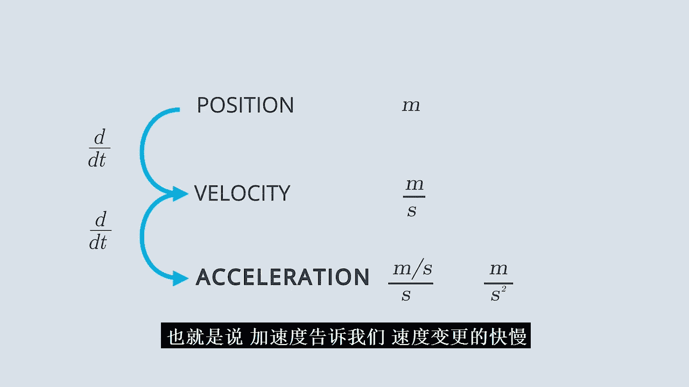
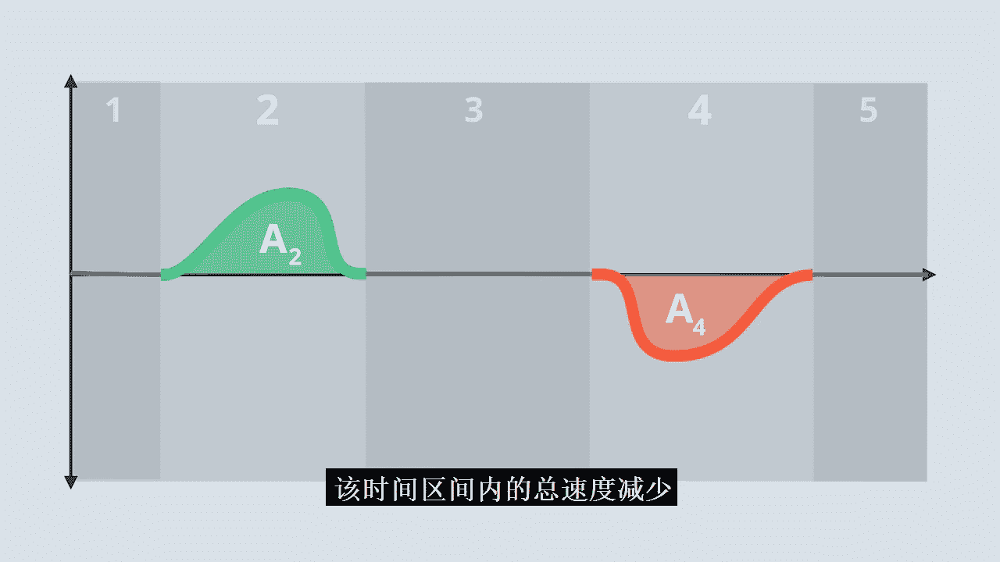
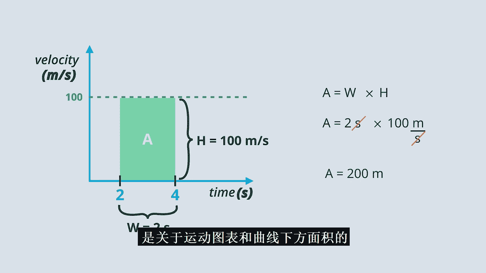
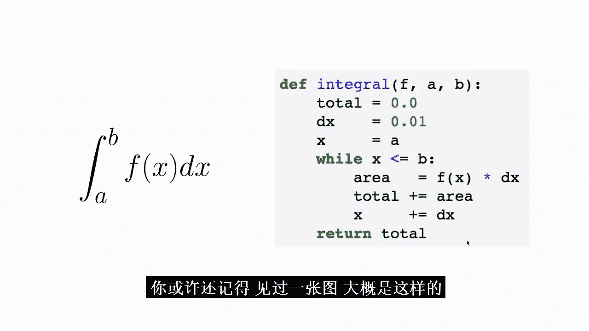
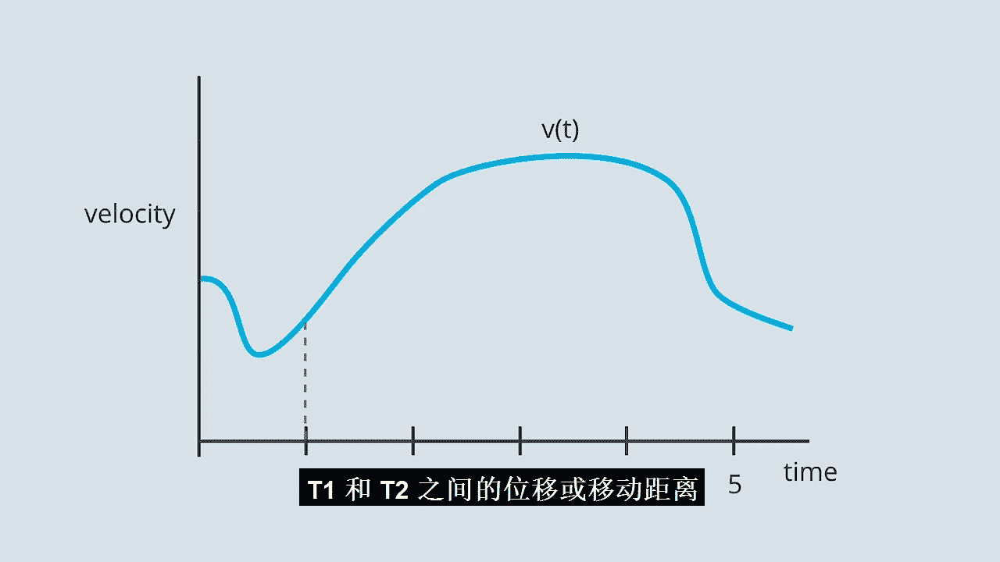
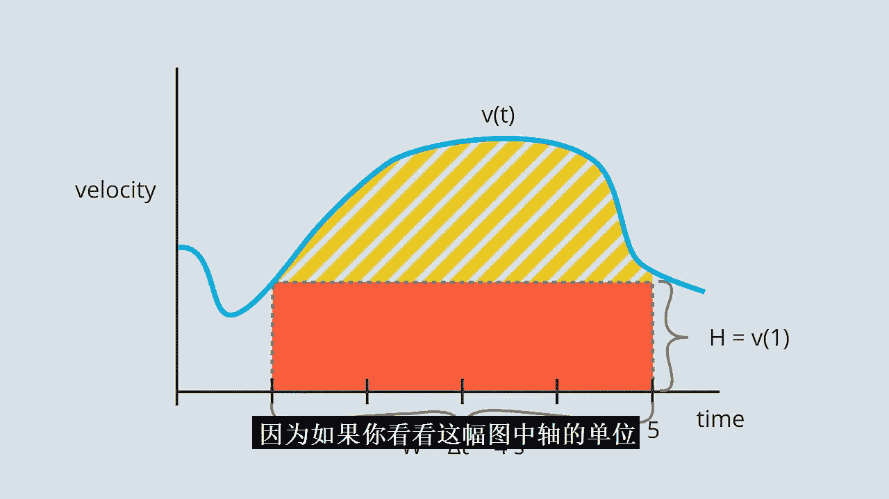
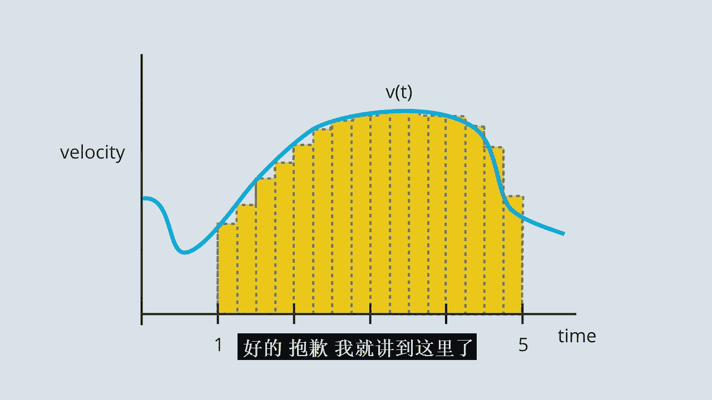

# 033：加速度计、速率陀螺仪与积分 📊

## 概述

在本节课中，我们将学习如何从加速度数据出发，计算速度和位置的变化。我们将探讨积分这一数学概念，并了解其在处理自动驾驶汽车传感器数据（如加速度计和速率陀螺仪数据）中的应用。

---

## 从加速度到位置：反向推导

上一节我们主要使用了里程计数据，即关于行驶距离的数据。我们了解到，可以通过计算车辆位置相对于时间的变化率来求得车辆的速度。

在上一节的最后，我们看到可以对速度数据做完全相同的事情来获得加速度。计算这些变化率的过程被称为微分或求导。因此，位置的导数是速度，速度的导数是加速度。

理解导数意味着，只要你能获取位置数据，你就能计算出速度和加速度数据。

但是，如果我们从加速度数据开始，想要了解速度或位置呢？在本节中，你将通过学习计算加速度数据的**积分**来掌握具体方法。

---

## 理解运动量：单位分析

位置、速度和加速度都是相互关联的。我们已经看到速度是位置的导数，加速度是速度的导数。在深入微积分之前，理解加速度的实际含义很重要，一种方法是查看与这些量相关的单位。

*   **位置**：例如，可以用英里或公里来测量。但最常用的是**米**，缩写为 **m**。
*   **速度**：通常以**公里每小时**、**英里每小时**或更常见的**米每秒**（**m/s**）为单位。注意，这些单位在分子上是距离单位，分母上是时间单位。这是因为速度是行驶距离的导数，是距离相对于时间的变化率。
*   **加速度**：它是速度相对于时间的变化率。这意味着分子应具有速度单位，分母应具有时间单位。因此，加速度的单位是 **米每秒每秒**（**m/s/s**），也常写作 **m/s²**，读作“米每二次方秒”。

我个人更喜欢第一种写法，因为它很好地提醒了加速度的实际含义：**速度相对于时间的变化率**。这意味着加速度只是告诉你速度变化得有多快。

---

## 案例分析：电梯加速度

你刚刚绘制了一部电梯从底层向上运行并在两层楼后停止时的加速度-时间图。数据大致如下所示。

我想请你注意数据的五个区域：
1.  第一部分：从我开始收集数据到电梯刚开始向上移动。
2.  第二部分：加速度为正的时期。这是电梯加速到正常速度的阶段，此时你可能会感到胃部稍有不适。
3.  第三部分：加速度在一段时间内基本为0。这是电梯以大致恒定的速度向上移动的阶段。
4.  第四部分：加速度在几秒钟内变为负值。这是电梯实际减速的阶段。
5.  第五部分：电梯停止后、但我关闭加速度计之前收集的所有数据。

区域2和区域4中的这两个凸起看起来非常相似。最明显的区别是一个为正，一个为负。除此之外，它们基本上像镜像。事实上，如果你计算这条绿色曲线下的面积并与这条红色曲线下的面积进行比较，你会发现它们完全相同，只是红色区域的面积在某种意义上是负的，因为它延伸到对应零加速度的水平线以下。

这并非巧合。在接下来的几个部分，我将向你证明，**绿色曲线下的面积对应于该时间间隔内发生的总速度增加量，而红色曲线下的面积对应于该时间间隔内发生的总速度减少量**。现在，我希望你再多思考一下这部电梯的运动。

---

## 积分的概念与符号

当你计算曲线下的面积时，你实际上是在进行**积分**。积分的数学符号是这个拉长的“S”形，通常在底部和顶部有所谓的**积分限**。

例如，如果 t₁ 是下限，t₂ 是上限，积分表达式为：`∫（从 t₁ 到 t₂）f(t) dt`。

**积分是导数的逆运算**。既然速度是位移的导数，这意味着**位移是速度的积分**。

让我们回到之前的图表。记住，这张图下的面积给出了总位移。现在，我想向你展示如何用积分符号来表达这个事实。

表达这一确切陈述的积分看起来像这样：`Δx = ∫（从 2 到 4）100 dt`。

解读方式如下：
*   **Δx**：总位移，这应该很熟悉。
*   **积分符号与积分限**：表示从时间 t=2 积分到 t=4。
*   **dt**：积分中总有一个“d某物”。这里的“某物”是 t，它告诉你积分限的含义（是时间 t=2 和 t=4，而不是 x=2 或 v=2）。
*   **100**：这里恰好是简单的 100，因为速度函数非常简单。如果速度函数更复杂，比如 `v(t) = 50 + 20t`，那么这里就会是 `50 + 20t`。

一般来说，这个 `v(t)` 可以是任何函数。所以我们可以写出这个通用版本的积分，它适用于任何奇怪的速度函数。

如果现在感觉有点难以理解，这是正常的。我只是想向你介绍一种你将在整个自动驾驶汽车生涯中都会看到的符号。幸运的是，计算机让使用这种符号变得相当简单。

我们将稍后回到电梯的例子。首先，我想提醒你在这个纳米学位项目早期课程中看到的一些内容。

---

## 重温：面积即位移

早些时候，当你学习矩阵和运动模型时，你可能记得看到过一个类似这样的图表，这是一个速度（米/秒）与时间（秒）的关系图。

当时，Czanne 告诉你，如果你想计算 t₁ 和 t₂ 之间的位移或移动距离，你可以通过**找到这条曲线下的面积**来实现。

在这个例子中，如果 t₁ 是 2，t₂ 是 4，那么这个矩形的宽度就是 4 - 2 = 2 秒，高度就是 100 米/秒。

我可以使用公式 `面积 = 宽度 × 高度` 来计算面积。在这种情况下，就是 `2 秒 × 100 米/秒`。这样写出来，你会发现有趣的事情：**秒** 单位实际上抵消了，最后只剩下 `200 米` 这个面积。

现在你明白为什么我一直如此关注与运动相关的单位了。因为如果你看这个图表的坐标轴单位，垂直轴的单位是米/秒，水平轴的单位是秒。当你将这些单位相乘时，就只剩下米。

**每当你计算积分时，你都会进行某种类似的乘法运算，并且你会查看图表坐标轴上的单位，以获取关于积分或曲线下面积实际代表什么的提示。**

现在，我希望你思考几个涉及运动图和曲线下面积的问题。

---

## 数值积分：用循环近似面积

在接下来的练习中，你将学习一种技术，让你能够对任何单变量函数进行积分，而这一切只需要一个循环。

在你深入研究代码之前，让我简要解释一下你将要做的事情背后的理论。

假设你想对速度关于时间进行积分，但你的速度是由某个相当复杂的函数给出的（现实世界经常如此）。假设你想使用这个速度数据来计算从 t=1 到 t=5 的位移。

当形状不是矩形时，如何计算面积？诀窍是：你并不直接计算，而是进行**近似**。

让我们从一个非常糟糕的近似开始：我们假设开始时的速度是整个四秒时间间隔内的速度。那么，我们的面积就是高度乘以宽度。在这种情况下，高度是速度函数在 t=1 时的值，宽度是时间间隔 Δt，这里是 4 秒。

显然，这是一个非常糟糕的近似，它没有考虑这条线上方的所有面积。但没问题，让我们改进近似。

一种方法是将这个 Δt 为 4 秒的单个区间，分解为四个 Δt 为 1 秒的时间区间。

然后，对于第一个时间区间（从 t=1 到 2），我们画一个矩形，再次使用 t=1 时的速度作为整个区间的速度。接着，我们对 2 到 3、3 到 4 以及 t=4 到 5 重复这个过程。

这将给出曲线下实际面积的更好近似。但你可能注意到它并不完美：除了在前两个区间低估了，它在最后一个区间实际上高估了。

所以，虽然这是一种改进，但仍然不够好。如何解决这个问题？我们将图表切割成更小的矩形。例如，我们可以使用半秒的时间间隔。这肯定更好了，但我们还可以更小。

随着我们将这些时间间隔的宽度减小到越来越接近 0，我们将越来越接近曲线下的真实面积。

好了，我说得够多了。我对积分感到非常兴奋。现在，你何不自己动手试试呢？

---

## 扩展到角速度与航向

到目前为止，你已经看到如何对加速度计数据进行积分以获得速度变化，也看到了如何对速度进行积分以获得位置变化或位移。

位移和速度对自动驾驶汽车来说是重要的量，因此我们能够从加速度计数据计算它们是非常幸运的。但是，**航向**呢？自动驾驶汽车需要知道它指向哪个方向，而一种方法是跟踪它转了多少。

幸运的是，所有自动驾驶汽车上的惯性测量单元都包含所谓的**速率陀螺仪**，这些陀螺仪测量一种叫做**角速度**的量。在本节剩余部分及接下来的练习中，你将看到如何使用来自这些速率陀螺仪的角速度数据来跟踪汽车的航向。

---

## 现实挑战：传感器噪声与误差

至此，你已经计算了速度数据、加速度数据和角速度数据的积分。希望你对进行积分意味着什么建立了良好的直观感受。

现在，我要坦白一件事：我向你展示的一些“真实”数据实际上并不真实。事实上，我偶尔可能生成了虚假数据，以便你绘制的图表干净、规整，并且积分都有意义。

但在现实中，传感器从来都不是完美的，它们有**噪声**，并且常常存在**偏差**。事实证明，当你对不完美的数据进行积分时，你的误差往往会**放大**。

我不希望你学完这个纳米学位后认为，定位机器人只需要一个加速度计和一个速率陀螺仪。虽然这些工具有帮助，但它们也有自身的缺陷。在接下来的部分，你将积分真实数据，并探索这样做时出现的一些问题。

---

## 总结与展望

恭喜你完成本课！在上一课中，你看到了像位移这样的量的导数如何给出速度。在本课中，你看到了积分如何让你反向而行，从速度计算位移，甚至从加速度计算速度。

我希望此时你对积分是什么以及为什么它对理解自动驾驶汽车的运动有用有了概念性的理解。

但我也想说的是，如果你以前从未上过微积分课，或者即使上过，你现在可能感觉有点不知所措，这完全正常。微积分真的很难，传统的微积分课程要花几个月来覆盖积分。

随着你不断使用和讨论运动、变化率以及变化的累积，你会对导数和积分等概念越来越熟悉。现在，我建议你接受可能感受到的任何智力上的不适，并为下一个挑战做好准备，因为在下一课中，你将参加另一个惊人数学分支——**三角学**的速成课程。

