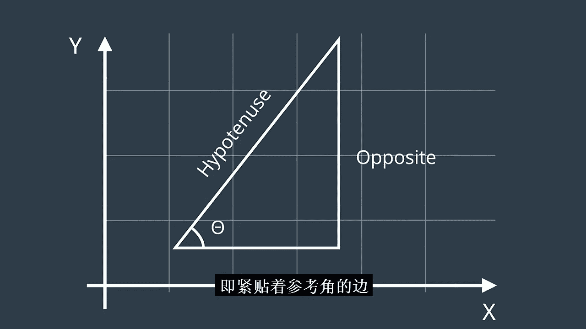
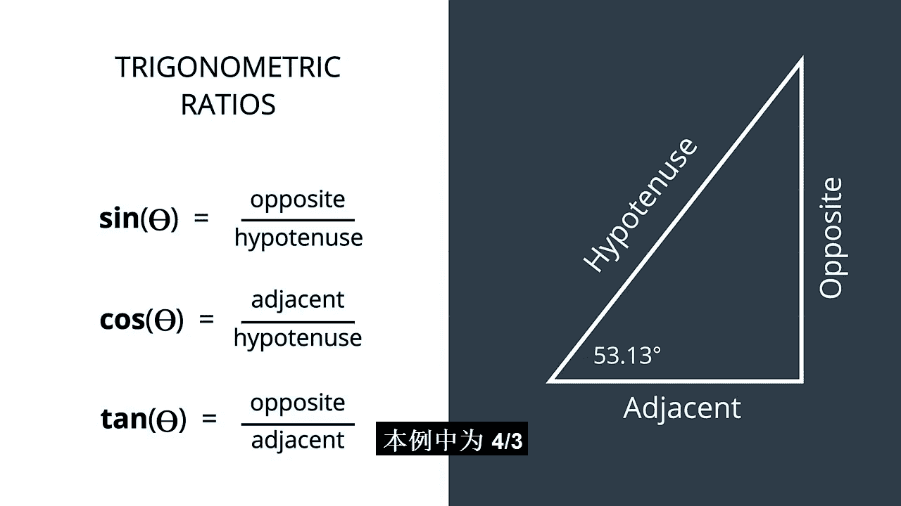
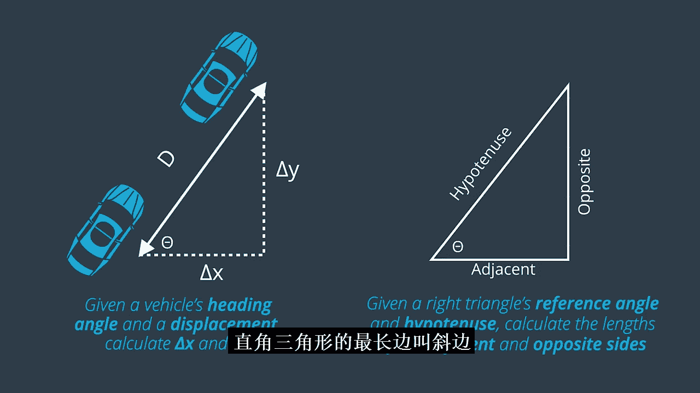
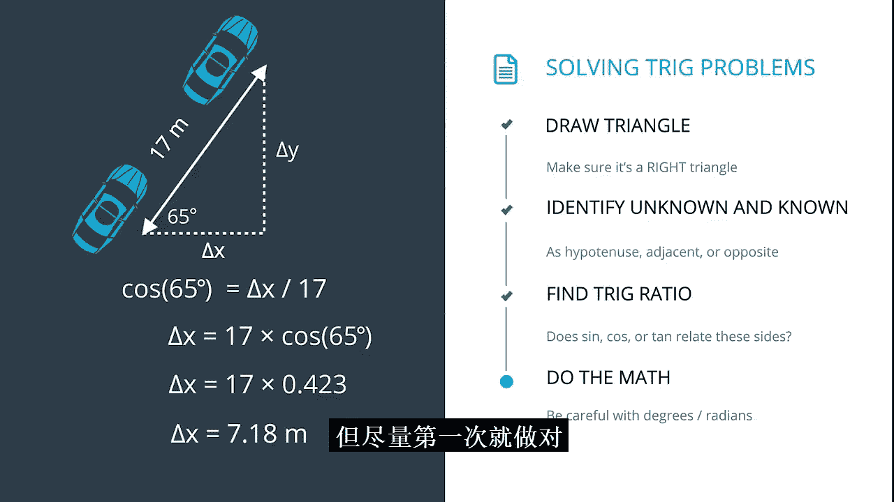

# 034：二维机器人运动与三角学 📐

在本节课中，我们将学习如何利用三角学，将车辆的航向角和行驶距离分解为X和Y方向上的位移变化。这是后续项目中利用传感器数据重建车辆轨迹的关键技能。

## 概述

在之前的课程中，我们学习了如何将加速度计数据转换为行驶距离，以及如何使用陀螺仪数据确定航向。然而，当车辆以任意角度行驶一段距离后，如何精确计算其在X和Y方向上的位移变化呢？这正是本节课要解决的问题。我们将借助三角学，特别是正弦、余弦和正切函数，来完成这一任务。

## 从特定角度到一般情况

上一节我们介绍了当车辆朝向正东、正北等方向时，位移计算非常简单。本节中我们来看看，当车辆航向是任意角度时，情况会如何变化。

当车辆以某个角度（非坐标轴方向）前进时，其X和Y坐标的变化量（Δx和Δy）都将大于0但小于行驶距离D。为了精确计算这些值，我们需要找到一个直角三角形，并利用三角学知识。

首先，我们从一个具体的例子开始。假设车辆航向角θ为53.13度，行驶距离D为5米。在这个特定情况下，Δx恰好是3米，Δy是4米。这是因为它们构成了一个经典的3-4-5直角三角形。

这意味着，对于53.13度的航向，位移与坐标变化之间存在固定的比例关系：
*   Δy = D * (4/5)
*   Δx = D * (3/5)

然而，这只是针对一个特定角度。我们需要一个适用于任何角度θ的通用方法。

## 三角学基础：命名与比率

为了将问题一般化，我们首先需要建立直角三角形各边的命名约定。

在一个直角三角形中，我们通常只关注其中一个角，称为**参考角**（θ）。三条边的命名如下：
*   **斜边**：直角所对的边，也是三角形中最长的边。
*   **对边**：与参考角相对的边。
*   **邻边**：与参考角相邻的边（不是斜边的那条）。

基于这些边的长度，我们定义了三个核心的三角函数，它们都是参考角θ的比率：

以下是三个核心的三角函数定义：
*   **正弦**：对边与斜边的比值。
    `sin(θ) = 对边 / 斜边`
*   **余弦**：邻边与斜边的比值。
    `cos(θ) = 邻边 / 斜边`
*   **正切**：对边与邻边的比值。
    `tan(θ) = 对边 / 邻边`

让我们用之前的53.13度三角形来验证：
*   sin(53.13°) = 对边/斜边 = 4/5 = 0.8
*   cos(53.13°) = 邻边/斜边 = 3/5 = 0.6
*   tan(53.13°) = 对边/邻边 = 4/3 ≈ 1.333

## 应用三角学解决运动分解问题

现在，我们可以将车辆运动问题重新表述为三角形问题：已知直角三角形的参考角（航向角）和斜边长度（行驶距离D），求邻边（Δx）和对边（Δy）的长度。

三角学为我们提供了完美的工具。以下是系统性的解题步骤：

1.  **识别三角形**：将车辆的位移视为直角三角形的斜边，航向角视为参考角θ。
2.  **标记已知与未知量**：斜边长度D已知，需要求解邻边Δx和对边Δy。
3.  **选择正确的三角函数**：
    *   要求Δx（邻边），使用余弦函数：`cos(θ) = Δx / D`
    *   要求Δy（对边），使用正弦函数：`sin(θ) = Δy / D`
4.  **进行计算**：重新排列公式并计算。
    *   `Δx = D * cos(θ)`
    *   `Δy = D * sin(θ)`

让我们通过一个例子来演示。假设车辆航向为65度，行驶了17米，求Δx。

解题过程如下：
1.  参考角θ = 65°，斜边D = 17米，未知边是邻边Δx。
2.  使用余弦函数：`cos(65°) = Δx / 17`
3.  重新排列公式：`Δx = 17 * cos(65°)`
4.  计算`cos(65°)`（注意计算器或代码应设置为角度制），约等于0.423。
5.  最终计算：`Δx = 17 * 0.423 = 7.18` 米。

现在，请你自己尝试计算Δy。记住使用正弦函数：`Δy = D * sin(θ)`。

## 总结

本节课中我们一起学习了如何运用三角学分解二维运动。我们掌握了正弦、余弦和正切函数的定义，并学会了如何利用公式`Δx = D * cos(θ)`和`Δy = D * sin(θ)`，从航向角θ和行驶距离D计算出X和Y方向的位移变化。

这项技能至关重要，你将把它与导数、积分知识结合，在本课程的最终项目中，利用车辆运动传感器的原始数据来重建其完整的XY轨迹。请注意，该项目比之前的项目更具开放性，且不强制提交。但我们强烈建议你尝试完成，如果遇到困难，欢迎在课程讨论区交流代码和想法。

祝你好运！