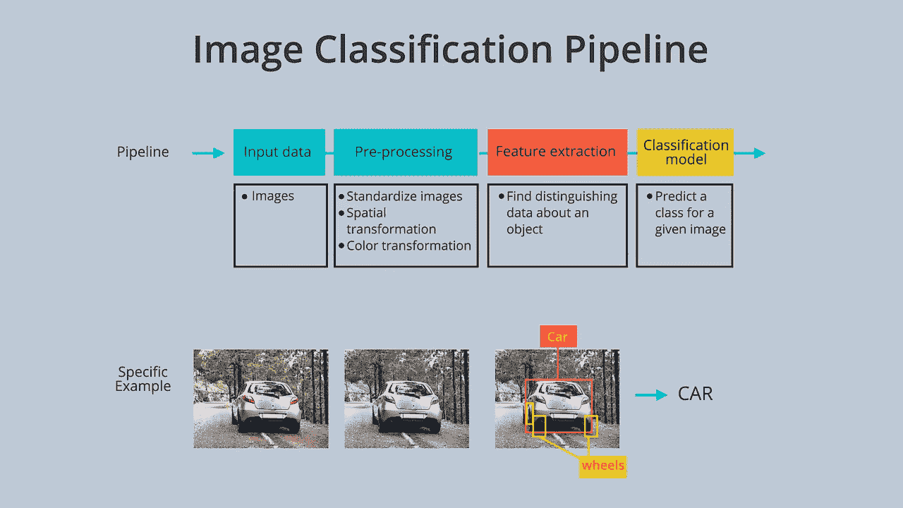
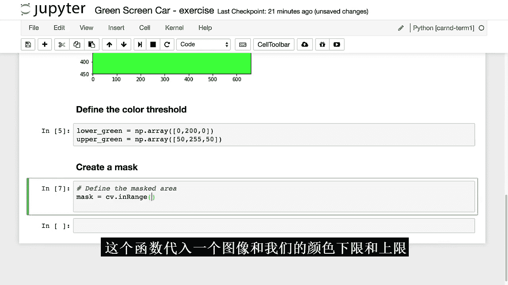
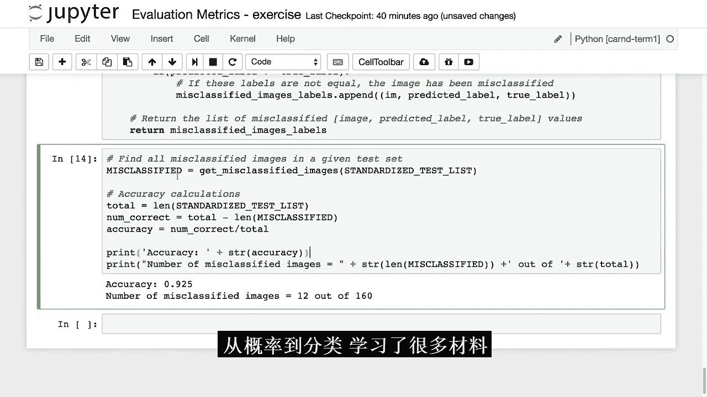

# 035：计算机视觉与分类

在本节课中，我们将要学习计算机视觉的基础知识，这是让自动驾驶汽车“看见”并理解周围世界的关键技术。我们将从图像的基本表示方法开始，逐步学习如何通过预处理、特征提取和分类算法来构建一个图像分类器。

---

我是 Danny Shapiro，我是 NVIDIA 汽车业务的高级总监。

NVIDIA 是一家技术公司，开发了许多不同的计算平台。具体来说，我们为自动驾驶汽车开发了一款人工智能超级计算机。

无论是汽车、班车、卡车，还是未来可能出现在我们道路上甚至天空中的任何其他车辆。

NVIDIA 并不制造汽车，但 NVIDIA 拥有自己的自动驾驶测试车队。

我们将其中的一辆先进机器人车辆命名为 BB8。

我们正在加利福尼亚州、新泽西州以及德国的街道上测试这些车辆。

我们与汽车行业合作已近二十年。事实上，每一辆汽车、卡车、飞机或其他交通工具，甚至消费产品，都是在 NVIDIA 的图形硬件和软件系统上设计的。

大约十年前，我们开始将技术引入汽车，开始研究信息娱乐系统、数字驾驶舱和平视显示器。

然而，最近，由于我们在人工智能领域扮演的角色，我们的技术被用于自动驾驶汽车。

因此，我们不再仅仅是将信息以像素形式输出到显示器上，现在也开始处理输入的信息，例如雷达、激光雷达和摄像头信息，所有这些都输入到 NVIDIA 系统中，我们正在使用人工智能来理解这些信息。

我们有一款专门为车辆设计的产品，名为 Drive PX。

这是一款人工智能超级计算机，其计算能力相当于超过 150 台 MacBook Pro，但体积非常小巧，大约只有车牌大小。

本质上，所有输入（来自摄像头、雷达、激光雷达和超声波等传感器）都进入 Drive PX，产生大量数据。因此，我们的处理过程必须接收所有这些信息并理解它们。

基本上，需要识别出哪些是其他车辆、哪些是行人、哪些是人行横道、哪些是交通标志。所有这些都必须在几分之一秒内完成。我们的摄像头每秒生成 30 帧图像，我们必须分析这些帧并理解车辆周围 360 度的完整环境。

GPU（图形处理单元）由 NVIDIA 于 1999 年发明。这是一种大规模并行处理器，与你在个人电脑中找到的 CPU（中央处理单元）不同。你可能听说过 CPU 被描述为双核或四核，这本质上意味着信息可以同时通过两条或四条“车道”流过 CPU。而另一方面，GPU 现在拥有超过 5000 个核心。想象一下，如果这是一条高速公路，那么我们现在拥有的不是双车道或四车道，而是 5000 条车道。因此，大量信息可以同时通过该处理器。

然后，我们能够将所有这些计算能力带入汽车中的 Drive PX，以便实时处理所有传感器数据。

Drive PX2 是 NVIDIA 多款产品之一，它们都使用深度学习。

因此，我们有用于汽车的系统，但其他开发人员可以在个人电脑上开发，可以在云端使用深度学习，或者如果你是一名爱好者或创客，可以使用我们名为 Jetson 的嵌入式设备。这种统一架构的好处在于，你可以在一个平台上开发，然后部署到任何平台上。因此，我认为当今的挑战在于让学生和行业开发新的算法、新的深度神经网络，并利用人工智能来构建一个专为车辆设计的完整自动驾驶汽车系统。

考虑到当今市场上的职位类型和人才的缺乏，我认为对于任何刚刚起步、能够通过学习课程来理解当今计算基础的人来说，都有很多机会。现在，自动驾驶挑战中有许多独特之处。因此，理解开发自动驾驶汽车整个计算流程中的复杂性，对于在这个行业找到工作至关重要。

---

现在，我们来到本课程中真正的魔法，也是我最喜欢的话题之一：计算机视觉，让自动驾驶汽车“看见”。

当你睁开眼睛时，你的大脑会神奇地理解什么是咖啡杯、什么是智能手机、谁是 Sebastian。你的大脑不会告诉你原始的像素信息，而是告诉你场景中的所有物体。

然而，不幸的是，自动驾驶汽车在这方面处于劣势。它们只有一个像这样的摄像头。摄像头会产生一张像这样的图像。图像是一个巨大的数字矩阵。左上角有一个像素，那是像素 (1,1)。然后它旁边是像素 (2,1)，接着是像素 (3,1)，依此类推，直到像素 (2024, 024) 或其他数字。每个像素都有颜色值，包含一定量的红色、蓝色和绿色。这就是你得到的所有信息。所以，你不会得到“哦，天哪，图像中这里显然有个反光板”这样的信息。你只会得到这个像素矩阵。而计算机视觉的全部意义就在于，从那个庞大的图像数据矩阵中提取出你能看到的物体。

想象一下，现在你得到了一张停车标志的图像，对于每个数字字段，你得到了正确的颜色编号，然后你必须说出停车标志在图像中的位置。不是你自己，不是你的大脑，不是你的视觉皮层，而是你的计算机软件。

你已经建立了坚实的编程和数据分析技能基础。在本节中，我很高兴向你介绍另一个自动驾驶汽车工具：计算机视觉。计算机视觉是像自动驾驶汽车这样的机器如何视觉感知世界并对其做出反应的方式。

想象一下，你正在驾驶一辆汽车，你必须使用你的感官来注意行人、其他汽车、骑自行车的人以及周围所有的道路和交通标志。

这与自动驾驶汽车观察世界的方式类似。它通过摄像头和其他传感器收集数据，然后利用这些输入来安全地导航和在世界中移动。

在本课中，我们将学习用于分析摄像头图像并从中提取重要信息的常见计算机视觉技术，例如不同物体的颜色或形状。我们还将简要讨论机器学习，以及如何将其与计算机视觉结合使用，为机器提供从数据中学习并识别图像模式的方法。让我们开始吧。

为了帮助我们学习计算机视觉技术和应用，我们邀请到了行业专家 Terran Ziae，他是自动驾驶汽车公司 Voyage 的联合创始人兼首席技术官。

你好，谢谢。Suzanne，非常高兴来到这里。谢谢你邀请我。是的，计算机视觉在 Voyage 这里非常重要。它在行业中无处不在，也非常关键。计算机视觉在这里的明显用途包括，例如，识别车辆所在的车道或检测车道线等。

然而，计算机视觉的一个很酷的地方在于，我们将要学习的这些技术不仅可以用于摄像头图像，还可以用于其他传感器生成的图像。事实上，只要你的数据具有我们所说的空间相干性，你就可以使用计算机视觉技术。

空间相干数据可以被认为是任何在空间上可预测变化的数据，例如声音。如果你靠近扬声器听声音，声音会很大，但你离得越远，声音就越小。因此，声音的音量可以给你提供空间信息。没错。因此，除了摄像头，自动驾驶汽车还使用声纳、雷达和激光雷达等传感器，这些传感器利用声波和电磁波来收集汽车周围环境的数据。接下来，让我们更仔细地看看这些传感器。

传统上，雷达用于长距离探测，而摄像头用于丰富的感官输入。在讨论自动驾驶汽车的传感器配置时，我们必须注意其中的细节。激光雷达和雷达被称为主动传感器。也就是说，它们基于能量发射来感知环境。而另一方面，摄像头是被动传感器。它们只能基于场景中已有的能量（光子）来感知环境。这些传感器细节对我们最终使用的算法类型有重大影响。

计算机视觉有许多强大的工具，但良好设计的一部分也意味着知道不应该做什么，即使它是可能的。此外，计算机视觉不一定只与摄像头图像相关联。你也可以用激光雷达传感器构建激光雷达图像，从而为你提供测量深度，同时还能对像素进行分类。以下是一些结果。

学习各种计算机视觉技术的一个好方法是构建一个图像分类器。我们在本课中将重点关注的是将图像数据分组到不同的类别中，例如人类、自行车和汽车，或者白天拍摄的图像与夜晚拍摄的图像。其中一些分类任务相当具有挑战性。

我们将探索两种主要的数据分离方法：通过编程显式规则将数据分组，或者通过机器学习技术自动分离数据。这两种方法都可用于构建图像分类器。那么，究竟什么是图像分类器呢？

图像分类器是一种算法，它接收图像作为输入，并输出一个标识该图像的标签或类别。例如，自动驾驶汽车中使用的一种分类器会查看不同的道路图像，并能够识别该道路是否包含人类、汽车、自行车等。根据其内容对每张图像进行区分和分类。

有许多类型的分类器用于识别特定物体，甚至行为，例如一个人是在走路还是在跑步。但所有这些分类器都涉及一系列相似的步骤。我将这些步骤称为图像分类流程的一部分。

首先，计算机从成像设备（如摄像头）接收视觉输入。这通常被捕获为一张图像或一系列图像。然后，每张图像都会经过一些预处理步骤，其目的是标准化每张图像。常见的预处理步骤包括调整图像大小或旋转以改变其形状，或者将图像从一种颜色转换为另一种颜色，例如从彩色转换为灰度。只有通过标准化每张图像（例如，使它们大小相同），你才能以相同的方式比较和进一步分析它们。

接下来，我们提取特征。特征帮助我们定义某些物体，通常是关于物体形状或颜色的信息。一些区分汽车和自行车的特征是：汽车通常形状更大，并且有四个轮子而不是两个。形状和轮子将是汽车的区分特征。我们将在本课后面更多地讨论特征。

最后，这些特征被输入到一个分类算法（也称为模型）中，该算法对图像进行分类。这一步查看来自上一步的任何特征，并预测，例如，这张图像是汽车、行人、自行车等。

你将手动编程实现这些分类步骤中的每一步，以便真正理解每一步。到本课结束时，你将拥有完成最终项目所需的所有技能：构建一个交通灯分类器，该分类器接收交通灯图像，并将它们分为三类：红灯、黄灯或绿灯。

---

你刚刚看到了一个图像分类器的完整分类流程，从一些输入图像开始，使用计算机视觉技术处理这些图像并提取特征（如图像中区分颜色或形状的特征），然后分类器查看这些特征并输出一个类别，即描述该图像的标签。

分类器应该预测具有相似形状或颜色的图像具有相同的类别。我们通常告诉分类模型要寻找什么。例如，假设我们正在查看一堆图像，我们想将它们分为两类：汽车和非汽车。为了对汽车进行分类，我们可能会编写一个程序来寻找汽车的不同部分：轮子、车灯、车窗等。然后，如果找到了这些东西，我们就会将图像分类为汽车。我们决定哪些特征是重要的。但是，还有另一种创建分类器的方法，那就是使用机器学习。

机器学习允许计算机通过给它大量示例来自行理解事物。因此，使用机器学习时，我们不是告诉模型要寻找哪些特征，而是只给它大量汽车和非汽车的图像，让它学会识别区分它们的特征。它可以学会识别轮子和车窗，以及哪种分类算法最适合准确地将任何给定图像分类为汽车或非汽车。

现在你可能想知道，这样的模型究竟是如何学会对不同的图像进行分类的呢？接下来，我们将看看机器学习技术如何被训练来对图像集进行分类。

当我们谈论机器学习时，你经常会听到深度学习和神经网络这些术语，这可能会让你联想到大脑或一些奇怪的数学公式和数据层图形。但在核心，所有这些学习技术都是关于将数据分离到不同的类别中。

这在我脑海中唤起的图像是一个孩子在沙滩上玩耍。孩子看到沙子里有一些蓝色和黄色的贝壳。然后有人对孩子说：“把这些贝壳分成几组，并在它们之间画一条线。”如果我不告诉你其他任何信息，你会如何分组这些贝壳？你可能会根据颜色和形状将它们分开，并在沙子上画一条线。

对于计算机来说，这个场景可能是我们给它单个贝壳的图像。就像一个孩子一样，神经网络可以根据给定示例中的相似性或差异来学习如何分离这些贝壳图像。在这个分离步骤之后，如果网络看到一张它以前没有见过的新图像，它会根据它落在线的哪一侧来进行排序和分类。

实际上，数据通常比这复杂得多，但神经网络只是在分离层之上叠加分离层，以创建更复杂的边界并对各种数据进行分组。接下来，我们将看看如何训练神经网络来分离数据。

你的第一个任务将是对一个二元数据集进行分类：白天或夜晚拍摄的图像。但在你能够完成这个任务之前，你首先必须了解机器是如何“看到”图像的。让我们以这张汽车图像为例。这实际上是一辆在路上的自动驾驶汽车，看看计算机是如何理解它的。

我们将首先处理这样的灰度图像，因为颜色增加了另一层复杂性。但正如我们很快将看到的，相同的一般原则也适用。所以，当我向你展示这张图像时，你可能会说：“哦，这是一张汽车的照片。”确实如此。但它也是一个二维数值网格，也称为具有宽度和高度的数组。让我告诉你我的意思。

这张以及所有数字图像都是由像素网格组成的，像素是单个颜色或强度的非常小的单位。如果我们放大汽车的图像，比如车轮周围的这个区域，我们可以更好地观察这些像素。现在你可以看到它开始看起来更像一个网格了。

这个网格中每个像素的颜色都有一个对应的数值。对于像这样的灰度图像，每个像素的值范围从 0 到 255。0 是黑色，255 是白色，灰色介于两者之间。因此，大约 120 的值是介于黑色和白色之间的中等灰色，而大约 20 的值将是非常非常深的灰色，接近黑色。这些像素除了具有颜色值外，在图像网格中还有一个位置 (X, Y)。这些轴很像图形的轴，只是对于数字图像，左上角的坐标位于原点，即点 x=0, y=0。

现在，我们的汽车图像高度为 427 像素，宽度为 640 像素。像素位置位于一个从索引 0 开始的网格上，从 0 到 369 列，从 0 到 426 行。例如，在位置 x=190, y=375 处，我们在图像左下角的这个车轮上有一个像素。该像素值为 28，一种非常深的灰色。你可能会问我是怎么知道的。嗯，在代码中，我们实际上可以通过位置找到任何单个像素值。让我们来做一下。

我们将读入我们的汽车图像。但首先，我将导入我需要的库。这包括 Matplotlib.image，它允许我们读入任何图像。你还会看到 CV2，这是一个计算机视觉库，你很快就会了解更多。我还将使用 Matplotlib Qt。Qt 使图像在我显示时弹出一个交互式窗口。

所以，我将使用 Matplotlib 的 `imread` 函数读入我们的汽车图像。我将传入我们的图像文件名。我的汽车图像位于与这个笔记本相同位置的 images 目录中。接下来，我将实际打印出关于这个图像的一些信息。我想通过引用 `image.shape` 来打印出它的尺寸。现在，我们可以看到它的高度和宽度（以像素为单位）。我们还看到另一个值 3，它对应于该图像具有的颜色通道数，我们很快就会了解更多关于这个值的信息。目前，我们将把图像转换为灰度。我们将使用我们的计算机视觉库将其转换为灰度。现在，请知道它有内置的颜色转换代码，例如将图像从红绿蓝颜色转换为灰度。然后我将显示这张灰度图像。

这会打开我们的交互式窗口。当我用鼠标划过这张图像时，你可以在屏幕左下角看到显示的 X、Y 位置，以及相应的像素值。在车轮附近这里，我们有大约 28、29 的暗像素值。而在天空这里，我们有一些亮的像素值。你可以看到大约 220 甚至更高。如果我们回到我们的笔记本，我们可以通过位置访问来打印出单个像素的值。我会说 x=190，y=375。我可以通过查看灰度图像中该位置的值来访问该像素值：`gray_image[y, x]`。最后，我将打印出该值。我们可以看到它是 28。

图像中的每个像素都只是一个数值，我们也可以改变这些像素值。我们可以将每个像素乘以一个标量来改变图像的亮度。我们可以将每个像素值向右或向左移动，以及进行更多操作。将图像视为数字网格是许多图像处理技术的基础。大多数颜色和形状变换只是通过对图像进行数学运算并逐个像素地改变它来完成的。

现在，你已经看到了一个被分解为二维灰度像素值网格的图像示例，该网格具有宽度和高度。但彩色图像有点不同。彩色图像被解释为具有宽度、高度和深度的三维数值立方体。深度是颜色通道的数量。大多数彩色图像可以仅由三种颜色的组合来表示：红色、绿色和蓝色值。这些被称为 RGB 图像，对于 RGB 图像，深度为 3。将深度视为三个堆叠的二维颜色层会很有帮助：一层是红色，一层是绿色，一层是蓝色。当它们堆叠在一起时，就创建了一个完整的彩色图像。

现在，彩色图像包含比灰度图像更多的信息，它们会增加不必要的复杂性并占用更多的内存空间。然而，彩色图像对于某些分类任务也非常有用。例如，假设你想对这张道路图像中的车道线进行分类。其中一条线是黄色的，一条是白色的，但哪条是哪条呢？在灰度图像中，你可能会看到车道线灰度强度有细微差别，但差异非常小，并且在不同的光照条件下会变化。因此，这张灰度图像没有提供足够的信息来区分黄色和白色的车道线。让我们看看彩色图像进行比较。在这里，我们可以清楚地看到白色和黄色车道线之间的区别。因此，我们也可以告诉机器识别这种差异。

所以，因为这个识别任务依赖于颜色，所以使用彩色图像很重要。一般来说，当你考虑计算机视觉应用（如识别车道线、汽车或人）时，你可以通过思考你自己的视觉来决定颜色信息和彩色图像是否有用。如果识别问题对我们人类来说在彩色中更容易，那么对算法来说，看彩色图像也可能更容易。

现在你知道了图像如何表示为数值网格，让我们谈谈分类流程中的下一步：预处理。预处理图像就是关于标准化输入图像，以便你可以沿着流程进一步前进，并以相同的方式分析图像。最常见的预处理步骤包括：第一，通过使用几何变换来改变图像的空间外观，这可以缩放图像、旋转图像，甚至改变物体看起来的距离。第二，改变颜色方案，例如选择使用灰度图像而不是彩色图像。

通过一个例子最容易看出这些变换是如何有用的。假设我们正在尝试构建一个交通标志分类器，用于识别两种类型的图像数据：停车标志和非停车标志。我们的分类流程可能如下所示：查看输入图像并计算图像中红色像素的数量。如果有很多红色像素超过某个阈值数字，比如 300 个像素，那么我们就将其标记为停车标志。但如果红色像素不够多，我们就将图像标记为非停车标志。现在，为了让这在任何图像上都能工作，我们需要有一个一致的颜色红色度量标准。我们不能只是在一张图像中累加灰度像素值，在另一张图像中累加 RGB 值，我们需要将这些图像转换为相同的颜色空间，并在分析每张图像时使用相同的红色像素度量标准。

让图像大小相同也很有用，因为我们计划逐个像素地累加红色值。因此，标准化每张输入图像的颜色和形状是实现最终目标（识别图像数据中的重要模式并对图像进行分类）的必要步骤。

我们了解了彩色图像如何用数值表示，接下来我想向你展示颜色如何在图像分析和变换中使用。我们将从学习如何使用图像中的颜色信息来隔离图像中的特定区域开始。这在一个例子中最容易理解。我们将使用颜色阈值选择一个感兴趣区域。颜色阈值在许多应用中使用，包括在计算机图形和视频中广泛使用。一个常见的用途是绿幕。绿幕用于基于识别和替换大面积的绿色区域来叠加两个图像或视频流。

那么这一切是如何工作的呢？第一步是隔离绿色背景，然后用你选择的图像替换那个绿色区域。这个任务看起来很简单。所以让我们看看如何通过编程用我们自己的图像来实现这一点。我们将从这张绿幕背景上的汽车图像开始。我们首先必须识别绿幕区域。然后，稍后，你将用背景图像替换它。我们在一个 Python 笔记本中。我的第一步是导入我需要的库，我们将在整个课程中使用这些库。

为了绘图和读入图像，我将导入 Matplotlib.pyplot 和 image。为了对图像进行操作，我将使用 NumPy 和计算机视觉库 OpenCV，它被命名为 CV2。接下来，你可以看到我使用 `mpimg.imread` 读入了汽车图像。这张图像位于与这个笔记本相同目录下的一个名为 `images` 的文件夹中。一旦读入，我实际上想打印出关于图像的一些信息。这些信息在你以后想要为绿色部分添加不同背景时会很有帮助。所以我会打印它的 `shape`，这将告诉我们图像的尺寸。我还会显示图像。我们看到了预期的输出。图像是一个数值数组，其形状包含三个值，代表图像数组的维度：首先是它的高度，450 像素；然后是它的宽度，660 像素；最后是它有多少个颜色分量，在这种情况下是 3，分别对应红色、绿色和蓝色值。

好的，现在我们有了绿幕图像，让我们开始绿幕遮罩。遮罩只是意味着遮挡图像的某个区域。为了创建一个遮罩，我将创建一个颜色阈值。我将定义要隔离的颜色（绿色）的下限和上限。所以我会定义一个下限阈值，包含仍被视为绿幕背景一部分的红色、绿色和蓝色的最低值。这将是一个包含三个值的数组，顺序为红色、绿色和蓝色值。对于红色和蓝色，我将它们设置为 0，这意味着在识别这个绿幕区域时，可以没有红色或蓝色。但绿色的最低值应该仍然相当高，不是完全达到 255，但假设是 200。然后我将定义上限阈值。我将定义它允许稍微多一点的红色和蓝色，比如各 50，并将绿色的最高值设置为 255。现在，任何介于这个低阈值和高阈值之间的颜色都将是强烈的绿色。

不过，我是在做一些估计，所以如果我发现这个范围没有找到我想要的绿幕区域，我会回来改变这些值。接下来，我将使用这些颜色阈值创建一个图像遮罩。遮罩是一种非常常见的隔离选定感兴趣区域并对该区域进行操作的方法。我们可以使用 OpenCV 的 `inRange` 函数在绿色区域上创建一个遮罩。

这个函数接收一个图像以及我们的下限和上限颜色阈值。

---

你已经看到了如何检测和遮罩绿幕背景。但这种检测依赖于一些假设才能工作。它假设场景光照非常好，并且幕布是非常一致的绿色。如果光照改变，或者背景部分处于阴影中或过曝变亮，会发生什么？在这种情况下，简单的 RGB 阈值效果不会很好。那么，我们如何在变化的光照条件下一致地检测物体呢？嗯，除了仅由红色、绿色和蓝色值组成外，还有许多其他方式来表示图像中的颜色。这些不同的颜色表示通常称为颜色空间。

RGB 是红绿蓝颜色空间。你可以将其视为一个三维形状，在这种情况下是一个立方体，其中任何颜色都可以由 R、G、B 值的三维坐标表示。例如，白色在这个角落，其红色、绿色和蓝色值均为 255。

还有 HSV 颜色空间（色调、饱和度、明度）和 HLS 颜色空间（色调、亮度、饱和度）。这两种空间将图像中的表观亮度和颜色分离到不同的分量中。例如，在 HSV 颜色空间中，明度（V）分量是亮度的良好度量。高值意味着非常亮，低值意味着非常暗。饱和度分量是颜色强度的良好度量。色调是表示某物实际颜色的度量，例如它是红色、绿色还是紫色等，并且在阴影或过度亮度下应保持相当一致。

因为这些空间将颜色和亮度分离到不同的通道中，所以它们是图像处理中最常用的颜色空间之一。接下来，我们将通过一个将图像转换为 HSV 颜色空间的例子来看看它们为什么如此有用。

我们将通过一个在 RGB 和 HSV 颜色空间中进行图像处理的例子。HSV 颜色空间隔离了图像中每个像素的明度（V）分量，这是在变化光照条件下变化最大的分量。色调（H）通道在阴影或过度亮度下保持相当一致。如果我们主要依赖这个通道并丢弃 V 通道中的信息，我们应该能够比 RGB 颜色空间更可靠地检测彩色物体，如绿幕背景。

所以在这个笔记本中，我导入了通常的资源并读入了一张 RGB 图像。这是我们的绿幕汽车。只是这次，它被不均匀地照亮，有阴影和不同亮度的区域。我将尝试遮罩这个绿色区域，同时查看 RGB 颜色空间和 HSV，看看每种情况下什么有效。现在，这张图像中的每个像素都有其位置的 X 和 Y 值，以及其颜色的 RGB 值。我要做的第一件事是重新创建你之前见过的 RGB 阈值。

所以，再次回顾这些步骤：我在 RGB 颜色空间中创建了下限绿色和上限绿色阈值。我使用 `cv2.inRange` 创建了一个遮罩。然后我实际上遮罩了图像中遮罩不等于 0（即白色）的部分。然后我将显示图像。现在，这使用了与之前情况完全相同的阈值。只是这次，你可以看到，由于阴影，这只遮罩了大约一半的绿幕背景。让我们看看我们是否能在 HSV 颜色空间中做得更好一些。

所以首先，我需要将图像转换为 HSV 颜色空间。我将使用 OpenCV 的 `cvtColor` 函数，这是一个颜色转换函数，我将使用转换代码 `RGB2HSV`。这将返回一个新的转换后的图像，我将其称为 `hsv`。然后，我将实际分离这些颜色通道中的每一个，以便我可以可视化它们。为了分离色调通道，我可以直接取图像数组：我将取前两个数组列中的所有 X 和 Y 值，然后取第三列的零索引，即每个像素的色调值。类似地，对于饱和度和明度，我将取图像像素的所有 X 和 Y 坐标，并取第三列的第一和第二索引，以获得每个像素的饱和度和明度分量。

然后，我可以用灰度绘制这些颜色通道中的每一个，以查看它们的相对强度。这是三个通道以灰度强度表示。较亮的像素分别表示较高的色调、饱和度或明度值。我们可以看到，即使在阴影中，色调水平也相当一致，但饱和度和明度分量变化更大，尤其是在阴影下。

现在，你知道如何创建颜色阈值和遮罩图像了。接下来，将由你利用这些信息以及你对 HSV 颜色空间的了解来遮罩这张图像。我不会向你展示我的确切值，但我确实使用了 HSV 颜色空间的色调通道来遮罩这张图像的绿色背景，你应该能够产生类似的结果。

现在，你正朝着能够构建一个完整分类器的方向前进。你知道如何分析给定图像中的颜色和亮度，仅这一项技能就可以帮助你区分，例如，红色的停车标志和绿色的信息标志。我要给你一个分类挑战。如果我要求你对在白天或太阳落山后的夜晚拍摄的两种类型的图像进行分类，你会怎么做？我想让你将这些图像分为两类：白天或夜晚。

这实际上是自动驾驶汽车面临的一个重要分类挑战。这些汽车需要知道它们正在什么条件下行驶，以便它们能够在一天中的任何时间安全地在道路上导航，并且仍然能够识别其他车辆和周围物体，无论外面是黑暗还是明亮。我们将一起完成每个分类步骤，但你认为创建白天和夜晚图像分类模型的第一步是什么？

在对任何图像集进行分类之前，你必须先查看它们。可视化你正在处理的图像数据是识别图像数据中任何模式并能够对该数据进行预测的第一步。因此，我们将首先加载这些图像数据，并了解一些我们将要处理的图像的信息。

在探索了白天和夜晚图像数据之后，你可能已经注意到了我们尚未讨论的数据的一部分：与每张图像相关联的标签。那么，究竟什么是标签，为什么我们需要它呢？标签有点像附加在特定图像上的标签，它告诉你关于该图像的某些信息。你可以把标签想象成一种名牌。我在结识新朋友的活动时会佩戴名牌，我的名牌将我标记为 Suzanne。现在，一张图像可以有多个描述它的标签，就像如果我有人类或戴眼镜等多个标签，每个标签都描述了我的某些方面。但对于本课，我们将处理每张图像一个标签。这些标签将图像数据分离成类别。类别就像一般分类。所以，我的标签可能是人类，这是一个与桌子、汽车或任何其他事物的标签不同的类别。它比像 Suzanne 这样的标签更通用。

因此，对于我们处理的图像数据集，我们应该拥有与类别一样多的标签。在我们的白天和夜晚图像的情况下，我们有两个标签：白天和夜晚。现在，为什么我们需要这些标签？你可以判断一张图像是夜晚还是白天，但计算机不能，除非我们通过标签明确告诉它。当我们测试分类模型的准确性时，这一点变得尤为重要。分类器接收图像作为输入，并应输出一个预测标签，告诉我们该图像的预测类别。

现在，当我们加载数据时，就像你看到的那样，我们加载的是所谓的真实标签。真实标签只是该图像的正确标签。为了检查分类器的准确性，我们比较预测标签和真实标签。如果真实标签和预测标签匹配，那么我们就正确分类了图像。但有时标签不匹配，这意味着我们错误分类了图像。在查看了许多许多图像之后，分类器的准确性被定义为正确分类的图像数量（即预测标签与真实标签匹配的图像）除以图像总数。假设我们尝试分类总共 100 张图像，我们正确分类了其中的 81 张，这意味着我们错误分类了 19 张。那将意味着我们有 0.81 或 81% 的准确性。只有当我们有这些预测标签和真实标签进行比较时，我们才能告诉计算机检查分类器的准确性。

我们还可以从分类器犯的任何错误中学习，正如我们将在本课后面看到的那样。需要注意的是，使用数字标签而不是字符串或分类标签是一种良好做法。数字更容易跟踪和比较。因此，对于我们的白天和夜晚二元分类示例，我们将使用数字标签 0 表示夜晚，1 表示白天。

好的，现在你熟悉了白天和夜晚图像数据，知道了什么是标签以及为什么使用它们。你已准备好进行下一步。我们将从头到尾构建一个分类流程。让我们首先集思广益，讨论一下我们将采取哪些步骤来对这些图像进行分类。

---

好的，101 特征提取。特征提取是你的大脑在你观察时一直在做的事情。所以，当图像进入你的视网膜时，你得到相同的颜色效果（不完全相同的矩阵，但暂时假设相同）。然后，你的视觉皮层（从眼睛后面一直到大脑后部的脑组织）会提取越来越高级的特征，直到认出这是 Sebastian，这是停车标志。在这些特征提取层中，你变得越来越抽象。你现在要从非常简单的开始，你将查看交通场景并提取简单的特征，比如是白天还是夜晚。你将被要求开发实现这一点的计算机软件，作为使自动驾驶汽车智能化的第一步。稍后，我们将给你交通灯。我们将让你从交通灯中提取特征。这不会是自动驾驶汽车的全部，但希望你能理解让汽车“看见”是多么美妙、富有想象力且伟大。

当你面对一个分类挑战时，你可能会问自己：我如何区分这些图像？这些图像有哪些特征可以区分它们？我如何编写代码来表示它们的差异？此外，我如何忽略这些图像中不相关或过于相似的部分？你可能已经想到了许多区分特征。白天图像通常比夜晚图像亮得多。夜晚图像也有这些非常明亮的小光点。因此，整个图像的亮度变化比白天图像大得多。白天图像中也有更多的灰蓝色调。

有许多可测量的特征可以区分这两种类型的图像，这些可测量的特征被称为特征。特征是一个图像或物体的可测量组成部分，理想情况下，在变化的条件（如变化的光照或相机角度）下是独特且可识别的。我们很快就会更多地了解特征，但我们有点超前了。要从任何图像中提取特征，我们必须对它们进行预处理和标准化。接下来，我们将看看在能够一致地提取特征之前应该采取的标准化步骤。

构建白天和夜晚图像分类器的第一步是可视化输入图像并将它们标准化为相同大小。为此，我们导入了我们通常的资源并加载了图像数据集。我们创建了一个包含所有图像及其标签的标准化列表。最后，我们可以可视化标准化后的数据。在这里，我选择了我们标准化列表中的第一张图像及其标签。然后我显示选定的图像及其一些信息。你可以看到它的尺寸和它的标签（1 表示白天）。最后，我们准备好查看所有这些图像，并开始将它们分为两类：白天和夜晚。

我们将根据图像的平均亮度水平来区分白天和夜晚图像。这将是一个单一的值，并且我们将假设白天图像的平均亮度高于夜晚图像。现在，为了计算图像的平均亮度，我们将使用 HSV 颜色空间。具体来说，我们将使用明度（V）通道，它是亮度的度量，并累加 V 通道中的像素值。然后，我们将该总和除以图像的面积，以获得图像的平均明度值。

所以首先，我将一张测试图像转换为 HSV 颜色空间。我想查看几张白天图像和几张夜晚图像，以找出两者之间的差异。在这个例子中，我分别绘制了 H、S 和 V 通道。所以这里是一张白天图像及其颜色通道 H、S 和 V。我们可以看到 V 通道在天空中特别高。这个分类是基于假设白天的天空比夜晚的天空更亮。所以我们的下一步将是使用明度通道找到平均亮度。

现在，我将定义一个函数来查找图像的平均明度值。这个函数 `average_brightness` 将接收一个 RGB 图像。第一步是将其转换为 HSV 颜色空间。接下来，我想累加明度通道中的所有像素值。我将使用 NumPy 的 `sum` 函数来实现。这会查看我们 HSV 图像的 V 通道并累加所有像素值。然后，我将计算图像的面积，由于我们标准化了每张图像，我知道它是 600 x 1100。为了找到图像的平均亮度，我们将这个亮度总和除以图像的面积。然后，这个函数将返回该平均值。所以这给了我们一个值：图像的平均亮度或平均明度值。

我们的下一步将是查看白天和夜晚图像及其平均亮度值。目标将是查看它们的平均亮度，看看是否能找到一个能清楚区分白天和夜晚图像的值。所以让我们先看看我们的标准化图像编号 0，我们知道这是一张白天图像。我们看到它的平均亮度大约为 175。现在，让我们看一张夜晚图像。这是一张相当暗的图像，平均亮度值只有大约 35。我们想查看各种这样的图像。这是另一张白天图像，它的平均亮度大约为 143。

现在，考虑到这些值，你可能在思考如何使用平均亮度来预测每张图像的标签：0 表示夜晚，1 表示白天。将由你来定义那个阈值。下一步将是将这些数据输入分类器，分类器可能简单到是一个条件语句，检查平均亮度是否高于你定义的某个阈值。现在，这个平均亮度值被认为是一个特征。特征只是图像的一个可测量组成部分，理想情况下有助于将其与其他图像区分开来。我们很快就会更多地了解测试这种模型的准确性。接下来，我们将更多地了解特征，以及为什么它们对自动驾驶汽车有用。

所以，它是一个特征。特征可以很容易地被认为是某物的总结。因此，图像的特征实际上只是图像数据的简洁摘要。此外，正如图像实际上只是数组中的数字集合一样，特征也只是数组中的另一个数字集合，尽管通常它们比图像小得多。那么这意味着什么呢？让我们更简单一点。忘记图像。考虑人类。一个人有很多方面，可能很难完整地描述一个人。然而，我们可以提取关于一个人的哪些紧凑特征呢？这里的“紧凑”是因为你希望这些特征描述这个人的某些方面。但我们希望这个描述是某种相关的总结。例如，如果你想将拳击手分配到他们的重量级别，我们可能希望对每个拳击手进行特征提取，我们会提取一个二维特征：身高和体重。在这个意义上，这些是特征，因为它们巧妙地忽略了不相关的信息。它们描述了此人的体重和身高，这些特征对于将拳击手分配到适当的重量级别很有用。它们也忽略了肤色或头发长度等。因此，从这个意义上说，你可以将特征提取视为一种提取相关信息，同时巧妙地忽略不相关信息的方式。一个好的特征总是非常简洁。

特征是图像中独特且可测量的信息片段。我们将通过特征的例子以及如何计算它们来进行讲解。计算机视觉的一个突破实际上来自于能够自动计算那些好的特征。然而，你也可以自己手动完成。事实上，你已经一直在创建自己的特征。没错。在上一个练习中，你必须想出一个区分特征来将图像分类为白天或夜晚拍摄。这个特征基于图像的整体亮度。

在本节中，我们将看到特征可以基于图像中的颜色或形状，并且我们将看到这些特征如何用于物体识别和分类任务。让我们从讨论特征在行业应用中的使用方式开始。现在，我们已经看到了如何利用颜色来帮助隔离图像的所需部分，甚至帮助对图像进行分类。除了利用颜色信息外，我们还了解图像中灰度强度的模式。强度是明暗的度量，类似于亮度，我们可以利用这些知识来检测其他感兴趣的区域或物体。例如，你通常可以通过观察强度的突然变化来识别物体的边缘，当图像从非常暗的区域变为亮的区域，或者反之亦然时，就会发生这种情况。

为了检测这些变化，你将使用和创建特定的图像滤波器，这些滤波器查看像素组并检测图像中强度的巨大变化。这些滤波器产生一个显示任何边缘的输出。让我们更多地了解这些滤波器，看看它们在处理图像和识别感兴趣特征方面的用处。

让我们确切地看看高通滤波器是如何工作的。我提到高通滤波器检测小区域内强度的巨大变化。强度模式在灰度图像中最好观察。例如，如果我们将这张汽车图像通过一个高通滤波器，我们期望检测到汽车的边缘，比如汽车顶部的边缘。在这一点上，图像从汽车上非常亮的区域变为暗背景。有很多像这样的小区域从亮变暗或从暗变亮。完整的滤波图像可能看起来像这样，汽车的边缘和道路线以白色突出显示。你还可以看到原始图片中强度没有变化或变化很小的区域，例如在这些大面积变暗或变亮的区域，高通滤波器会阻挡这些区域并将像素变为黑色。

我将讨论的滤波器以矩阵形式存在，通常称为卷积核，它们只是修改图像的数字网格。这是一个进行边缘检测的高通滤波器示例。它是一个 3x3 的核，其所有元素之和为 0。对于边缘检测，所有元素之和为 0 很重要，因为这个滤波器计算相邻像素之间的差异或变化。差异是通过从一个像素值中减去另一个像素值来计算的。在这种情况下，减去围绕中心像素的像素值。如果这些核值加起来不为 0，那将意味着这个计算出的差异将具有正或负的权重。这将具有使整个滤波图像变亮或变暗的效果。

为了应用这个滤波器，输入图像（我称之为 F(x, y)，表示 x 和 y 空间的函数）与这个核（我称之为 K）进行卷积。这称为核卷积，卷积用星号表示，不要误认为是乘法。核卷积是计算机视觉应用中的重要操作，也是卷积神经网络的基础。它涉及取一个核（我们的小数字网格），并将其逐个像素地传递到图像上，根据网格中的这些数字创建另一个边缘检测输出图像。我们将看到，通过改变核中的数字，我们可以创建许多不同的效果，从边缘检测到模糊图像。

我将使用这个 3x3 边缘检测滤波器进行一个数学示例，以更好地理解像素级操作。我将放大这张图像，就在汽车的这个边缘附近，以查看灰度像素值。首先，对于这张灰度图像中的每个像素，我们将核放在它上面，使一个像素与核的中心对齐。我只是选择这个像素作为示例。然后我们查看以这个像素为中心的 3x3 像素网格。然后，我们取核中的数字，并将它们与它们对应的像素成对相乘。所以左上角的这个像素值 150 乘以核角 0。接下来，我们将值 45 乘以 -1。再下一个，25 乘以 0。然后我们移动到下一行。我们对所有 9 个像素-核值对都这样做。注意，中心像素的值为 200，将乘以 4。最后，所有这些值被求和，得到一个新的像素值 175。像这样的