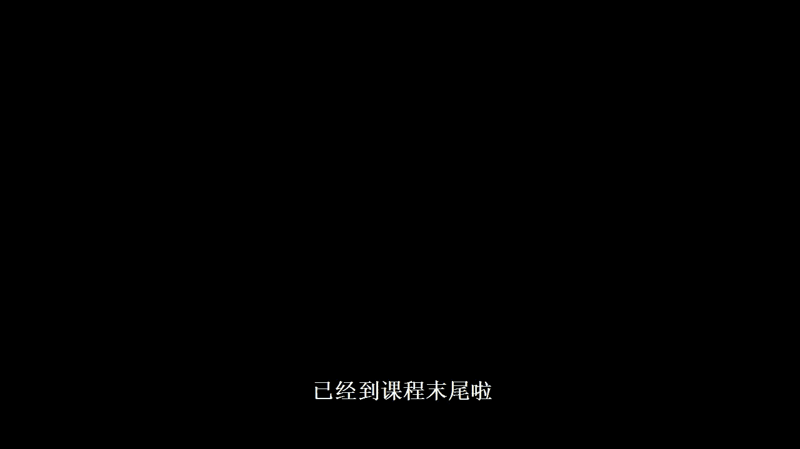
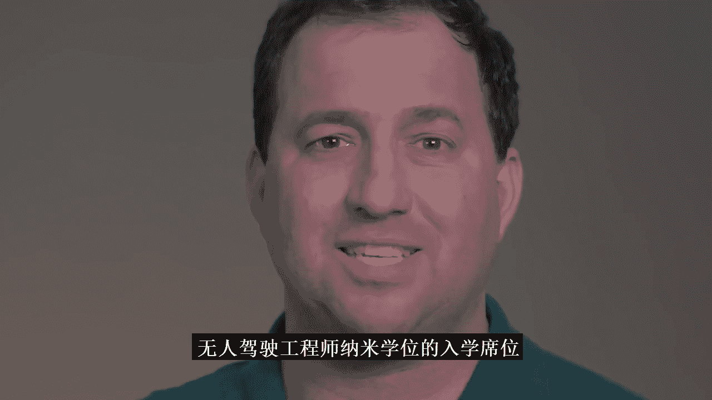

# 036：课程完结与进阶之路 🎉

在本节课中，我们将回顾你在“无人驾驶汽车入门纳米学位”项目中的成就，并了解完成此项目后为你开启的进阶机会。

## 课程概述

你已成功完成优达学城（Udacity）的“无人驾驶汽车入门纳米学位”项目。在此，我们向你表示祝贺。你在此项目中付出的承诺与努力，已为你迈出成为自动驾驶汽车工程师的第一步奠定了坚实基础。

## 学习成果总结

上一节我们概述了课程完结的意义，本节中我们来具体看看你已取得的核心成果。

以下是你在本项目中取得的主要成就：

*   **巩固了编程与数学技能**：你通过实践强化了解决复杂问题所需的基础能力。
*   **解决了自动驾驶新颖问题**：你甚至应用了一些创新方法来解决特定的自动驾驶汽车挑战。

这些成果表明，你已经为将技能提升至更高水平做好了充分准备。

## 进阶之路

那么，所谓的“更高水平”具体指什么呢？它就在此向你招手。

这位是**大卫·席尔瓦（David Silver）**，他负责教授优达学城的“高级无人驾驶汽车纳米学位”项目。通过完成“无人驾驶汽车入门纳米学位”项目并毕业，你不仅证明了自己具备相关的技能，更重要的是，展现了在优达学城取得成功所必需的决心。

因此，你也为自己赢得了**优达学城“无人驾驶汽车工程师纳米学位”项目的保录资格**。

我们期待在进阶课堂中与你相见！😊

---

## 课程总结

本节课中，我们一起回顾了你完成“无人驾驶汽车入门纳米学位”的里程碑。我们总结了你在编程、数学及解决实际问题方面取得的进步，并介绍了由此获得的、通往更高级课程（“无人驾驶汽车工程师纳米学位”）的保录资格。恭喜你圆满完成此阶段的学习，并预祝你在自动驾驶领域的旅程中继续前行，取得更大成就。