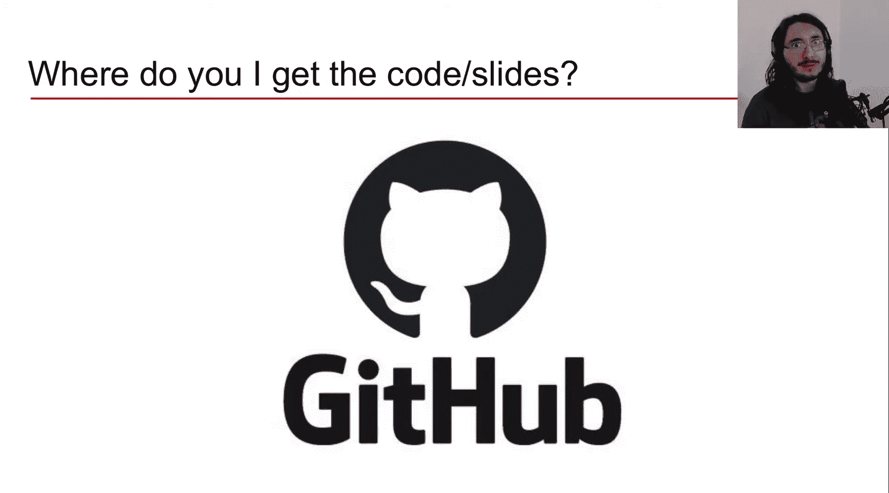
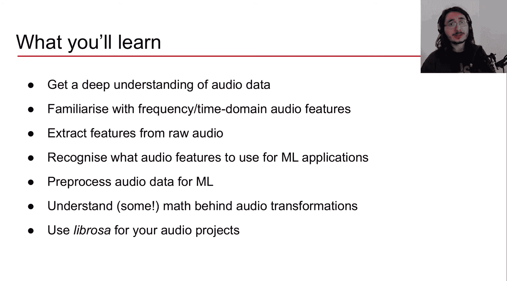
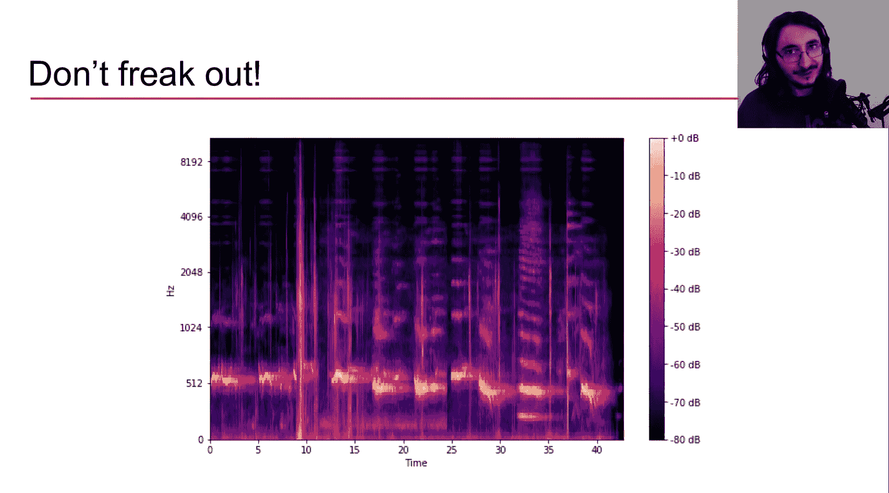
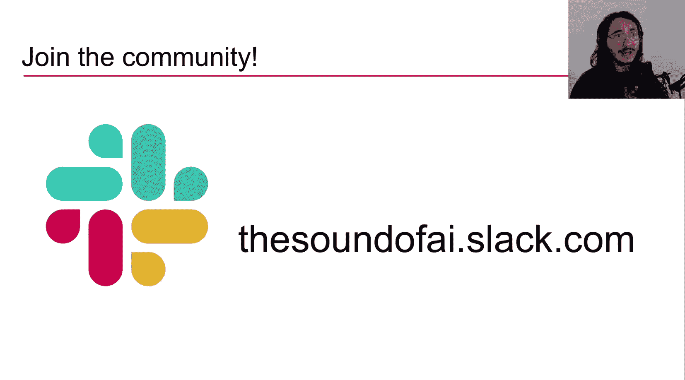

#  001：课程概述 🎵

在本节课中，我们将对《面向机器学习的音频信号处理》系列课程进行概述。我们将了解开设本课程的原因、将要涵盖的核心内容、目标受众以及学习本课程所需的预备知识。

许多深度学习工程师在开发图像相关的应用时，拥有丰富的资源来指导如何处理图像数据以适配模型。然而，对于音频数据，情况则不同。音频数据及其在机器学习应用中的使用方法，常常笼罩着一层迷雾。这正是本系列课程旨在解决的问题。

当我们讨论音频AI应用时，可以将其分为两个主要阶段。第一个阶段是模型的开发与评估，这在我的另一个系列课程《Python音频深度学习》中已有涵盖。第二个阶段则是准备原始的音频数据，使其能够作为模型的输入。虽然我在之前的课程中已经涉及了一些音频预处理和特征提取的内容，但显然这还不够深入，因此有了本系列课程。

## 课程应用场景 🎯

那么，音频数字信号处理具体在哪些机器学习（特别是深度学习）场景中应用呢？以下是一些主要的应用领域：
*   **音频分类问题**：例如语音识别、说话人验证、说话人分离。
*   **音频增强**：例如音频降噪、音频上采样。
*   **音乐信息检索**：这是一个结合数字信号处理与机器学习的领域，用于解决如乐器识别、音乐情绪与流派分类等问题。

## 课程内容大纲 📚

本系列课程将涵盖大量内容，并且会根据大家的反馈进行调整。目前确定的核心主题包括：
*   **声波基础**：理解音频的物理本质。
*   **数模/模数转换**：了解数字音频是如何产生和记录的。
*   **音频特征**：深入探讨时域和频域特征，例如**RMS**、**频谱质心**、**MFCCs**。
*   **音频变换**：学习关键的数学变换，包括**傅里叶变换**、**短时傅里叶变换**（其结果是**频谱图**），并对比其他变换如**常数Q变换**、**梅尔频谱图**和**色谱图**。
*   **听觉感知**：探讨如何利用人类听觉感知的知识来预处理音频数据，使其更贴合待解决的问题。

## 课程形式与资源 💻

如果你熟悉The Sound of AI频道，就会知道我喜欢同时涵盖理论和实践。本系列也不例外：
*   **理论环节**：深入探讨所涉及主题背后的理论思想。
*   **编程环节**：使用Python实现讨论过的理论内容。

课程将主要使用Python编程语言，并依赖一个强大的开源音频处理库——**Librosa**，来方便地提取各种音频特征。

所有课程资料，包括代码示例和幻灯片，都可以在下方描述区链接的GitHub页面找到，方便大家复习。

## 学习目标 🎓

从实践角度，完成本系列课程后，你将能够：
*   **深入理解音频数据**，掌握其本质及预处理方法。
*   **熟悉时域和频域音频特征**，并能从音频中提取这些特征。
*   **为不同的音频ML应用选择合适的音频特征**。
*   **预处理音频数据**，使其适用于深度学习模型。
*   **理解核心音频变换背后的数学原理**，从而能够根据具体问题调整特征提取参数。
*   **高效使用Librosa库**，为你的音频ML项目提取所需特征。

最重要的是，本课程成功的衡量标准是：当你再次看到类似下图的**频谱图**时，不再感到困惑，而是能够理解其含义并解读其中蕴含的音频信息。

## 目标受众 👥

本系列课程适合以下人群：
*   涉足音频领域的**机器学习/深度学习工程师**。
*   寻求音频数据预处理方法的**计算机科学学生**。
*   对音频和音乐感兴趣的**软件工程师**。
*   希望深入了解音频与计算的**音乐技术专家**或**技术导向的音乐人**。

## 预备知识与社区 🚀

本课程并非面向Python初学者，你需要具备**中级的Python技能**以跟上编程环节。

最后，我邀请你加入The Sound of AI的Slack社区。在那里，你可以找到一个由对AI音乐、AI音频、音频与音乐处理感兴趣的同好组成的成长型社区。你可以提问、深化理解，并与许多酷炫且博学的人交流网络。社区链接请在下方描述区查看。

本节课中，我们一起了解了《面向机器学习的音频信号处理》系列课程的开设背景、核心内容、学习目标以及适合的学习者。我期待与你一同开启这段学习旅程。