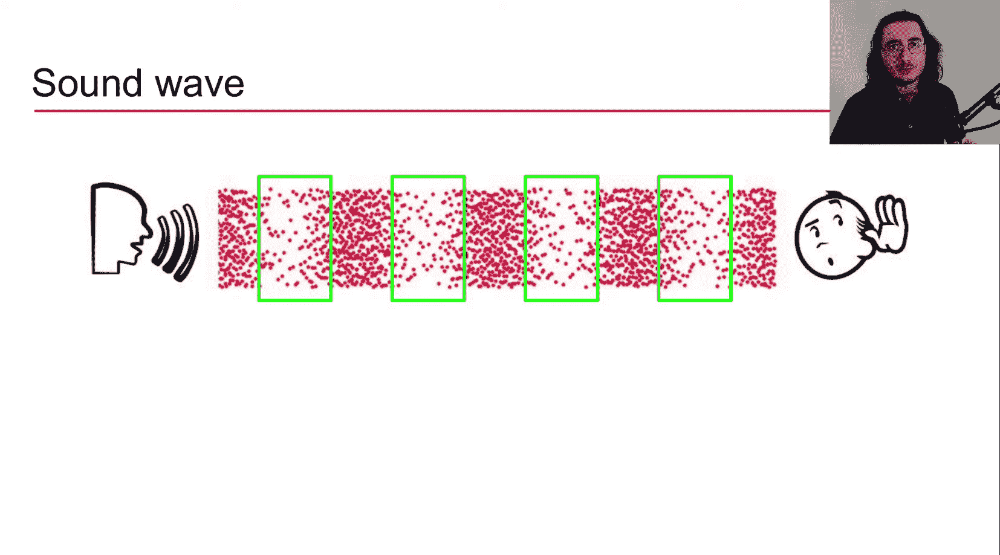
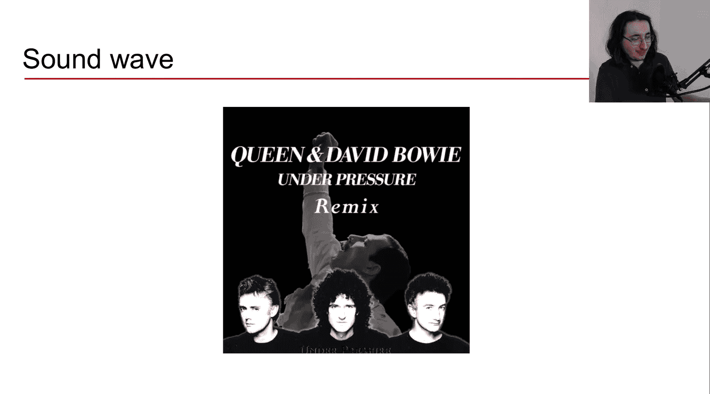
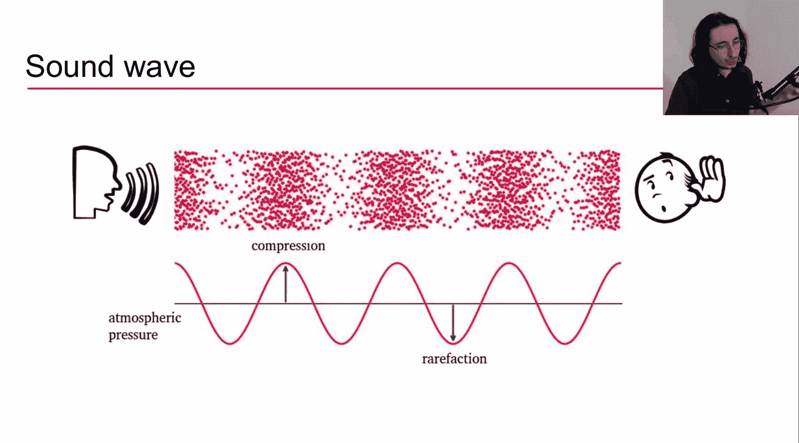
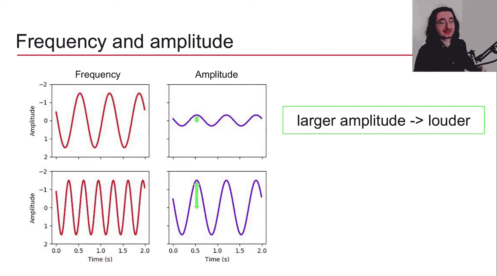
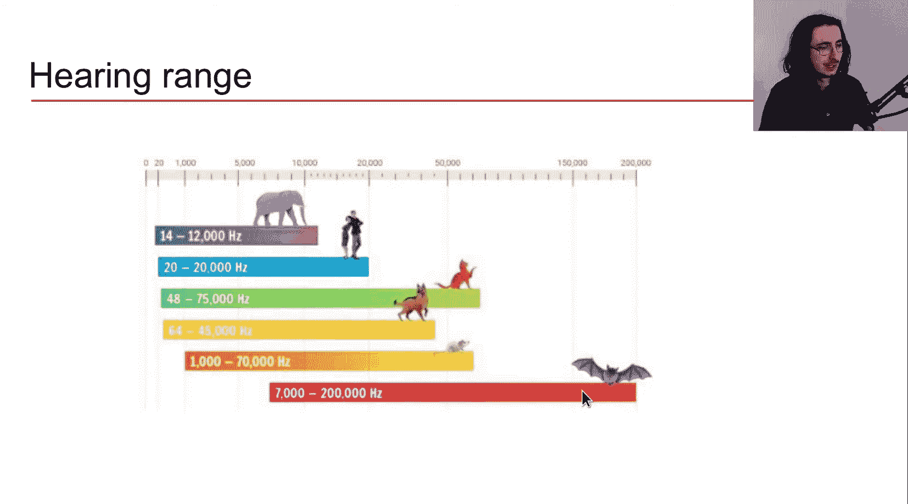
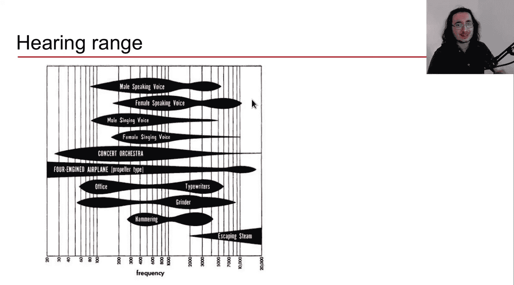

#  002：声音与波形 🎵

在本节课中，我们将学习声音的基本概念，包括声音的产生原理、波形的表示方法，以及频率、振幅、音高等核心参数的定义和关系。这些基础知识是理解后续音频处理技术的关键。

## 声音是什么？

声音是由振动物体产生的。物体振动导致空气分子振荡并相互碰撞，从而改变局部区域的空气压力状态，并在此过程中形成波。因此，我们可以将声音视为一种通过空气分子将能量从一点传递到另一点的波。

具体来说，声音是一种机械波。机械波是一种在空间中传播的振荡，能量随之传递。机械波的特点是它需要一个介质来传播。对于声音而言，这个介质通常是空气。当声波传播时，介质（空气）会发生形变：空气分子碰撞时形成高压区（压缩），分子相互远离时形成低压区（稀疏）。

我们可以用压力图来可视化声波。下图展示了一个简单的正弦波，中心线代表平均大气压。随时间变化，压缩点（空气分子密集）和稀疏点（空气分子稀疏）交替出现。

## 波形：声音的可视化

我们可以使用波形来表示复杂的声音。波形本质上是一个压力图，它绘制了空气压力相对于零基准线的偏差随时间的变化。

通过波形，我们可以直观地表示一段音乐、噪音或任何声音。它不仅是可视化声音的好方法，也是后续提取音频信号重要特征时进行各种变换的基础。

波形之所以重要，是因为它提供了丰富的信息，不仅包括频率信息，还包括强度、音色、持续时间等时间信息。例如，在一段复杂音乐的波形中，我们可以识别音符的起始点和持续时间。

## 声音的分类

根据其特性，声音可以分为以下几类：

*   **周期性声音**：在这种声音中，压缩和稀疏有规律地重复。最简单的周期性声音是单一正弦波。更复杂的声音（如管弦乐）是由多个正弦波叠加组合而成的复合音。
*   **非周期性声音**：顾名思义，这类声音没有周期性。它又可以分为两种：
    *   **连续非周期性声音**：例如噪音，其空气压力变化不遵循任何模式，是随机的。
    *   **瞬态非周期性声音**：例如爆裂声或咔嗒声，它们是能量的突然爆发，导致空气压力瞬间改变，类似于脉冲。

## 正弦波与核心参数

让我们从最简单的正弦波开始分析。下图展示了一个正弦波的波形及其数学表达式。

正弦波的方程由几个参数决定：
`y(t) = A * sin(2πft + φ)`
其中：
*   **A** 代表**振幅**。
*   **f** 代表**频率**。
*   **t** 代表**时间**。
*   **φ** 代表**相位**。

接下来，我们逐一分析这些参数如何影响波形。

### 频率与周期

**周期**是指波形中两个连续波峰（或波谷）之间的时间间隔。**频率**是周期的倒数，表示每秒完成的周期数，单位为赫兹（Hz）。
`f = 1 / T`
其中 `T` 是周期，`f` 是频率。

### 振幅

**振幅**衡量的是空气压力扰动的最大幅度。振幅越大，表示能量传递越强，我们感知到的声音就越响。

### 相位

**相位**决定了波形在时间零点（t=0）时的位置。通过改变相位，我们可以将波形向左或向右平移。

通过振幅、频率和相位，我们可以完全确定一个正弦波。正如我们将在后续课程中看到的，复杂声音可以被视为许多正弦波的组合或叠加，因此理解这些参数至关重要。

## 频率、振幅与听觉感知

频率和振幅与我们的听觉感知直接相关。

*   **频率与音高**：频率越高，我们感知到的音调就越高。下图展示了不同频率（周期）的波形。
    
*   **振幅与响度**：振幅越大，我们感知到的声音就越响。下图展示了不同振幅的波形。
    

## 听觉范围与音高

人类可听到的频率范围（听觉范围）大约在20 Hz到20,000 Hz之间。不同动物的听觉范围差异很大，例如猫、狗可以听到更高频率的超声波。

频率是一个客观的物理量，而我们主观感知到的频率称为**音高**。我们对音高的感知不是线性的，而是对数的。一个有趣的现象是，如果两个频率相差一倍（即2的幂次关系），我们感知到的音高差异是相同的，这引出了**八度**的概念。

## MIDI音符、音高与频率的映射

在音乐中，我们常用MIDI音符来表示音高。每个琴键对应一个MIDI编号（例如中央C是60），也可以映射为音符名（如C4）。

一个八度包含12个半音。如果我们将频率提高一倍，音高就上升一个八度。例如，标准音A4（MIDI音符69）的频率是440 Hz，那么高一个八度的A5频率就是880 Hz。

频率 `f` 和音高 `p`（以MIDI编号表示）之间的转换公式如下：
`f(p) = 440 * 2^((p - 69)/12)`
例如，计算MIDI音符60（C4）的频率：
`f(60) = 440 * 2^((60 - 69)/12) ≈ 261.6 Hz`

相邻两个半音（即MIDI编号相差1）之间的频率比是恒定的：
`f(p+1) / f(p) = 2^(1/12) ≈ 1.059`

## 音分

我们的听觉分辨率很高，能够分辨小于一个半音的音高差异。为了精确度量这种微小差异，引入了**音分**的概念。一个八度被分为1200音分，因此每个半音对应100音分。人耳可察觉的最小音高差异阈值大约在10到25音分之间，音乐家通常具有更好的分辨能力。

## 总结

本节课我们一起学习了声音与波形的基础知识。我们了解了声音作为机械波的产生原理，以及如何使用波形来可视化声音。我们深入探讨了描述声音的核心参数：频率（及相关的周期）、振幅和相位，并明确了它们与听觉感知（音高、响度）之间的关系。此外，我们还介绍了人类听觉范围、音乐中音高与频率的对数映射关系（通过MIDI音符和八度概念），以及用于度量微小音高差异的单位——音分。

下一节课，我们将继续深入探讨声音的其他描述参数，包括与振幅相关的强度、功率和响度，以及声音中非常有趣且主观的一个属性——音色。