#  003：强度、响度与音色

在本节课中，我们将继续探索声音的特征，重点学习强度、响度与音色这三个核心概念。我们将了解声音的客观物理量（如强度）与主观感知量（如响度）之间的区别与联系，并初步探讨音色这一复杂而迷人的属性。

## 声音强度与功率

上一节我们介绍了声音的基本特征和频率。本节中，我们来看看声音的强度与功率。

声音功率是一个物理量，表示声源在单位时间内向所有方向辐射的总能量。其公式为：
\[
P = \frac{E}{t}
\]
其中，\( P \) 是功率，单位是瓦特 (W)；\( E \) 是能量；\( t \) 是时间。

与声音功率紧密相关的是声音强度。声音强度定义为通过单位面积的声功率。其公式为：
\[
I = \frac{P}{A}
\]
其中，\( I \) 是强度，单位是瓦特每平方米 (W/m²)；\( P \) 是功率；\( A \) 是面积。

一个有趣的事实是，一个大型交响乐团或一次强烈的雷鸣，其声音功率大约仅为1瓦特，这仅相当于一个旧式白炽灯泡功率的百分之一。

## 听觉阈值与分贝

人类能够感知的声音强度范围极其宽广。以下是两个关键的听觉阈值：

*   **听阈**：这是人耳能感知到的最小声音强度，约为 \(10^{-12}\) W/m²。
*   **痛阈**：这是开始引起听觉疼痛的强度阈值，约为 \(10\) W/m²。

由于人耳可感知的强度范围跨越了13个数量级，我们通常使用对数标度——分贝 (dB) 来描述声音的强度级。分贝的计算公式为：
\[
L = 10 \log_{10}\left(\frac{I}{I_0}\right)
\]
其中，\( L \) 是强度级（分贝），\( I \) 是当前声音强度，\( I_0 \) 是参考强度（通常取听阈强度 \(10^{-12}\) W/m²）。当 \( I = I_0 \) 时，强度级为0 dB。

分贝每增加3 dB，声音强度大约翻倍。以下是一些常见声音的强度级参考：

*   耳语：约 20 dB
*   正常交谈：约 60 dB
*   痛阈：约 130 dB
*   喷气发动机起飞：约 140 dB

## 响度：主观的强度感知

虽然强度和功率是客观的物理量，但响度是我们对声音大小的主观感受。它与强度相关，但并非线性对应。

响度感知受以下因素影响：

*   **持续时间**：在相同强度下，持续时间较长的声音听起来比短促的声音更响。
*   **频率**：人耳对不同频率声音的敏感度不同。在中等频率范围（约几百赫兹到几千赫兹）内，我们对响度的感知最敏感。
*   **年龄**：不同年龄的人对相同强度声音的响度感知也不同。

研究人员通过心理声学实验，引入了“方 (phon)”作为响度的度量单位。等响曲线图揭示了在相同响度水平下，所需声压级（分贝）随频率变化的规律。例如，要让人耳在20 Hz的低频处感知到与1 kHz处相同的响度，需要更高的声压级。

## 音色：声音的“色彩”

音色是区分具有相同音高、响度和时长的不同声音的属性。例如，同样演奏中央C，小提琴和钢琴的声音截然不同，这种差异就源于音色。

音色是一个多维度的复杂特征，尚无单一、全面的定义，但通常用以下词语描述：明亮、暗淡、柔和、刺耳、温暖等。影响音色的主要因素包括以下三个方面。

### 1. 声音包络

声音包络（或称振幅包络）描述了一个声音振幅随时间变化的形状。在音乐中，常用ADSR模型来描述：

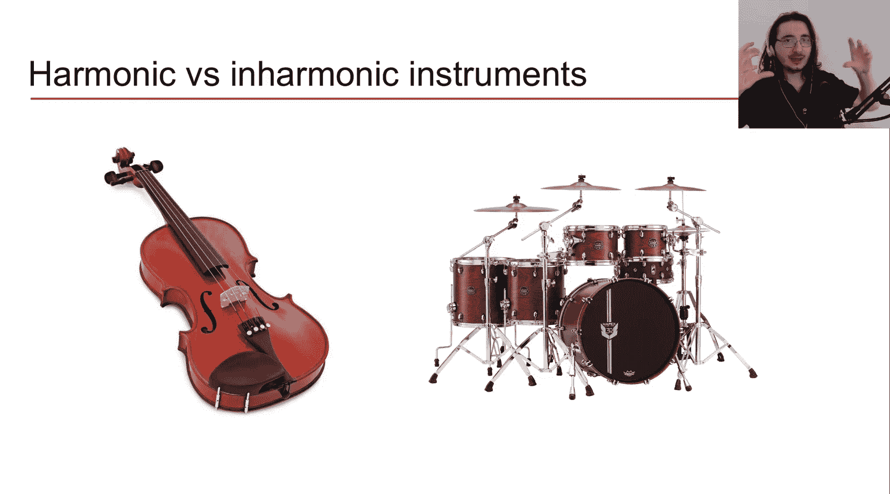

*   **起音 (Attack)**：声音振幅从静音上升到峰值的阶段。
*   **衰减 (Decay)**：峰值过后，振幅下降到某一稳定水平的阶段。
*   **延音 (Sustain)**：振幅保持相对稳定的阶段。
*   **释音 (Release)**：声音振幅从稳定水平衰减到零的阶段。

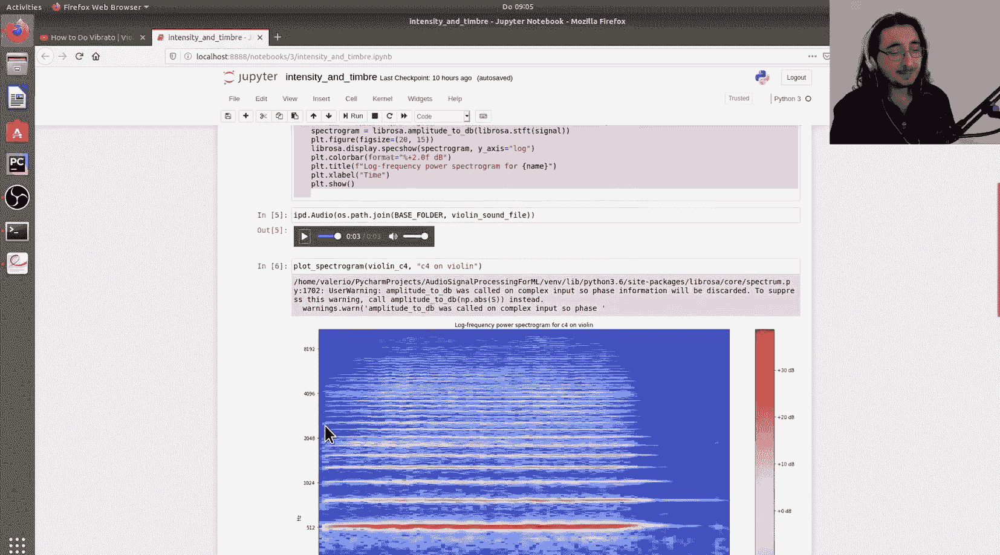

不同乐器的包络形状差异显著。例如，钢琴的起音尖锐、衰减快；而小提琴的起音则相对平缓。

### 2. 谐波成分

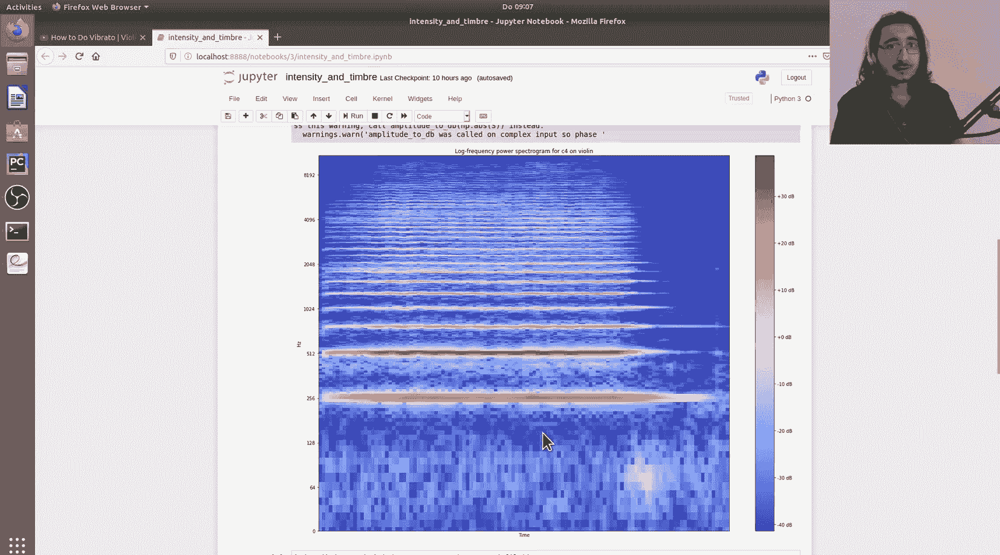

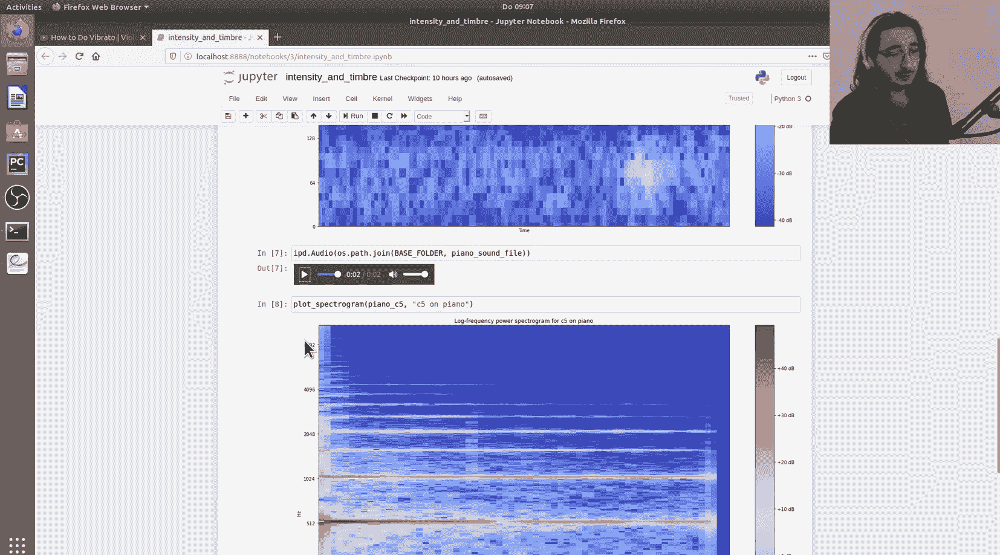

复杂的声音可以看作是许多正弦波（称为“分音”或“谐波分音”）的叠加。

*   **基频**：最低的分音，决定了我们感知到的音高。
*   **谐波**：频率为基频整数倍的分音。例如，如果基频是440 Hz，那么二次谐波就是880 Hz，三次谐波是1320 Hz，依此类推。

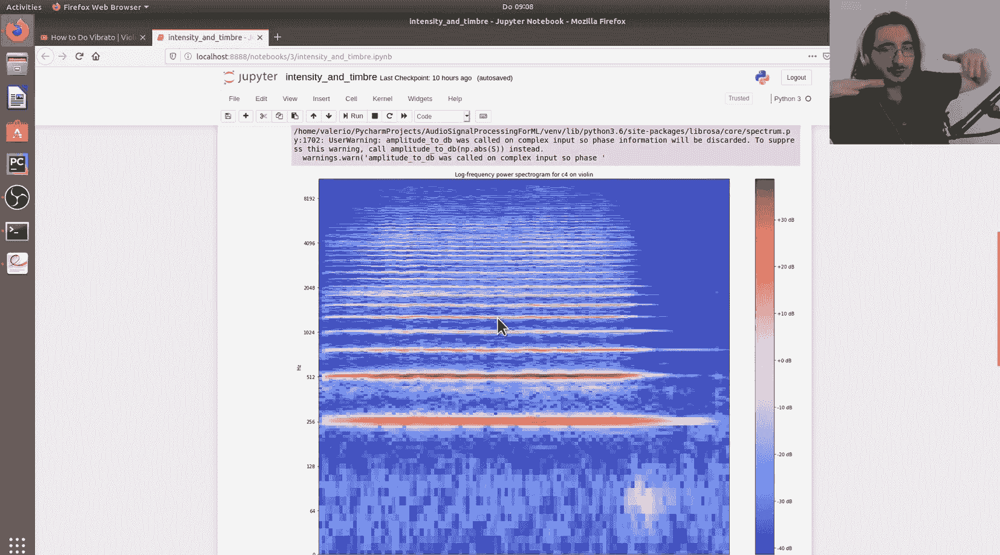

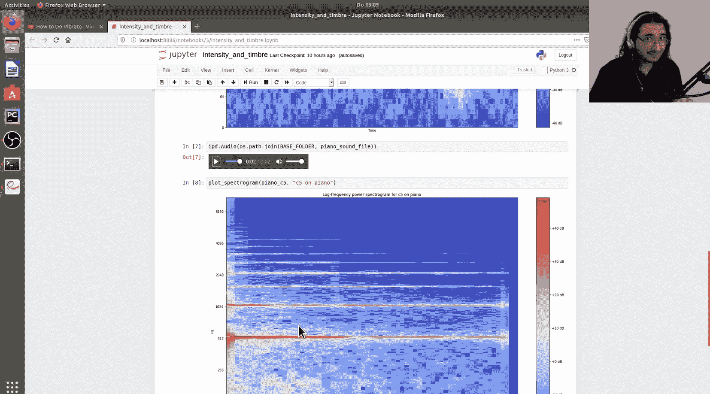

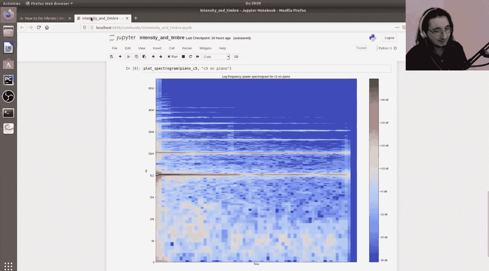

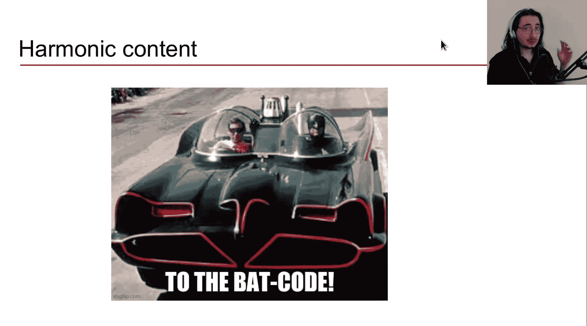

音色在很大程度上取决于这些谐波分音上的能量分布。频谱图是一种可视化工具，可以展示声音中不同频率成分的能量随时间的变化。通过对比小提琴和钢琴演奏同一音符的频谱图，可以清晰地看到它们谐波能量分布的差异。

### 3. 振幅与频率调制

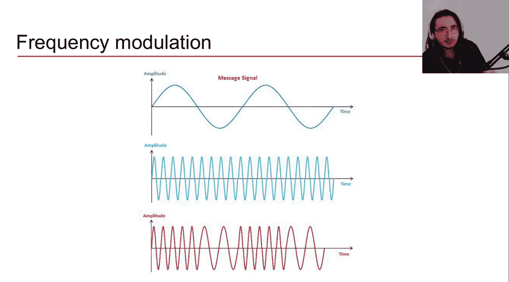

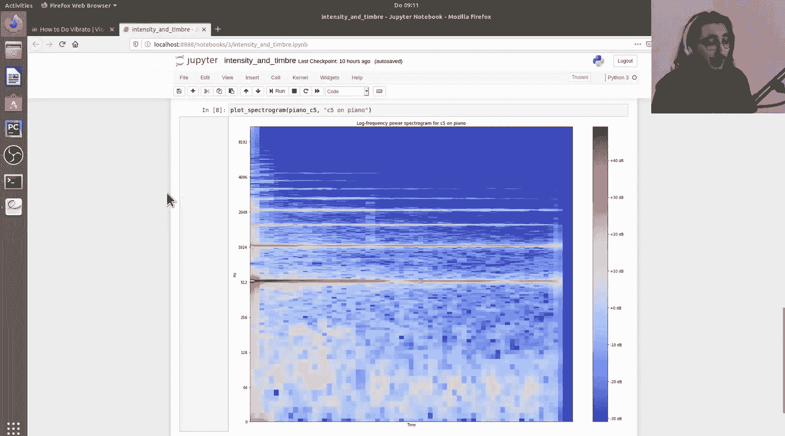

调制是指信号的某些参数（如振幅或频率）按照另一个信号（调制信号）的规律发生变化。

*   **频率调制 (FM) / 颤音 (Vibrato)**：声音频率发生周期性的微小波动。在小提琴等乐器中，颤音常用于情感表达。
*   **振幅调制 (AM) / 震音 (Tremolo)**：声音振幅发生周期性的波动。这种效果在音乐中也常能听到。

这两种调制都会显著改变声音的音色特征。

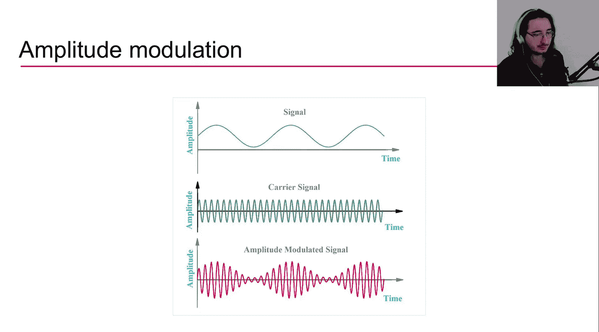

## 总结

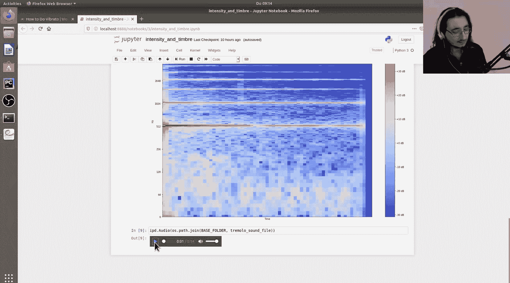

本节课中，我们一起学习了声音的三个重要特征：

1.  **强度与功率**：客观的物理量，描述了声音的能量属性，常用分贝度量其级别。
2.  **响度**：人对声音强度的主观感受，受频率、持续时间等因素影响，使用“方”作为单位。
3.  **音色**：区分声音“色彩”的多维度属性，主要受声音包络、谐波成分以及振幅/频率调制的影响。

理解这些基础概念，是后续深入学习音频数字信号处理、频谱分析以及机器学习应用的关键。下一节，我们将正式引入音频信号的概念，并探讨模拟信号与数字信号之间转换的核心过程——模数转换与数模转换。