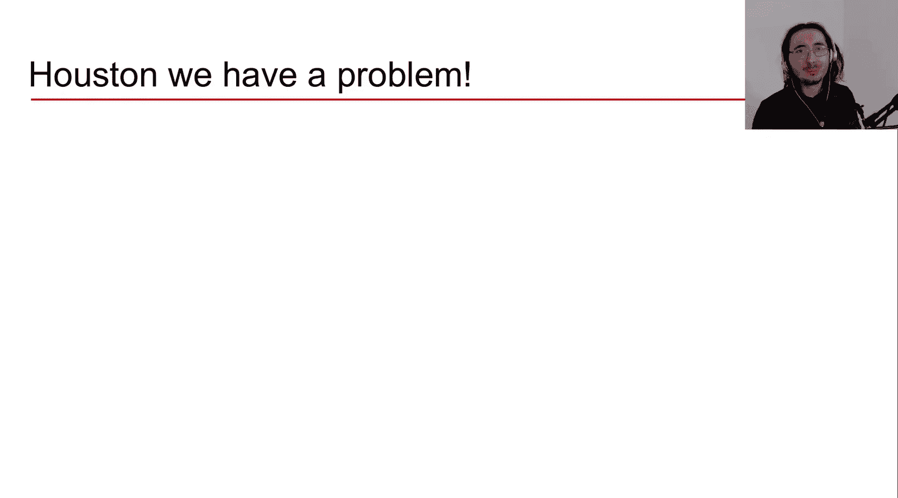
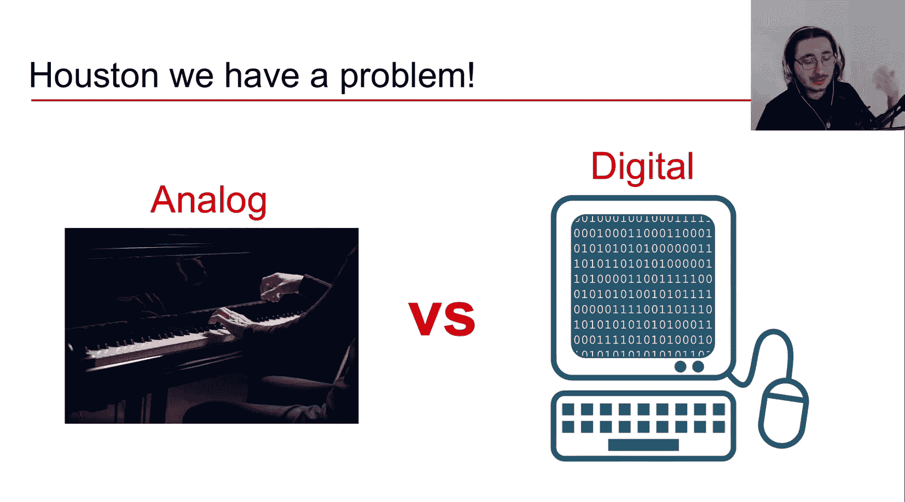
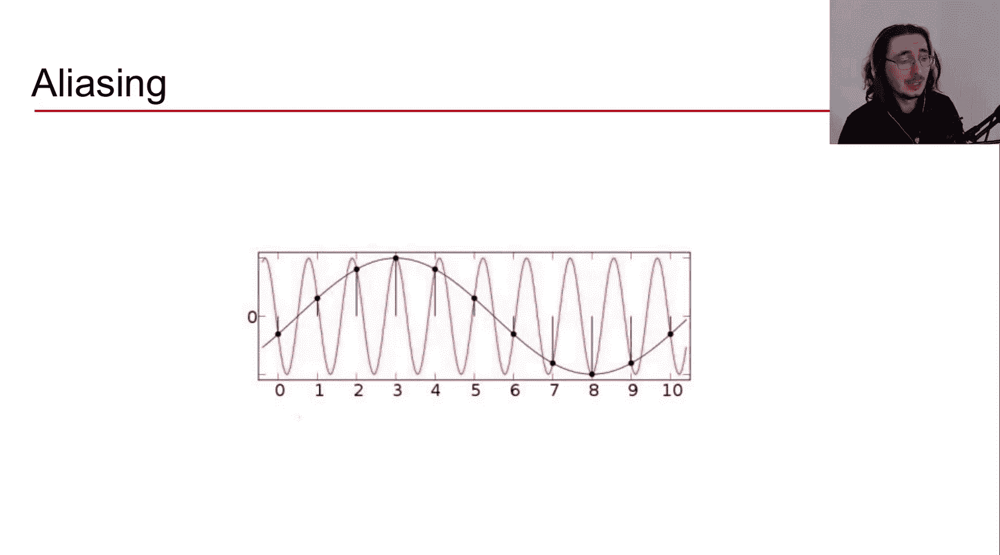
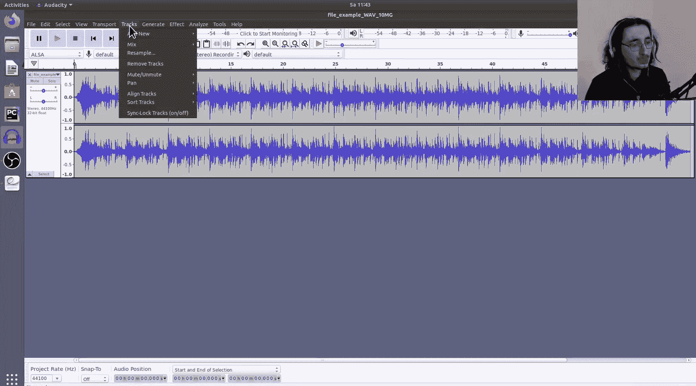
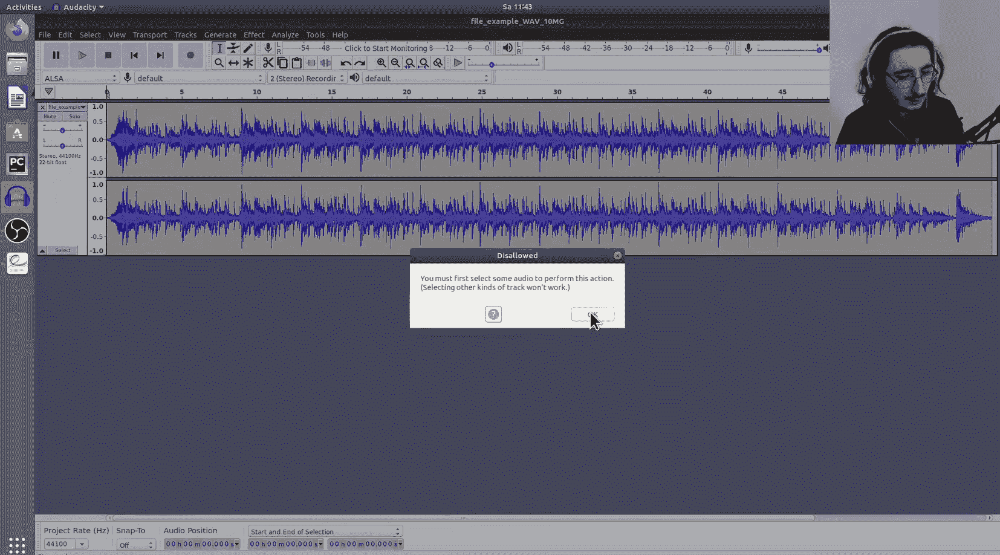
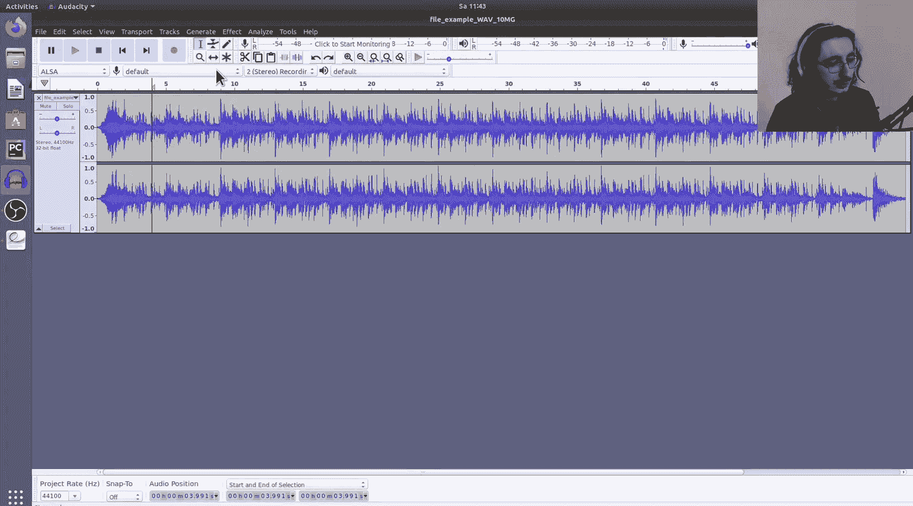
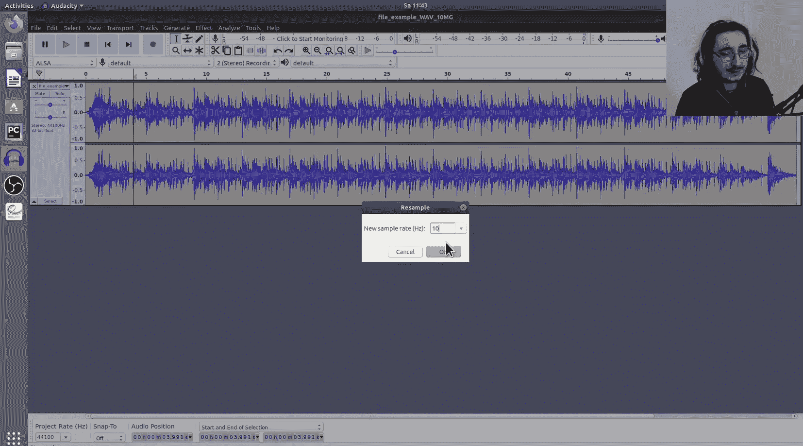
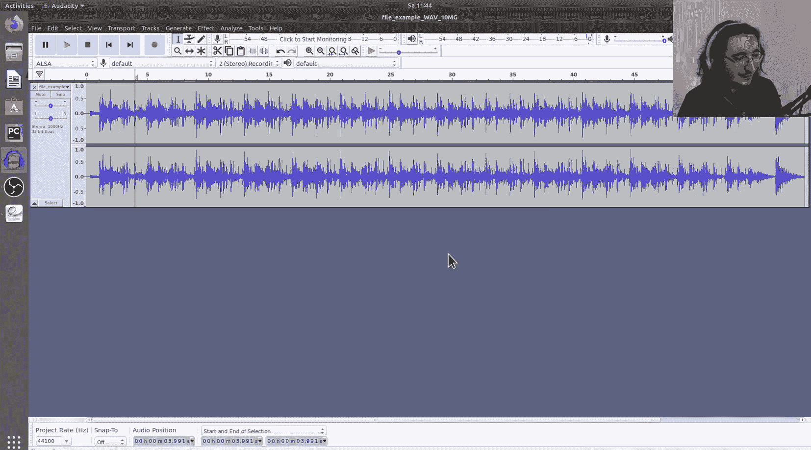
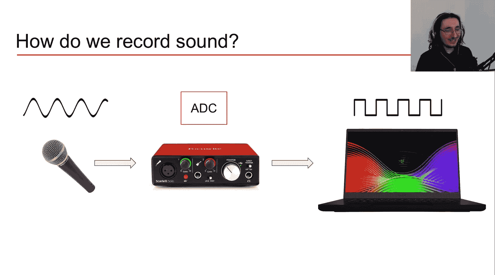
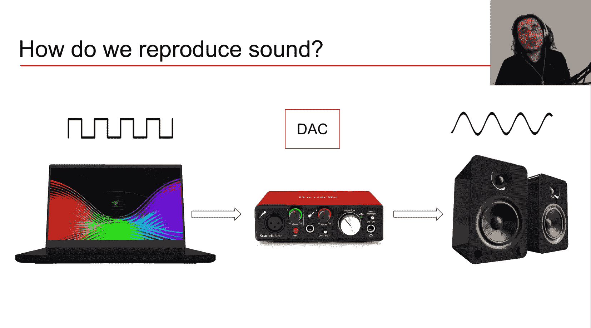

#  004：理解音频信号

在本节课中，我们将学习如何将声音转换为数字化的音频信号，以便我们能够处理它、提取特征，并用于机器学习任务。首先，我们需要理解什么是音频信号。

音频信号是声音的一种可能表示形式，它包含了重建该声音所需的全部信息。然而，这里存在一个核心问题：声音本质上是模拟的机械波，而我们希望使用计算机等数字技术来处理它。那么，如何将模拟信号转换为数字信号呢？这正是本节课的主题。

在深入探讨之前，我们先简要概述一下模拟信号和数字信号。

## 模拟信号与数字信号

模拟信号的特点是，在表示时间的X轴和表示振幅（例如声压）的Y轴上，其值都是**连续**的实数。

如上图所示，模拟信号的曲线是连续的。如果我们想以数字格式存储模拟信号，就会遇到问题：它在时间和振幅轴上都具有**无限的分辨率**。这意味着无论我们如何提高观察精度，总能找到更细微的时间点或振幅值。显然，这需要无限的内存来存储，而我们无法负担。因此，我们需要转向数字信号。

数字信号本质上是一系列**离散值**的序列。可以将其理解为在连续信号的不同时间点拍摄快照。这些数据点只能取**有限数量**的值，而不是所有可能的实数。

## 模数转换

从模拟信号转换到数字信号的过程称为**模数转换**，其英文缩写是 **ADC**。这个过程包含两个子步骤：**采样** 和 **量化**。ADC的结果就是数字音频信号，我们通常也称之为**脉冲编码调制**信号。

上一节我们介绍了ADC的基本概念，本节中我们来看看它的两个核心步骤。

### 1. 采样

采样的过程，就是在特定时间点获取模拟波形上的数据点。下图中的黑点就是采样点。

我们通常以固定的**采样周期**（用大写 **T** 表示）在等间隔的时间点上进行采样。每个周期获取一个数据点。

要定位第 **n** 个采样点在时间轴上的位置，可以使用以下公式：

**时间(T_n) = n × T**

采样的一个关键特征是**采样率**，用 **SR** 表示。它是采样周期 **T** 的倒数：

**SR = 1 / T**

采样率的单位是赫兹，它表示**每秒钟数字信号中包含的样本数量**。

采样率的高低会影响采样质量。采样率越低，采样周期越长，采样点之间的间隔越大，这会导致**采样误差**增大——即连续曲线下的面积与采样点构建的阶梯状面积之间的差异。反之，采样率越高，时间分辨率越高，采样误差就越小。

那么，我们应该使用多高的采样率呢？这引出了一个重要概念：**奈奎斯特频率**。

### 奈奎斯特频率与混叠

根据**奈奎斯特定理**，奈奎斯特频率 **F_N** 等于采样率的一半：

**F_N = SR / 2**

奈奎斯特频率定义了一个数字信号中能够被**无失真重建**的最高频率上限。如果信号中包含高于奈奎斯特频率的成分，就会产生名为**混叠**的失真现象。

混叠会使高于奈奎斯特频率的信号成分“折叠”到较低的频率上，从而在重建信号中引入原本不存在的低频成分。下图展示了这一现象：红色高频原始信号经过采样（黑点）后，重建出的蓝色信号频率远低于原始信号。

为了直观感受混叠的效果，我们可以听一段音乐。在44.1 kHz的原始采样率下，音乐听起来是正常的。但如果将其重采样到极低的1 kHz，奈奎斯特频率变为500 Hz，所有高于500 Hz的频率成分都会发生混叠，导致声音严重失真、变得低沉模糊。

因此，在实际的ADC过程中，通常会加入一个**抗混叠滤波器**（低通滤波器），在采样前滤除信号中高于奈奎斯特频率的成分，以防止混叠发生。

理解了采样之后，我们来看看ADC的第二个步骤：量化。

### 2. 量化

量化处理的是信号的振幅轴。其核心思想是：将振幅轴划分为有限个离散的层级，然后将每个采样点的振幅值**近似到最接近的可用层级**。

与采样会产生采样误差类似，量化也会产生**量化误差**，即原始振幅值与量化后近似值之间的差异。直观上，**量化分辨率越高**（即振幅轴上可用的层级越多），量化误差就越小。

在数字系统中，这些振幅层级用**二进制数值**表示。量化的分辨率通常用**比特深度**来衡量。例如，CD的比特深度是16位。

比特深度为 **Q** 时，可表示的振幅层级数量为 **2^Q**。对于16位深度，就是 **2^16 = 65,536** 个不同的振幅值。

量化过程关联着**动态范围**的概念，它指的是系统能够记录的最大信号与最小信号之间的差异，可以理解为数字声音的响度范围。比特深度越高，动态范围通常也越大。

动态范围又与**信噪比**相关。信噪比衡量的是最大信号强度与量化误差（噪声）之间的关系。对于量化过程，信噪比 **SQNR** 可以近似估算为：

**SQNR ≈ 6.02 × Q dB**

其中 **Q** 是比特深度。对于16位深度，信噪比约为 **96 dB**，这也大致对应了其动态范围。

## 音频的录制与回放流程

现在，我们可以将整个过程串联起来，理解声音从录制到回放的完整数字链路：

1.  **录制**：
    *   声音（机械波）冲击麦克风的振膜，使其振动。
    *   振动产生模拟电信号。
    *   模拟电信号进入声卡（充当ADC设备）。
    *   声卡进行抗混叠滤波、采样和量化，输出数字信号。
    *   数字信号被存储到计算机中。

2.  **回放**：
    *   数字信号从计算机送入声卡。
    *   声卡进行**数模转换**，将数字信号还原为模拟电信号。
    *   模拟电信号驱动扬声器的振膜振动。
    *   振膜振动产生机械波（声音），传入我们的耳朵。

## 总结

本节课中，我们一起学习了音频数字化的核心知识：

*   我们了解了模拟信号（连续值）与数字信号（离散值）的根本区别。
*   我们深入探讨了**模数转换**的两个关键步骤：
    *   **采样**：在时间轴上以固定周期（采样率）获取离散点。采样率需满足奈奎斯特定理，以避免**混叠**失真。
    *   **量化**：在振幅轴上将连续值近似到有限的离散层级（由**比特深度**决定）。量化会引入误差，并决定了信号的**动态范围**和**信噪比**。
*   我们梳理了声音从物理振动，经过ADC变为数字信号，再通过DAC还原为声音的完整流程。

掌握了音频信号的基础后，在接下来的课程中，我们将开始深入探讨如何从这些数字音频信号中提取各种**特征**，例如时域特征和频域特征。这些特征正是我们训练机器学习或深度学习模型所使用的核心数据。

---
*欢迎加入Sound of AI Slack社区，与更多对AI、音频、音乐和数字信号处理感兴趣的同好交流。链接请在视频描述中查找。如果你对本视频内容有任何疑问，请在下方评论区提出。*