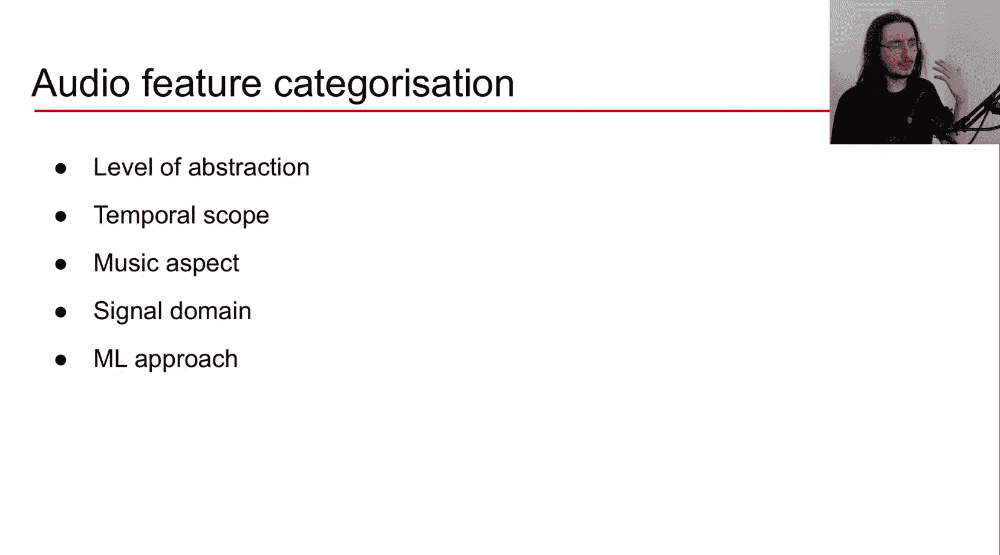
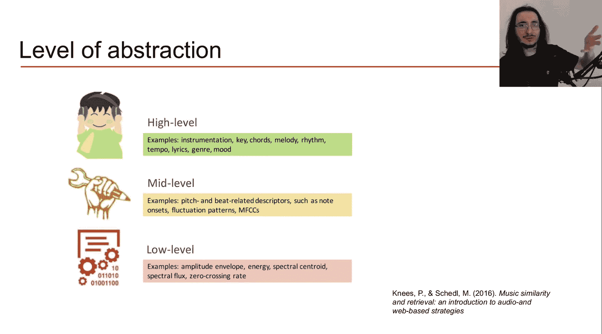
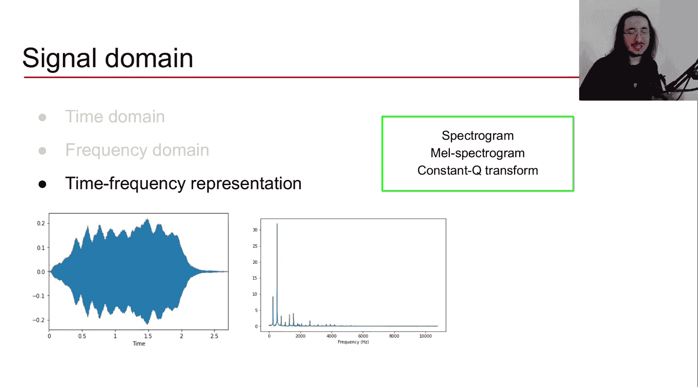
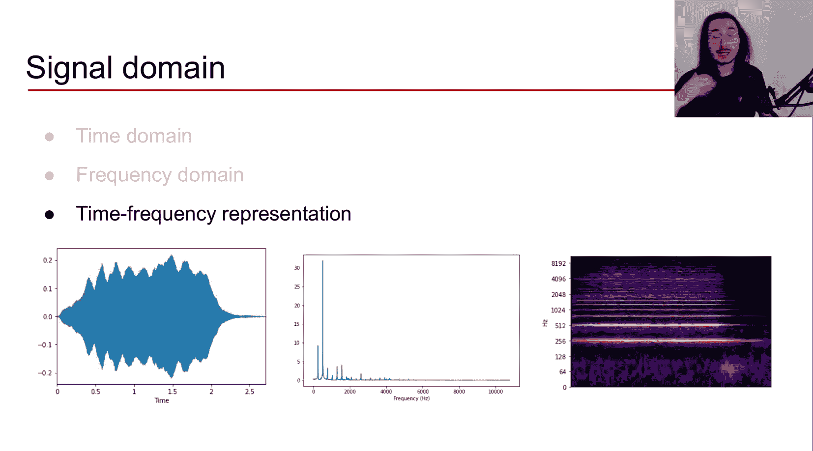
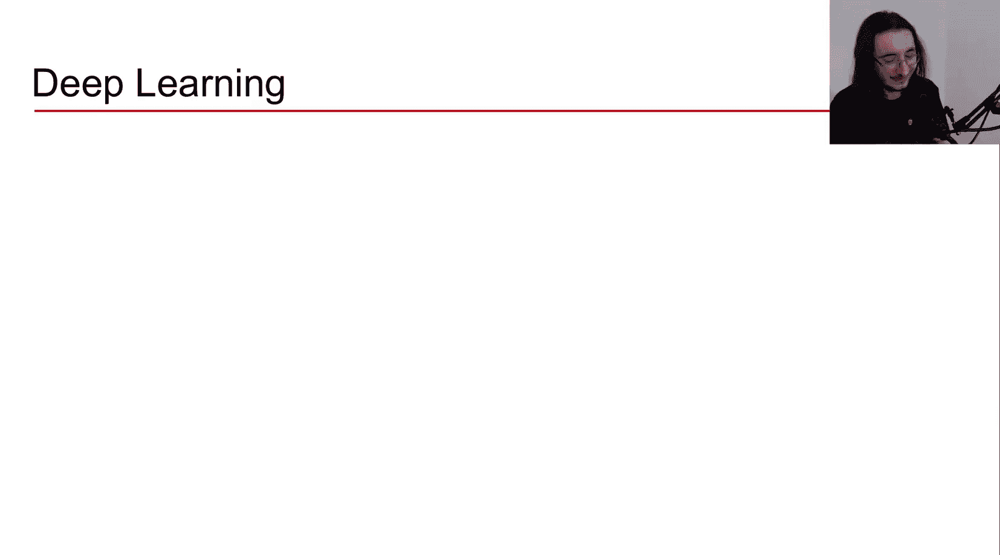
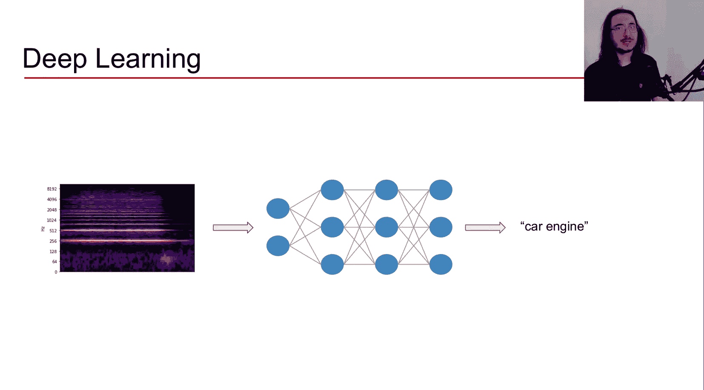
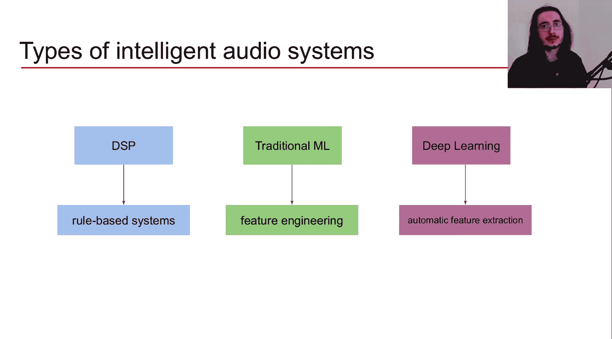
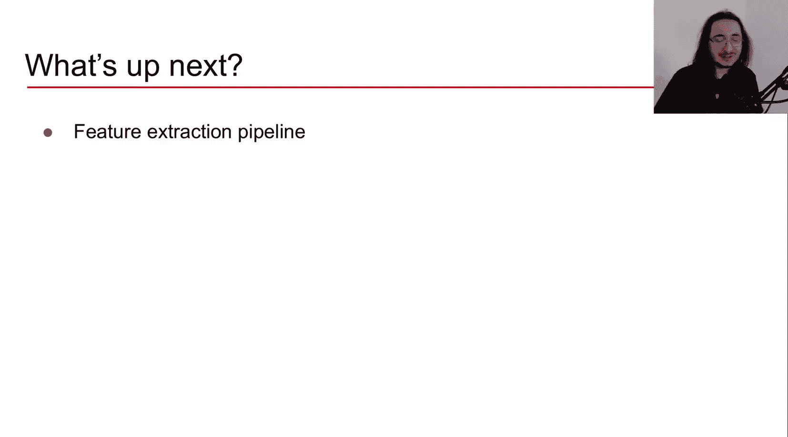

#  005：机器学习中的音频特征类型 🎵

在本节课中，我们将学习什么是音频特征，以及如何从不同角度对它们进行分类。理解这些分类策略，有助于我们为机器学习任务选择合适的音频描述符。

音频特征是声音的描述符。不同的音频特征能为我们提供声音不同方面的信息。我们可以利用这些特征来训练智能音频系统。具体方法是，识别出我们感兴趣的若干音频特征，然后将它们输入到机器学习系统中，以期让系统学习到模式并解决我们的任务或问题。

现在，让我们回顾几种可用于对音频特征进行分类的策略。这里列出了五种策略。这些策略的设计初衷是尽可能通用，能够处理任何类型的声音。当然，其中一些策略（如“音乐层面”和“抽象层次”）更侧重于音乐信号。

以下是五种分类策略：
*   抽象层次
*   时间范围
*   音乐层面
*   信号域
*   机器学习方法

在接下来的内容中，我们将深入探讨每一种分类策略。

## 抽象层次 🎼

这种分类策略主要适用于音乐信号，而非一般的声音或音频。我们可以将其分为三个层次：低层音频特征、中层音频特征和高层音频特征。

以下是三个层次的具体说明：
*   **低层特征**：这些特征对机器有意义，但对我们人类来说不太容易理解。它们通常是直接从音频中提取的统计特征。未经音频处理训练的人很难理解这些特征的含义。
*   **中层特征**：这些特征开始从感知角度变得有意义。它们涉及音高和节拍等属性。例如，音符起始点、波动模式和梅尔频率倒谱系数都属于此类。
*   **高层特征**：这些是非常抽象的特征，倾向于映射到我们在听音乐时能够理解和感知的音乐结构。例如，乐器、调性、和弦、旋律、节奏和速度。基本思想是，层次越高，音频特征就越抽象。

## 时间范围 ⏱️

这种策略适用于任何类型的声音，无论是音乐还是非音乐。我们可以将音频特征大致分为三类。

以下是基于时间范围的分类：
*   **瞬时级特征**：这些特征提供音频信号的瞬时信息。它们通常考虑非常短的音频片段，大约在20到100毫秒之间。需要记住，人类能够感知的最小时间分辨率大约为10毫秒，低于这个阈值在感知层面上就没有意义了。
*   **片段级特征**：这些是可以在音频片段上计算的特征。这里我们谈论的是秒级的时间，从2秒到5秒、10秒、15秒、20秒甚至更长。以音乐为例，这些特征可以提供关于一个小节或一个乐句的信息。它们倾向于从更长的时段中聚合瞬时信息。
*   **全局特征**：这些特征提供关于整个声音的信息，基本上是聚合特征。我们可以聚合来自较低时间分辨率特征（如瞬时或片段级特征）的结果，然后使用某种平均值或更复杂的聚合方法，最终得到一个描述整个声音或整个信号的数字或特征向量。

## 音乐层面 🎹

这种分类策略显然只专注于音乐。它基于音频特征所揭示的音乐层面进行分类。

例如，音符起始点与节拍和旋律有关。而调性则与和声和音高有关。我们可以根据音频特征所反映的音乐层面来对它们进行分类。由于显而易见的原因，这种分类策略主要用于音乐。

## 信号域 📊

这是对音频特征进行分类的最重要策略之一，它基于我们所在的信号域。通过几个例子，这个概念会变得非常清晰。

以下是基于信号域的分类：
*   **时域特征**：这些特征直接从波形（原始音频）中提取。在波形中，X轴是时间，Y轴是振幅。时域音频特征从这个表示中提取信息。例如：振幅包络、均方根能量、过零率。
*   **频域特征**：声音的特征很大程度上由频率决定，而时域表示不包含频率信息。频域特征专注于声音的频率成分。我们通过对时域信号应用傅里叶变换，将其转换到频域，从而得到频谱。在频谱中，X轴是频率，Y轴是幅度。例如：频带能量比、频谱质心、频谱通量、频谱扩展。
*   **时频域特征**：时域和频域表示无法同时提供时间和频率信息。时频域特征则能同时提供这两方面的信息，使用时频表示。例如：频谱图、梅尔频谱图、常数Q变换。其中，频谱图是最著名的时频表示。通过对时域信号应用短时傅里叶变换获得。在频谱图中，X轴是时间，Y轴是频率，颜色亮度表示特定时间点上特定频带的贡献大小。

## 机器学习方法 🤖

最后一种分类音频特征的方法是基于所使用的机器学习方法。这里可以在传统机器学习算法和深度学习架构之间做出重要区分。

以下是基于机器学习方法的分类：
*   **传统机器学习**：对于传统机器学习算法（如支持向量机、逻辑回归），我们通常会手动挑选我们认为对解决问题最有效的音频特征（来自时域和频域）。例如，对于音频分类任务（区分汽车引擎、飞机或枪声），我们可能选择振幅包络、过零率和频谱通量这三个特征，将它们从音频文件中提取出来，然后输入给算法进行训练和推理。
*   **深度学习**：在深度学习中，我们倾向于使用非结构化的数据表示。类似于图像处理中直接输入像素，在音频处理中，我们可以直接输入原始音频（时域表示），或者输入非结构化的音频表示，如频谱图、梅尔频谱图等。深度学习的承诺是算法能够自动从这些原始表示中提取特征，而无需人工手动挑选。

## 总结与回顾 📝

在本节课中，我们一起学习了音频特征及其多种分类策略。我们回顾了五种主要的分类方式：抽象层次、时间范围、音乐层面、信号域和机器学习方法。

其中，基于**信号域**的分类（时域、频域、时频域）是最核心和通用的策略，这将是我们未来课程中重点探讨的内容。

理解这些分类后，我们现在对将要使用的“食材”——即各种音频特征——有了清晰的图景。下一步是学习如何直接从音频中提取这些特征。在下一节课中，我们将探讨针对时域和频域特征的**特征提取流程**。

希望本节课对你有所帮助。我们下节课再见！