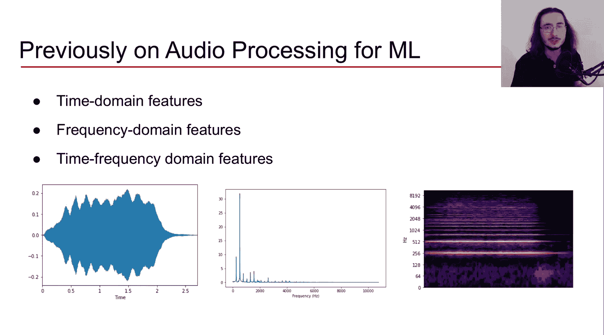
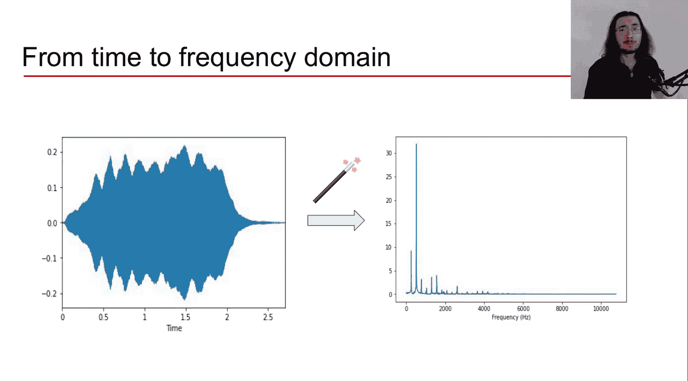

#  006：音频特征提取流程

在本节课中，我们将学习如何构建提取时域和频域音频特征的完整流程。我们将从模拟声音开始，逐步了解数字化、分帧、加窗等关键步骤，并解释为何需要这些处理。

## 概述

在上一节视频中，我们介绍了几种不同类型的音频特征：存在于时域的**时域特征**、存在于频域的**频域特征**，以及同时提供时间和频率信息的**时频域特征**。

本节我们将重点探讨用于提取时域和频域特征的**提取流程**。让我们先从时域特征开始。

## 时域特征提取流程

时域特征的提取流程始于原始声音。

首先，我们需要处理一个模拟声音，例如小提琴声或噪音。为了能在计算机中编辑和处理这个声音，我们必须将其转换为数字信号。这个过程称为**模数转换**，包括**采样**和**量化**两个步骤。

如果你对这个过程不熟悉，建议回顾本系列中详细介绍此过程的视频。

获得声音的数字化版本后，下一步是**分帧**。分帧意味着将一系列样本捆绑在一起。例如，第一帧可能包含第1到第128个样本，第二帧包含第64到第192个样本，第三帧包含第128到第256个样本，依此类推。

这里有一个有趣的现象：这些帧是**重叠**的。我们暂时不解释原因，在本视频结束时你会明白。

### 为何需要分帧？

在提取声学特征之前，我们需要理解为何使用分帧。可以将帧视为可感知的音频块。

问题在于，如果我们以CD标准的44.1 kHz采样率来看，一个**单一样本**的持续时间仅为约0.0227毫秒。这个时间非常短，远低于人耳听觉的**时间分辨率阈值**（约10毫秒）。这意味着持续时间低于10毫秒的事件，我们几乎无法将其感知为独立的声学事件。

通过分帧，我们获得一段有足够持续时间的音频信号，使其从声学角度变得有意义，并能被人类感知。我们想要提取的特征与人类的听觉体验相关，因此分帧是必要的。

### 帧的大小与持续时间

关于帧的另一个要点是，**帧大小**（即每帧包含的样本数）通常是2的幂。这听起来可能很奇怪，原因在于当我们进入频域进行处理时，通常会应用**傅里叶变换**。而应用**快速傅里叶变换**（FFT）时，样本数为2的幂可以极大地**加速计算过程**。

典型的帧大小在256到8192之间。帧的持续时间可以通过以下公式计算：

**帧持续时间 = (1 / 采样率) × 帧大小**

这个公式中，`(1 / 采样率)` 计算的是单个样本的持续时间，乘以帧大小 `K` 就得到了整帧的持续时间。

让我们代入一些常用数值。假设采样率为44.1 kHz，帧大小为512，计算可得帧持续时间约为11.6毫秒。这个值略高于人耳约10毫秒的时间分辨率。

### 特征计算与聚合

回到时域特征提取流程。在完成分帧后，下一步是在**每一帧**上计算时域特征。

但之后，我们需要**聚合**这些结果，为整个声音得到一个单一的特征描述。这可以通过使用统计方法来实现，例如计算**均值**、**中位数**、**总和**，或使用更复杂的方法如**高斯混合模型**。

通过这个过程，我们最终得到一个值、一个特征向量，甚至一个特征矩阵。这基本上是整个被分析音频信号的一个**快照**。

以上就是时域特征的提取流程。

## 频域特征提取流程

现在让我们转向频域特征。你会发现，许多步骤与上述时域流程基本相同。

我们同样从模拟声音开始，进行模数转换（采样和量化），得到数字化音频信号，然后对其进行**分帧**。

现在我们有了一系列帧。下一步是使用一个“魔法工具”——**傅里叶变换**——将信号从时域转换到频域。目前，我们可以将其视为一个黑箱，它神奇地将时间表示转换为频率表示。我们将在后续视频中更详细地介绍傅里叶变换。

简单回顾一下时域和频域：
*   **时域**：声音被可视化为随时间变化的函数，我们看到声音在时间轴上的所有事件。
*   **频域**：我们观察声音的所有频率成分，看它们对整体声音的贡献有多大。X轴是频率（Hz），Y轴是幅度，表示各频段对整体声音的贡献程度。

### 频谱泄漏问题

你可能会认为，提取流程中下一步自然就是应用傅里叶变换。但不幸的是，这里存在一个主要问题，称为**频谱泄漏**。

频谱泄漏发生在我们处理的信号**周期数不是整数**时。这在实际中经常发生，因为一段音频的时间长度很少恰好包含整数个周期。

通常，信号的**端点**会存在**不连续性**，因为它们不是整数个周期。

这些不连续性在通过傅里叶变换转换到频谱（频域）时，会表现为**高频成分**。但这些高频成分在原始信号中并不真实存在，它们只是由于端点不连续性而产生的**伪影**。换句话说，这些不连续频率“泄漏”到了其他更高频率中，因此得名“频谱泄漏”。

在频谱中，你可能会看到一些本不该有实质性贡献的高频成分（例如下图中红框部分），这就是频谱泄漏的例子。

### 加窗：解决频谱泄漏

幸运的是，我们有一种方法可以最小化频谱泄漏，那就是**加窗**。

加窗的思想是：在将帧送入傅里叶变换**之前**，对每一帧应用一个**窗函数**。这样做基本上**消除**了帧端点的样本信息。

这会产生一个周期性信号，从而**最小化频谱泄漏**。

一个著名且最常用的窗函数是**汉宁窗**。其函数形式如下（其中 `k` 代表样本索引）：

`w(k) = 0.5 * (1 - cos(2πk / (K-1)))`， 其中 `0 ≤ k ≤ K-1`

下图展示了应用于50个样本的汉宁窗，它形成了一个钟形曲线，端点趋向于0。

将汉宁窗应用于原始信号 `s` 的数学操作是逐点相乘：`s_windowed = s * w`。得到的新信号端点被平滑，不连续性消失，因为信号在窗函数的作用下自然趋于零。

### 重叠帧：解决信息丢失

但加窗带来了一个新问题：我们**丢失了信号**。因为在帧的起点和终点，我们通过加窗移除了信息。我们当然不希望在进行傅里叶变换时丢失信号。

解决方案就是使用**重叠帧**。这解开了视频开头提到的“帧为何重叠”的谜团。

在非重叠帧的情况下，我们选择一个帧大小并将其应用于信号，帧与帧之间没有重叠。但如果加窗后这样做，就会丢失端点信息。

通过使用**重叠帧**，我们可以弥补在端点丢失的信息。我们让连续的帧之间有一部分样本重叠。

### 关键概念：帧大小与跃迁长度

这里有两个重要概念：
1.  **帧大小**：每帧包含的样本数量。
2.  **跃迁长度**（有时称为跃迁大小）：每次我们向右移动以获取新一帧时，**跳过的样本数**。

在频域特征提取流程中，经过加窗后，我们现在可以应用**傅里叶变换**了。我们希望得到的是一个频谱泄漏最小化的频谱。

之后，我们回到与时域特征提取相似的步骤：在每一帧上计算频域特征，然后使用统计方法聚合整个音频信号的所有结果，最终得到一个频域特征值、向量或矩阵。

## 总结

本节课我们一起学习了提取时域和频域音频特征的完整流程。我们了解了从模拟信号到数字信号的转换、分帧的必要性、加窗如何解决频谱泄漏问题，以及为何需要使用重叠帧来避免信息丢失。

你现在应该对处理时域和频域特征所需的流程有了清晰的认识。接下来，我们将开始深入探讨具体的**时域特征**，了解它们是什么以及如何在机器学习的不同应用中使用它们。敬请期待下一节内容。