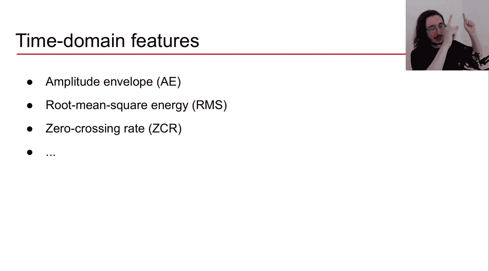
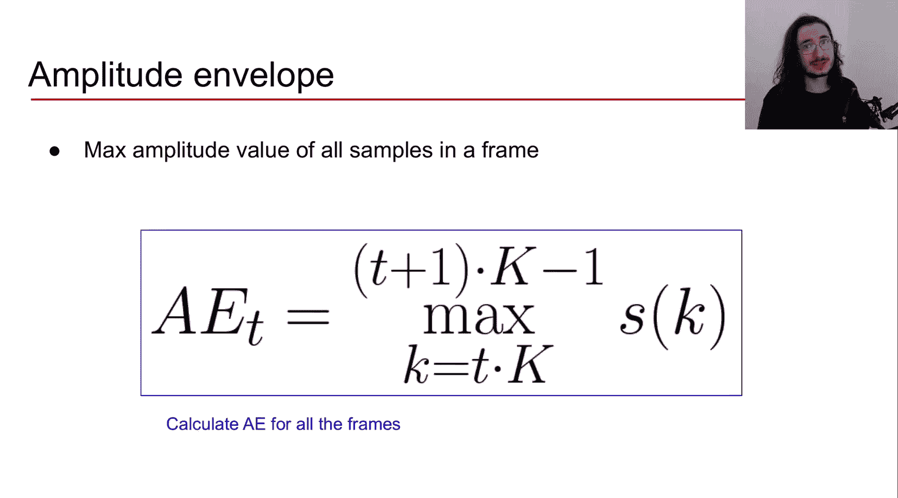
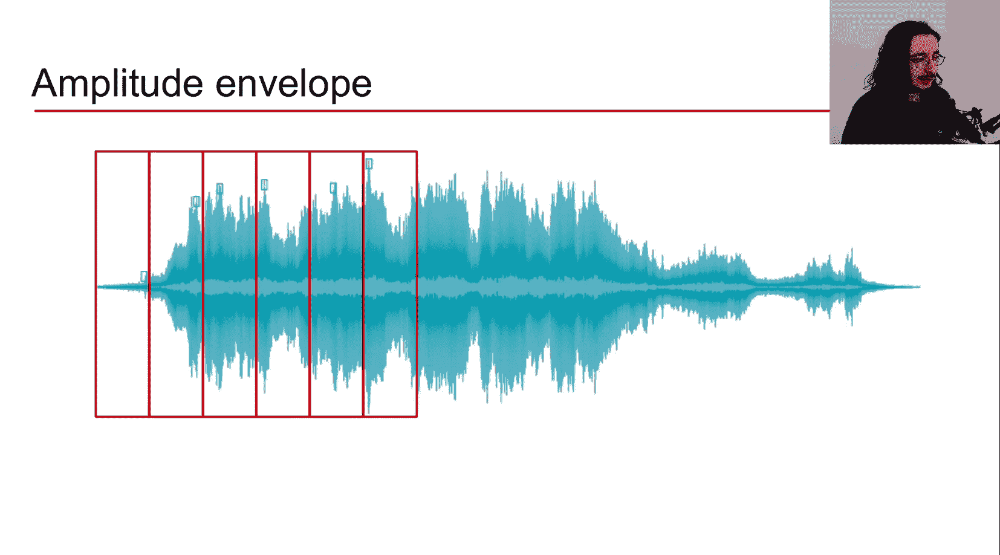
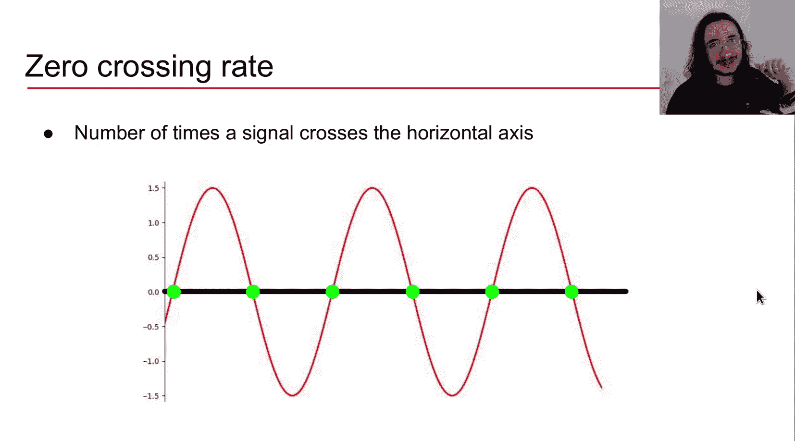
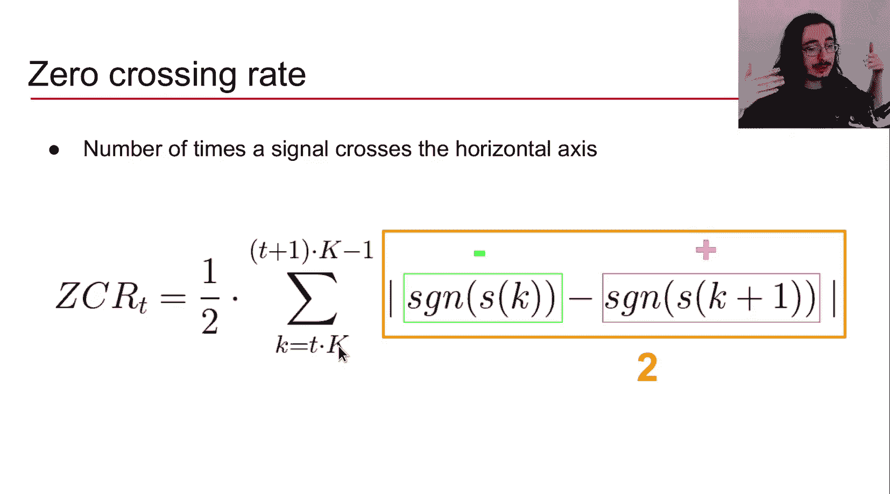
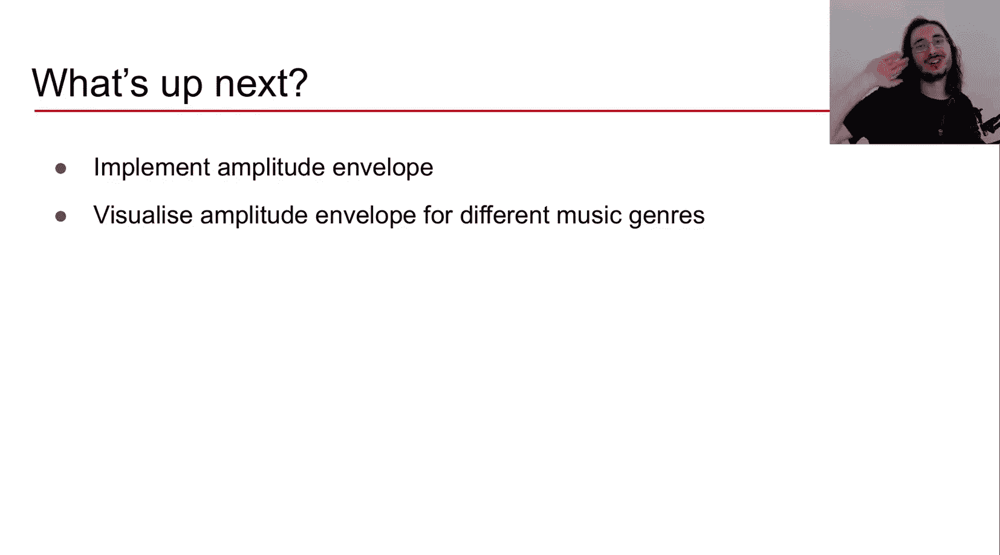

#  007：理解时域音频特征

在本节课中，我们将要学习三种重要的时域音频特征：振幅包络、均方根能量和过零率。我们将逐一探讨它们的定义、计算方法、应用场景以及各自的优缺点。


## 概述

上一节我们介绍了时域和频域特征的提取流程。本节中，我们来看看三种核心的时域音频特征：振幅包络、均方根能量和过零率。这些特征是低级的声学特征，并且是瞬时性的，即我们在音频信号的每一帧上计算它们。理解这些特征是进行更高级音频分析的基础。



## 振幅包络

振幅包络是我们在一个音频帧中所有样本里取出的最大振幅值。它为我们提供了信号响度的粗略概念，因为振幅与强度和响度相关。

### 计算方法

振幅包络在帧 `t` 的计算公式如下：

```
AE(t) = max(|s(k)|)  对于 k = t*K, ..., (t+1)*K - 1
```

其中：
*   `s(k)` 是样本 `k` 的振幅值。
*   `K` 是帧大小，即一帧中包含的样本数量。
*   `t` 是当前帧的索引。



这个公式的含义是：找出从第 `t` 帧的第一个样本（索引为 `t*K`）到最后一个样本（索引为 `(t+1)*K - 1`）之间，振幅绝对值的最大值。



### 可视化理解

想象我们将一个音频信号分割成连续的帧。对于每一帧，我们找出该帧波形中振幅绝对值最大的那个点。连接所有帧的这些最大振幅点，就形成了振幅包络线。它勾勒出了信号振幅变化的轮廓。

### 特点与应用

振幅包络的主要问题是对离群值非常敏感。因为它是从一帧中只取一个样本值（最大值），如果该帧内恰好有一个异常的振幅尖峰，那么这个尖峰就会成为代表整帧的包络值，可能无法真实反映整帧的平均能量水平。

以下是振幅包络的一些应用场景：
*   **起始点检测**：在音符、单词或音素开始时，通常会出现能量的爆发（振幅尖峰），振幅包络可用于检测这些起始点。
*   **高级分类问题**：例如音乐流派分类，不同风格的音乐可能具有不同的振幅包络形态。

## 均方根能量

均方根能量计算的是音频帧内所有样本的均方根值。它是衡量信号响度的另一个指标，并且比振幅包络更常用。

### 计算方法

均方根能量在帧 `t` 的计算公式如下：

```
RMS(t) = sqrt( (1/K) * Σ (s(k)^2) )  对于 k = t*K, ..., (t+1)*K - 1
```

计算步骤分解：
1.  **计算能量**：对帧内每个样本的振幅 `s(k)` 进行平方，得到该样本的能量 `s(k)^2`。
2.  **求和**：将帧内所有样本的能量值相加 `Σ (s(k)^2)`。
3.  **求平均**：将总能量除以帧大小 `K`，得到平均能量 `(1/K) * Σ (s(k)^2)`。
4.  **开方**：对平均能量开平方根，得到均方根能量 `sqrt(平均能量)`。

### 特点与应用

均方根能量对离群值的敏感度低于振幅包络。因为它考虑了帧内所有样本的贡献，并通过平均过程平滑了单个样本的极端值影响，因此能更稳定地表示整帧的能量水平。

以下是均方根能量的一些应用场景：
*   **音频分割**：当音频中出现新的段落或事件（如说话人切换、音乐段落改变）时，RMS值通常会发生显著变化，可用于识别这些边界。
*   **音乐流派分类**：与振幅包络类似，RMS能量特征也可用于区分不同音乐风格。

## 过零率

过零率是指信号在单位时间内穿过零轴（即从正振幅变为负振幅，或反之）的次数。它是一个直观的特征，广泛应用于语音识别和音乐信息检索。



### 计算方法

过零率在帧 `t` 的计算公式如下：

```
ZCR(t) = (1/(2K)) * Σ |sgn(s(k)) - sgn(s(k+1))|  对于 k = t*K, ..., (t+1)*K - 2
```

其中 `sgn()` 是符号函数：
*   如果 `s(k) > 0`，则 `sgn(s(k)) = 1`
*   如果 `s(k) < 0`，则 `sgn(s(k)) = -1`
*   如果 `s(k) = 0`，则 `sgn(s(k)) = 0`

计算逻辑：
1.  **比较相邻样本**：对于帧内每一对连续的样本 `s(k)` 和 `s(k+1)`，计算它们符号的差值 `sgn(s(k)) - sgn(s(k+1))`。
2.  **判断过零**：
    *   如果两个样本符号相同（同为正或同为负），差值的绝对值为0，表示没有发生过零。
    *   如果两个样本符号相反（一正一负），差值的绝对值为2。
3.  **计数与归一化**：将所有差值的绝对值求和，然后除以 `2K`（因为一次过零会产生值为2的贡献，且最多有 `K-1` 个样本对），得到该帧的过零率。



### 特点与应用

过零率提供了关于信号频率内容的粗略信息。高频信号通常比低频信号过零更频繁。

以下是过零率的一些应用场景：
*   **区分打击乐与音高乐音**：打击乐声音的过零率通常变化随机且剧烈，而具有稳定音高的声音其过零率则相对稳定。
*   **简单的单音高估计**：对于单音信号，过零率与基频存在一定的近似关系，过零率越高，通常音高也越高。这是一种基础但非绝对可靠的方法。
*   **语音识别中清/浊音判别**：浊音（如元音）部分的过零率通常较低，而清音（如/s/、/f/等辅音）部分由于类似噪声的特性，过零率通常较高。

## 总结

本节课中我们一起学习了三种基础的时域音频特征：
1.  **振幅包络**：提取每帧的最大振幅，反映响度轮廓，但对噪声敏感。
2.  **均方根能量**：计算每帧样本的均方根值，是更稳健的响度度量。
3.  **过零率**：统计每帧内信号穿过零轴的次数，与信号频率特性相关。



这些特征是构建更复杂音频分析系统的基石。在接下来的课程中，我们将动手实践，使用代码实现这些特征，并将它们应用于具体的音频分析任务中。