#  010：直观理解

在本节课中，我们将要学习傅里叶变换的核心概念。傅里叶变换是信号处理的基石，它能够将复杂的时域信号分解为其组成的频率分量。我们将通过直观的类比和简单的代码演示来理解其工作原理，为后续深入学习打下基础。

## 傅里叶变换的直观类比

为了引入傅里叶变换背后的概念，我们使用一个类比。这个类比借鉴了平克·弗洛伊德乐队《月之暗面》专辑的经典封面。

这个封面与傅里叶变换有何关系？关键在于类比。这里有一束复杂的光波（复合波形），它穿过一个棱镜（算法或机器），然后从棱镜中我们得到了不同颜色的光谱带（分解后的不同频率成分）。

傅里叶变换做的事情与此非常相似。其高层直觉是：我们有一个复杂的声音，然后使用傅里叶变换（类比中的棱镜），将这个复杂的声音分解成其组成的频率。

因为正如我们在早期视频中所学，复杂的声音是由许多不同的纯音叠加在一起构成的。这是你需要掌握的第一个直观理解。

## 从时域到频域的旅程

当我们使用傅里叶变换时，我们实际上是在进行一次从时域到频域的旅程。

下图展示了一个声音的波形图，其X轴代表时间。

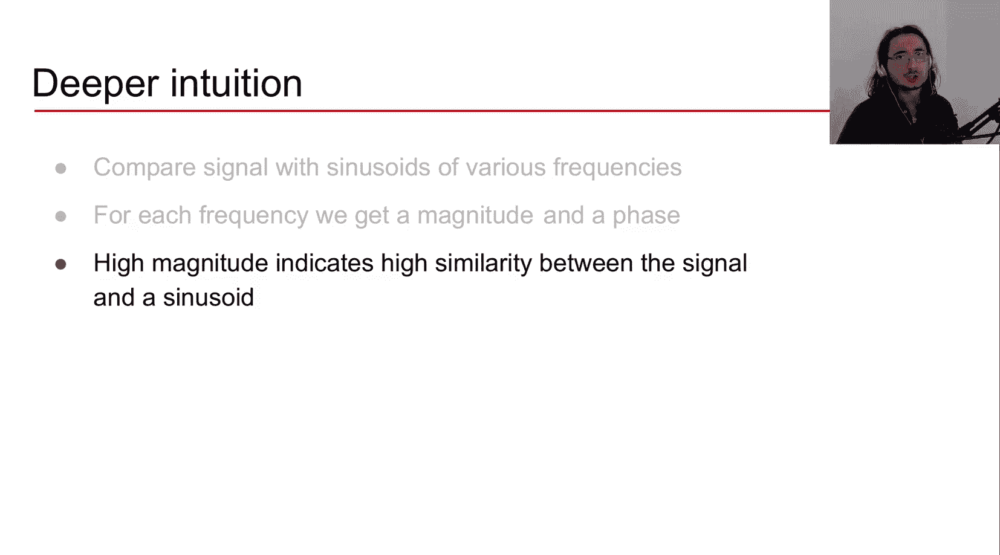

然后我们应用傅里叶变换，经过一番“魔法”，我们得到了同一个声音在频域中的表示，即对声音进行频率分析。此时，X轴代表频率。频谱中的尖峰意味着该特定赫兹处的频率是原始声音的重要组成部分。

那么，我们是如何做到这一点的呢？这就是今天视频要探讨的核心问题。

## 深入理解傅里叶变换的过程

现在，让我们进一步深入，更好地理解傅里叶变换内部发生了什么。

当我们应用傅里叶变换时，我们进行了一系列操作。

以下是其核心步骤的概述：
1.  **比较信号与正弦波**：我们将原始信号与一系列不同频率的正弦波进行比较。
2.  **计算幅度和相位**：通过比较，我们得到两个关键值：幅度和相位。
3.  **幅度表示相似度**：幅度告诉我们原始信号与特定频率的正弦波有多么相似。幅度越高，相似度越高。
4.  **相位表示对齐**：相位则告诉我们正弦波在时间上的偏移量，我们稍后会详细讨论。

为了具体化这些直觉，让我们通过一些代码和可视化来观察这个过程。

## 代码演示：观察傅里叶变换

我们将分析一个C5音符的钢琴声。首先，我们加载音频文件并绘制其时域波形。

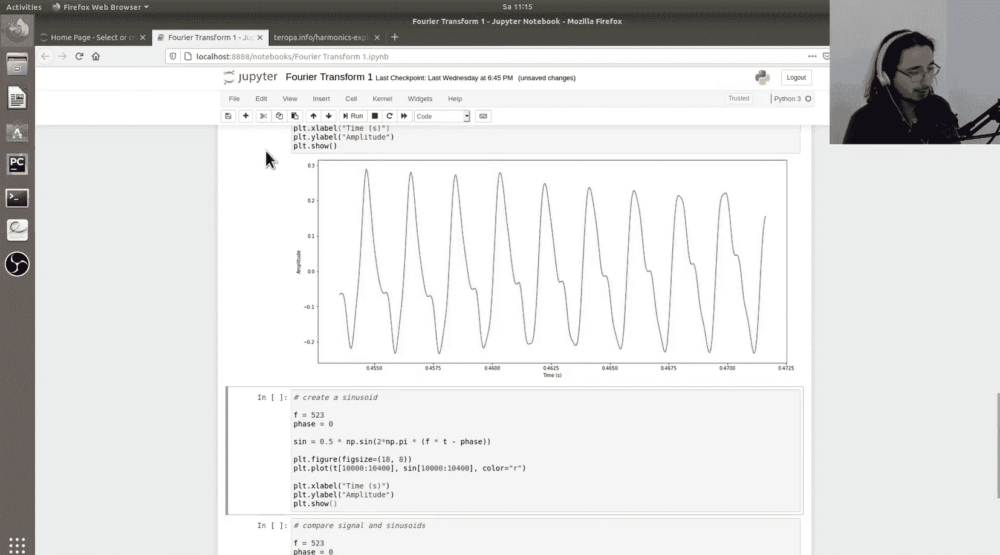

如上图所示，我们在时域中看到了声音的波形，X轴是时间，Y轴是振幅。声音在约1.4秒处结束。

接下来是关键步骤：使用SciPy库中的`fft`函数计算傅里叶变换。我们取结果的绝对值来获得幅度谱，并对应地设置频率轴（从0 Hz到采样率）。然后绘制频谱图。

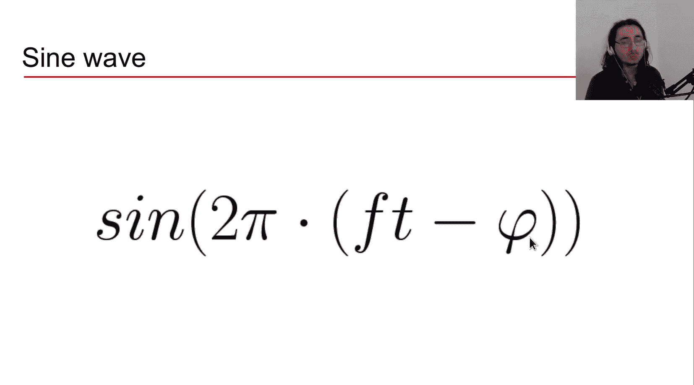

在频谱中，我们可以看到在523 Hz附近有一个明显的峰值，这正好是C5音符的基频。此外，在1040 Hz、1560 Hz和2080 Hz附近还有几个较小的尖峰，这些是基频的谐波（泛音），分别是基频的2倍、3倍和4倍。这个轮廓是谐波声音的典型特征。

## 可视化比较：信号与正弦波

为了理解傅里叶变换如何工作，我们需要放大波形，观察其周期，并将其与正弦波进行比较。

我们首先创建一个频率为523 Hz（基频）的正弦波，其相位初始设为0。正弦波的公式为：
`s(t) = sin(2π * f * t - p)`
其中 `f` 是频率，`t` 是时间，`p` 是相位。

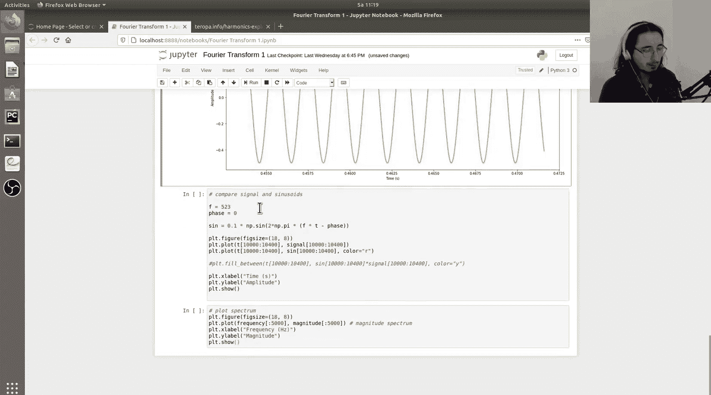

上图展示了原始信号（蓝色）和初始正弦波（红色）。可以看到它们的频率相似，但并未对齐。

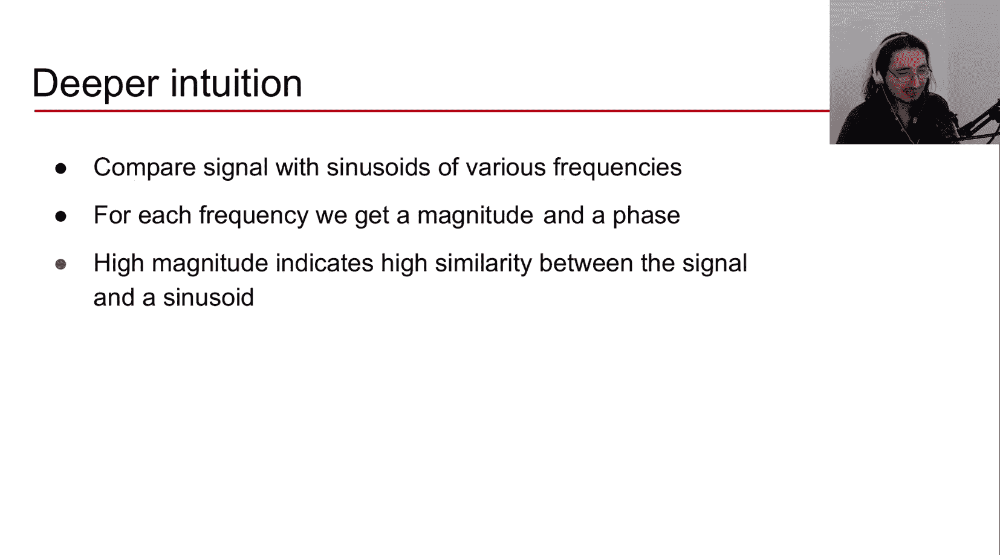

**相位的作用**：相位 `p` 控制正弦波在时间轴上的左右移动。当相位从0变化到1时，正弦波会经历一个完整的周期偏移。例如，相位为0.5时，两个正弦波完全反相（一个波峰对应另一个波谷）。

为了找到最佳对齐，我们调整正弦波的相位。通过尝试，我们发现当相位约为0.555时，正弦波与原始信号对齐得非常好。

## 计算相似度：点乘与面积

如何量化两个信号的相似度？一个直观简单的方法是：将两个信号逐点相乘（点乘），然后计算乘积曲线下的**净面积**（正面积减去负面积）。

我们将对齐后的正弦波与原始信号相乘，得到黄色曲线。

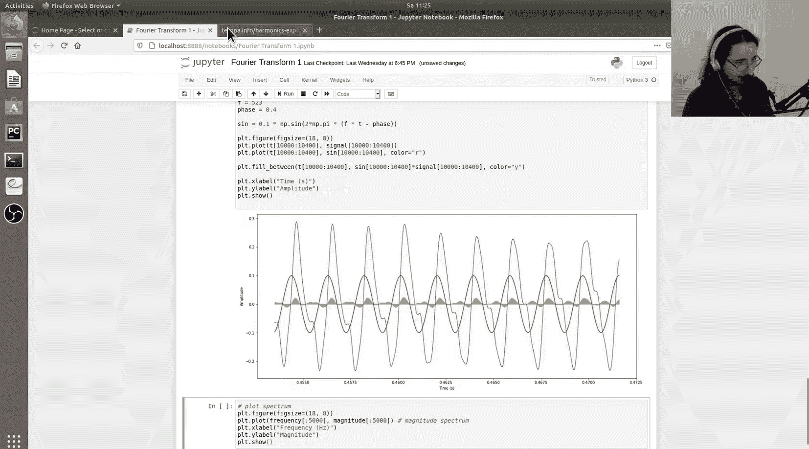

**直觉**：当两个信号同号（都为正或都为负）时，乘积为正，贡献正面积；当它们异号时，乘积为负，贡献负面积。净面积越大，说明两个信号在形状和相位上越相似。

如果我们改变相位（例如回到0），乘积曲线下几乎全是负面积，净面积很小，表明相似度很低。

因此，对于**一个给定频率**，傅里叶变换的核心步骤可以总结为：
1.  选择该频率并生成一个正弦波。
2.  优化相位，使得该正弦波与原始信号点乘后的净面积最大。
3.  这个最大的净面积就是该频率对应的**幅度**（相似度度量）。

## 扩展到所有频率

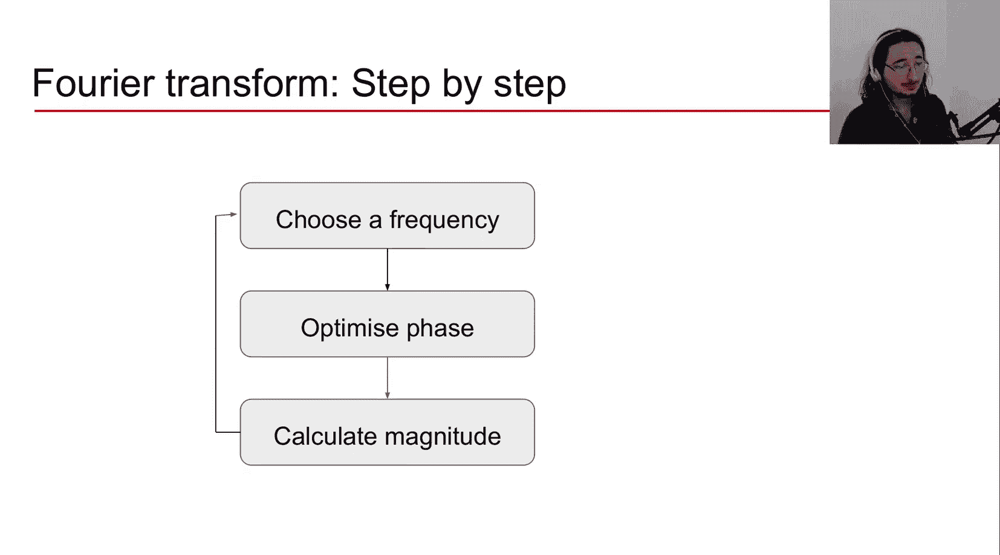

傅里叶变换不仅仅对一个频率进行上述操作，而是对**所有可能的频率**（在实数范围内）重复这一过程。

对于每一个频率，我们都找到使其与原始信号最匹配的相位，并计算最大相似度（幅度）。最终，我们将所有频率及其对应的幅度绘制出来，就得到了频谱图。频谱中的高峰就对应了原始信号中能量最强的频率成分。

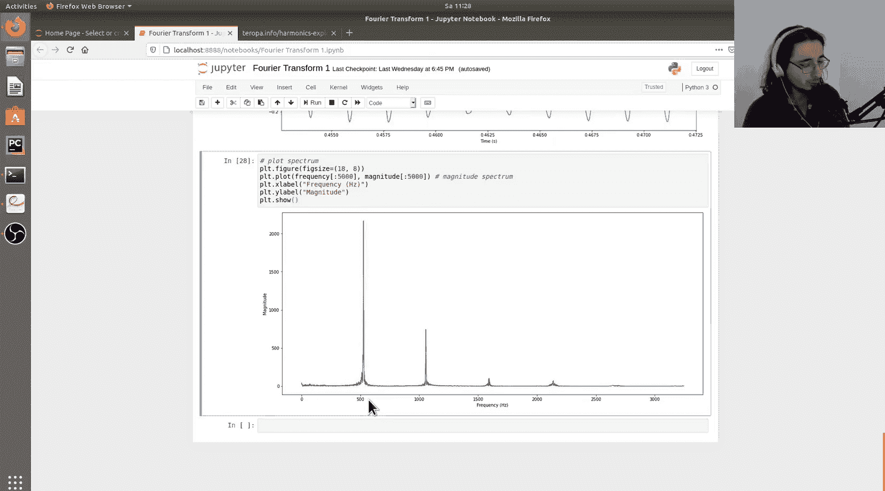

回到我们的频谱图，523 Hz处的峰值正反映了我们之前观察到的现象：频率为523 Hz的正弦波与原始信号具有很高的相似性。

## 数学形式化

上述直觉可以用数学公式进行形式化描述。对于连续信号，我们寻找对于给定频率 `f` 的最优相位 `φ`，以最大化点乘的积分（净面积）。

寻找最优相位的公式可以表示为：
`φ_opt(f) = argmax_{φ ∈ [0,1)} ∫ s(t) * sin(2πft - φ) dt`
其中 `s(t)` 是原始信号，积分计算的是点乘后的净面积，`argmax` 表示寻找使该积分最大的 `φ` 值。

一旦找到最优相位 `φ_opt(f)`，该频率的幅度 `M(f)` 就可以通过将最优相位代入来计算：
`M(f) = ∫ s(t) * sin(2πft - φ_opt(f)) dt`

这本质上是将我们手动调整相位、计算面积的过程用数学语言表达了出来。需要注意的是，这里使用的是连续时间信号的积分表示。在实际的数字信号处理中，我们处理的是离散采样信号，使用的是离散傅里叶变换，其数学形式会有所不同，但核心思想一致。

## 逆傅里叶变换：从频域回到时域

我们不仅可以从时域变换到频域，还可以反过来，从频域重建时域信号。这个过程称为**逆傅里叶变换**。

其思想是：将我们从原始信号中提取出的所有频率的正弦波，按照它们各自的幅度（作为权重）和相位叠加（相加）起来，就能重构出原始信号。

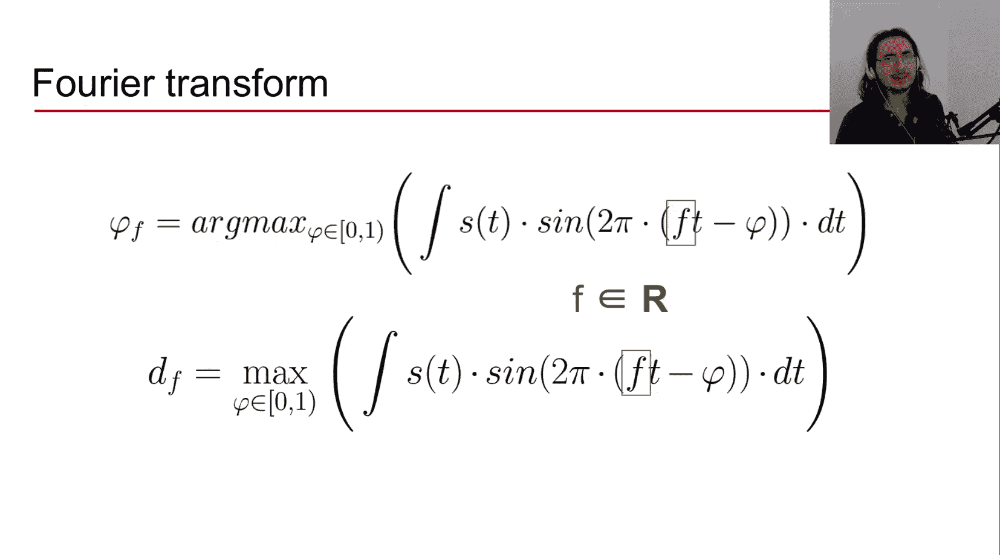

这意味着时域信号和其傅里叶变换（频域表示）包含完全相同的信息，我们可以在两者之间自由转换。这类似于加法合成，在合成器中，通过叠加不同频率、幅度和相位的正弦波来创造复杂的声音。

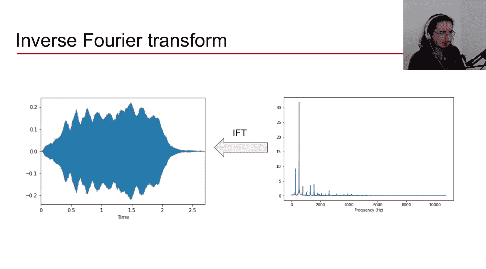

下图展示了一个加法合成器的例子，通过激活基频（C4， 261 Hz）及其谐波（C5， 523 Hz 等），可以合成出丰富的音色。

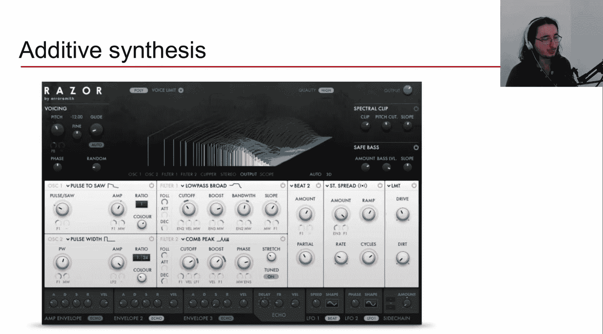

## 总结与展望

本节课中我们一起学习了傅里叶变换的直观理解。我们通过棱镜的类比引入了频率分解的概念，详细讲解了傅里叶变换通过将信号与不同频率的正弦波进行比较、计算相似度（幅度）和相位偏移来工作的过程，并通过代码可视化加深了理解。我们还简要了解了其数学形式以及逆变换的可能性。

傅里叶变换是音频和信号处理的基石。为了深入其数学原理和实现，我们需要先掌握另一个重要工具：**复数**。复数可以非常优雅地表示我们刚才讨论的幅度和相位。在接下来的视频中，我们将学习复数，为最终攻克傅里叶变换的数学核心做好准备。

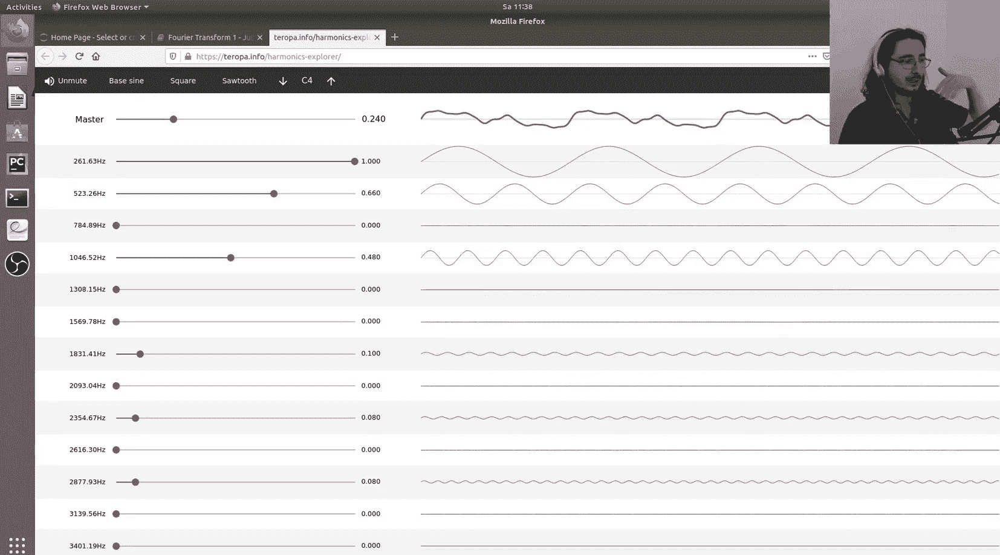

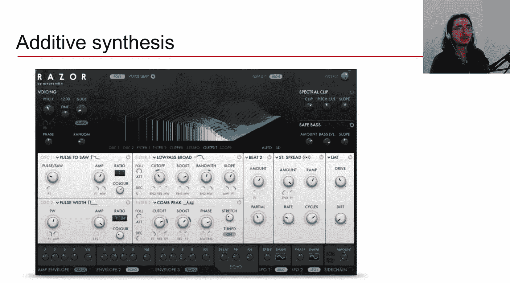

