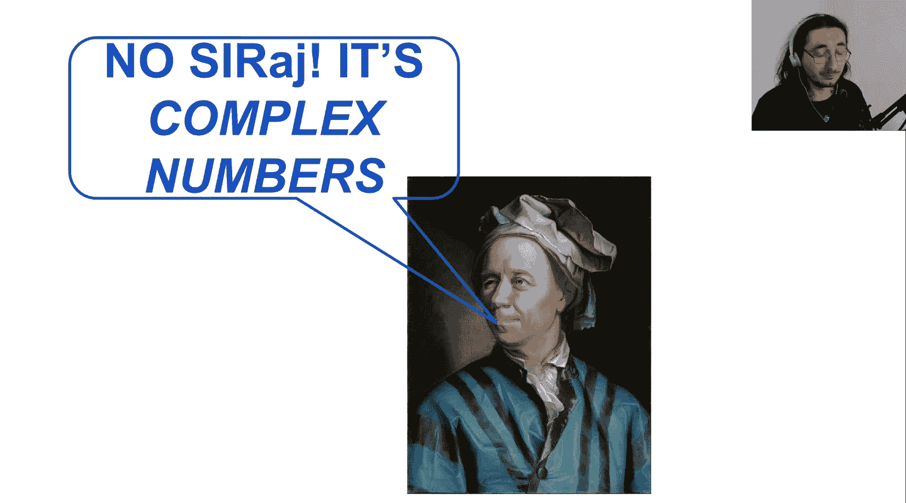
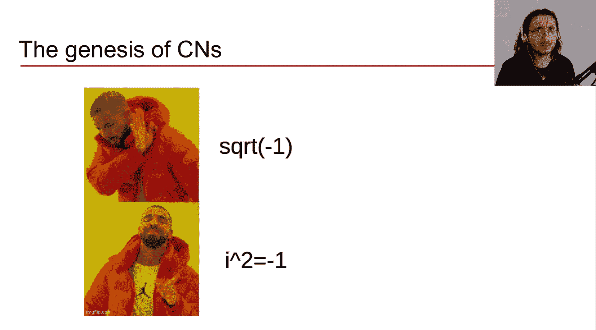
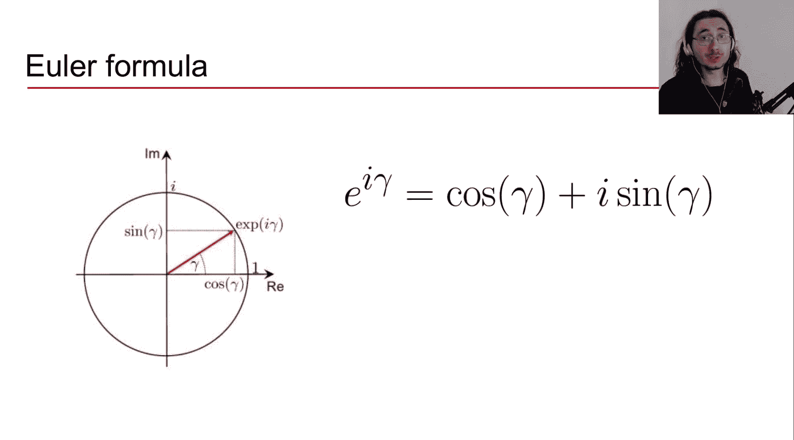
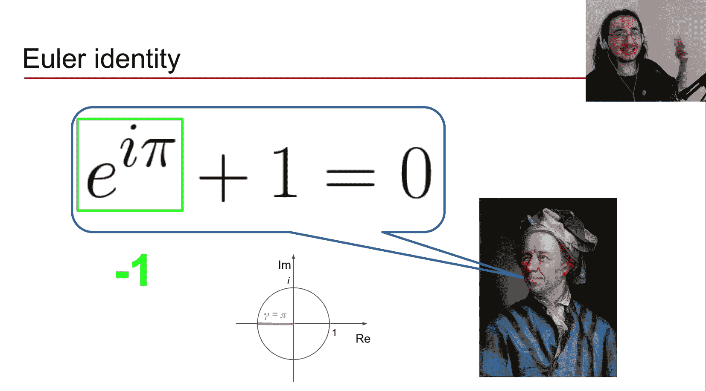
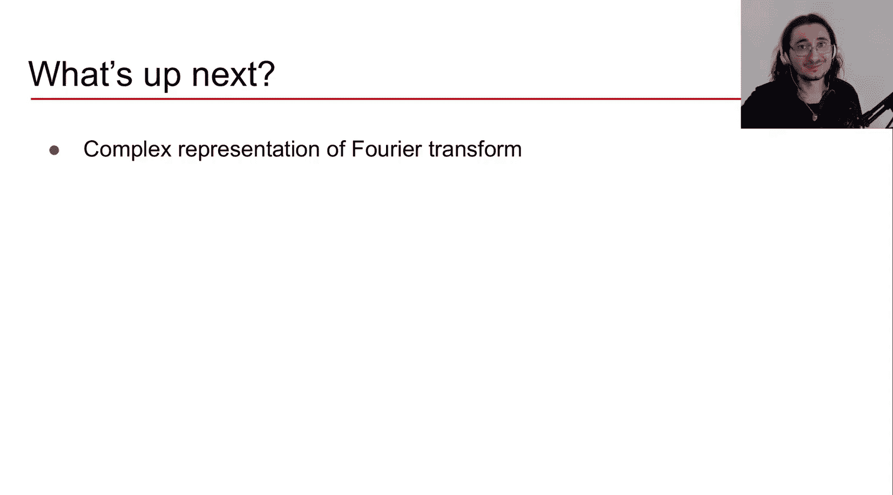

#  011：音频信号处理中的复数

在本章中，我们将学习复数的基本概念。这些知识对于深入理解傅里叶变换至关重要。我们将探讨复数的起源、表示方法及其与音频信号处理的联系。

上一节我们介绍了傅里叶变换的直观理解，并提到需要复数知识才能更进一步。本节中，我们将深入探讨复数的核心概念。

## 为什么需要复数？🤔




在处理傅里叶变换时，每个纯音频率分量会得到两个参数：**幅度**和**相位**。幅度是实数。如果只关心幅度谱，则无需复数。但如果想完整理解傅里叶变换并处理相位信息，就需要一种能同时处理这两个参数的数学工具。复数正是这样的工具。

## 复数的起源

长期以来，数学家们被一个简单问题所困扰：**负数的平方根**。在实数范围内，无法求解如 `√(-1)` 这样的问题。为此，数学家引入了**虚数单位 i**，其定义为：
```
i² = -1
```
这使得处理负数的平方根成为可能。虽然这看起来像是“编造”的，但复数在信号处理等领域被广泛应用，是真实有效的数学工具。



## 复数的定义与表示

一个复数 `C` 通常定义为：
```
C = a + i * b
```
其中 `a` 和 `b` 都是实数。`a` 称为**实部**，`b` 称为**虚部**。

为了可视化复数，我们使用**复平面**。复平面的横轴（x轴）是实轴，纵轴（y轴）是虚轴。复数 `a + i*b` 可以表示为复平面上的一个点，其坐标为 `(a, b)`。

例如，复数 `3 + 2i` 对应点 `(3, 2)`；复数 `-1 + 4i` 对应点 `(-1, 4)`。

## 复数的极坐标表示

在音频信号处理中，**极坐标表示法**更为方便。它将复数表示为距离和角度，这与傅里叶变换中的幅度和相位概念直接对应。

从笛卡尔坐标 `(a, b)` 转换到极坐标需要两个参数：
1.  **模（绝对值） |C|**：复数到原点的距离。
2.  **辐角 γ**：正实轴与连接原点和复数的线段之间的夹角。

以下是计算这两个参数的公式。

**计算模 |C|：**
根据勾股定理，在复平面上，`a` 和 `b` 构成直角三角形的两条直角边，`|C|` 是斜边。因此：
```
|C| = √(a² + b²)
```

**计算辐角 γ：**
利用三角函数关系：
```
cos(γ) = a / |C|
sin(γ) = b / |C|
```
两式相除可得：
```
tan(γ) = sin(γ) / cos(γ) = b / a
```
因此，辐角 γ 可以通过反正切函数求得：
```
γ = arctan(b / a)
```

得到模和辐角后，我们可以将复数用极坐标形式重新表示。利用三角恒等式 `a = |C| * cos(γ)` 和 `b = |C| * sin(γ)`，代入复数定义：
```
C = a + i*b = |C| * cos(γ) + i * |C| * sin(γ) = |C| * [cos(γ) + i * sin(γ)]
```
这就是复数的极坐标形式。

## 欧拉公式与复指数表示

欧拉公式建立了复指数与三角函数的美妙联系：
```
e^(i * γ) = cos(γ) + i * sin(γ)
```
其中 `e` 是自然对数的底数。这个公式意味着，`e^(i * γ)` 在复平面上代表**单位圆**（半径为1的圆）上的一个点。随着角度 `γ` 增加，这个点沿单位圆逆时针移动。



利用欧拉公式，我们可以将复数的极坐标形式写得极其简洁：
```
C = |C| * e^(i * γ)
```
这个表示法非常强大：`|C|` 决定了复数的“长度”（距离原点的远近），而 `e^(i * γ)` 决定了它的“方向”（在复平面上的角度）。

**一个著名的特例：欧拉恒等式**
当 `γ = π` 时，代入欧拉公式：
```
e^(i * π) = cos(π) + i * sin(π) = -1 + i * 0 = -1
```
由此得到被誉为“数学中最优美公式”的欧拉恒等式：
```
e^(i * π) + 1 = 0
```
它巧妙地将数学中五个最重要的常数（`e`, `i`, `π`, `1`, `0`）联系在了一起。



## 可视化复数的两个组成部分

理解公式 `C = |C| * e^(i * γ)` 的直观含义非常重要：
*   **指数部分 `e^(i * γ)`**：它像一个**方向指针**，指向单位圆上的某个角度 `γ`。它决定了复数在复平面上的朝向。
*   **模 `|C|`**：它像一个**缩放因子**，将单位圆上的点拉近或推远原点。如果 `|C| > 1`，则点被推向圆外；如果 `|C| < 1`，则点被拉向圆内。

这种理解方式将抽象的公式转化为清晰的几何图像。

## 复数与傅里叶变换的联系🔗

现在，我们可以清晰地看到复数表示法与傅里叶变换参数之间的对应关系：
*   复数的**模 `|C|`** 直接对应傅里叶变换中纯音分量的**幅度（Magnitude）**。
*   复数的**辐角 `γ`** 直接对应傅里叶变换中纯音分量的**相位（Phase）**。

因此，复数 `C = |C| * e^(i * γ)` 以一种紧凑而优雅的方式，同时封装了音频信号中某个频率成分的**强度**和**时间偏移**信息。这为我们在复数域中理解和操作傅里叶变换奠定了坚实的基础。

## 总结



本节课中我们一起学习了复数的核心知识。我们了解了复数因解决负数开方问题而被引入，并掌握了其两种主要表示法：笛卡尔坐标形式 `a + i*b` 和极坐标形式 `|C| * e^(i * γ)`。我们推导了两种形式间的转换公式，并借助欧拉公式得到了极其简洁的复指数表示。最重要的是，我们建立了复数与傅里叶变换参数（幅度和相位）之间的直观联系，这将是后续深入理解傅里叶变换复数形式的钥匙。