#  012：用复数定义傅里叶变换 🎵

在本节课中，我们将学习如何使用复数来定义傅里叶变换。我们将看到，这种表示方法非常紧凑和优雅，它将傅里叶变换输出的幅度和相位两个参数，巧妙地编码进一个复数中。

上一节我们介绍了复数，并提到它将用于定义音频信号处理的许多方面。本节中，我们将在此基础上，使用复数来定义傅里叶变换。

## 回顾：傅里叶变换的参数与复数表示

首先，我们回顾一下之前介绍过的几个关键公式和概念。

以下是傅里叶变换中提取相位和幅度的公式：

**相位公式**：
`φ = arctan2(b, a)`

**幅度公式**：
`M = sqrt(a² + b²)`

这些公式在介绍傅里叶变换直观理解的视频中已经详细讲解过。在高层次上，相位和幅度是当我们用傅里叶变换分解一个复杂声音时，为每个频率提取的两个参数。幅度告诉我们原始信号中有多少该频率的成分。

接下来，我们回顾复数的极坐标表示法：

**复数极坐标公式**：
`c = |c| * e^(iγ)`

其中 `i` 是虚数单位，`|c|` 是复数的模（绝对值），`γ` 是角度。这是用指数形式表示的复数极坐标定义。

## 核心思想：将傅里叶系数编码为复数

现在，让我们进入正题。用复数定义傅里叶变换的直观思想是：每次应用傅里叶变换，我们为每个频率得到一对参数（幅度和相位）。我们可以将这对参数作为极坐标，来定义一个复数。换句话说，我们可以将这两个系数编码进一个复数中。

让我们看看这在数学上是如何实现的。

我们从之前提到的数学公式开始。我们有相位 `φ` 和幅度 `M`，以及复数的极坐标定义。

那么，我们如何得到傅里叶变换系数呢？公式如下：

**复数傅里叶变换系数公式**：
`C_f = (M / sqrt(2)) * e^(-i * 2πφ)`

这个复数被称为**复数傅里叶变换系数**。我们为分解原始信号得到的每个频率都有一个这样的系数。

仔细观察这个公式，我们可以将这个复数系数映射到复数的极坐标表示上：
*   复数的模 `|C_f|` 对应 `M / sqrt(2)`。这里的 `sqrt(2)` 是由于归一化原因，它是一个常数因子。
*   复数的角度 `γ` 对应 `-2πφ`。其中的负号 `-` 意味着当相位 `φ` 增加时，我们在复平面上**顺时针**旋转。

## 可视化：复平面上的傅里叶系数

现在，让我们回到复数傅里叶系数的可视化表示。

这个系数 `C_f` 不过是复平面上的一个点。在复平面中，水平轴是复数的实部，垂直轴是复数的虚部。

`C_f` 这个点具有以下几何意义：
*   该点到原点的距离由系数的模 `|C_f|` 给出，即 `M / sqrt(2)`。
*   该点与原点连线和正实轴之间的夹角是 `γ`，即 `-2πφ`。由于相位 `φ` 介于 0 和 1 之间，我们无法画出整个圆。

## 傅里叶变换的数学定义与视觉解读

现在，我想展示如何实际得到傅里叶变换，以及其数学定义。为此，我们从连续音频信号开始。

我们的连续音频信号是 `g(t)`。这是一个函数，输入一个实数（时间），输出另一个实数（振幅或强度）。这是一个波形。

这与复数傅里叶变换形成鲜明对比。复数傅里叶变换我们用 `ĝ(f)` 表示。它的输出是我们几分钟前看到的系数，即傅里叶变换系数。我们为每个频率都有一个这样的复数。

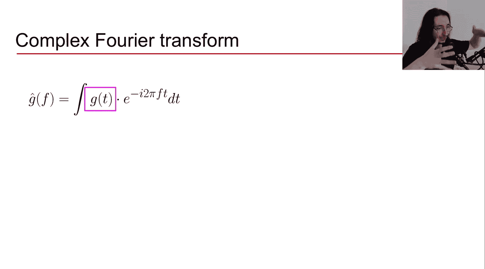

这个函数 `ĝ(f)` 有所不同：它输入一个实数（频率，单位赫兹），但输出一个复数，即傅里叶变换系数。

在复平面上看，对于频率 `f1`，复数傅里叶变换的输出可以可视化为复平面上的一个点。这非常有趣，你现在可能开始理解为什么我们使用复数表示傅里叶变换了。它的伟大之处在于，傅里叶变换产生两个不同的参数（幅度和相位），我们可以将它们打包成一个方便的工具——复数，并轻松地在复平面上可视化。

但你可能会问，我们如何从数学上得到这个系数 `C_f` 呢？

让我们再次从之前视频中看过的原始公式开始。我们有幅度和相位从傅里叶变换中产生的公式，以及复数傅里叶变换的定义。

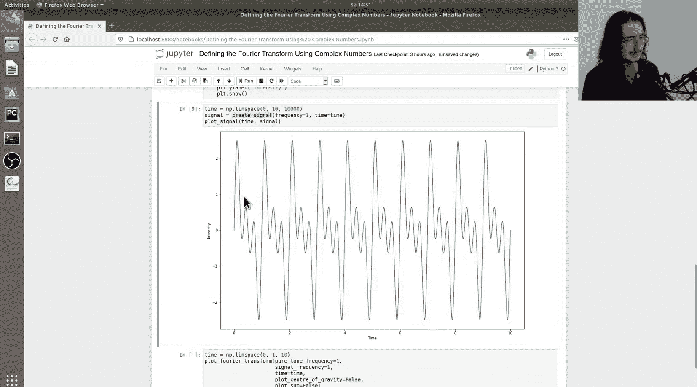

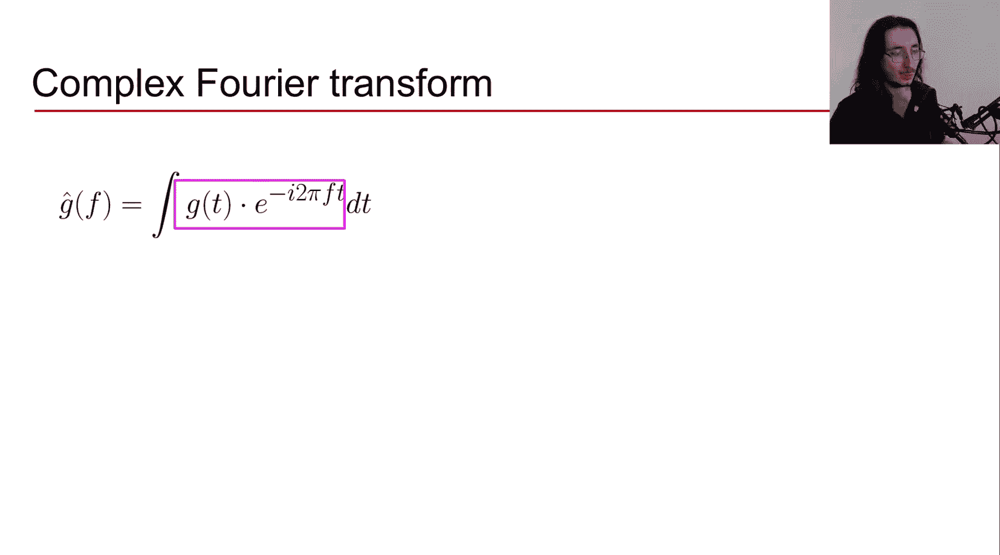

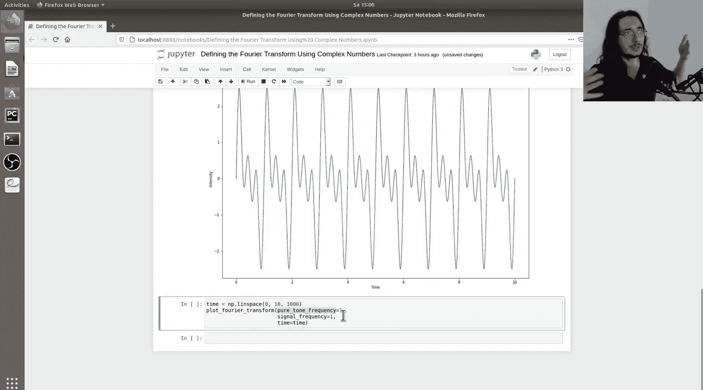

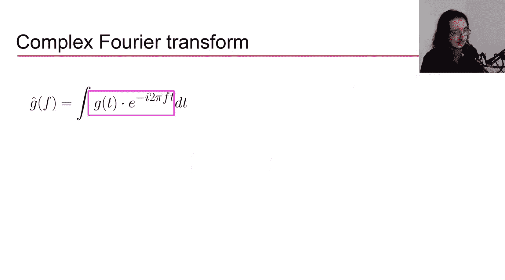

我知道下面这个积分公式看起来有点吓人，但请耐心听我解释，因为我们将查看它的视觉解读，你会发现它其实很容易理解。

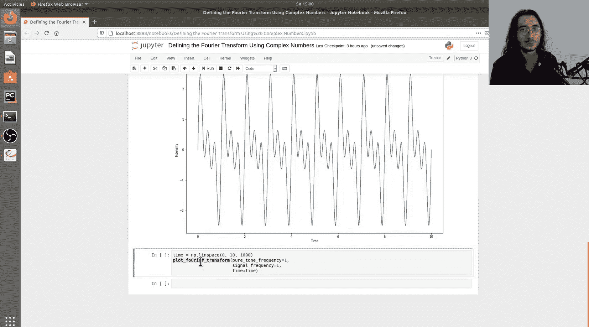

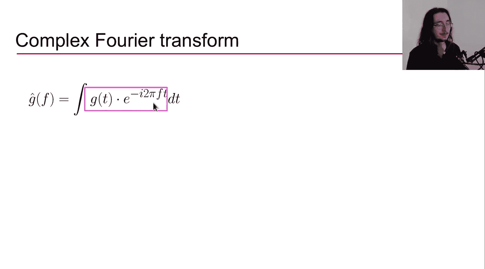

**复数傅里叶变换积分公式**：
`ĝ(f) = ∫ g(t) * e^(-i*2πft) dt`

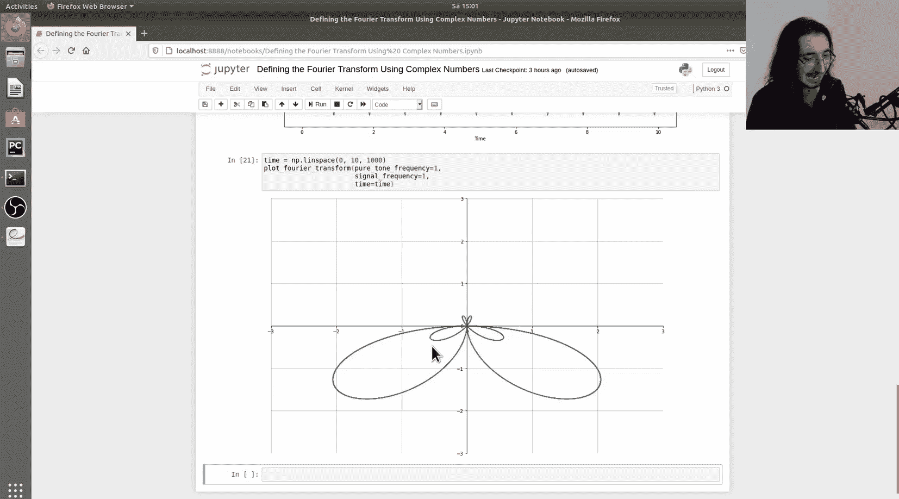

如前所述，`ĝ(f)` 在特定频率 `f` 的输出不过是复平面上的一个复数，即我们的傅里叶变换系数。但我们如何从这个包含指数和复数的“怪兽”积分中得到它呢？

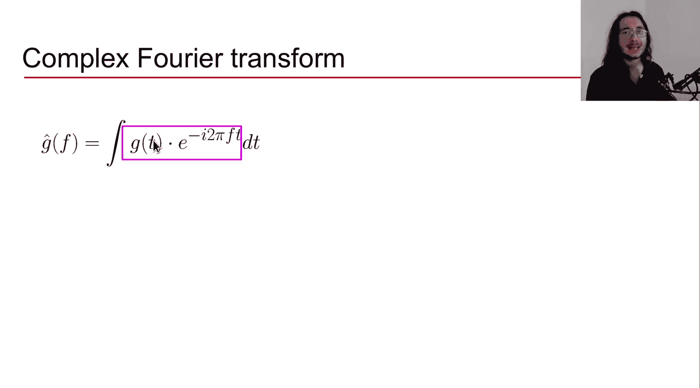

首先，我们来看看这个公式的不同部分。

第一部分是指数项 `e^(-i*2πft)`。这个指数在复平面上描绘单位圆。随着 `t` 增加，我们沿着整个单位圆移动。由于负号 `-` 的存在，我们是**顺时针**描绘这个圆。需要记住的另一点是，我们完成一个圆的速度取决于频率值 `f`。例如，如果 `f = 1 Hz`，则需要 1 秒完成一个整圆；如果 `f = 2 Hz`，则只需 0.5 秒（因为周期 `T = 1/f`）。这本质上就是用复数表示正弦波（纯音），我们将用它来分解原始信号。

第二部分是我们的信号 `g(t)`。为了展示视觉解读，我创建了一个自定义信号（由基频及其二次、三次谐波的正弦波叠加而成），并在 Jupyter Notebook 中进行了绘制。

第三部分是信号 `g(t)` 与纯音 `e^(-i*2πft)` 的乘法。这在视觉上是什么样子呢？

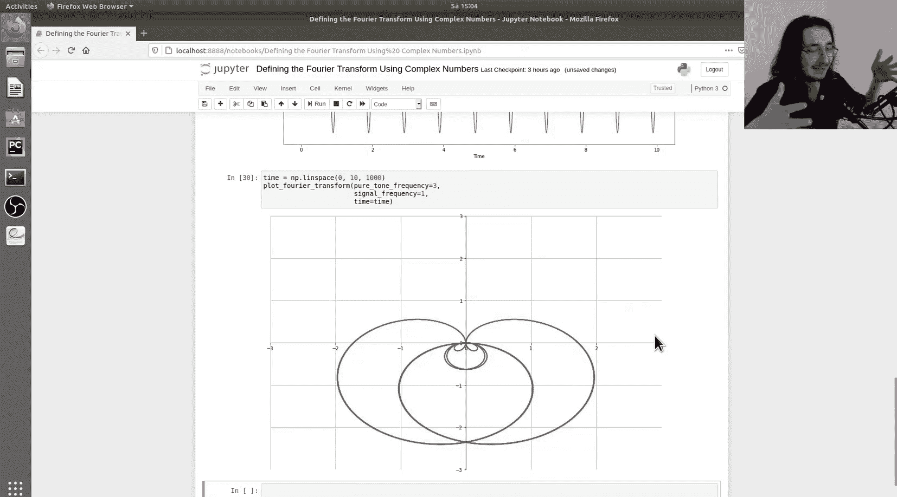

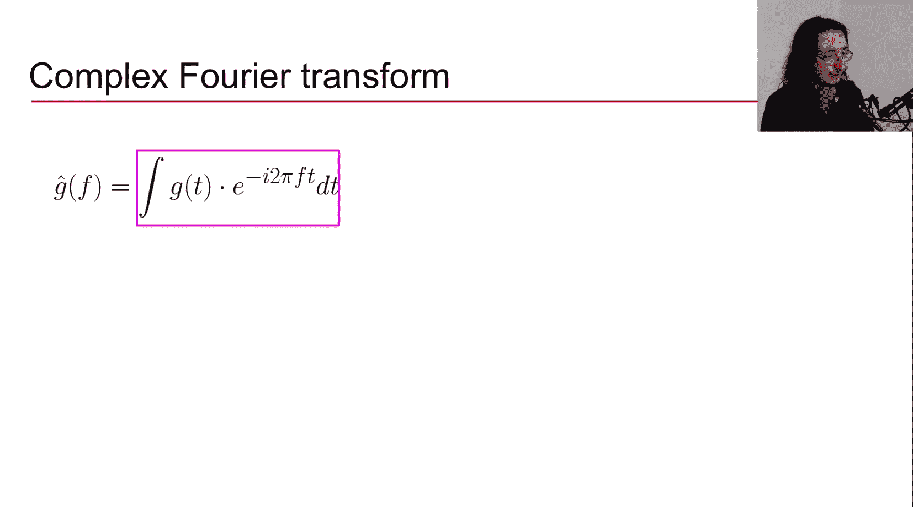

当我们绘制这个乘法结果时，我们看到一个形状出现在复平面上。**正在发生的是，我们通过将原始信号乘以一个纯音，将原始信号“缠绕”在了复平面上。** 这非常酷。

如果我稍微改变纯音频率，比如从 1 Hz 改为 1.1 Hz，输出形状会发生巨大变化。为了理解这一点，我们需要查看时域。如果我们只观察 1 秒内的数据，会看到一个形状；在下一秒，会绘制另一个形状。继续下去，直到 10 秒，我们基本上旋转了一整圈。

另一个有趣的现象是，如果我用频率 2 Hz 或 3 Hz（这些频率存在于原始信号中）的纯音去分解，会得到相当稳定的形状。但如果用 3.1 Hz（不存在于信号中），又会得到那种混乱的形状。直观上，这意味着**每当原始声音中存在的频率成分被用来分解时，我们就会得到一个更稳定的输出**。

## 理解积分：求“重心”与求和

现在我们有了信号与纯音相乘的视觉解读。但这个积分呢？它看起来像什么？

直观上，积分所做的是：取所有不同的点（不同时间点对应的复数）并**对它们求和**。在物理系统中，这类似于求该系统的**重心**（即所有点的平均值）。

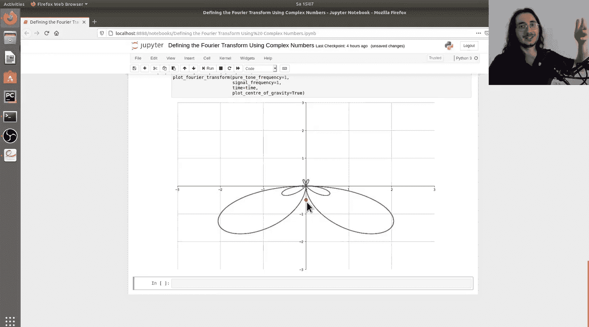

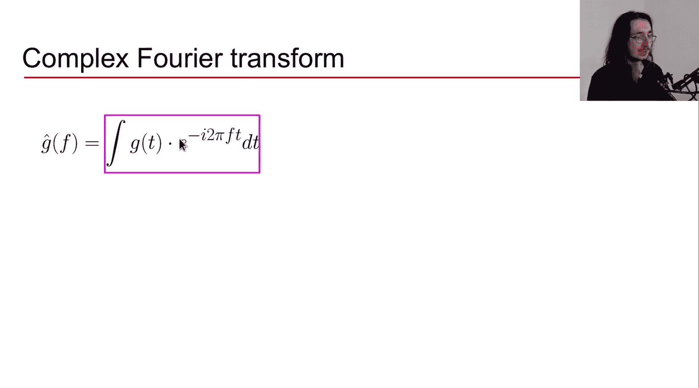

当我绘制这个重心（用红点表示）时，例如用 3 Hz 的纯音分解，重心在某个位置。用 1 Hz（基频）分解，重心也在某个位置。但如果用 1.1 Hz 分解，重心就在原点。这并不意外，因为图形完全对称，所有点相互抵消，平均值为 0。

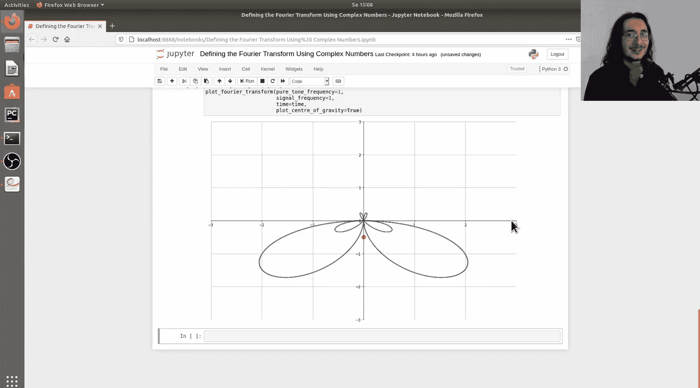

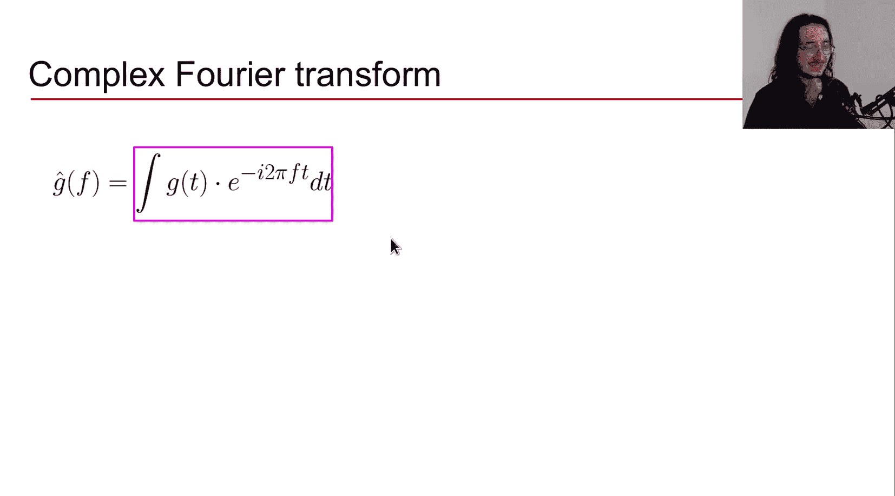

这与我们对傅里叶变换的直观理解产生了共鸣：**当原始信号中存在某个频率成分时，其幅度不为零；当处理的频率成分不存在时，幅度为零。**

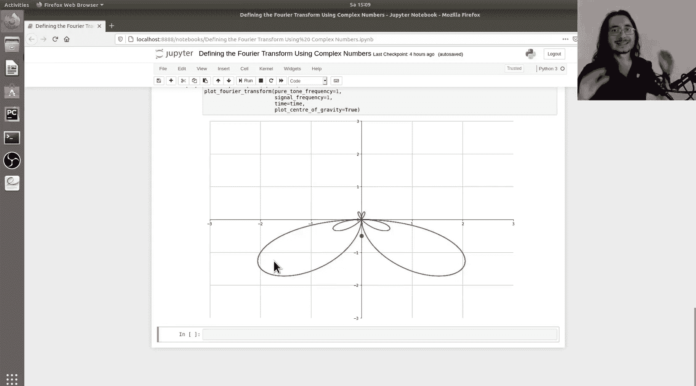

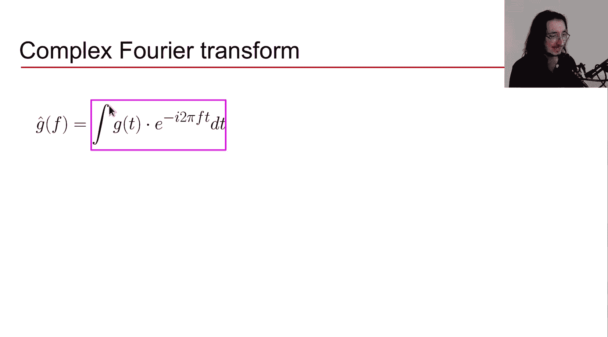

现在，关键点来了：我们可以将复数傅里叶变换系数看作是复平面上的这个点（重心）。但这里我有点“作弊”，因为我们并不是在求平均值，而是在**求和**。积分告诉我们对所有值求和。

那么，如果我绘制所有这些点的和（用绿点表示），会发生什么？例如，在 1000 个时间步长下，和可能是一个很大的数（如 -500）。如果只取 100 步，和大约是 -50。你能看出这与重心的联系吗？重心大约在虚轴 -0.5 的位置。和（-50）大约是重心（-0.5）乘以步数（100）的结果。所以，概念上，我们取重心，然后乘以所考虑的时间步数。

对于 1.1 Hz 的情况，由于图形对称，所有点相互抵消，和就在原点。**这就是我们如何在原始声音中实际存在的频率上得到那些尖峰的方法。**

现在，你应该对如何得到傅里叶变换系数有了视觉上的理解：
1.  我们从一个信号开始。
2.  通过将信号乘以一个纯音，将信号缠绕在复平面上。
3.  然后，我们对每个时间步的结果求和。

但你可能会问，为什么这里用积分符号 `∫`，而不是求和符号 `∑`？这取决于我们使用的是连续表示。如果我们考虑的时间步长无限多（即连续时间），那么求和就变成了积分。

## 幅度、相位与逆傅里叶变换

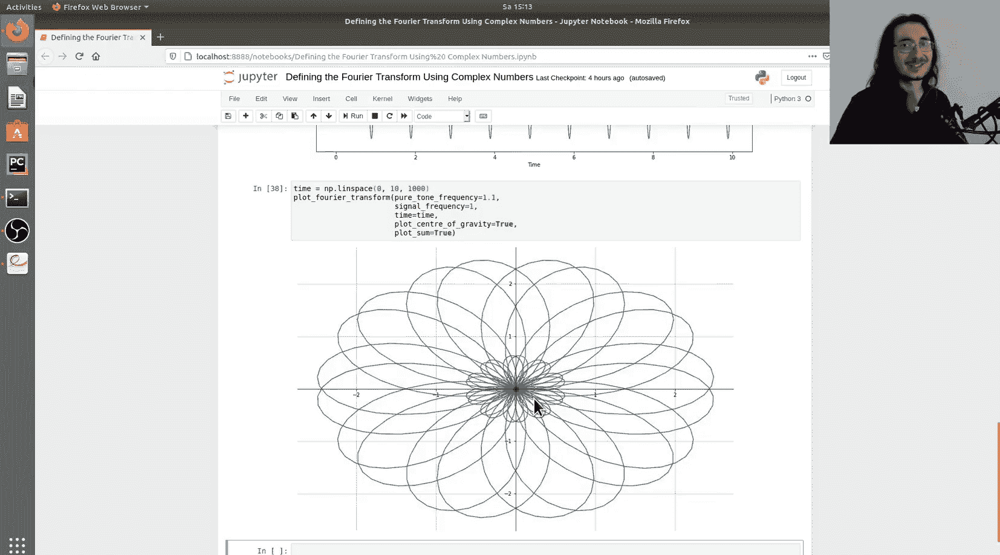

回到复系数 `C_f` 的定义，我们可以写出其实部和虚部：

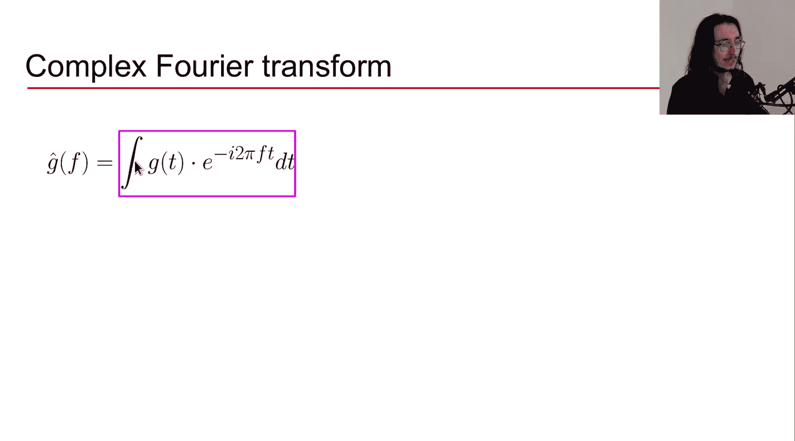

`ĝ(f) = a + bi`

我们可以取傅里叶变换的幅度，即取该函数的绝对值：

`|ĝ(f)|`

并且我们知道，`|ĝ(f)|` 等于 `M / sqrt(2)`。同样，`sqrt(2)` 是归一化常数。

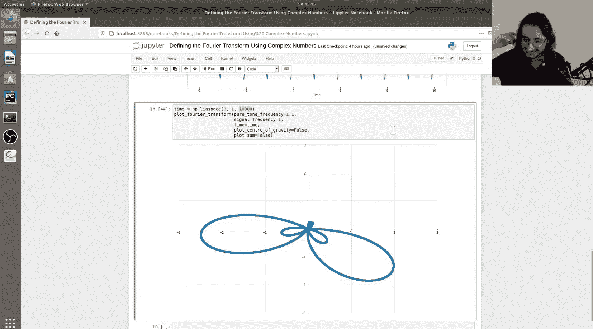

对于相位 `φ`，我们可以通过取 `ĝ(f)` 的角度 `γ` 来定义：

`φ = -γ / (2π)`

现在，你已经对傅里叶变换有了很好的深入理解。你知道幅度和相位是什么，如何将它们编码成一个称为傅里叶变换系数的复数，也知道了获取傅里叶变换的数学公式，并且理解了其视觉解读。

还缺少什么呢？缺少的是**逆傅里叶变换**。我们在之前的视频中已经见过，可以从频域回到时域。逆傅里叶变换的数学表示如下：

**逆傅里叶变换公式**：
`g(t) = ∫ ĝ(f) * e^(i*2πft) df`

高层次上的直观理解是：我们取所有不同的频率成分，用幅度对它们进行加权，加上相位，然后把它们全部加起来，从而重建原始信号 `g(t)`。关键在于，原始信号和它的傅里叶变换包含相同的数据，我们可以在两者之间任意转换而不丢失任何信息。

让我们快速看一下视觉解读：
1.  `e^(i*2πft)` 是频率为 `f` 的纯音（正弦波）。
2.  我们将复数傅里叶变换系数 `ĝ(f)` 乘以这个纯音。这实际上是用幅度对纯音进行加权，并加上相位，从而得到一个可能具有不同相位和振幅的新信号。
3.  最后，我们积分（即求和）。这里不是对时间积分，而是对频率积分。换句话说，我们将所有加权的正弦波相加，得到原始声音。

## 傅里叶变换的“往返之旅”

现在，我们准备好看看傅里叶变换的“往返之旅”了。

**傅里叶变换**：
`ĝ(f) = ∫ g(t) * e^(-i*2πft) dt`

**逆傅里叶变换**：
`g(t) = ∫ ĝ(f) * e^(i*2πft) df`

它们基本上是同一个函数，唯一真正的区别是：在傅里叶变换中，我们对时间积分；在逆傅里叶变换中，我们对频率积分。这非常优美。所有的复杂性都被一个非常直接和极简的公式优雅地捕捉到了，并且在时域和频域之间来回转换的想法也非常美妙。

我希望你现在能理解为什么我们要不厌其烦地引入复数，因为通过依赖这个数学构造，我们现在有了傅里叶变换及其逆变换的超级紧凑的定义。

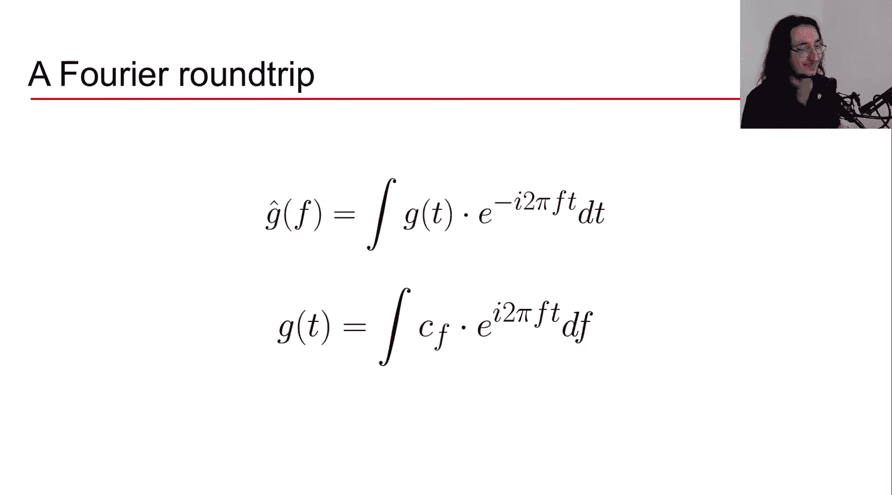

## 总结与展望

本节课内容很长，但我希望对你来说非常值得。现在，我们终于破解了将复杂声音分解成频率成分以及反向合成的“魔法”。我们了解了傅里叶变换。

然而，我们还有一个问题。到目前为止，我们处理傅里叶变换的所有理论都是在连续数学的框架内，即我们假设处理的是模拟或连续信号。但在现实中，当我们实际应用傅里叶变换时，我们处理的是数字信号、离散信号。我们从模拟信号开始，然后对其进行采样和数字化。

因此，关于傅里叶变换，剩下的工作就是理解如何将我们迄今为止所学的理论适应到离散世界，即我们的数字计算机世界，也是我们实际从信号中提取信息所要使用的世界。**下一次，我们将学习离散傅里叶变换。**

这就是今天的全部内容。我知道信息量很大，但希望你觉得值得。现在你应该对傅里叶变换有了非常深入的理解。如果你有任何问题，欢迎在下方评论区留言。我们下次再见！