#  013：离散傅里叶变换详解 🎵

在本节课中，我们将要学习连续傅里叶变换如何演变为其离散版本——离散傅里叶变换。我们将理解为何需要这种转变，以及如何通过数学调整来处理数字信号。课程将涵盖从连续到离散的转换过程、DFT的最终公式、其可视化解释以及一个关键的高效计算算法。

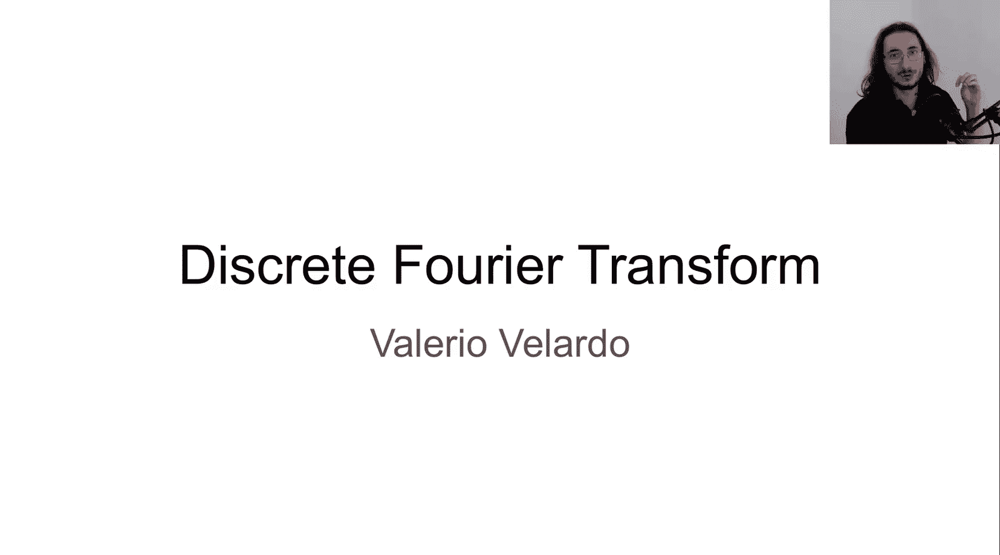

---

## 从连续到离散的转变

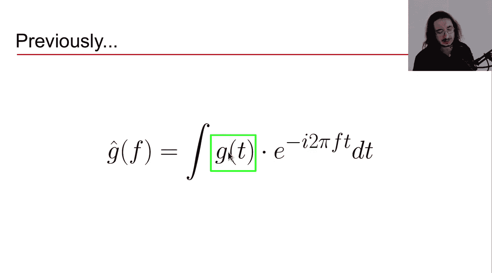

上一节我们介绍了使用复数表达的连续傅里叶变换。本节中我们来看看如何处理数字世界中的离散信号。

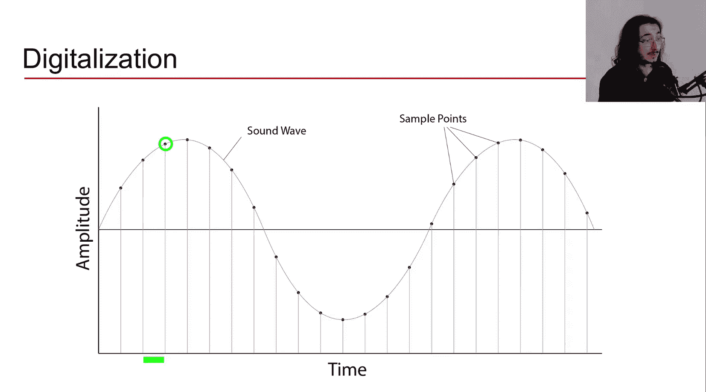

连续傅里叶变换公式适用于时间上连续的模拟信号。然而，在实际应用中，我们处理的是由计算机等数字设备处理的离散信号。

从连续信号 `G(t)` 转换到离散信号 `x[n]` 的过程称为**数字化**。这包括**采样**和**量化**。采样是指在特定时间点（采样点）记录信号的值，采样周期 `T` 定义了采样点之间的时间间隔。

离散信号 `x[n]` 表示在第 `n` 个采样点获取的值，其对应的实际时间为 `t = n * T`。

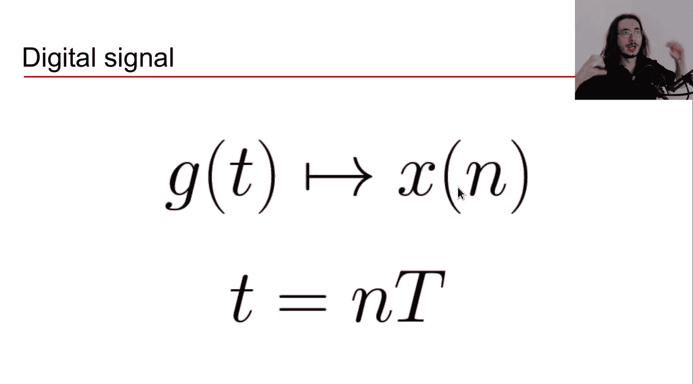

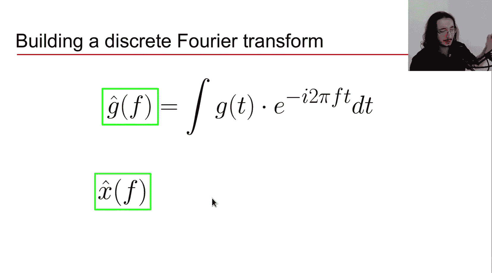

## 构建离散傅里叶变换

现在，让我们尝试从连续傅里叶变换出发，构建离散傅里叶变换。我们将看到公式中的每个元素如何映射到其离散对应物。

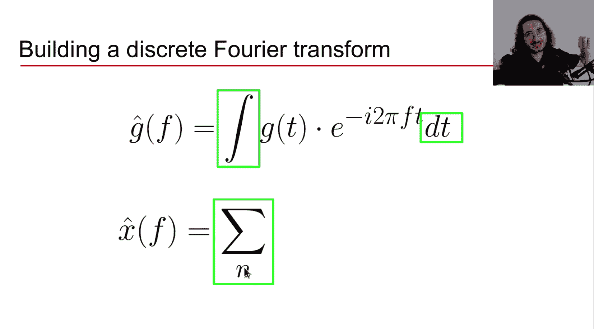

我们从傅里叶变换的定义开始。在连续情况下，我们称之为 `Ĝ(f)`；在离散情况下，我们称之为 `x̂(f)`，以表明我们处理的是样本。

以下是核心元素的转变：

1.  **积分变为求和**：连续时间意味着无限的时间点，因此使用积分。离散情况下，我们只有有限的样本点，因此使用求和符号 `Σ`，对样本索引 `n` 进行求和。
2.  **连续时间 `t` 变为离散索引 `n`**：在复指数项中，我们用离散的样本索引 `n` 替换连续时间变量 `t`。

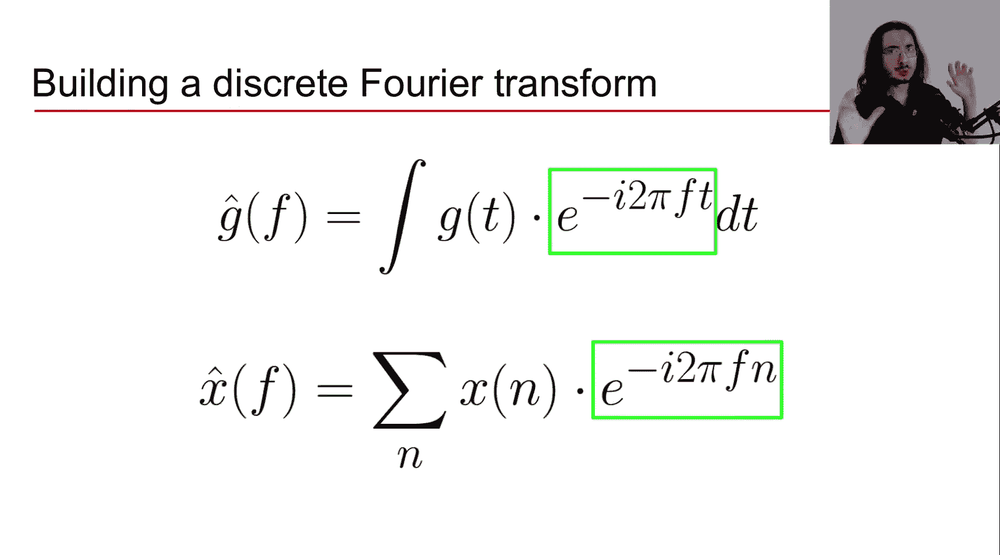

由此，我们得到离散傅里叶变换的初步版本：

`x̂(f) = Σ (x[n] * e^(-i2πfn))` （对所有 `n` 求和）

## DFT的可视化解释

为了直观理解DFT，我们可以参考其可视化解释。

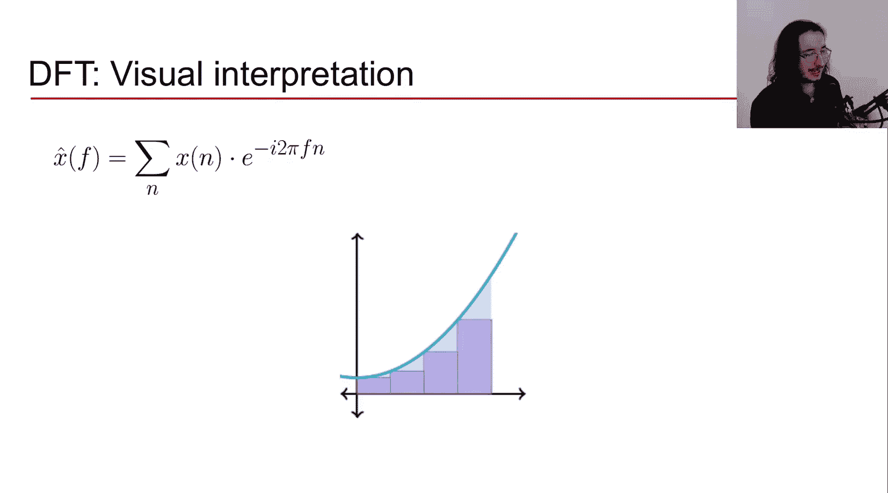

在连续傅里叶变换中，我们计算信号曲线下的面积。在离散版本中，我们近似这个面积。我们将每个样本点视为一个矩形的顶部，矩形的宽度由采样周期决定。DFT的结果近似于所有这些矩形面积的总和，它代表了原始连续信号下面积的离散近似。

采样周期越小（采样率越高），矩形数量越多，近似误差就越小。

## 完善DFT公式：解决两个问题

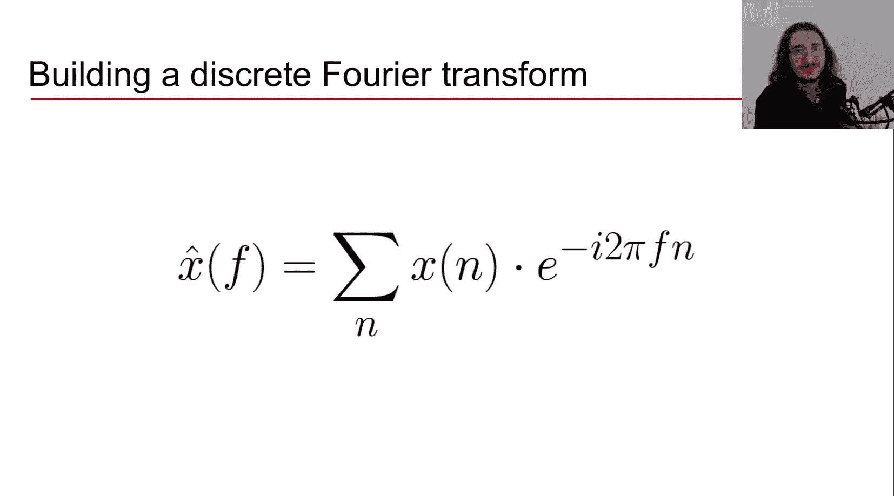

我们初步的DFT公式仍存在两个问题，使其无法直接用于数字计算。

以下是这两个问题及其解决方案：

1.  **问题一：无限数量的样本**：理论上，傅里叶变换需要对无限时间（即无限样本）进行积分。
    *   **解决方案（技巧一）**：我们只考虑信号在**有限时间区间**内的样本。例如，对于一首3分钟的歌曲，我们只分析这3分钟内的样本。这假设该时间段包含了我们所需的所有频率信息。因此，求和限制在有限的 `N` 个样本上。
2.  **问题二：连续的频率**：频率 `f` 在理论上是连续变量，意味着有无限多个频率分量。
    *   **解决方案（技巧二）**：我们只计算**有限个频率点**上的变换。一个巧妙且高效的做法是：**考虑的频率数量 `M` 等于信号样本的数量 `N`**，即 `M = N`。这样做有两个主要原因：一是保证了从时域到频域再通过逆变换返回时域的完整“往返”能力；二是计算上更高效。

应用这两个技巧后，我们得到了最终广泛使用的离散傅里叶变换公式。

## 离散傅里叶变换的最终公式

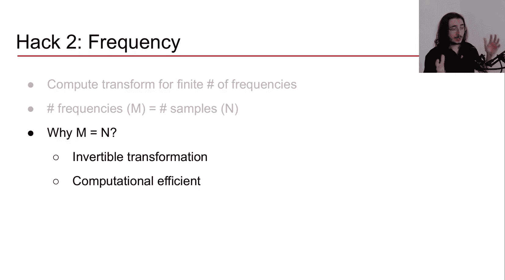

应用上述调整后，我们得到离散傅里叶变换的标准定义：

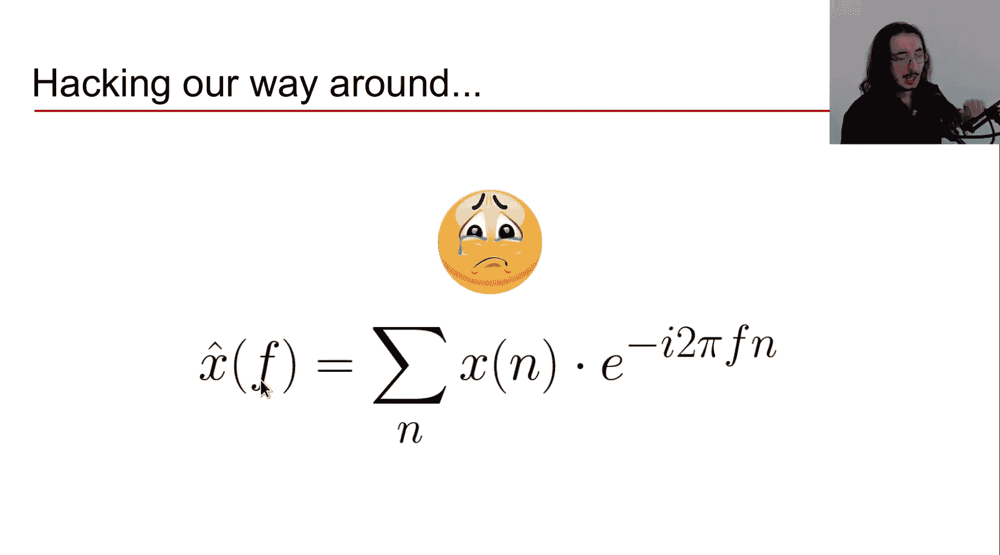

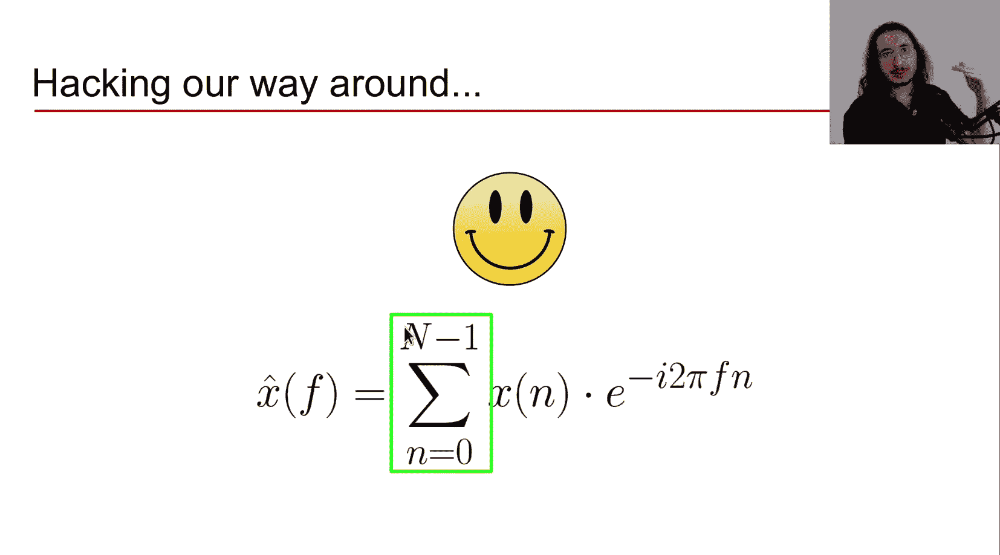

`X[k] = Σ (x[n] * e^(-i2πkn/N))` （对 `n=0` 到 `N-1` 求和）

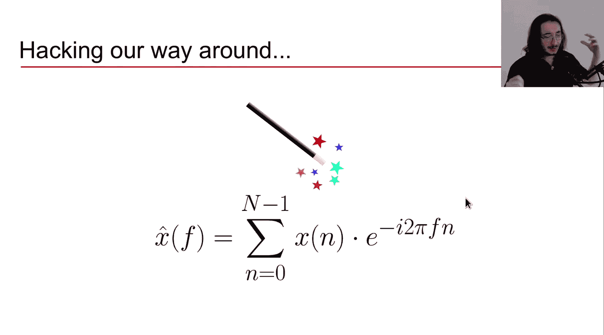

其中：
*   `N` 是信号的总样本数。
*   `n` 是当前样本的索引（从0到N-1）。
*   `k` 是当前频率分量的索引（从0到N-1）。
*   `X[k]` 是第 `k` 个频率分量的复数傅里叶系数。

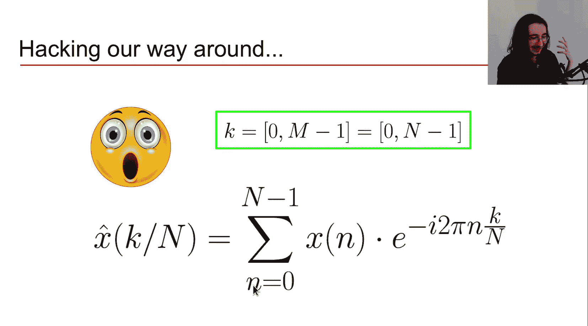

这里，我们用 `k/N` 替代了连续的频率 `f`。`k` 的取值范围是 `0` 到 `N-1`，对应着 `N` 个离散的频率点。

第 `k` 个索引对应的实际频率（以赫兹Hz为单位）由以下公式给出：

`频率 = k / (N * T) = k * Fs / N`

其中 `T` 是采样周期，`Fs` 是采样率（`Fs = 1/T`）。

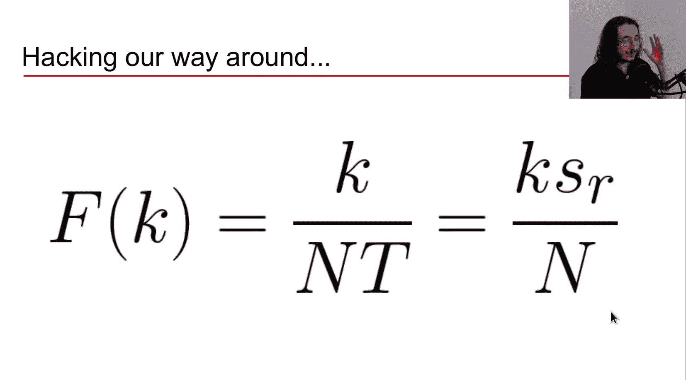

这意味着DFT输出的频率范围是从 `0 Hz`（当 `k=0`）到**采样率 `Fs`**（当 `k=N` 时，但实际 `k` 最大为 `N-1`，接近 `Fs`）。这个范围被均匀地划分为 `N` 个点。

## DFT幅度谱与奈奎斯特频率

DFT的输出 `X[k]` 是复数，包含每个频率分量的幅度和相位信息。对于音频分析，**幅度谱**尤为重要，它显示了每个频率在信号中的强度。

观察DFT的幅度谱时，会发现一个有趣现象：频谱在频率 `Fs/2` 处呈现**对称性**。`Fs/2` 这个频率称为**奈奎斯特频率**。

*   频率轴从 `0` 到 `Fs`。
*   从 `0` 到 `Fs/2` 的部分是“真实”的频率信息。
*   从 `Fs/2` 到 `Fs` 的部分是前半部分的镜像复制，是冗余的。

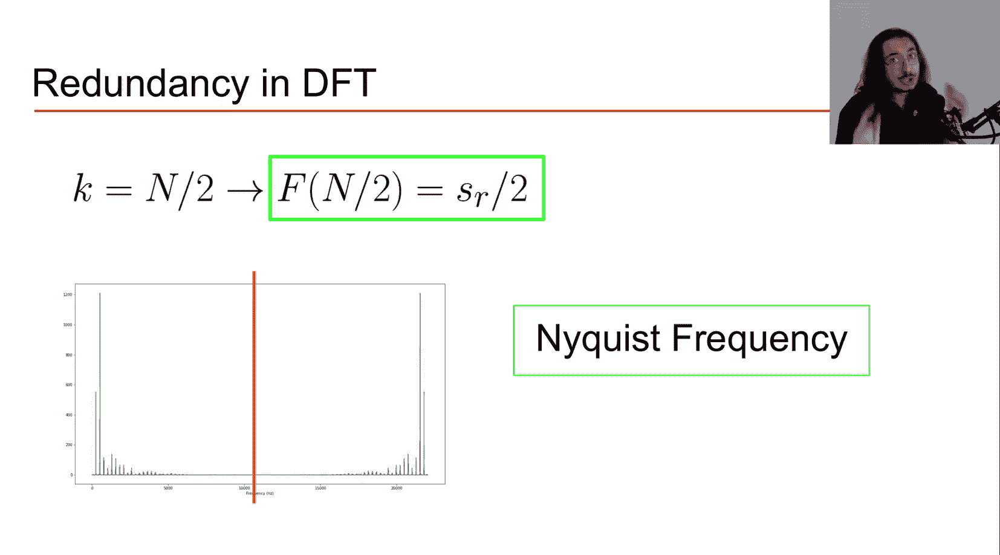

因此，在分析时，我们通常只关心从 `0` 到 `Fs/2` 的频率范围。奈奎斯特频率是数字系统能够无失真重建的最高频率，高于此频率会发生**混叠**现象。

## 快速傅里叶变换

直接计算DFT需要进行大约 `N²` 次运算，当样本数 `N` 很大时计算量非常昂贵。

**快速傅里叶变换** 是一种高效计算DFT的算法。它通过利用正弦和余弦计算中的**对称性和周期性冗余**，显著减少了运算量。

FFT将计算复杂度从 `O(N²)` 降低到 `O(N log₂ N)`。为了充分发挥FFT的效率，通常要求样本数 `N` 是**2的幂**（如256, 512, 1024等）。现代所有的傅里叶变换实现（如在NumPy、SciPy或音频处理软件中）都使用FFT算法。

---

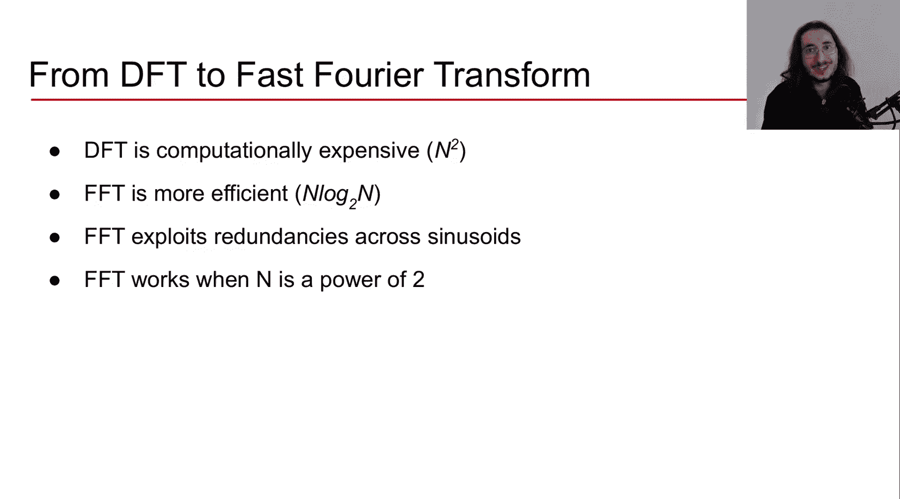

本节课中我们一起学习了离散傅里叶变换。我们从连续傅里叶变换出发，理解了为何及如何将其调整为处理离散数字信号的版本。我们探讨了DFT的构建过程、最终公式、其输出的频率含义、幅度谱的对称性（奈奎斯特频率的关键作用），以及用于高效计算的快速傅里叶变换算法。下一节，我们将暂时抛开理论，进行实际编程，从声音中提取幅度谱并分析其语义含义。