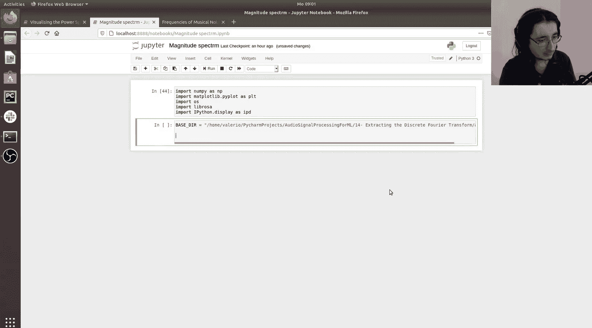
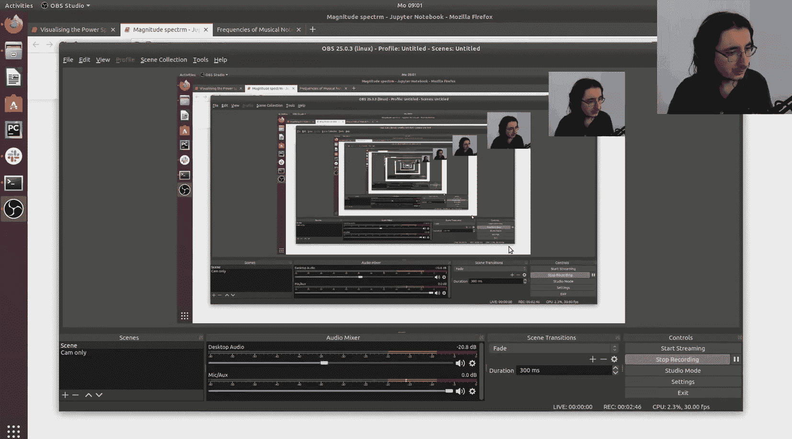
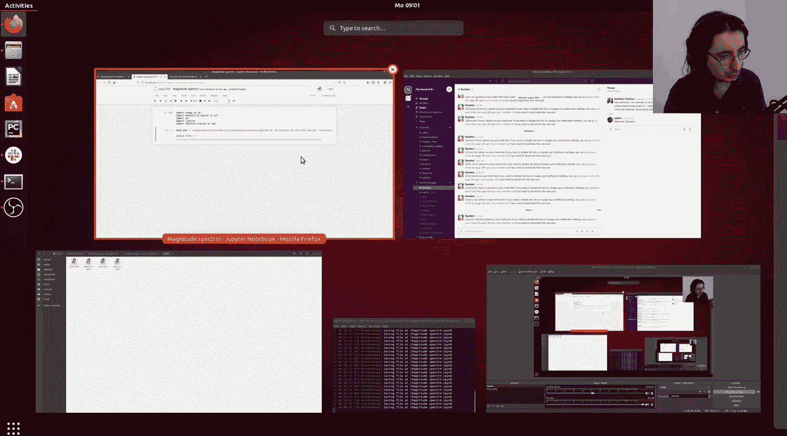
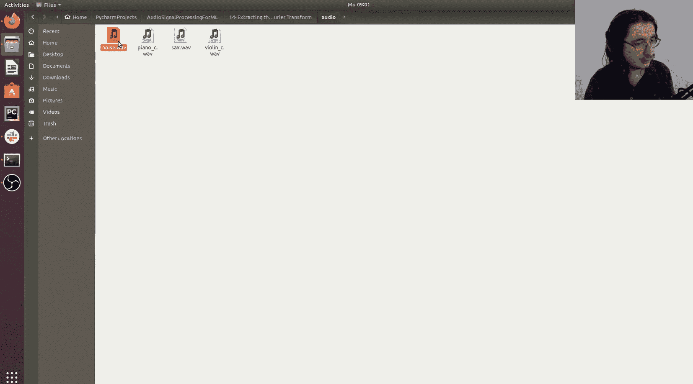
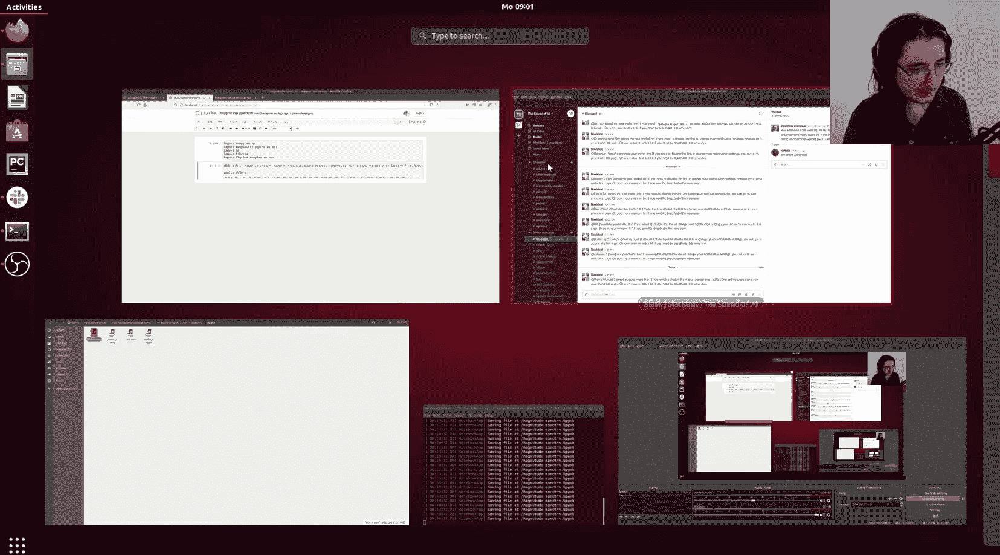
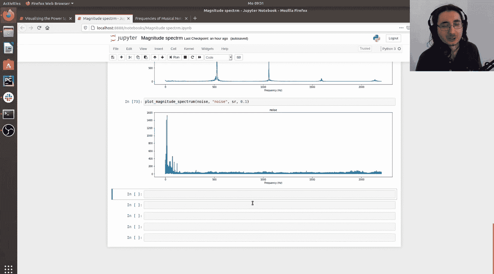

#  014：使用Python提取傅里叶变换 🎵

## 概述
在本节课中，我们将学习如何使用Python提取音频信号的傅里叶变换系数，并绘制其幅度谱。我们将通过对比不同乐器演奏同一音符的频谱，来初步理解音色差异的成因。

上一节我们介绍了离散傅里叶变换和快速傅里叶变换的理论基础。本节中，我们将动手实践，使用Python代码来实现这些概念。

## 准备工作
首先，我们需要导入必要的Python库。









以下是所需的库及其用途：
*   `numpy`：用于数值计算，特别是执行快速傅里叶变换。
*   `matplotlib.pyplot`：用于绘制频谱图。
*   `librosa`：用于加载音频文件。
*   `IPython.display`：用于在Jupyter笔记本中直接播放音频。



```python
import numpy as np
import matplotlib.pyplot as plt
import librosa
import IPython.display as ipd
```

接下来，我们定义音频文件所在的目录路径，并加载四个音频文件：小提琴、萨克斯、钢琴演奏的C音，以及一段噪声。

```python
base_dir = ‘/home/valerio/pycharm_projects/audio_processing_for_ML/14/audio/‘
violin_file = ‘violin_C4.wav‘
sax_file = ‘sax_C4.wav‘
piano_file = ‘piano_C5.wav‘
noise_file = ‘noise.wav‘
```

现在，我们可以在笔记本中直接播放这些音频片段，以便了解它们的声音。

```python
ipd.Audio(base_dir + violin_file)
ipd.Audio(base_dir + sax_file)
ipd.Audio(base_dir + piano_file)
ipd.Audio(base_dir + noise_file)
```

## 加载音频数据
为了进行信号处理，我们需要将音频文件加载为NumPy数组。我们将使用`librosa.load`函数，它会返回音频波形数据及其采样率。

```python
violin_C4, sr = librosa.load(base_dir + violin_file)
sax_C4, _ = librosa.load(base_dir + sax_file)
piano_C5, _ = librosa.load(base_dir + piano_file)
noise, _ = librosa.load(base_dir + noise_file)
```

加载后，我们可以查看小提琴信号的形状，它代表时域中的样本数量。

```python
print(violin_C4.shape)
```

## 提取傅里叶变换系数
现在，我们使用NumPy的`fft.fft`函数来计算信号的快速傅里叶变换。这将把信号从时域转换到频域。

```python
violin_ft = np.fft.fft(violin_C4)
```

变换后得到的数组与原始信号具有相同的长度，每个元素对应一个频率仓。每个元素都是一个复数，包含该频率分量的幅度和相位信息。

```python
print(violin_ft[0]) # 查看第一个频率仓的复数系数
```

## 计算幅度谱
在音频AI应用中，我们通常更关心频率的幅度而非相位。因此，我们通过取复数系数的绝对值来获得幅度谱。

```python
violin_magnitude_spectrum = np.abs(violin_ft)
```

此时，幅度谱中的值变为实数，代表了每个频率分量的能量大小。

```python
print(violin_magnitude_spectrum[0]) # 查看第一个频率仓的幅度
```

## 可视化幅度谱
为了直观比较不同声音的频谱，我们创建一个函数来绘制幅度谱。

以下是`plot_magnitude_spectrum`函数的关键步骤：
1.  计算信号的傅里叶变换。
2.  计算幅度谱。
3.  生成对应的频率轴（0 Hz 到采样率）。
4.  使用`matplotlib`绘制频率与幅度的关系图。

```python
def plot_magnitude_spectrum(signal, title, sample_rate, freq_ratio=1):
    ft = np.fft.fft(signal)
    magnitude_spectrum = np.abs(ft)
    
    frequency = np.linspace(0, sample_rate, len(magnitude_spectrum))
    num_freq_bins = int(len(frequency) * freq_ratio)
    
    plt.figure(figsize=(10, 5))
    plt.plot(frequency[:num_freq_bins], magnitude_spectrum[:num_freq_bins])
    plt.xlabel(‘Frequency (Hz)‘)
    plt.title(title)
    plt.show()
```

参数`freq_ratio`允许我们只查看频谱的一部分。例如，设置为0.5表示只显示到奈奎斯特频率（采样率的一半），设置为0.1可以放大观察低频部分。

## 对比不同乐器的频谱
现在，我们使用这个函数来绘制并对比四个音频文件的幅度谱。

首先绘制小提琴演奏C4的频谱，并放大观察前10%的频率范围。

```python
plot_magnitude_spectrum(violin_C4, ‘Violin C4‘, sr, freq_ratio=0.1)
```

在频谱图中，我们可以在约260 Hz处看到一个明显的峰值，这是C4音符的基频。此外，在520 Hz（第一谐波）等处也有峰值。有趣的是，小提琴的第一谐波能量可能比基频更强。

接下来绘制萨克斯演奏C4的频谱。

```python
plot_magnitude_spectrum(sax_C4, ‘Saxophone C4‘, sr, freq_ratio=0.1)
```

小提琴和萨克斯都演奏C4，因此它们的频谱在基频和谐波位置相似。然而，各频率分量能量的相对比例不同，这正是我们感知到它们音色不同的主要原因之一。

然后绘制钢琴演奏C5的频谱。

```python
plot_magnitude_spectrum(piano_C5, ‘Piano C5‘, sr, freq_ratio=0.1)
```

钢琴演奏的是C5，其基频约为520 Hz（是C4的两倍）。钢琴的频谱特征通常是基频能量最强，谐波能量依次衰减，这与弦乐器有所不同。

最后，我们观察噪声信号的频谱。

```python
plot_magnitude_spectrum(noise, ‘Noise‘, sr, freq_ratio=0.1)
```

噪声的频谱显示，能量广泛分布在几乎所有频率仓中，没有像乐音那样清晰的峰值结构。

## 总结
本节课中我们一起学习了如何使用Python提取和可视化音频信号的傅里叶变换。我们掌握了以下核心操作：
*   使用`np.fft.fft`计算快速傅里叶变换。
*   使用`np.abs`从复数系数中获取幅度谱。
*   创建函数绘制并对比不同声音的幅度谱。

通过对比小提琴、萨克斯、钢琴和噪声的频谱，我们看到了谐波结构如何影响音色，以及噪声在频域中的能量分布特性。



需要指出的是，我们目前绘制的幅度谱是整个音频片段在时间上的平均。它丢失了频率成分随时间变化的信息。在下一节课中，我们将介绍短时傅里叶变换的理论，它将使我们能够提取随时间变化的频谱图，这将是音频AI和音乐信息检索中分析数字音频信号的主要工具。