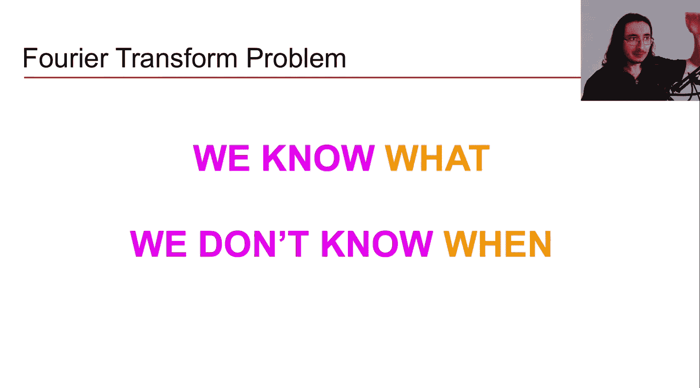
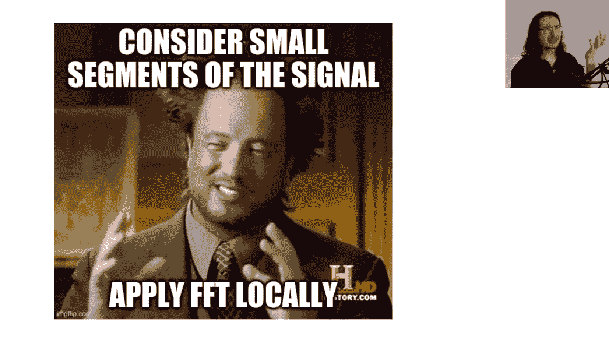
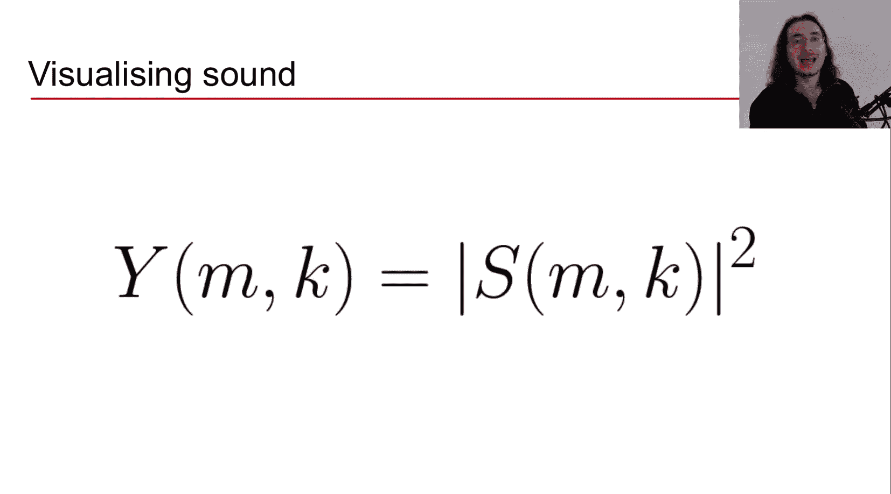
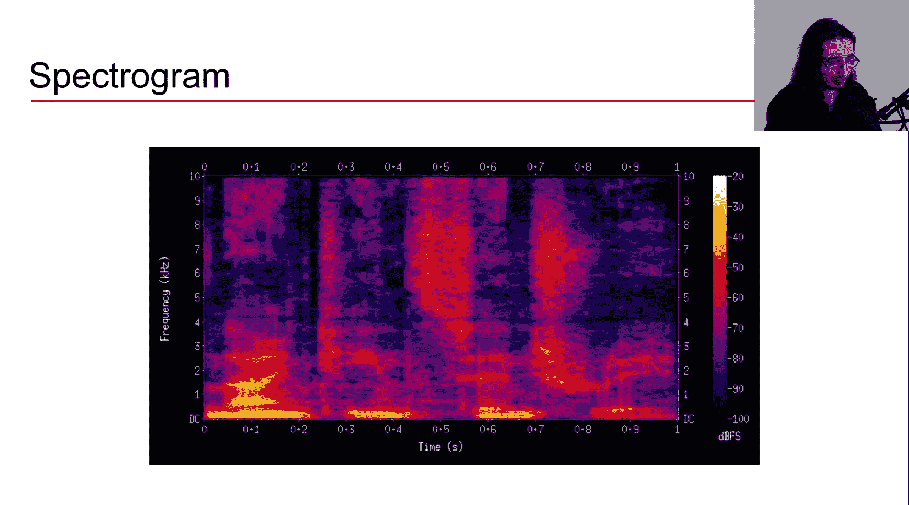
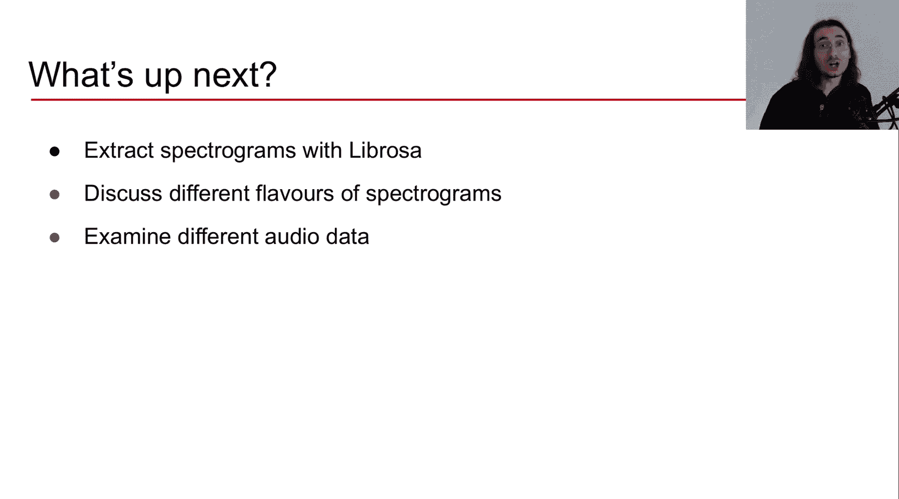

#  015：短时傅里叶变换详解 🎵

在本节课中，我们将学习音频信号处理中的一个核心概念——短时傅里叶变换。我们将了解它的工作原理、数学表达、关键参数，以及它如何生成对机器学习至关重要的特征——频谱图。

## 概述

上一节我们使用Python和Librosa从音频文件中提取了离散傅里叶变换。本节我们将回到理论层面，探讨AI音频中的一个关键主题：短时傅里叶变换。短时傅里叶变换之所以重要，是因为它使我们能够提取频谱图，而频谱图可能是可以馈送给深度学习音频模型的最重要的特征。

## 从离散傅里叶变换到短时傅里叶变换

首先，让我们回顾一下离散傅里叶变换。其数学公式如下：



```
X[k] = Σ_{n=0}^{N-1} x[n] * e^{-j2πkn/N}
```

其高层次直觉是：我们从时域信号（如波形）开始，应用离散傅里叶变换，得到的结果是原始信号中不同频率成分存在情况的一幅“图片”，即幅度谱。然而，这是一个“静态图片”，因为它只提供了一个平均了整个信号持续时间内频率成分存在情况的单一图像。这里存在一个问题：我们知道信号中存在哪些频率成分，但我们不知道它们何时出现得更多或更少，因为所有信息都被平均了。



音频数据是关于频率成分随时间演变的动态过程。我们希望了解不同频率成分如何随时间变化，这正是短时傅里叶变换的核心目的——从静态图像转向能提供跨时间频率成分信息的“视频”。

## 短时傅里叶变换的核心思想

短时傅里叶变换的高层次思想是：我们不对整个信号持续时间进行傅里叶变换，而是考虑信号的小片段或块，技术上我们称之为“帧”，然后对每一帧应用离散傅里叶变换。

为了更直观地理解，让我们将其可视化。我们从一个音频信号开始，然后只考虑第一块（第一帧）。此时，仅对该帧内的样本应用离散傅里叶变换，得到幅度谱。接着，我们滑动到下一帧，再次对该帧应用离散傅里叶变换，如此重复，直到遍历整个信号。

## 分帧与加窗

一种用于推导信号片段的方法是通过加窗。这意味着我们取原始信号，然后逐样本地乘以一个窗函数，从而得到一个加窗信号。

例如，我们从一个音频信号开始，然后应用一个矩形窗函数。矩形窗函数是一个红色曲线，除了一个片段内值为1外，其他地方均为0。将信号与矩形窗相乘，我们就得到了下方的加窗信号。

现在，介绍两个对今天讨论非常重要的参数：**窗长** 和 **帧长**。它们都以样本数衡量，但指代略有不同。

*   **窗长**：我们应用加窗的样本数量。
*   **帧长**：当我们分割信号并传递给短时傅里叶变换以计算每帧的傅里叶变换时，我们在信号的每个块中考虑的样本数量。

通常，窗长和帧长是一致的，具有相同的样本数。但有时帧长可能大于窗长。不过，在大多数应用场景中，窗长和帧长是相同的。例如，在Librosa中提取短时傅里叶变换时，我们不必强制传递窗长，其默认值就是帧长。

如果窗长小于帧长会发生什么？我们应用傅里叶变换的块仍然是整个帧，但加窗只发生在窗长数量的样本上，剩余的样本（帧长与窗长之差）将进行零填充。为了简化，本视频中我们假设窗长等于帧长。

此时，我们已经有了一个帧，并对其应用了窗函数。接下来就是应用离散傅里叶变换，从该帧中获取频率成分。然后我们向右滑动，得到第二帧，同样滑动窗函数并应用离散傅里叶变换，直到信号结束。

但这是一个简化版本。在实际的短时傅里叶变换中，帧通常是重叠的，第二帧与第一帧重叠。这就需要引入另一个参数：**跳数**。

## 跳数与帧重叠

跳数（通常用大写H表示）告诉我们当获取新帧时向右滑动多少样本。帧的重叠很重要，原因涉及频谱泄漏等问题。如果你想深入了解为什么跳数如此重要以及为什么需要重叠帧，建议观看关于音频特征提取管道的视频。

## 短时傅里叶变换的数学公式

现在，让我们从视觉直觉转向数学公式。我们将对比离散傅里叶变换和短时傅里叶变换的数学表达。

离散傅里叶变换的公式为：
```
X[k] = Σ_{n=0}^{N-1} x[n] * e^{-j2πkn/N}
```

短时傅里叶变换的公式为：
```
S[m, k] = Σ_{n=0}^{N-1} (x[n + mH] * w[n]) * e^{-j2πkn/N}
```

让我们逐项比较它们如何对应：

1.  **定义与变量**：
    *   离散傅里叶变换 `X[k]` 是频率 `k` 的函数。每个公式为我们提供一个复数傅里叶系数，包含相位和幅度信息。
    *   短时傅里叶变换 `S[m, k]` 不仅依赖于频率 `k`，还依赖于 `m`。`m` 是时间的代理，代表当前所在的帧号。因此，短时傅里叶变换的结果是第 `m` 个时间仓（帧）中第 `k` 个频率的傅里叶系数，它仍然是一个包含相位和幅度信息的复数。

2.  **求和范围**：
    *   在离散傅里叶变换中，我们对信号中的所有样本（整个持续时间）求和，`N` 等于信号中的总样本数。
    *   在短时傅里叶变换中，我们只对一个帧内的样本求和，`N` 等于帧长，因为我们考虑的不是整个信号，而只是一帧。

3.  **信号部分**：
    *   在离散傅里叶变换中，`x[n]` 是整个信号。
    *   在短时傅里叶变换中，我们只考虑当前帧 `m` 中存在的信号。`m * H` 是当前帧的起始样本（`H` 是跳数），加上 `n`（从0到帧长-1），覆盖了该帧内的所有样本。然后，我们将该信号乘以窗函数 `w[n]`，得到该帧的加窗信号。

4.  **复指数项**：
    *   最后一步对于两者是相同的：乘以一个频率为 `k/N` 的复指数（纯音）。这样做的本质是将信号分解并投影到该频率的纯音上。

## 短时傅里叶变换的输出

理解了数学公式，你可能会问：我们从离散傅里叶变换和短时傅里叶变换中具体得到什么输出？

*   **离散傅里叶变换**：我们提取一个**频谱向量**，它是一个一维数组，包含一定数量的频率仓的傅里叶系数。这里没有时间维度，因为所有信息都是整个信号持续时间的平均。
*   **短时傅里叶变换**：我们得到一个**频谱矩阵**，它是一个二维数组，包含频率仓数量和帧数量。换句话说，我们为考虑的每个频率仓和每一帧得到一个复数傅里叶系数。这样，我们不仅保留了频率信息，还通过不同的帧（时间的代理）获得了时间信息。

## 计算输出形状

我们可以计算短时傅里叶变换输出的频率仓数和帧数。

**频率仓数**：
公式为：`帧长 / 2 + 1`
原因在于离散傅里叶变换具有围绕奈奎斯特频率的镜像对称性。第一半部分包含信息，第二半部分是其镜像。因此，在短时傅里叶变换中，我们只取第一半部分的信息以避免冗余。

**帧数**：
公式为：`(总样本数 - 帧长) / 跳数 + 1`
建议你作为练习，通过可视化来理解这个公式。

**示例**：
假设信号有10000个样本，帧长为1000，跳数为500。
*   频率仓数 = 1000 / 2 + 1 = 501
*   帧数 = (10000 - 1000) / 500 + 1 = 19
因此，短时傅里叶变换的输出形状为 (501, 19)，是一个二维数组。

## 短时傅里叶变换的关键参数

短时傅里叶变换的输出取决于我们传递的一系列参数。不同的参数会导致不同的输出。

**1. 帧长**
帧长决定了我们将原始信号分割成的块的大小，以样本数衡量。常用值是2的幂次方，如512、1024、2048。选择2的幂次方很重要，因为这样我们可以使用快速傅里叶变换来计算离散傅里叶变换，这是一种非常快速且计算高效的方法。

选择帧长时涉及一个重要的概念：**时频权衡**。
*   如果使用较大的帧长，频率分辨率会增加，但时间分辨率会下降。因为更多的样本意味着更多的频率仓（更好的频率分辨率），但也意味着考虑的时间块更大（更差的时间分辨率）。
*   反之，如果使用较小的帧长，频率分辨率会下降（更少的频率仓），但时间分辨率会提高（考虑更小的时间块）。

这个权衡无法完全解决，通常需要根据具体应用找到一个合适的折中值。例如，某些问题可能更需要高频率分辨率，而像起始点检测这样的应用可能更需要高时间分辨率。

**2. 跳数**
跳数是我们获取新帧时向右滑动的样本数。常用值也是2的幂次方，如256、512。也可以将其定义为帧长的一部分，例如帧长的一半、四分之一或八分之一。

**3. 窗函数**
短时傅里叶变换的结果也取决于所选的窗函数，因为不同的窗函数会以不同的方式调制原始信号。

虽然我们介绍了矩形窗，但在数字信号处理中它并不常用，因为它会在边缘产生不连续性。为了避免这些，通常使用钟形曲线窗，其中最重要的是**汉宁窗**。大约90%的情况下，你在执行短时傅里叶变换时可能都在使用汉宁窗。其公式如下：

```
w[n] = 0.5 * (1 - cos(2πn / (N-1))) , 0 ≤ n ≤ N-1
```

当我们将汉宁窗应用于信号时，信号被调制，样本值在边缘趋向于0，从而避免了不连续性。这有助于减少频谱泄漏。

## 从短时傅里叶变换到频谱图

最后，我们来到本视频的最终主题，也是你可能最关心的部分：**频谱图**。通过频谱图，我们可以可视化声音。

我们如何得到频谱图？到目前为止，我们知道短时傅里叶变换是一个矩阵，其中每个元素都是复数傅里叶系数。我们取短时傅里叶变换的**幅度平方**，得到一个与原始短时傅里叶变换形状相同的矩阵，但区别在于现在所有元素都是实数。然后，我们可以使用热图将其可视化，这种可视化就称为频谱图。

频谱图对AI音频的所有应用都至关重要，因为很多时候我们都会使用频谱图作为输入算法的特征。



观察一个频谱图：
*   **X轴** 代表时间，显示离散的时间点（帧/时间仓）。
*   **Y轴** 代表频率，显示不同的频率仓。
*   图中显示的是不同频率成分如何随时间（跨帧）演变。

现在，我们梦想成真了：我们不仅拥有频率成分的信息（这是幅度谱已有的），还拥有了成分随时间演变的信息（这是时域通常提供的信息）。因此，频谱图被称为**时频表示**，这也是频谱图在AI音频中如此重要的原因。

## 总结



本节课我们一起学习了短时傅里叶变换。我们从回顾离散傅里叶变换的局限性开始，引出了需要分析频率随时间变化的需求。接着，详细讲解了短时傅里叶变换通过分帧、加窗、重叠的方式，将一维时域信号转换为二维时频表示的核心思想。我们深入探讨了其数学公式，并与离散傅里叶变换进行了对比。然后，我们学习了如何计算短时傅里叶变换输出的形状（频率仓数和帧数），并分析了影响其结果的关键参数：帧长（涉及时频权衡）、跳数和窗函数。最后，我们了解到通过对短时傅里叶变换结果取幅度平方，可以得到能够可视化声音动态频率内容的频谱图，这是机器学习音频应用中最常用的特征之一。



在下一讲中，我们将使用Python和Librosa具体提取频谱图，研究不同种类的频谱图，并比较不同音频样本（例如不同音乐流派）的频谱图。