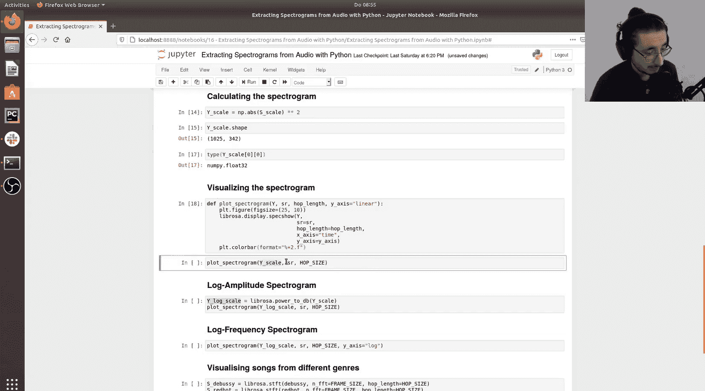
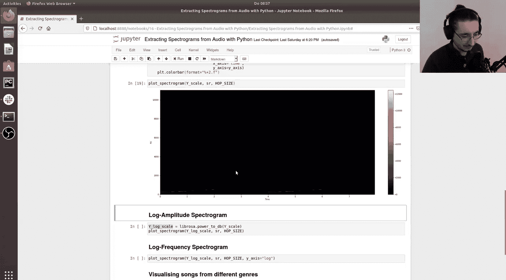
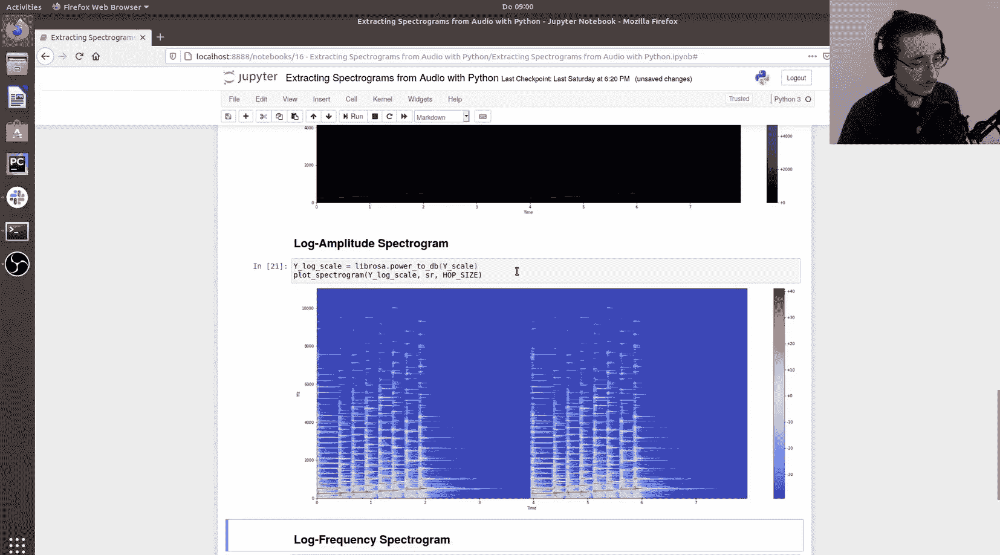
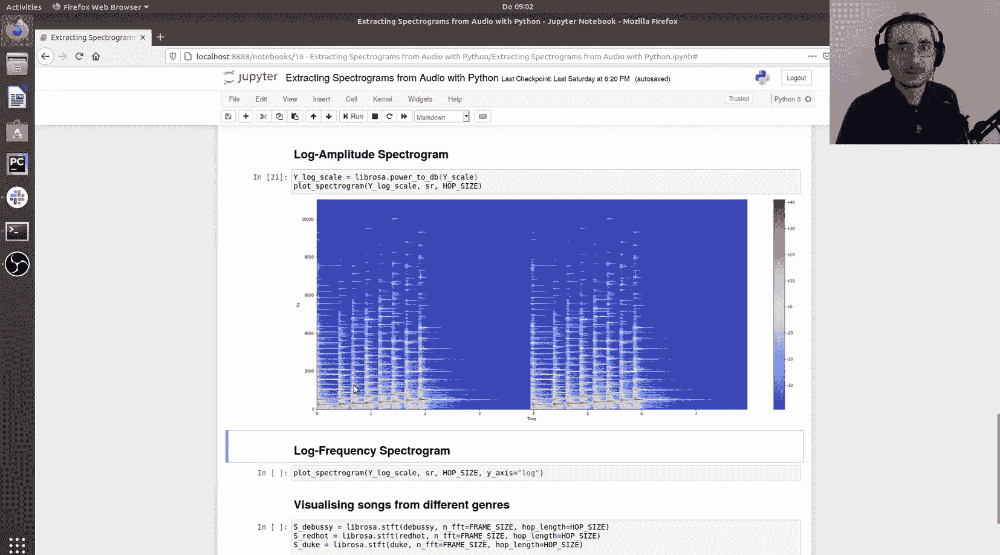
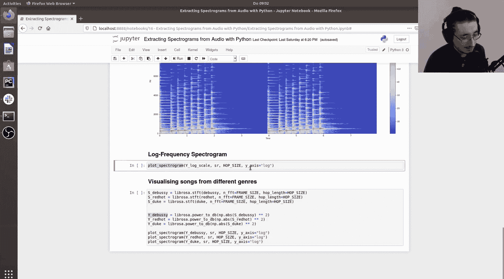
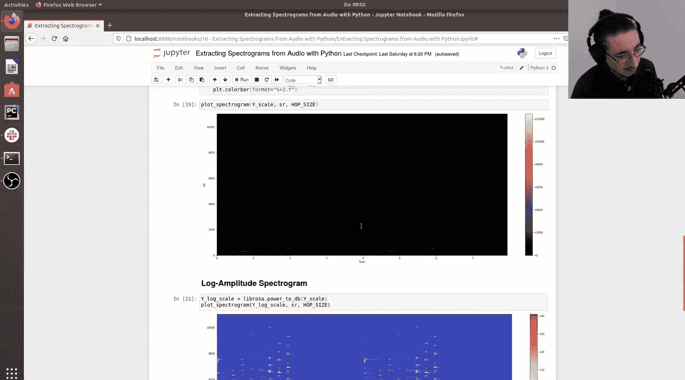
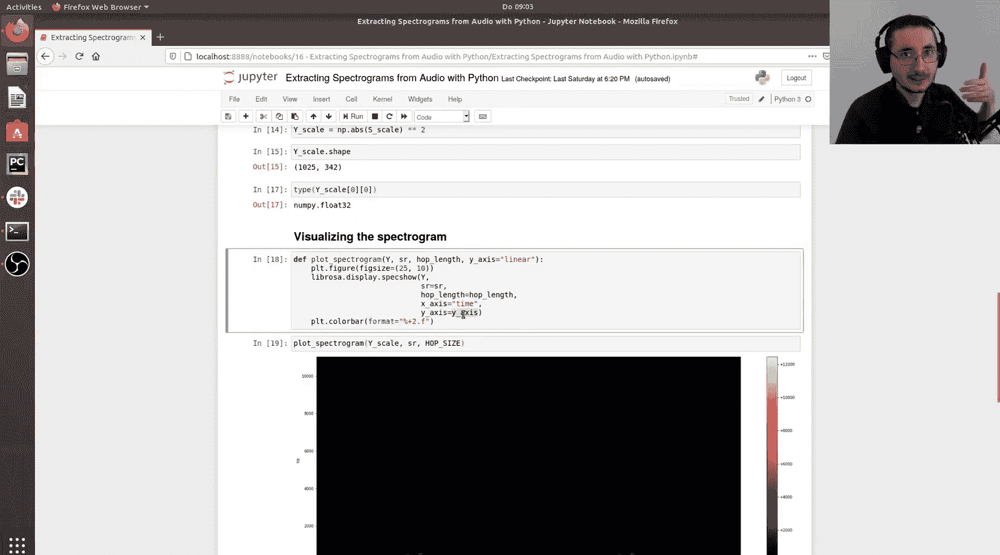
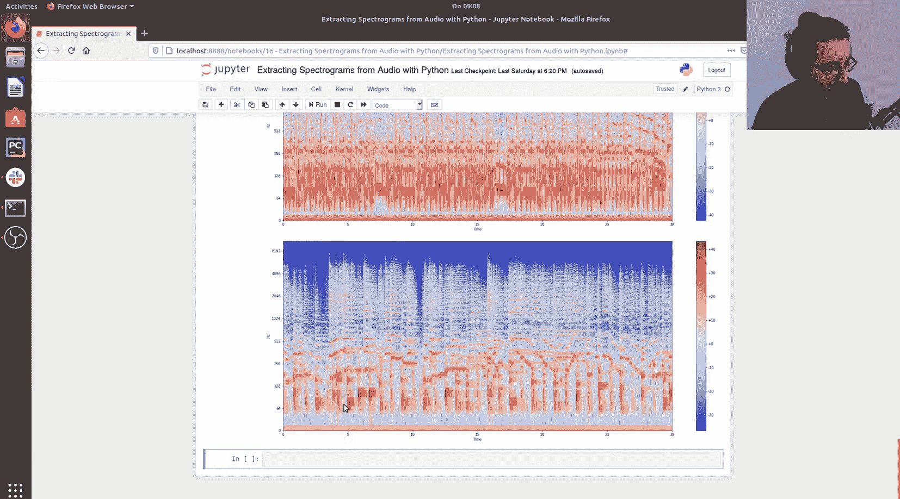

#  016：使用Python从音频中提取频谱图

在本节课中，我们将学习如何使用Python和Librosa库从音频文件中提取并可视化频谱图。我们将从加载音频开始，逐步进行短时傅里叶变换，计算频谱图，并最终生成对数幅度和对数频率的频谱图以进行更好的可视化分析。

---

## 导入必要的库

首先，我们需要导入一些必要的Python库来处理音频、进行数学运算和可视化。

```python
import os
import librosa
import librosa.display
import numpy as np
import matplotlib.pyplot as plt
import IPython.display as ipd
```

---

## 加载音频文件

我们将使用四个不同的音频文件进行演示：一个钢琴音阶、一段德彪西的古典音乐、一段红辣椒乐队的摇滚乐以及一段艾灵顿公爵的爵士乐。

以下是加载音频文件的代码。`librosa.load`函数返回音频信号（一个NumPy数组）和采样率。

```python
# 定义音频文件路径
scale_path = ‘path/to/scale.wav’
debussy_path = ‘path/to/debussy.wav’
redhot_path = ‘path/to/redhot.wav’
duke_path = ‘path/to/duke.wav’

# 加载音频文件
scale_signal, sr_scale = librosa.load(scale_path)
debussy_signal, sr_debussy = librosa.load(debussy_path)
redhot_signal, sr_redhot = librosa.load(redhot_path)
duke_signal, sr_duke = librosa.load(duke_path)
```

为了对处理的音频有一个直观印象，我们可以在Jupyter笔记本中直接播放它们。

```python
# 播放音阶音频
ipd.Audio(scale_signal, rate=sr_scale)
```

---

## 提取短时傅里叶变换

上一节我们介绍了短时傅里叶变换的理论。本节中，我们来看看如何使用Librosa库实际计算它。

首先，我们需要设置两个关键参数：帧大小和跳跃长度。

```python
# 设置参数
frame_size = 2048  # 帧大小（样本数）
hop_size = 512     # 跳跃长度（样本数）
```

现在，我们可以使用`librosa.stft`函数来计算短时傅里叶变换。

```python
# 计算音阶音频的短时傅里叶变换
scale_stft = librosa.stft(scale_signal, n_fft=frame_size, hop_length=hop_size)
```

让我们检查一下结果的形状和数据类型。

```python
# 检查STFT结果的形状
print(scale_stft.shape)  # 输出: (1025, 342)

# 检查数据类型（应为复数）
print(type(scale_stft[0, 0]))  # 输出: <class ‘numpy.complex128’>
```

结果矩阵的第一维（1025）是频率仓的数量，等于`frame_size/2 + 1`。第二维（342）是时间帧的数量。

---

## 计算频谱图

短时傅里叶变换的结果是复数。为了得到可以可视化的频谱图，我们需要计算其幅度平方。

以下是计算频谱图的公式：
**频谱图 = |STFT|²**

在代码中，我们使用NumPy的绝对值函数和平方运算来实现。

```python
# 计算幅度平方频谱图
scale_spectrogram = np.abs(scale_stft) ** 2
```

检查新矩阵的形状和数据类型。

```python
print(scale_spectrogram.shape)  # 输出: (1025, 342)
print(type(scale_spectrogram[0, 0]))  # 输出: <class ‘numpy.float64’>
```



现在，我们有了一个实数矩阵，代表每个频率和时间点上的能量。

---

## 可视化频谱图（线性表示）

有了频谱图数据，我们现在可以尝试将其可视化。Librosa提供了一个方便的函数`librosa.display.specshow`。



首先，我们创建一个辅助函数来绘制频谱图。

```python
def plot_spectrogram(Y, sr, hop_length, y_axis=“linear”):
    plt.figure(figsize=(10, 6))
    librosa.display.specshow(Y, sr=sr, hop_length=hop_length, x_axis=“time”, y_axis=y_axis)
    plt.colorbar(format=“%+2.0f dB”)
    plt.title(“Spectrogram”)
    plt.show()
```

现在，用这个函数绘制音阶的线性频谱图。

```python
plot_spectrogram(scale_spectrogram, sr_scale, hop_size, y_axis=“linear”)
```



您可能会注意到图像非常暗，大部分区域是黑色的。这是因为人耳对声音强度的感知是对数式的，而非线性的。

---

## 转换为对数幅度频谱图

为了使频谱图更符合人耳的感知，我们需要将对数变换应用于幅度。这可以通过Librosa的`librosa.power_to_db`函数轻松完成。

```python
# 将对数变换应用于幅度
scale_log_spectrogram = librosa.power_to_db(scale_spectrogram)
```

现在，再次绘制频谱图，这次使用对数幅度。



```python
plot_spectrogram(scale_log_spectrogram, sr_scale, hop_size, y_axis=“linear”)
```





现在图像看起来好多了！我们可以看到音阶中每个音符的能量爆发。较低的部分是基频，较高的部分是谐波成分。

---

## 转换为对数频率频谱图



除了幅度，我们对频率的感知也是对数式的。因此，一个更符合感知的表示是同时使用对数幅度和对数频率。

在我们的绘图函数中，只需将`y_axis`参数从`“linear”`改为`“log”`即可。

```python
plot_spectrogram(scale_log_spectrogram, sr_scale, hop_size, y_axis=“log”)
```

在对数频率表示下，音阶的上升过程在视觉上更加清晰和均匀，反映了我们实际的听觉体验。

---

## 比较不同音乐风格的频谱图

现在，让我们将同样的流程应用于其他三个音乐片段，并比较它们的频谱图。

以下是处理每个音频文件的步骤：

1.  计算短时傅里叶变换。
2.  计算幅度平方频谱图。
3.  转换为对数幅度频谱图。
4.  使用对数频率轴进行绘制。

```python
# 为德彪西片段处理
debussy_stft = librosa.stft(debussy_signal, n_fft=frame_size, hop_length=hop_size)
debussy_spectrogram = np.abs(debussy_stft) ** 2
debussy_log_spectrogram = librosa.power_to_db(debussy_spectrogram)

# 为红辣椒乐队片段处理
redhot_stft = librosa.stft(redhot_signal, n_fft=frame_size, hop_length=hop_size)
redhot_spectrogram = np.abs(redhot_stft) ** 2
redhot_log_spectrogram = librosa.power_to_db(redhot_spectrogram)

# 为艾灵顿公爵片段处理
duke_stft = librosa.stft(duke_signal, n_fft=frame_size, hop_length=hop_size)
duke_spectrogram = np.abs(duke_stft) ** 2
duke_log_spectrogram = librosa.power_to_db(duke_spectrogram)
```

现在，绘制所有三个对数幅度、对数频率的频谱图。

```python
plot_spectrogram(debussy_log_spectrogram, sr_debussy, hop_size, y_axis=“log”)
plot_spectrogram(redhot_log_spectrogram, sr_redhot, hop_size, y_axis=“log”)
plot_spectrogram(duke_log_spectrogram, sr_duke, hop_size, y_axis=“log”)
```

通过观察，我们可以发现不同音乐风格在频谱图上的差异：



*   **古典音乐（德彪西）**：能量分布变化丰富，弦乐部分在高频有平滑的能量增长和衰减。
*   **摇滚音乐（红辣椒乐队）**：在低频有大量重复的能量模式（如鼓和贝斯），节奏感强。
*   **爵士乐（艾灵顿公爵）**：结合了规律的模式和更流畅、即兴的能量变化。

---

## 总结

本节课中我们一起学习了如何使用Python和Librosa库从音频中提取和可视化频谱图。我们从加载音频和计算短时傅里叶变换开始，然后通过计算幅度平方得到频谱图。为了获得更符合人类感知的可视化效果，我们应用了对数变换到幅度（`librosa.power_to_db`）和频率轴（设置`y_axis=“log”`），最终生成了对数幅度-对数频率频谱图。通过比较不同音乐风格的频谱图，我们看到这种表示方法能够揭示音频信号在时频域上的特征差异。在下一课中，我们将介绍另一种更贴近听觉感知的频谱图变体——梅尔频谱图。