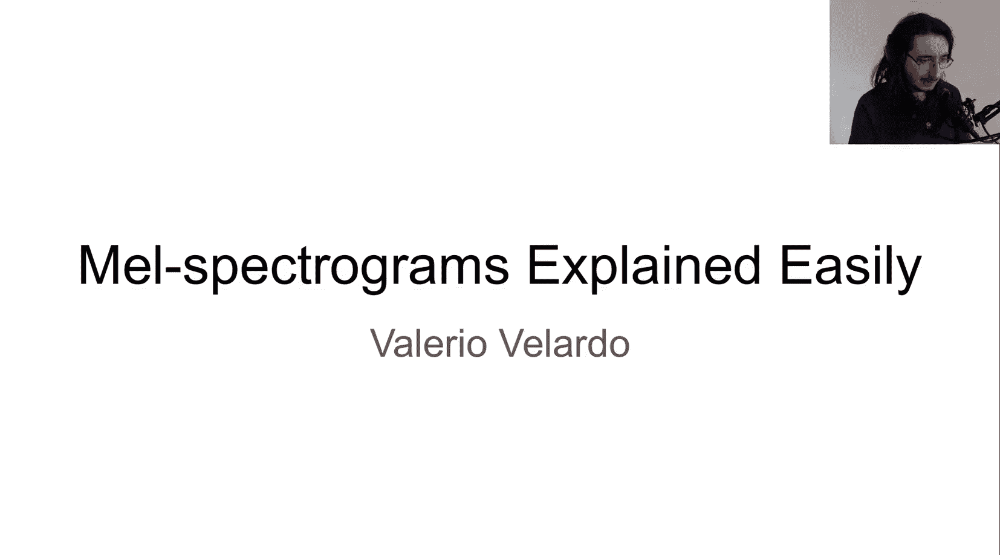
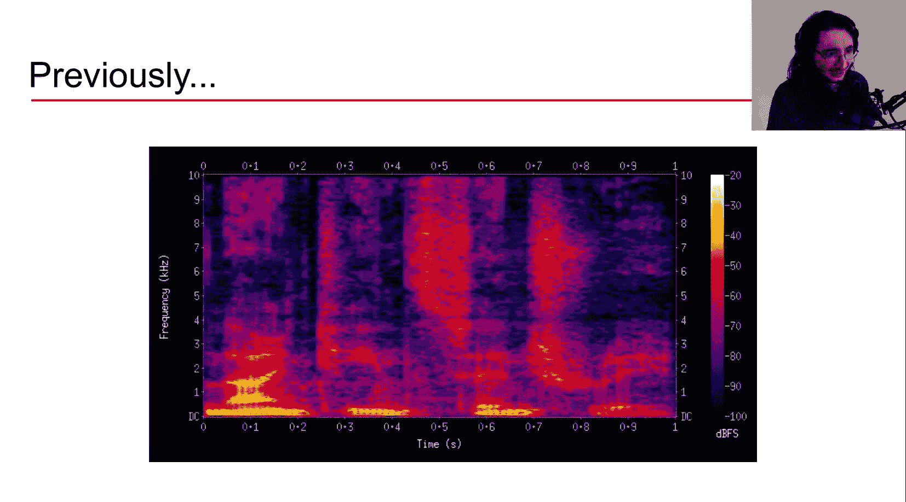
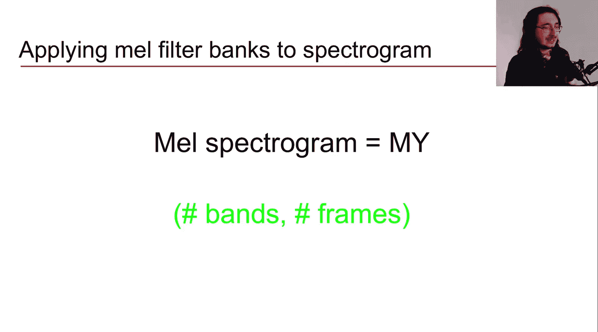
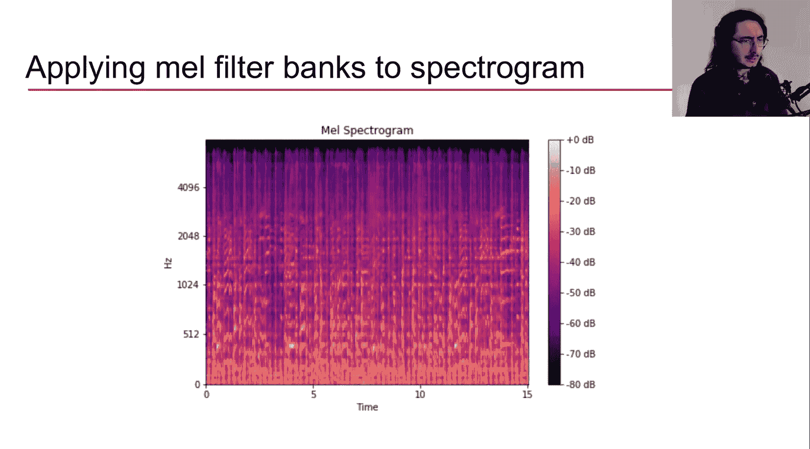

#  017：梅尔频谱图详解 🎵

在本节课中，我们将要学习梅尔频谱图。这是一种在人工智能音频研究和实际应用中广泛使用的频谱图变体。

在上一节中，我们介绍了短时傅里叶变换以及如何提取和可视化频谱图。本节中，我们来看看梅尔频谱图，它解决了普通频谱图在频率感知上的一个关键问题。

## 从线性频率到感知频率

首先，我们回顾一下普通频谱图。在频谱图中，X轴代表时间，Y轴代表频率，每个点的颜色表示特定频率在特定时间点的能量强度。

这里的关键在于，普通频谱图的频率表示是**线性**的，单位是赫兹。这与人类感知音高的方式存在矛盾。人类对音高的感知是**非线性**的，我们在低频区的分辨率远高于高频区。

为了证明这一点，我们可以进行一个简单的听觉实验。比较两组音符：第一组是从C2到C4，第二组是从G6到A6。虽然它们在赫兹尺度上的频率差都约为200Hz，但我们的听觉会明显感觉到第二组音符的音高距离比第一组要近得多。这证实了我们的音高感知是非线性的。

## 理想的音频特征

现在，让我们思考一下，对于机器学习算法而言，理想的音频特征应该具备哪些特性。

以下是三个关键条件：
1.  **时频表示**：能够展示信号中不同频率随时间的变化。
2.  **感知相关的幅度表示**：幅度应以对数尺度表示，因为人耳对响度的感知也是对数式的。
3.  **感知相关的频率表示**：频率表示应符合人类的听觉感知特性。

普通频谱图可以满足前两个条件（例如通过幅度谱），但无法满足第三个条件。而这正是**梅尔频谱图**的核心目标。

## 什么是梅尔尺度？🎼

“梅尔频谱图”由“频谱图”和“梅尔”两部分组成。“梅尔”这个概念与**梅尔尺度**相关。梅尔尺度是一种基于人耳听觉感知的音高标度。

梅尔尺度是**对数**性质的。这意味着，在梅尔尺度上相等的距离，对应着相同的**感知音高距离**。例如，500梅尔到510梅尔的感知差异，与1000梅尔到1010梅尔的感知差异是相同的。而这在赫兹线性尺度上是不成立的。

梅尔（Mel）一词是“旋律”的缩写，因为旋律主要由音高和节奏构成。

从赫兹到梅尔的转换公式如下：
`m = 2595 * log10(1 + f/700)`

反之，从梅尔转换回赫兹的公式为：
`f = 700 * (10^(m/2595) - 1)`

## 如何提取梅尔频谱图？🔧

提取梅尔频谱图可以概括为三个主要步骤。

以下是具体流程：
1.  **提取短时傅里叶变换**：这与生成普通频谱图的第一步相同。
2.  **将幅度转换为分贝**：即对幅度取对数，这也是普通频谱图的常见操作。
3.  **将频率转换为梅尔尺度**：这是梅尔频谱图独有的、最关键的一步。

那么，如何将频率转换到梅尔尺度呢？这需要通过梅尔滤波器组来实现。

## 构建与应用梅尔滤波器组

频率转换过程包含以下几个子步骤。

以下是构建梅尔滤波器组的步骤：
1.  **选择梅尔带数量**：这是一个超参数，通常在40到128之间选择，具体取决于任务。可以参考钢琴的88个键作为启发。
2.  **确定频率范围**：设定STFT中要考虑的最低和最高频率（赫兹），并将其转换为梅尔值。
3.  **创建中心频率点**：在梅尔尺度上，在最低和最高梅尔频率之间，生成等间距的`N`个点（`N`为梅尔带数量）。这些点就是各个梅尔带的**中心频率**。
4.  **将中心频率点转换回赫兹**：使用逆转换公式，将梅尔中心频率点转换回赫兹。
5.  **创建三角滤波器**：以每个中心频率点为中心，以前一个和后一个中心频率点为边界，构建一个三角滤波器。在中心点权重为1，在边界点权重为0。所有三角滤波器的集合就构成了**梅尔滤波器组**。

梅尔滤波器组在数学上可以表示为一个矩阵，其形状为 `(num_mel_bands, n_fft/2 + 1)`。

## 得到梅尔频谱图

最后一步是将梅尔滤波器组应用到频谱图上。

应用方法就是进行**矩阵乘法**：`梅尔频谱图 = 梅尔滤波器组矩阵 × 频谱图矩阵`。前提是滤波器组矩阵的列数等于频谱图矩阵的行数（即`n_fft/2 + 1`）。

相乘后得到的梅尔频谱图是一个新矩阵，其形状为 `(num_mel_bands, num_frames)`。在视觉上，它看起来和普通频谱图类似，但Y轴的单位从线性赫兹变成了感知相关的梅尔带。

## 为什么使用梅尔频谱图？💡

梅尔频谱图在AI音频和音乐信息检索领域被广泛使用。

以下是其主要应用场景：
*   自动情绪识别
*   音乐流派分类
*   乐器分类
*   以及其他众多音频分类任务

它之所以受欢迎，是因为它为机器学习模型提供了更符合人类听觉感知的输入特征，这通常能带来更好的模型性能。

## 总结

本节课中我们一起学习了梅尔频谱图。我们首先指出了普通频谱图在线性频率表示上的局限性。接着，我们探讨了梅尔尺度如何以对数方式模拟人耳的音高感知。然后，我们详细拆解了提取梅尔频谱图的步骤，核心在于构建和应用梅尔滤波器组将线性频率转换为梅尔带。最后，我们了解了梅尔频谱图在各类AI音频任务中的广泛应用。

下一节，我们将使用Python和LibROSA库来实际提取和可视化梅尔频谱图及梅尔滤波器组。