#  018：使用Python提取梅尔频谱图

在本节课中，我们将学习如何利用Python和Librosa库，将上一节介绍的梅尔频谱图理论付诸实践，从音频文件中提取梅尔频谱图。

## 导入必要库

首先，我们需要导入一些必要的Python库。Librosa用于音频处理，Librosa.display和Matplotlib用于可视化。

```python
import librosa
import librosa.display
import matplotlib.pyplot as plt
```

## 加载音频文件

接下来，我们将加载一个音频文件。这个文件是一个C大调音阶的钢琴演奏，我们在之前提取普通频谱图的视频中也使用过它。

以下是加载和播放音频的步骤：
1.  获取音频文件的路径。
2.  使用Librosa加载音频，得到信号数组和采样率。

```python
# 获取音频文件路径
audio_path = ‘path/to/your/audio/file.wav’

# 加载音频文件
signal, sr = librosa.load(audio_path, sr=None) # sr=None 保持原始采样率
```

## 理解梅尔滤波器组

在从音频中提取梅尔频谱图之前，我们先来回顾并可视化梅尔滤波器组。梅尔滤波器组是获取梅尔频谱图的关键，其原理是将滤波器组矩阵与普通频谱图进行矩阵乘法运算。

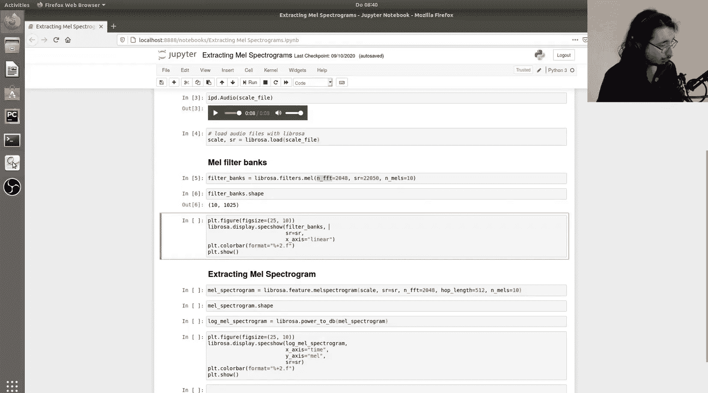

在Librosa中，我们可以使用一个实用函数来生成梅尔滤波器组，而无需手动实现所有步骤。

```python
# 定义参数
frame_size = 2048
n_mels = 10

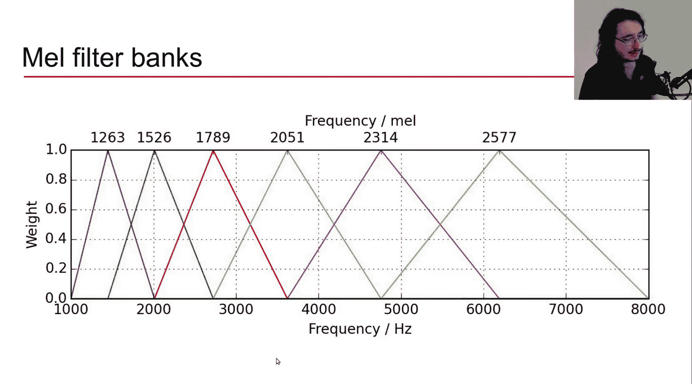

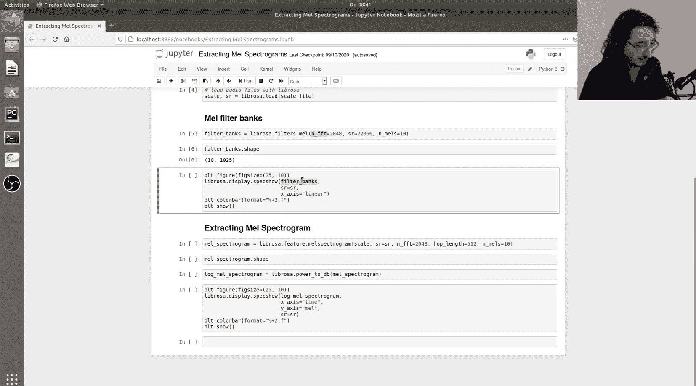

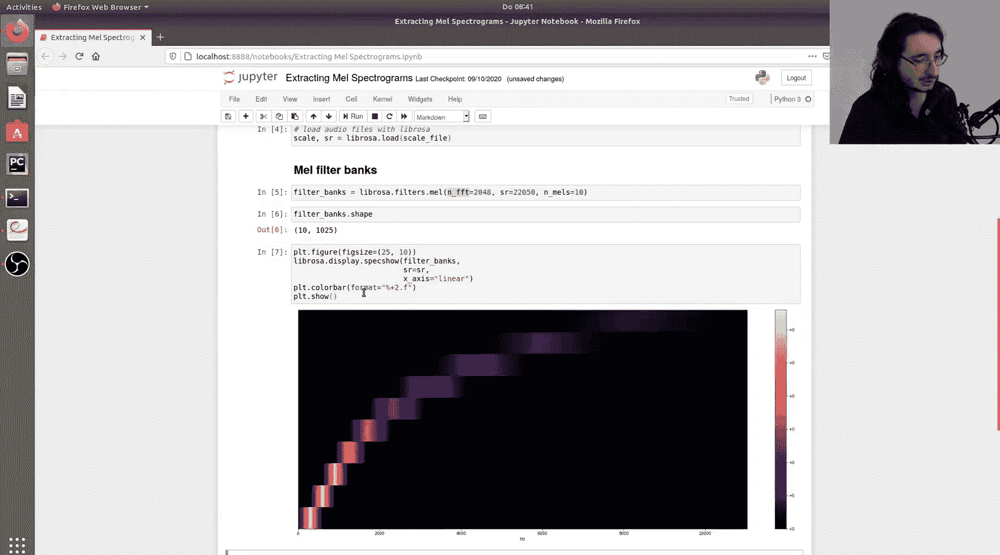

# 生成梅尔滤波器组
mel_filter_banks = librosa.filters.mel(sr=sr, n_fft=frame_size, n_mels=n_mels)

# 查看滤波器组的形状
print(mel_filter_banks.shape) # 输出应为 (n_mels, frame_size // 2 + 1)
```

滤波器组是一个矩阵，其第一维的大小等于梅尔带的数量（本例中为10），第二维的大小等于帧大小的一半加一（即 `2048 // 2 + 1 = 1025`），这对应于频谱图中的频率单元数。

## 可视化梅尔滤波器组

我们可以用两种方式可视化梅尔滤波器组。第一种是绘制每个三角滤波器的权重随频率变化的曲线。第二种是使用频谱图显示函数，将整个滤波器组矩阵显示为图像。

以下是使用频谱图方式可视化的代码：
```python
# 将梅尔滤波器组可视化为图像
plt.figure(figsize=(10, 4))
librosa.display.specshow(mel_filter_banks, sr=sr, x_axis=‘linear’)
plt.colorbar(format=‘%+2.0f dB’)
plt.title(‘Mel Filter Banks’)
plt.xlabel(‘Frequency (Hz)’)
plt.ylabel(‘Mel Band’)
plt.tight_layout()
plt.show()
```

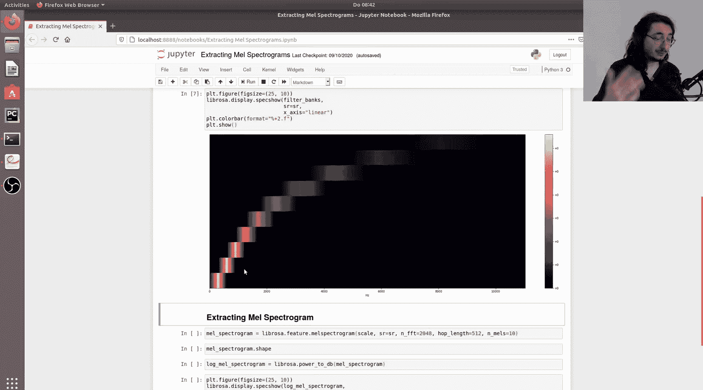

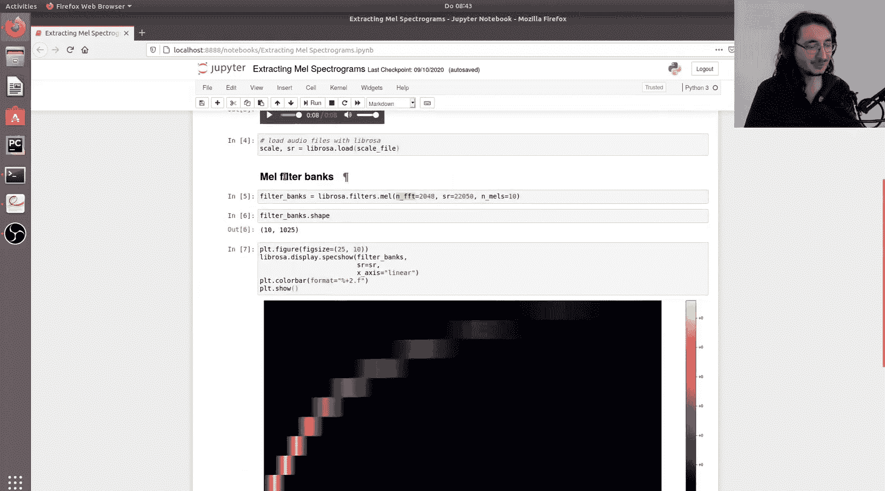

在生成的图像中，X轴表示频率（Hz），Y轴表示不同的梅尔带（本例中为10个）。颜色亮度代表在特定频率下，某个梅尔带的权重值，最亮的点（权重为1）对应每个梅尔带的中心频率。

## 提取梅尔频谱图

理解了滤波器组后，我们现在可以提取梅尔频谱图了。在Librosa中，这可以通过一个函数轻松完成，该函数在内部自动执行了提取普通频谱图、创建梅尔滤波器组并应用滤波器组这三个步骤。

以下是提取梅尔频谱图的代码：
```python
# 提取梅尔频谱图
mel_spectrogram = librosa.feature.melspectrogram(y=signal, sr=sr, n_fft=frame_size, hop_length=512, n_mels=90)

# 查看梅尔频谱图的形状
print(mel_spectrogram.shape) # 输出应为 (n_mels, 时间帧数)
```

输出的形状中，第一维是梅尔带的数量（90），第二维是时间帧的数量（例如342），这取决于音频长度和跳幅大小。

## 转换为对数梅尔频谱图

由于人耳对振幅的感知是对数关系而非线性关系，因此将功率谱转换为分贝标度的对数谱是重要的一步。这不会改变频谱图的形状，但会转换矩阵中每个元素的值。

以下是转换代码：
```python
# 转换为对数梅尔频谱图（分贝标度）
log_mel_spectrogram = librosa.power_to_db(mel_spectrogram, ref=np.max)

# 验证形状不变
print(log_mel_spectrogram.shape) # 形状保持不变
```

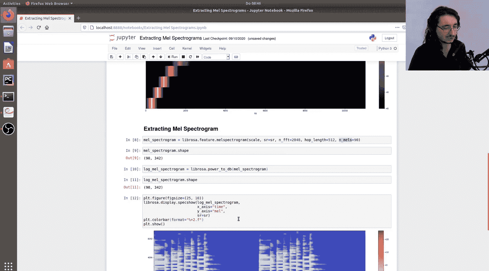

## 可视化梅尔频谱图

最后，我们可以将提取的梅尔频谱图可视化出来，观察音频信号在梅尔频率尺度下的时频特征。

以下是可视化代码：
```python
plt.figure(figsize=(10, 4))
librosa.display.specshow(log_mel_spectrogram, sr=sr, hop_length=512, x_axis=‘time’, y_axis=‘mel’)
plt.colorbar(format=‘%+2.0f dB’)
plt.title(‘Log-Mel Spectrogram’)
plt.tight_layout()
plt.show()
```

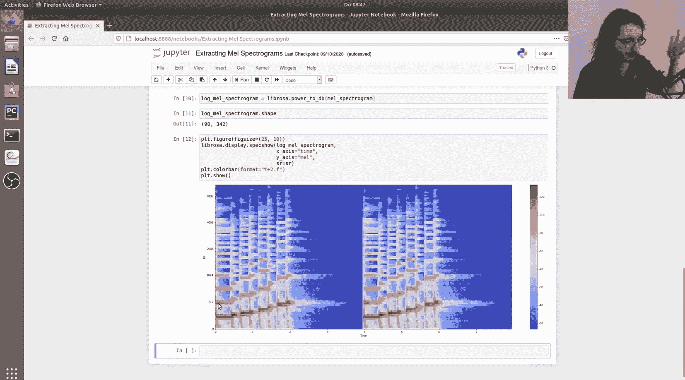

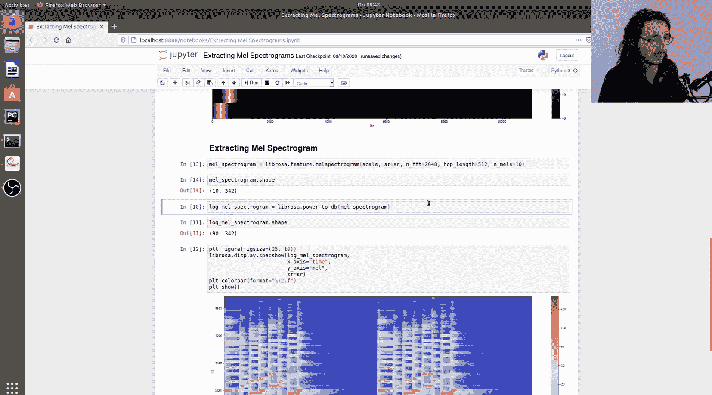

在生成的频谱图中，X轴是时间，Y轴是梅尔带。对于我们的钢琴音阶，可以看到能量在梅尔带上依次上升的模式。为了更清晰地看到离散的梅尔带，我们可以将 `n_mels` 参数设置为一个较小的值（如10）并重新运行，这样在Y轴上就能看到10个清晰的色块。

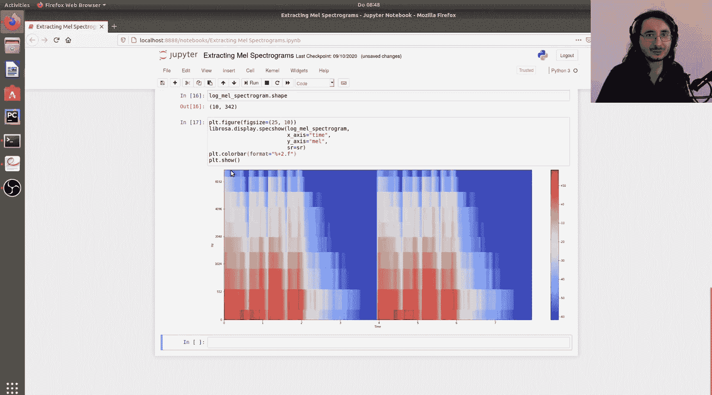

## 总结

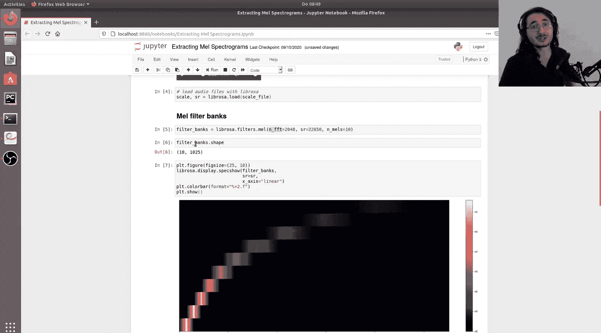

本节课中，我们一起学习了如何使用Python的Librosa库从音频文件中提取梅尔频谱图。我们回顾了梅尔滤波器组的概念，并演示了如何生成和可视化它。接着，我们使用 `librosa.feature.melspectrogram` 函数一步完成了梅尔频谱图的提取，并将其转换为对数尺度以便于分析。最后，我们可视化了结果，观察了音频在梅尔频率尺度下的特征。掌握这些步骤，你就具备了为机器学习任务准备音频特征的基础能力。