#  019：梅尔频率倒谱系数详解 🎵

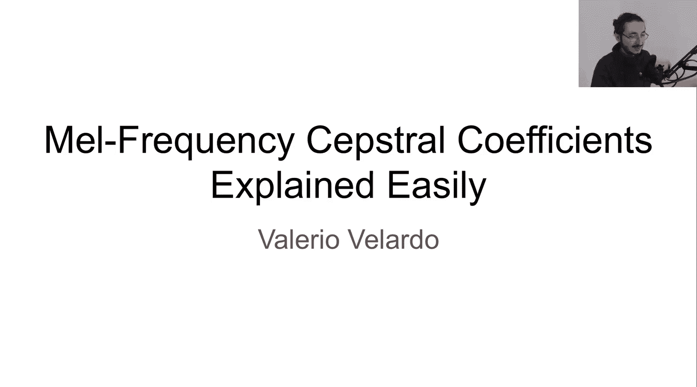


在本节课中，我们将要学习一个非常重要的音频特征：梅尔频率倒谱系数。我们将从基础概念开始，逐步深入其数学原理、计算过程、优缺点以及应用场景，确保初学者能够轻松理解。

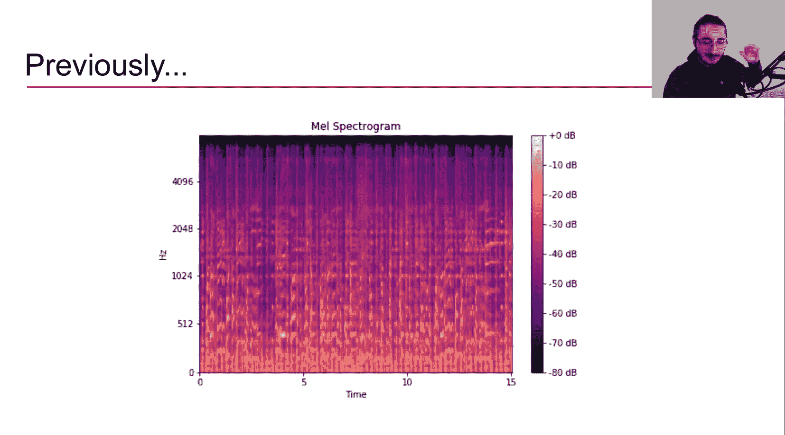

## 概述

梅尔频率倒谱系数是一种广泛用于语音和音乐处理的音频特征。它能够有效捕捉声音的“音色”信息，同时过滤掉我们不关心的细节（如音高）。本节课我们将详细拆解其构成、计算步骤和背后的原理。

---

## 梅尔频率倒谱系数是什么？

上一节我们介绍了梅尔频谱图，它是理解MFCC的重要基础。本节中，我们来看看MFCC到底是什么。

MFCC是“梅尔频率倒谱系数”的缩写。这个名字包含了几个关键部分：
*   **梅尔频率**：指我们使用了**梅尔刻度**，这是一种与人耳对音高感知相关的非线性频率刻度。
*   **倒谱**：这个词与“频谱”相关，它本质上是一个**频谱的频谱**。我们稍后会详细解释。
*   **系数**：最终我们会得到一系列数值（系数），这些数值描述了声音片段的特征。

---

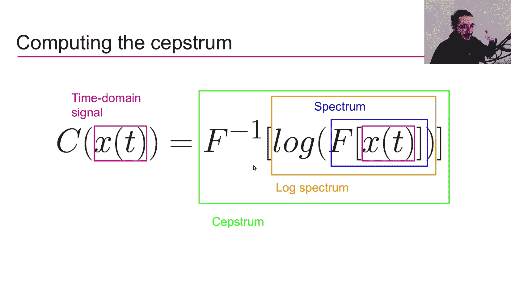

## 理解“倒谱” 🧠

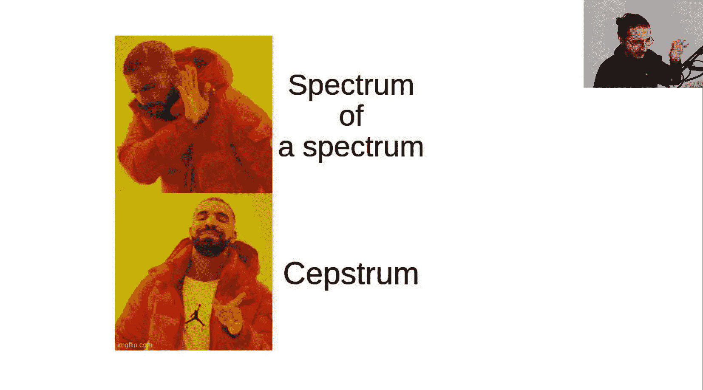

“倒谱”是理解MFCC的核心。为了理解它，我们需要先了解一些历史背景和数学形式化。

### 历史背景与应用

倒谱的概念最初由MIT的研究人员在20世纪60年代提出，用于研究地震信号中的回声。随后，语音处理领域的研究者发现这个概念非常适用于语音分析。从70年代起，倒谱及其衍生特征（如MFCC）成为了语音识别、说话人识别等任务的首选特征，直到深度学习兴起。在21世纪初，MFCC也开始被广泛应用于音乐信息检索领域。

### 数学形式化

倒谱的计算过程可以通过一个数学公式来清晰地描述。以下是计算倒谱 `C(t)` 的步骤：

1.  **时域信号**：我们从时域信号 `x(t)`（即波形）开始。
2.  **傅里叶变换**：对 `x(t)` 应用离散傅里叶变换 `F`，得到频谱 `X(f)`，即从时域转换到频域。
    ```math
    X(f) = \mathcal{F}\{x(t)\}
    ```
3.  **取对数**：计算频谱 `X(f)` 的幅度（或功率）的对数，得到**对数幅度谱** `log(|X(f)|)`。
4.  **逆傅里叶变换**：对对数幅度谱应用**逆傅里叶变换**，得到的结果就是**倒谱** `C(t)`。
    ```math
    C(t) = \mathcal{F}^{-1}\{\log(|\mathcal{F}\{x(t)\}|)\}
    ```

**关键理解**：这个过程可以看作是在计算一个**频谱的频谱**。因为我们对频谱（对数幅度谱）进行了傅里叶分析（逆变换）。研究者们玩了一个文字游戏，将“spectrum”（频谱）的前四个字母“spec”倒过来，创造了“cepstrum”（倒谱）这个词。

### 可视化理解

让我们通过可视化来巩固这个概念：

1.  **从波形到频谱**：我们从一个短时音频波形开始，通过傅里叶变换得到其功率谱（频率 vs. 功率）。
2.  **从频谱到对数谱**：对功率谱的幅度值取对数，得到对数功率谱（频率 vs. 分贝）。这个信号看起来是连续的，并且由于原始信号中的谐波结构，它呈现出一定的周期性。
3.  **从对数谱到倒谱**：现在，我们将这个对数功率谱**视为一个时域信号**。对这个“信号”应用逆傅里叶变换，就得到了倒谱。此时，横轴不再是频率，而是一种被称为**倒频率**的伪频率轴，单位通常是毫秒。

在倒谱图中，峰值（称为**倒频峰**）对应了原始对数谱中的周期性结构。第一个显著的倒频峰通常与原始信号的基频相关，因此倒谱也曾被用于基频检测。

---

## 倒谱在语音处理中的意义 🗣️

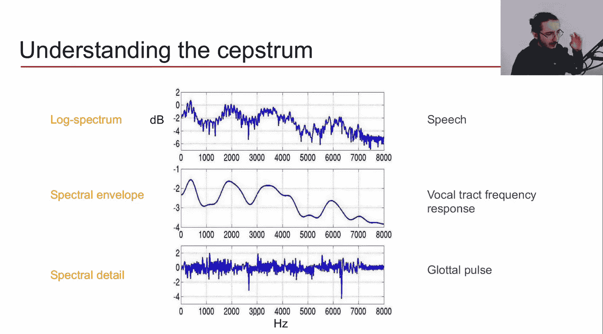

为了理解为什么倒谱如此有用，我们需要了解人类语音的产生机制。

### 语音产生模型

人类语音的产生可以简化为一个管道模型：
1.  **声门脉冲**：由声带振动产生的一个类似噪声的、高频的信号，它主要携带**音高（基频）** 信息。
2.  **声道**：包括舌头、牙齿、鼻腔、喉咙等。声道像一个**滤波器**，对声门脉冲进行滤波。
3.  **输出**：滤波后的结果就是我们听到的语音信号。**声道的形状决定了我们发出什么音素（元音或辅音）**，即声音的**音色**。

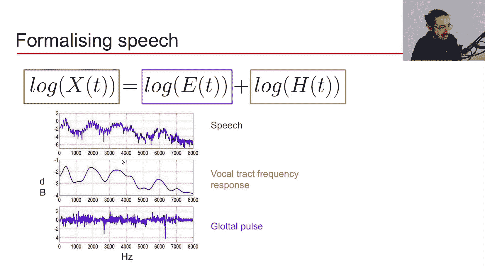

### 频谱分解与倒谱的作用

根据这个模型，语音信号 `x(t)` 可以看作是声道的脉冲响应 `v(t)`（即滤波器特性）与声门脉冲 `g(t)` 的卷积：
```math
x(t) = v(t) * g(t)
```
转换到频域，卷积变为乘法：
```math
X(f) = V(f) \cdot G(f)
```
然后，我们对两边取对数：
```math
\log(|X(f)|) = \log(|V(f)|) + \log(|G(f)|)
```
**这就是关键所在！** 取对数后，乘积变成了加法。`log(|V(f)|)` 对应**声道频率响应**（决定音色），`log(|G(f)|)` 对应**声门脉冲谱**（决定音高）。它们在倒谱域中天然地分离了：
*   倒频率轴的低频部分（对应缓慢变化的包络）包含了 `log(|V(f)|)` 的信息，即**共振峰**和音色。
*   倒频率轴的高频部分（对应快速变化的细节）包含了 `log(|G(f)|)` 的信息，即音高细节。

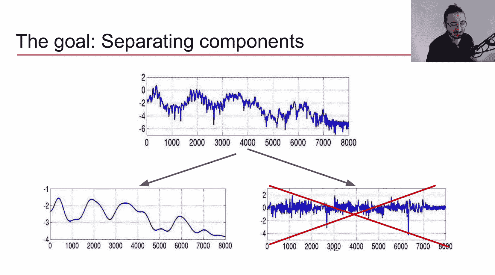

对于大多数语音识别任务，我们只关心音色（共振峰），不关心音高。因此，我们可以使用一个**低通“倒频滤波器”** 来滤除倒谱中高频部分（与声门脉冲相关）的系数，只保留低频部分（与声道响应相关）的系数。这样就得到了我们想要的、描述音色的特征。

---

## 从倒谱到梅尔频率倒谱系数 🎚️

理解了倒谱之后，MFCC就很容易理解了。它是在倒谱的基础上，引入了梅尔刻度，以更好地匹配人耳听觉特性。

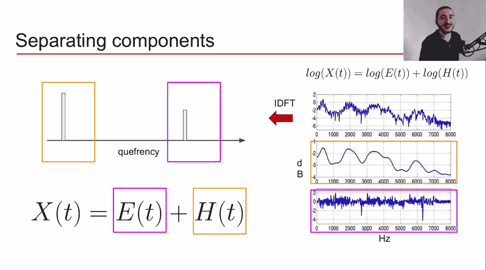

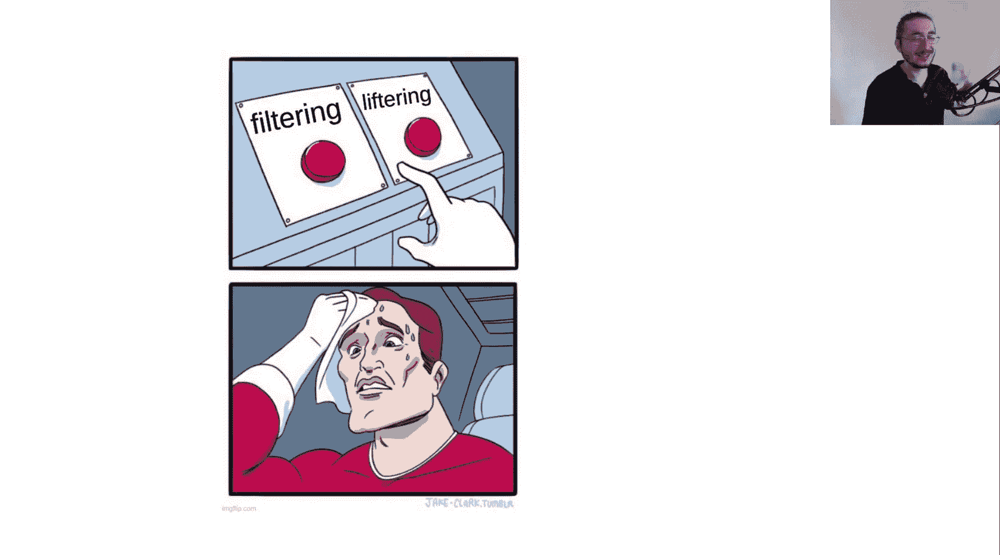

### MFCC的计算步骤

以下是计算MFCC的多步流程，其中许多步骤与计算倒谱共享：

1.  **预加重、分帧、加窗**：对原始音频波形进行预处理。
2.  **傅里叶变换**：对每一帧应用FFT，得到幅度谱。
3.  **计算功率谱**：求幅度谱的平方。
4.  **应用梅尔滤波器组**：将功率谱通过一组**梅尔三角滤波器**。这一步将线性频率刻度映射到梅尔刻度，并求每个滤波器内的能量和，得到**梅尔频谱**。这是与普通倒谱计算的第一处不同。
5.  **取对数**：计算梅尔频谱的对数。
6.  **离散余弦变换**：对对数梅尔频谱应用**离散余弦变换**。这是与普通倒谱计算的第二处不同（普通倒谱使用逆傅里叶变换）。DCT的结果就是**梅尔频率倒谱系数**。

每一步都具有一定的感知合理性：对数运算模拟了人耳对响度的非线性感知；梅尔刻度模拟了人耳对音高的非线性感知；DCT则帮助我们解相关并压缩数据。

### 为什么使用离散余弦变换？

使用DCT而非逆傅里叶变换有几个原因：
*   **实数系数**：DCT输出的是实数系数，而FFT输出复数系数。对于MFCC，实数系数足够且更易于处理。
*   **解相关**：DCT能有效**解相关**梅尔滤波器组能量（因为相邻滤波器有重叠），这有利于后续的机器学习算法。
*   **降维**：DCT可以看作一种降维技术，它能够用少数几个系数捕捉对数梅尔频谱的主要形状。

### 应该取多少个系数？

传统上，我们只取前12-13个MFCC系数。这是因为：
*   前几个系数包含了关于**频谱包络（共振峰）** 的大部分信息，这正是我们关心的音色特征。
*   高阶系数包含更多关于**频谱细节（音高）** 的信息，这些信息对于语音识别通常不重要，甚至可能成为噪声。

为了提升模型性能，一个常见的做法是计算MFCC的**一阶差分**和**二阶差分**（也称为Delta和Delta-Delta系数）。它们描述了MFCC系数随时间的变化（类似于速度、加速度），对于捕捉动态特征非常有效。通常会将13个静态MFCC、13个一阶差分和13个二阶差分拼接起来，形成一个39维的特征向量。

### MFCC的可视化

MFCC通常以热图形式可视化，非常类似于频谱图。横轴是时间帧，纵轴是MFCC系数索引（从0开始，0对应第一个系数）。每个点的颜色深浅代表该系数在对应时间帧上的数值大小。

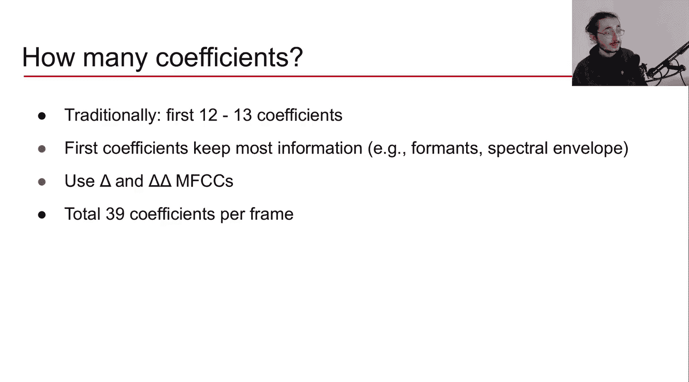

---

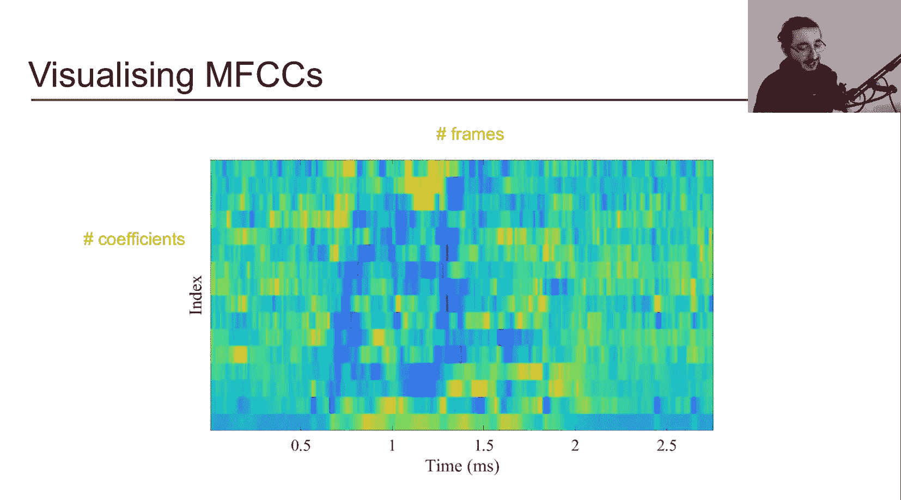

## MFCC的优缺点与应用总结 📊

### 优点
*   **聚焦音色**：能有效描述频谱的大体结构（包络、共振峰），忽略细微的频谱细节和音高信息。
*   **感知相关**：计算步骤融合了人耳听觉特性（对数、梅尔刻度）。
*   **久经考验**：在语音和音乐处理领域有长期的成功应用历史。

### 缺点
*   **对加性噪声敏感**：在嘈杂环境中性能会下降。
*   **包含人为假设**：梅尔刻度、三角滤波器形状等选择带有一定的主观性和局限性，可能不是最优的，也限制了数据驱动方法从原始数据中自行学习特征的能力。
*   **不可逆**：主要用于分析，难以完美地从MFCC重构回原始音频，因此不适用于合成任务。

### 主要应用
*   **语音处理**：语音识别、说话人识别、语种识别。
*   **音乐处理**：音乐流派分类、情绪分类、自动打标签、乐器识别等与音色相关的任务。

---

## 总结

本节课我们一起深入学习了梅尔频率倒谱系数。我们从其名称解析开始，深入探讨了核心概念“倒谱”的数学定义、历史背景及其在语音产生模型中的重要意义。随后，我们详细讲解了MFCC的计算步骤，理解了为何引入梅尔刻度和离散余弦变换，并讨论了系数选取、差分计算以及可视化方法。最后，我们总结了MFCC的优缺点和典型应用场景。

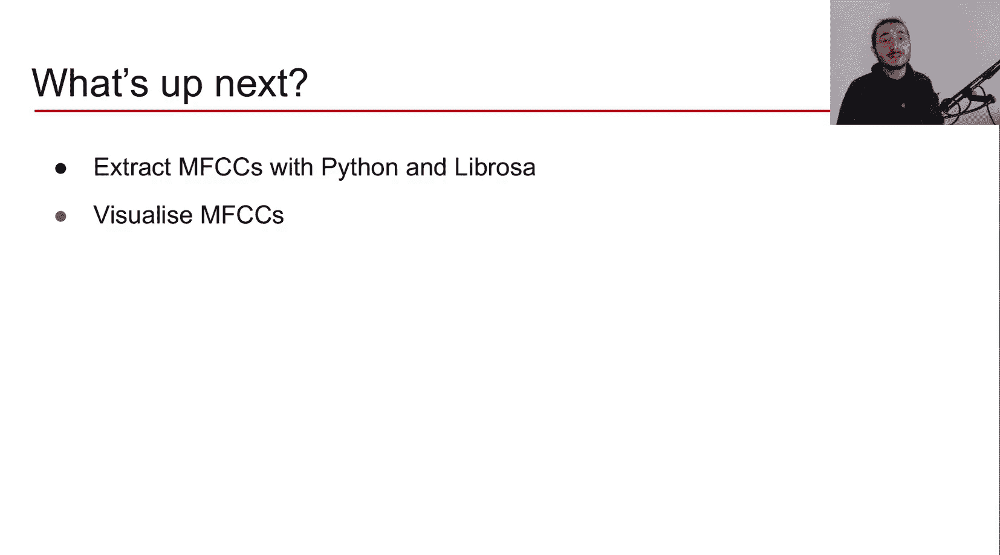

MFCC是连接传统信号处理与机器学习的重要桥梁，理解它对于掌握音频特征工程至关重要。在接下来的课程中，我们将使用Python实际提取并可视化MFCC，将理论付诸实践。