#  020：使用Python提取梅尔频率倒谱系数 🎵

在本节课中，我们将学习如何使用Python和Librosa库来提取音频信号的梅尔频率倒谱系数。我们将从加载音频文件开始，逐步完成MFCC的提取、可视化，并计算其一阶和二阶导数，最后将它们组合成一个综合性的音频特征。

## 概述

上一节我们从理论角度探讨了梅尔频率倒谱系数。本节我们将通过实践，学习如何使用Python代码来提取和操作MFCCs。

## 导入必要的库

首先，我们需要导入本教程中将要用到的Python库。

```python
import librosa
import librosa.display
import IPython.display as ipd
import matplotlib.pyplot as plt
import numpy as np
```

## 加载音频文件

接下来，我们将加载一个音频文件。我们使用一段熟悉的古典音乐片段。

```python
audio_file = ‘debusy.wav’
```

为了确认音频内容，我们可以在Jupyter笔记本中播放它。

```python
ipd.Audio(audio_file)
```

现在，我们使用Librosa加载音频文件，获取其波形信号和采样率。

```python
signal, sr = librosa.load(audio_file)
```

我们可以查看信号的形状，了解它包含的样本数量。

```python
signal.shape
```

## 提取MFCCs

提取MFCCs是整个过程的核心。Librosa库提供了一个非常简便的函数来完成此操作。

我们将提取13个MFCC系数，这是一个常用的数量。

```python
mfccs = librosa.feature.mfcc(y=signal, n_mfcc=13, sr=sr)
```

提取完成后，我们可以查看MFCCs矩阵的形状。

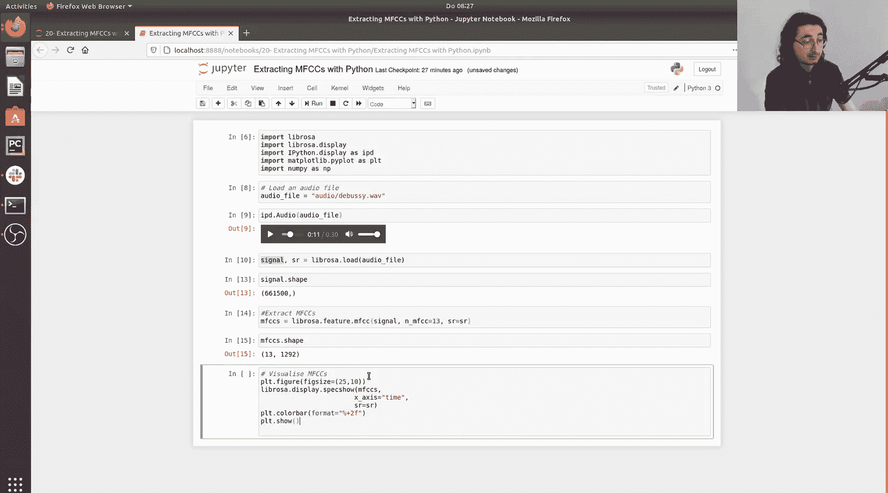

```python
mfccs.shape
```

## 可视化MFCCs

为了直观理解MFCCs，我们可以将其可视化为频谱图。

以下是可视化步骤：

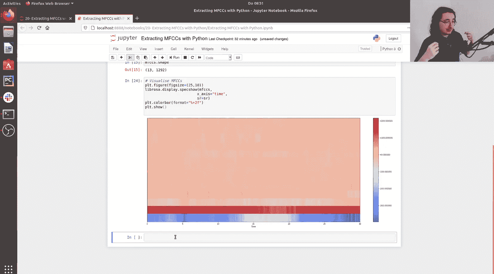

```python
plt.figure(figsize=(25, 10))
librosa.display.specshow(mfccs, x_axis=‘time’)
plt.colorbar(format=‘%+2.0f dB’)
plt.show()
```

## 计算MFCCs的导数

MFCCs的一阶和二阶导数（Delta和Delta-Delta）描述了这些系数随时间的变化情况，是重要的补充特征。

以下是计算步骤：

```python
# 计算一阶导数 (Delta MFCCs)
delta_mfccs = librosa.feature.delta(mfccs)

# 计算二阶导数 (Delta-Delta MFCCs)
delta2_mfccs = librosa.feature.delta(mfccs, order=2)
```

我们可以检查导数的形状，确认它们与原始MFCCs一致。

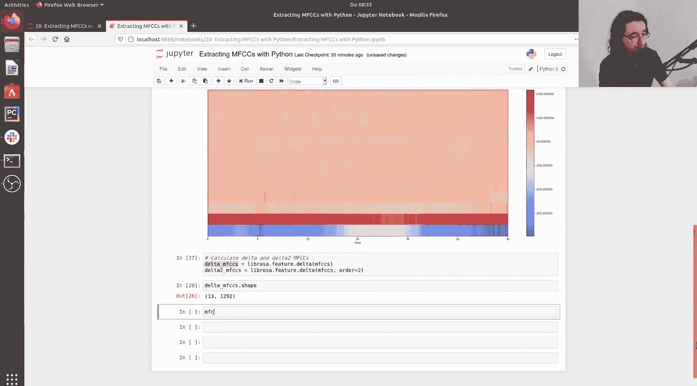

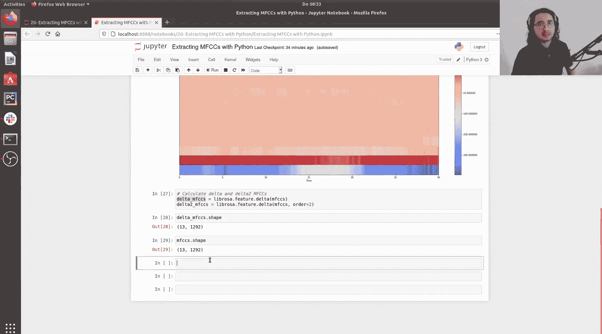

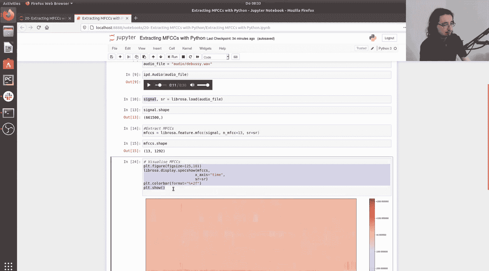

```python
delta_mfccs.shape
```

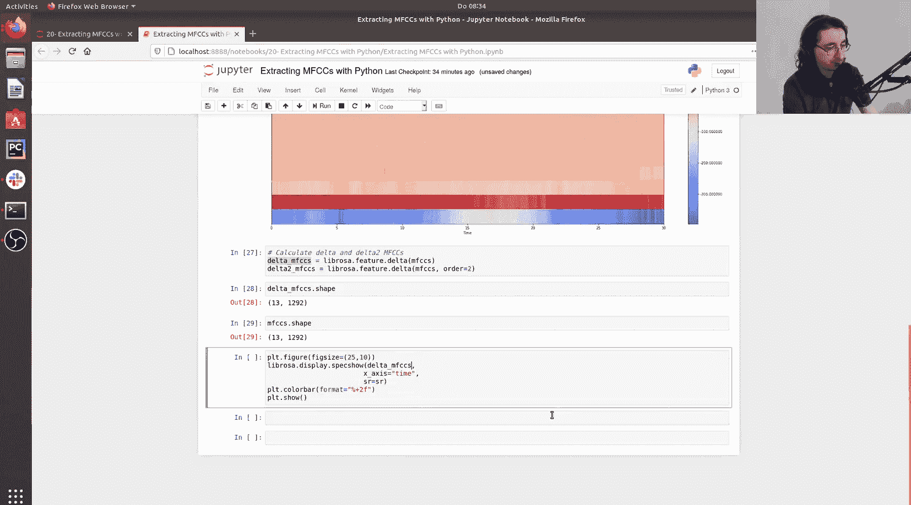

同样地，我们可以将导数可视化。

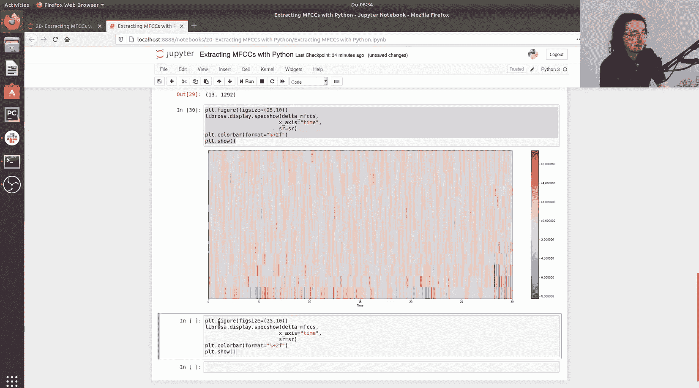

以下是可视化Delta MFCCs的代码：

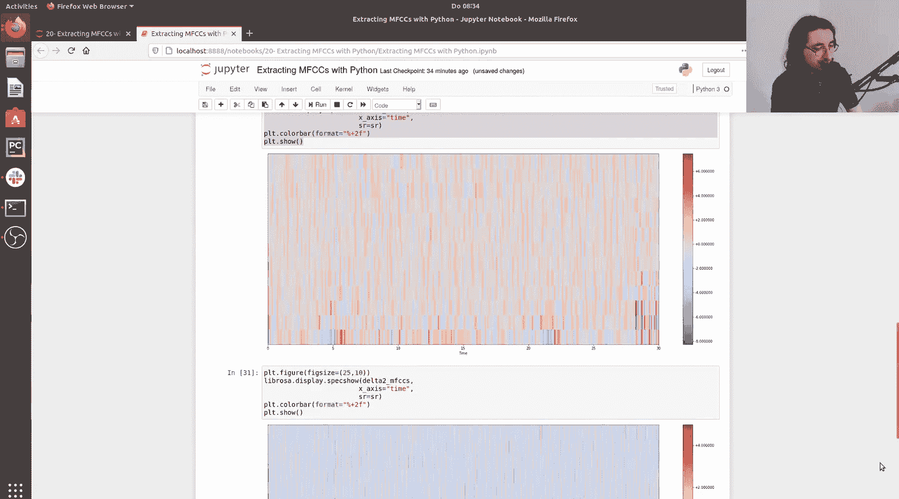

```python
plt.figure(figsize=(25, 10))
librosa.display.specshow(delta_mfccs, x_axis=‘time’)
plt.colorbar(format=‘%+2.0f dB’)
plt.show()
```

以下是可视化Delta-Delta MFCCs的代码：

```python
plt.figure(figsize=(25, 10))
librosa.display.specshow(delta2_mfccs, x_axis=‘time’)
plt.colorbar(format=‘%+2.0f dB’)
plt.show()
```

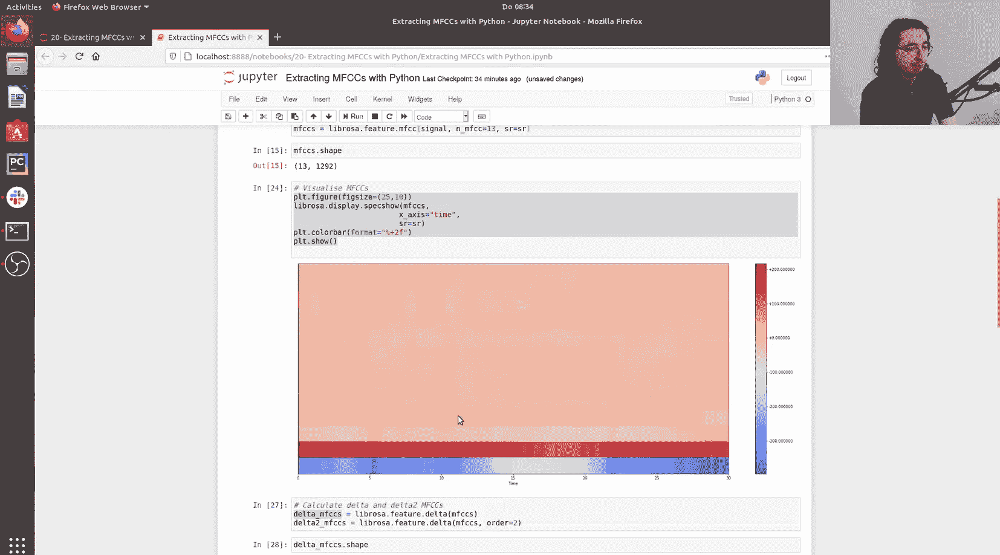

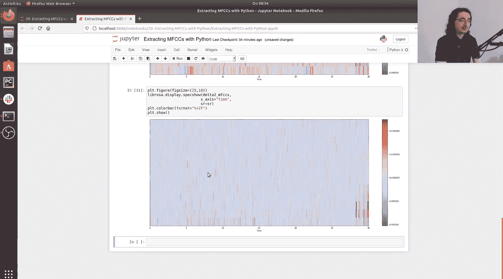

## 组合特征

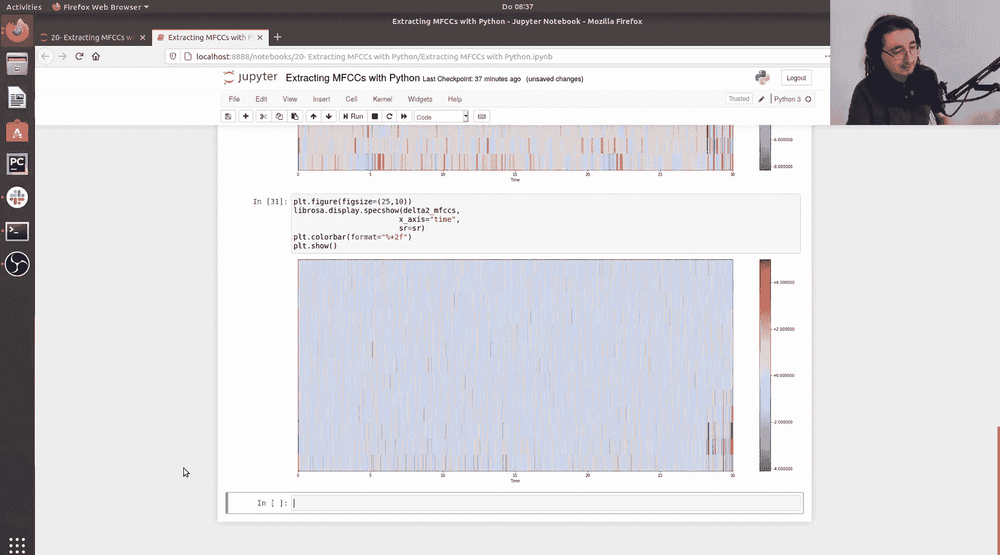

最后，我们可以将原始MFCCs及其一阶、二阶导数在特征维度上拼接起来，形成一个包含静态和动态信息的综合性特征向量。

以下是组合步骤：

```python
comprehensive_mfccs = np.concatenate((mfccs, delta_mfccs, delta2_mfccs))
```

查看组合后特征的形状，可以看到特征维度从13增加到了39。

```python
comprehensive_mfccs.shape
```

## 总结

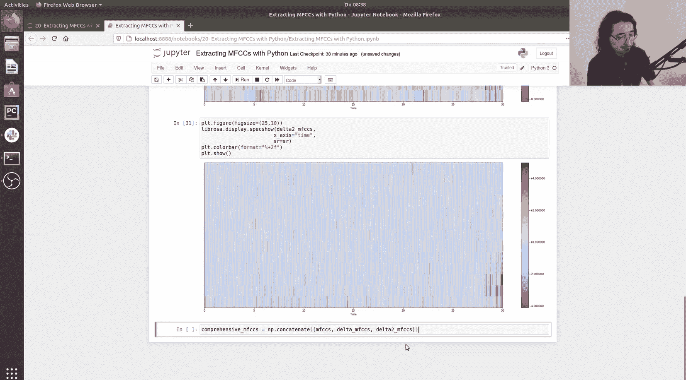

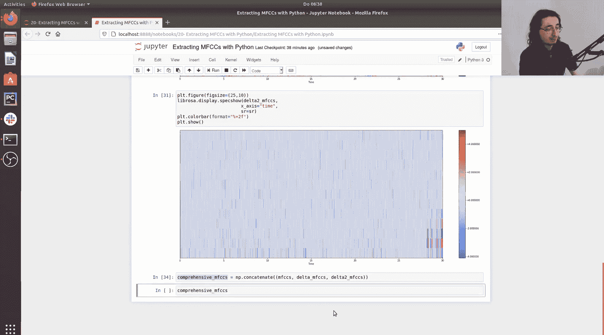

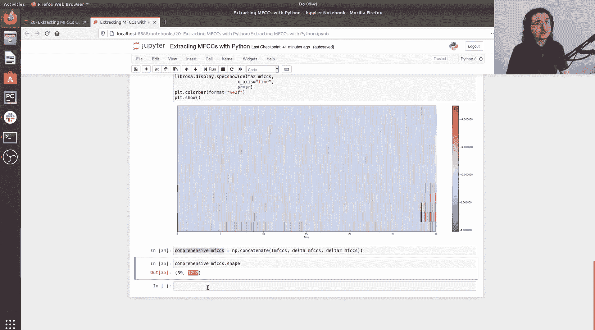

本节课中，我们一起学习了使用Python和Librosa库提取梅尔频率倒谱系数的完整流程。我们掌握了如何加载音频、提取MFCCs、将其可视化、计算并可视化其一阶和二阶导数，以及如何将这些特征组合成一个更全面的表示。现在，你应该能够将这些技术应用到自己的音频处理项目中。在下一节视频中，我们将探讨频域音频特征。