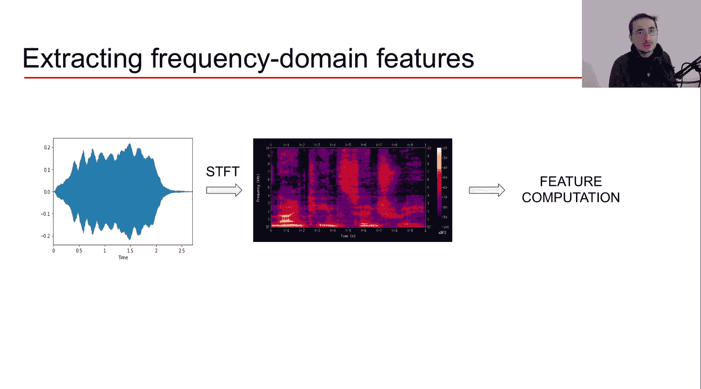
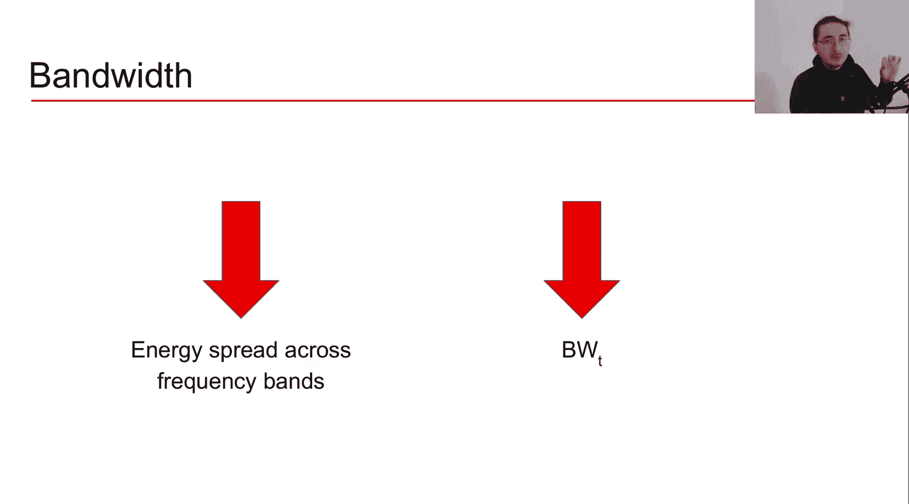
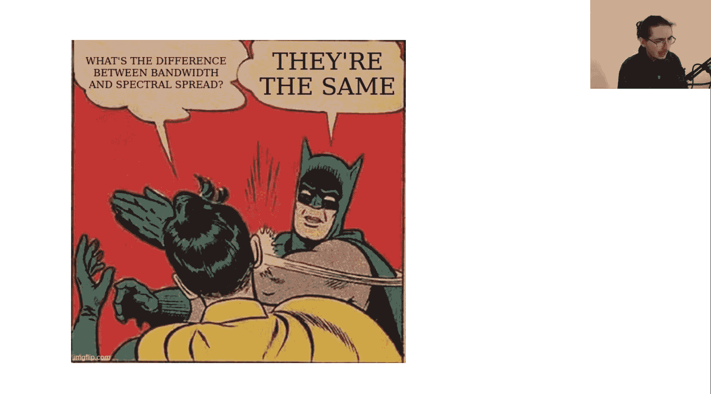
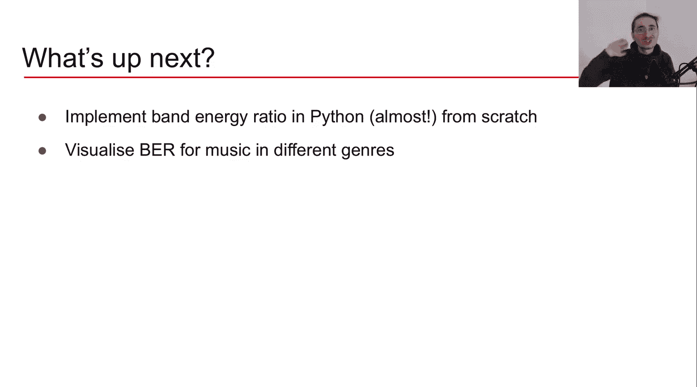

#  021：频域音频特征 🎵

在本节课中，我们将学习三种重要的频域音频特征：频带能量比、频谱质心和带宽。我们将探讨它们的数学原理、直观理解以及应用场景。

在之前的几节视频中，我们学习了梅尔频率倒谱系数。现在，我们将利用对傅里叶变换和短时傅里叶变换的深入理解，转向频域音频特征的分析。本节将重点介绍三种核心特征。

## 频带能量比 📊

频带能量比用于衡量信号中低频能量与高频能量的相对关系，可以理解为低频成分主导程度的指标。

以下是计算频带能量比的公式：



```
BER(t) = ( Σ_{n=1}^{F-1} |M_t(n)|^2 ) / ( Σ_{n=F}^{N} |M_t(n)|^2 )
```

其中：
*   `M_t(n)` 代表在时间帧 `t` 和频率仓 `n` 处的信号幅度。
*   `N` 是频谱图中的总频率仓数。
*   `F` 是分割频率，它将频谱划分为低频和高频两部分。

**核心概念解析**：
*   **分子**：计算从第1个频率仓到分割频率 `F-1` 的所有频率仓的功率（幅度平方）之和，即**低频带总能量**。
*   **分母**：计算从分割频率 `F` 到最高频率仓 `N` 的所有频率仓的功率之和，即**高频带总能量**。
*   **分割频率 `F`**：这是一个任意设定的阈值频率。通常设为2000赫兹，但可根据需要调整。低于 `F` 的为低频，高于 `F` 的为高频。

这个公式会应用于频谱图的**每一时间帧**，从而得到一个随时间变化的频带能量比序列。

**应用场景**：频带能量比在音频处理中用途广泛，尤其常用于区分音乐与语音，以及在音乐流派分类、情绪分类等问题中作为关键特征。

## 频谱质心 ⚖️

频谱质心提供了幅度谱的“重心”位置，即能量最集中的频率带。它与一个重要的听觉感知特征——**明亮度**——有很好的对应关系。声音越明亮，频谱质心通常越高。

频谱质心在数学上定义为频率仓的**加权平均值**。

其计算公式如下：

```
SC(t) = ( Σ_{n=1}^{N} n * |M_t(n)| ) / ( Σ_{n=1}^{N} |M_t(n)| )
```

**核心概念解析**：
*   **权重**：每个频率仓 `n` 的权重是该仓在时间帧 `t` 的幅度值 `|M_t(n)|`。
*   **加权平均**：公式计算的是所有频率仓编号 `n` 以其幅度为权重的加权平均。结果 `SC(t)` 就是一个代表能量重心的频率值。

**应用场景**：频谱质心是音频和音乐分类任务中最核心、最常用的频域特征之一，在各种应用中都有广泛的历史。

## 带宽 📏

带宽与频谱质心密切相关。我们可以将带宽理解为**围绕频谱质心的、有意义的频谱范围**，或者看作是能量分布相对于质心的**方差**。它同样与听觉感知特征（如音色）直接相关。

带宽在数学上定义为**各频率仓到频谱质心距离的加权平均值**。

其计算公式如下：

```
BW(t) = ( Σ_{n=1}^{N} |M_t(n)| * |n - SC(t)| ) / ( Σ_{n=1}^{N} |M_t(n)| )
```

**核心概念解析**：
*   **距离**：`|n - SC(t)|` 计算了每个频率仓 `n` 与当前帧的频谱质心 `SC(t)` 的绝对距离。
*   **加权平均**：同样以幅度 `|M_t(n)|` 为权重，对所有频率仓的这个距离值求加权平均。
*   **物理意义**：如果能量广泛分布在多个频率带上，带宽值会**增大**；如果能量集中在质心附近的少数频率带上，带宽值会**减小**。因此，带宽有时也被称为**频谱扩展**。



**应用场景**：与频谱质心类似，带宽也广泛应用于音乐流派分类、情绪分类等音乐信息检索任务。



## 总结与展望 🚀

本节课我们一起学习了三种基础的频域音频特征：**频带能量比**、**频谱质心**和**带宽**。它们都源于对短时傅里叶变换得到的频谱图进行计算，并在传统的机器学习时代（依赖于特征工程）被大量使用。虽然深度学习时代更倾向于使用频谱图或波形本身作为输入，但理解这些基础特征对于掌握音频分析的核心思想至关重要。

掌握了这些基本概念后，你将能更容易地理解其他更复杂的频域特征。



**下节预告**：本节我们探讨了这些特征的理论基础。下一节，我们将使用Python**从零开始实现**频带能量比特征，并将其应用于不同流派的音乐片段，可视化并观察是否能仅凭此特征区分它们。