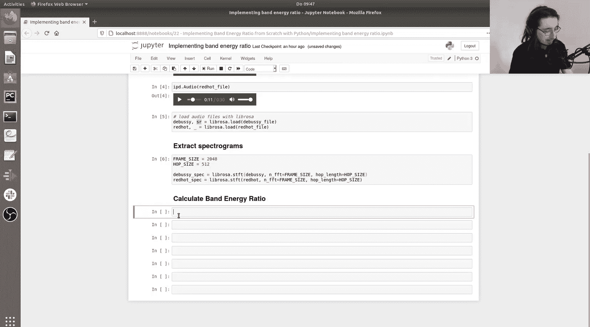
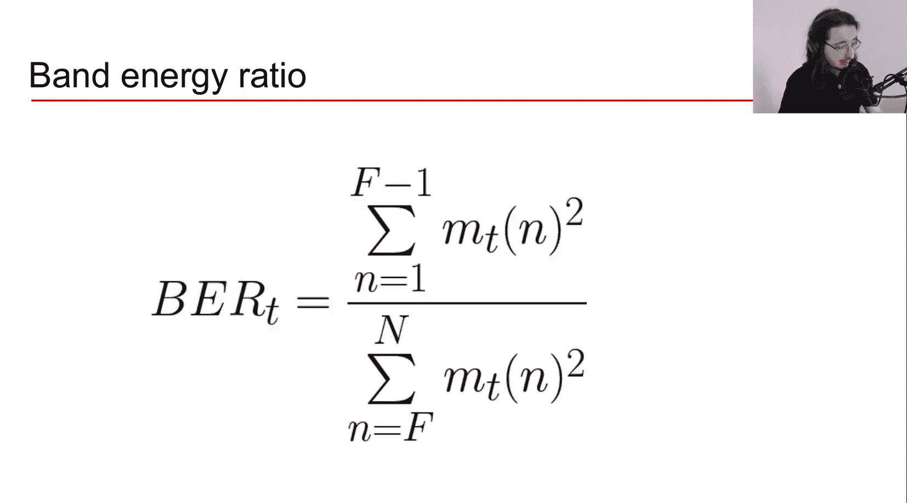
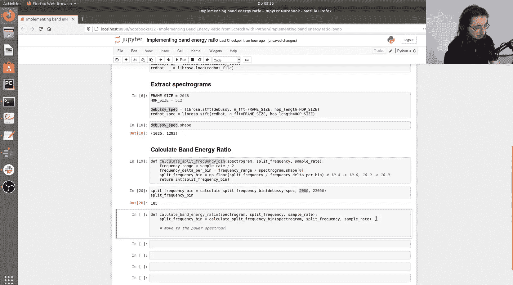
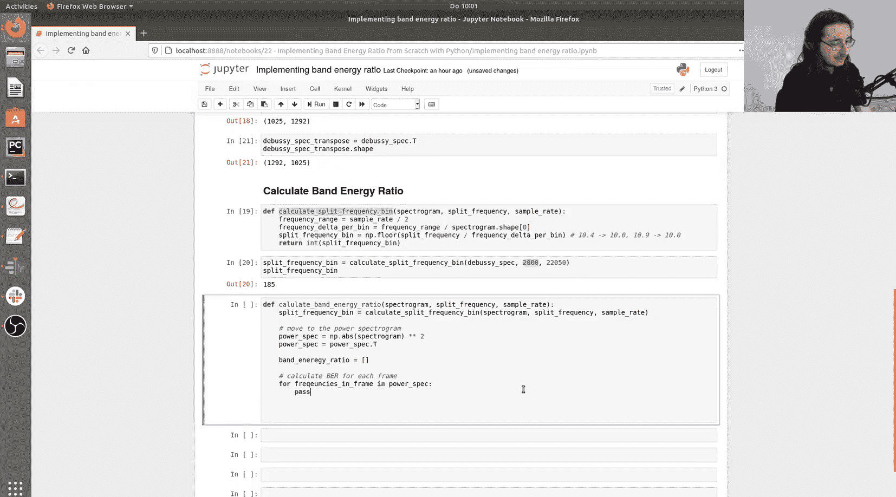
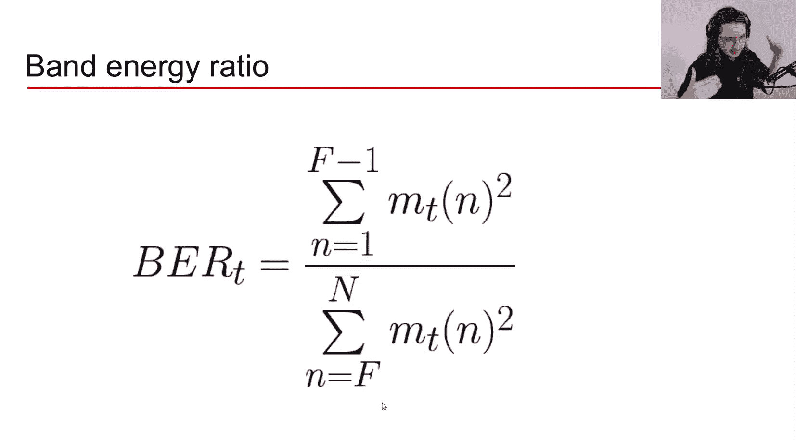
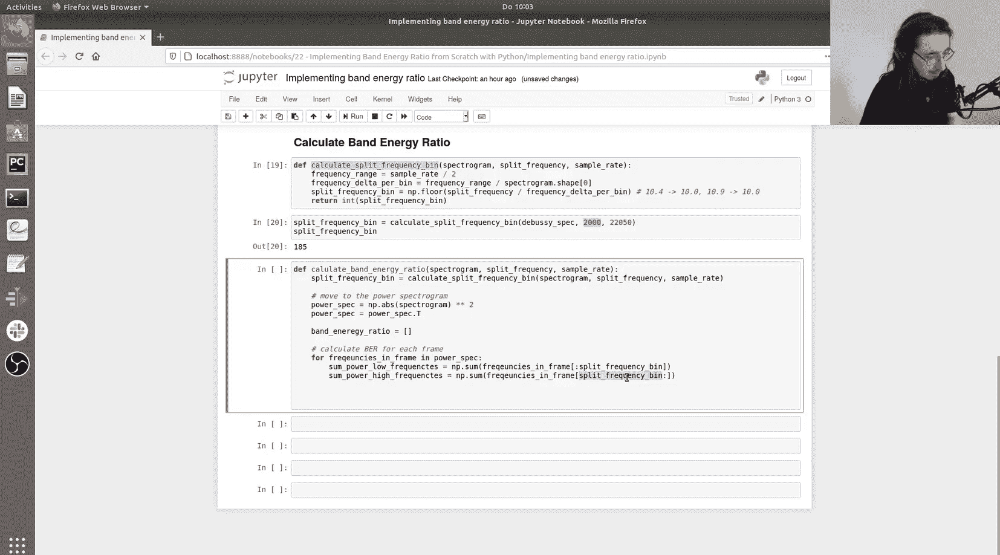
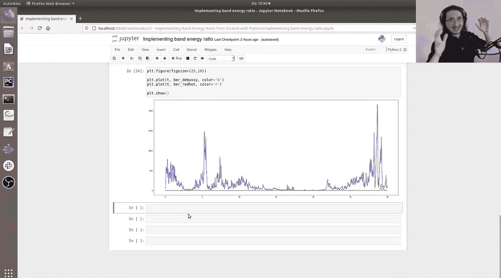

#  022：Python实现频带能量比

在本节课中，我们将学习如何从零开始，使用Python实现一个重要的频域音频特征——频带能量比。我们将通过分析两段不同风格的音乐（古典乐和摇滚乐），来直观地理解这个特征如何反映音频信号的频谱能量分布。

上一节我们介绍了几种频域音频特征的理论基础。本节中，我们来看看如何将其中一个特征——频带能量比——通过代码实现出来。

## 准备工作

首先，我们需要导入必要的库并加载音频文件。我们将使用两段音乐：一段是德彪西的古典乐，另一段是红辣椒乐队的摇滚乐。





```python
import librosa
import numpy as np
import matplotlib.pyplot as plt

# 加载音频文件
beethoven_path = ‘path_to_beethoven.wav’
rhcp_path = ‘path_to_red_hot_chili_peppers.wav’

beethoven_waveform, sr = librosa.load(beethoven_path, sr=22050)
rhcp_waveform, _ = librosa.load(rhcp_path, sr=sr)

# 定义帧长和跳数
frame_size = 2048
hop_size = 512

# 计算频谱图
beethoven_spec = librosa.stft(beethoven_waveform, n_fft=frame_size, hop_length=hop_size)
rhcp_spec = librosa.stft(rhcp_waveform, n_fft=frame_size, hop_length=hop_size)
```

## 计算分割频率对应的频点索引

频带能量比需要一个分割频率，将频谱分为低频和高频两部分。由于频谱图是离散的，我们需要一个函数将连续的频率值映射到最接近的离散频点索引上。

以下是实现此功能的步骤：



1.  计算频谱图覆盖的总频率范围（0 Hz 到奈奎斯特频率）。
2.  计算相邻频点之间的频率间隔。
3.  将给定的分割频率除以这个间隔，得到对应的浮点数索引。
4.  使用向下取整函数，将其转换为整数索引。


```python
def calculate_split_frequency_bin(spectrogram, split_frequency, sample_rate):
    """
    将连续的分割频率映射到频谱图最接近的离散频点索引。
    参数:
        spectrogram: 输入的频谱图（复数矩阵）
        split_frequency: 分割频率（Hz）
        sample_rate: 音频采样率
    返回:
        分割频率对应的频点索引（整数）
    """
    frequency_range = sample_rate / 2
    frequency_delta_per_bin = frequency_range / spectrogram.shape[0]
    split_frequency_bin = np.floor(split_frequency / frequency_delta_per_bin)
    return int(split_frequency_bin)
```

## 计算频带能量比

有了分割频点索引，我们就可以计算每一帧的频带能量比了。其定义为低频带能量之和与高频带能量之和的比值。

以下是计算频带能量比的核心步骤：



1.  获取分割频点索引。
2.  将复数频谱图转换为功率谱（取绝对值后平方）。
3.  转置功率谱，使第一维是时间（帧），第二维是频率，便于按帧迭代。
4.  遍历每一帧，分别计算低频部分和高频部分的能量和。
5.  将低频能量和除以高频能量和，得到该帧的频带能量比值。



```python
def calculate_band_energy_ratio(spectrogram, split_frequency, sample_rate):
    """
    计算频谱图每一帧的频带能量比。
    参数:
        spectrogram: 输入的频谱图（复数矩阵）
        split_frequency: 分割频率（Hz）
        sample_rate: 音频采样率
    返回:
        一个NumPy数组，包含每一帧的频带能量比值
    """
    split_frequency_bin = calculate_split_frequency_bin(spectrogram, split_frequency, sample_rate)
    
    # 转换为功率谱并转置，使时间维度在前
    power_spectrogram = np.abs(spectrogram) ** 2
    power_spectrogram = power_spectrogram.T
    
    band_energy_ratio = []
    
    # 遍历每一帧
    for frequencies_in_frame in power_spectrogram:
        sum_power_low_frequencies = np.sum(frequencies_in_frame[:split_frequency_bin])
        sum_power_high_frequencies = np.sum(frequencies_in_frame[split_frequency_bin:])
        
        ber_current_frame = sum_power_low_frequencies / sum_power_high_frequencies
        band_energy_ratio.append(ber_current_frame)
    
    return np.array(band_energy_ratio)
```



## 应用与可视化


现在，我们可以对两段音乐应用这个函数，并可视化结果以进行比较。

```python
# 设置分割频率为2000 Hz
split_freq = 2000

# 计算两段音乐的频带能量比
ber_beethoven = calculate_band_energy_ratio(beethoven_spec, split_freq, sr)
ber_rhcp = calculate_band_energy_ratio(rhcp_spec, split_freq, sr)

# 将帧索引转换为时间（秒）
frames = range(len(ber_beethoven))
times = librosa.frames_to_time(frames, hop_length=hop_size)

# 绘制结果
plt.figure(figsize=(25, 10))
plt.plot(times, ber_beethoven, color=‘blue’, label=‘Beethoven (Classical)’)
plt.plot(times, ber_rhcp, color=‘red’, label=‘RHCP (Rock)’)
plt.xlabel(‘Time (s)’)
plt.ylabel(‘Band Energy Ratio’)
plt.title(‘Band Energy Ratio Comparison: Classical vs. Rock’)
plt.legend()
plt.show()
```

## 结果分析

从生成的图表中，我们可以清晰地看到两条曲线的显著差异：
*   蓝色曲线（古典乐）的频带能量比值普遍远高于红色曲线（摇滚乐）。
*   这表明在古典音乐片段中，大部分声学能量集中在频谱的低频部分。
*   而在摇滚乐片段中，能量在频谱上的分布更为均衡，高频部分（如鼓、镲片等乐器产生的噪声）贡献了更多能量。

这种差异正是频带能量比特征能够有效区分不同音乐风格或音频事件的关键所在。

## 总结



本节课中我们一起学习了如何从零开始实现频带能量比。我们首先编写了将连续频率映射到离散频点的函数，然后实现了计算每一帧能量比的核心逻辑，最后通过可视化对比了该特征在古典乐和摇滚乐中的不同表现。频带能量比是一个简单但强大的特征，能够有效表征音频信号频谱能量的分布情况，在音乐信息检索和音频分类等任务中非常有用。下一节课，我们将学习如何使用`librosa`库来便捷地计算其他频域音频特征。