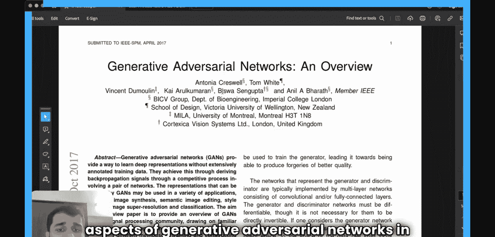
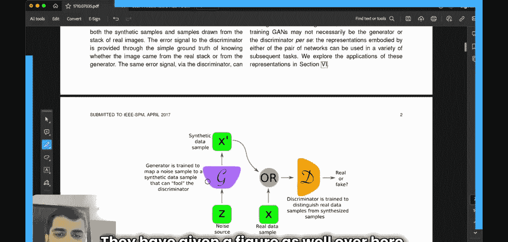
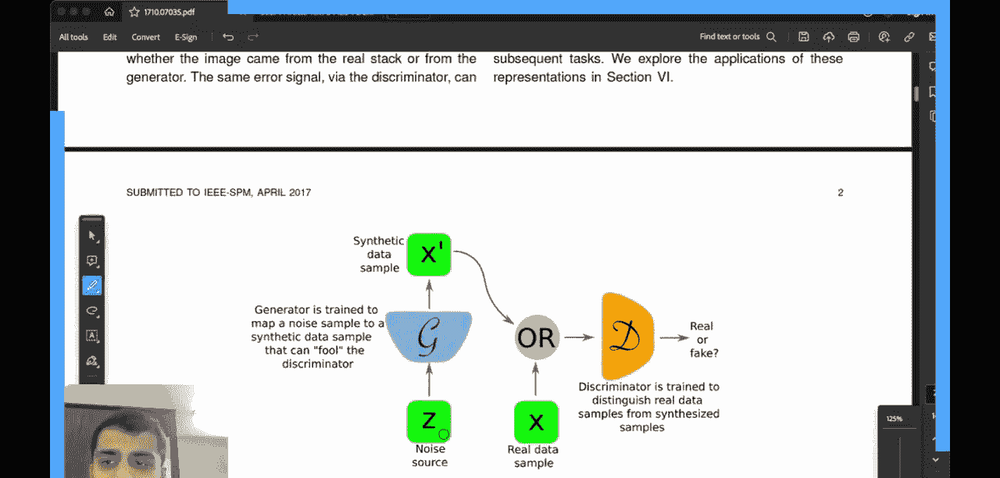
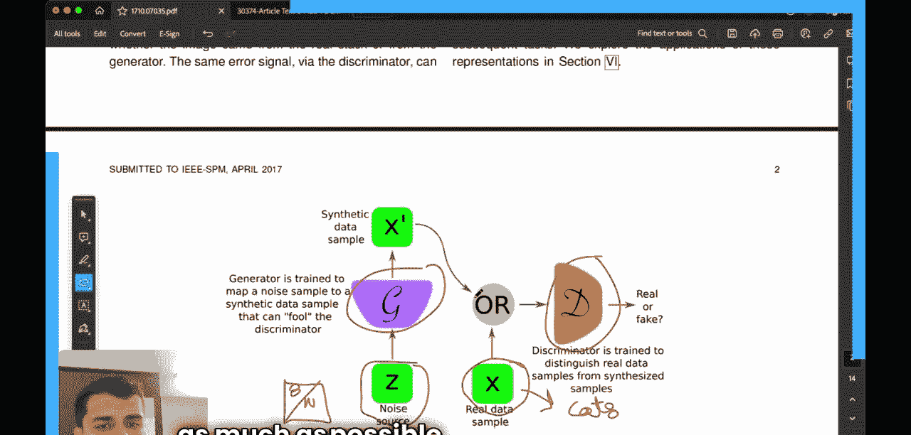

#  001：生成对抗网络 🎨🤖

在本节课中，我们将要学习生成对抗网络的基本概念。我们将从一篇2017年发表的综述性论文入手，逐步拆解GANs的核心思想、工作原理及其组成部分。课程将分为两部分，从最基础的概念开始，确保初学者能够跟上。

## 概述

这篇论文旨在为信号处理社区提供一个关于生成对抗网络的概述。GANs是一种无需大量标注训练数据即可学习深度表示的方法。它属于生成式模型，意味着它能观察一系列数据（如图像），并尝试生成在原始数据中不存在的新样本。

## 引言

上一节我们介绍了课程的整体目标，本节中我们来看看GANs的起源和基本类比。

生成对抗网络技术于2014年首次提出。其有趣之处在于，它同时训练一对相互竞争的神经网络。我们可以将这两个网络想象成一个艺术伪造者和一个艺术鉴定专家。伪造者被称为**生成器**，而鉴定专家被称为**判别器**。

## 核心架构与工作原理

上一节我们了解了GANs的基本类比，本节中我们来看看其具体的工作流程和架构。

以下是GANs的核心工作流程：

1.  **真实数据**：我们有一个真实的数据集，例如一系列猫的图像。
2.  **噪声输入**：生成器接收一个随机噪声向量作为输入。
3.  **生成样本**：生成器将噪声转换为一个合成数据样本（例如，一张“假”的猫图片）。
4.  **判别过程**：判别器同时接收真实数据样本和生成器产生的合成样本。
5.  **判别任务**：判别器的任务是判断其接收的样本是来自真实数据还是来自生成器。

初始时，生成器产生的样本质量很差，判别器能轻易识别出它们是假的。但随着训练的进行，生成器不断学习如何生成更逼真的样本以“欺骗”判别器，而判别器则不断学习如何更好地区分真假。两者在对抗中共同进步。

## 数学目标

上一节我们描述了GANs的动态过程，本节中我们来看看驱动这个过程的数学目标。

GAN的训练可以被形式化为一个**极小极大博弈**。生成器和判别器的目标函数是相互对抗的。

生成器的目标是生成尽可能逼真的数据，以最小化判别器做出正确判断的概率。其目标可以理解为让判别器对生成样本的判别输出接近1（即认为是“真”）。

判别器的目标是最大化其正确分类真实样本和生成样本的能力。其目标函数包含两部分：一是将真实样本判别为“真”，二是将生成样本判别为“假”。

这个博弈的纳什均衡点是生成器产生的数据分布与真实数据分布完全一致，此时判别器无法区分，对任何样本的输出概率都是0.5。

## 总结

本节课中我们一起学习了生成对抗网络的基础知识。我们从一篇综述论文出发，理解了GANs是一种无需标注数据的生成式模型。我们学习了其核心架构，包括**生成器**和**判别器**这两个相互对抗的网络，并通过艺术伪造的类比加深了理解。最后，我们探讨了驱动整个训练过程的**极小极大博弈**数学目标。GANs通过这种对抗性训练，最终使生成器能够产生足以“以假乱真”的数据样本。