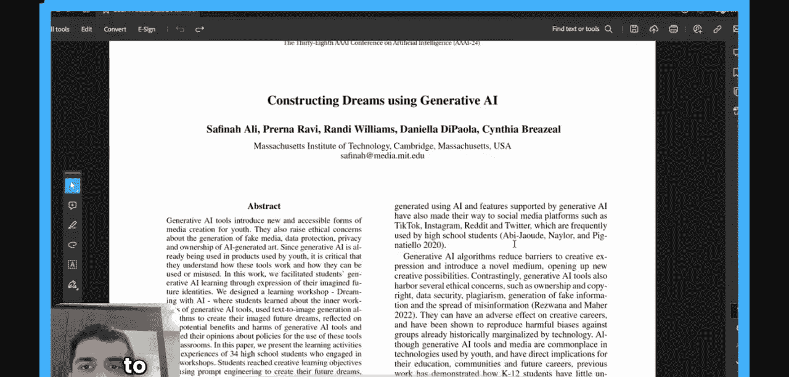

#  002：阅读你的第一篇AI论文 📄

在本节课中，我们将学习如何阅读一篇AI研究论文。我们将以一篇名为《使用生成式AI构建梦想》的论文为例，逐步拆解其内容，学习如何理解摘要、引言，并识别论文的核心概念与潜在的研究空白。

---

## 概述

本节课，我们将一起阅读一篇关于生成式AI在教育中应用的论文。我们将从摘要开始，理解论文的整体目标，然后深入引言部分，分析作者提出的问题、背景以及研究方法。通过这个过程，你将学习到阅读研究论文的基本步骤和关键点。

---

## 阅读摘要

首先，我们通过阅读摘要来获取论文的概览。摘要通常总结了研究的目的、方法、结果和结论。

这篇论文的作者让34名高中生接触了一系列生成式AI应用。作者要求这些学生创建他们想象中的未来梦想，同时试图理解生成式AI工具在此过程中的潜在益处和危害。

阅读摘要时，我思考了常见的生成式AI应用，例如ChatGPT和Midjourney。这篇论文吸引我的地方在于，它探讨了学生如何利用这些工具来构建未来梦想，并同时评估工具的利弊。这在当前时代尤为有趣，因为生成式AI很可能在未来全球的课堂中扮演某种角色。

---

## 深入引言部分

上一节我们了解了论文的总体目标，本节中我们来看看论文的引言部分。引言通常会阐述研究背景、问题定义以及现有研究的不足。

### 生成式人工智能的含义

引言的第一段解释了生成式人工智能的含义。与传统分类问题不同，生成式AI基于现有的文本和图像数据集训练算法。其输出不是概率，而是算法试图生成的**全新文本或图像**。这就是生成式人工智能的核心。我们已经看到有应用可以生成文本、图像、视频、3D模型等。其中，在蛋白质折叠方面的应用相当有趣。

OpenAI的ChatGPT于2022年12月左右发布，并在极短时间内获得了1亿用户，这十分引人注目。

### 生成式AI的优势与伦理关切

接下来的一段讨论了生成式AI的优势，即显著降低了创造性表达的障碍。我们已经通过使用ChatGPT看到了这一点，它可以用于广泛的创意目的。

同时，它们也可能被用于一些负面用途。作者以一种有趣的方式列出了伦理关切：
*   **所有权与版权**：当AI生成新内容时，很难确定它使用了哪些现有作品，且这些作品通常未被引用。
*   **数据安全**
*   **剽窃**
*   **虚假信息的生成与传播**

版权问题尤其令我感兴趣。最近在一次采访中，OpenAI的首席技术官也表示不清楚其新应用的数据来源。因此，我注意到这些应用存在伦理关切，特别是版权问题。它们也可能影响创意行业的就业机会，当然，这也取决于未来可能创造的新工作岗位数量，这仍有待辩论。

### 当前教育领域的空白

在这一段中，作者还将此与K12学生（指12年级以下的学生）联系起来。这些学生对这类工具的工作原理了解甚少，并且目前很少有为他们设计课程和学习材料的努力。

这很有趣，我注意到这是现有领域的一个空白：并非很多学生熟悉不同的生成式AI工具，目前也没有开发出能在年轻时向学生介绍如何正确使用生成式AI算法的课程。

### 研究的核心与目标

下一段特别吸引我，作者提到了几个要点。首先，请关注以下三点：
1.  当要求学生创造某物（例如创造未来的自己）时，这允许他们表达自我认同。
2.  它允许他们分享一些仅用语言可能无法表达的东西。
3.  第三点当然也很有趣，因为它提出了生成式算法的社会和伦理影响问题。

作者使用了Stability AI的Dream Studio平台，这很有趣，我之前没有用过这个特定平台。

引言最后聚焦于创造性、技术性和伦理性的学习目标：
*   **创造性学习目标**：教导学生如何在生成式AI工具中编写恰当的提示。
*   **技术性学习目标**：理解当前算法的能力和局限性。
*   第四点非常有趣，它试图聚焦于：**生成的图像中的模式实际上反映了底层数据中的模式**。例如，如果训练数据中特定肤色的人被赋予很多重要性，那么这将成为输出中反映的模式。因此，无论你想生成什么图像，都可能偏向于白人或者肤色较浅的人，这只是一个例子。
*   **伦理性学习目标**：我们已经讨论过潜在的危害，包括算法偏见、版权侵权、伪造媒体的创建。算法偏见之所以超级有趣，是因为它揭示了数据中的固有偏差如何影响AI的输出。

---

## 总结

本节课中，我们一起学习了如何开始阅读一篇AI研究论文。我们以《使用生成式AI构建梦想》为例，从摘要入手把握全局，然后深入引言，理解了生成式AI的定义、其优势与伦理挑战，以及当前在教育领域存在的空白。我们还识别了论文研究的核心目标：即探索学生如何利用生成式AI进行创造性表达，并同时培养其技术理解和伦理意识。在接下来的课程中，我们将继续阅读论文的其他部分，学习如何总结关键发现并识别文献中的研究缺口。