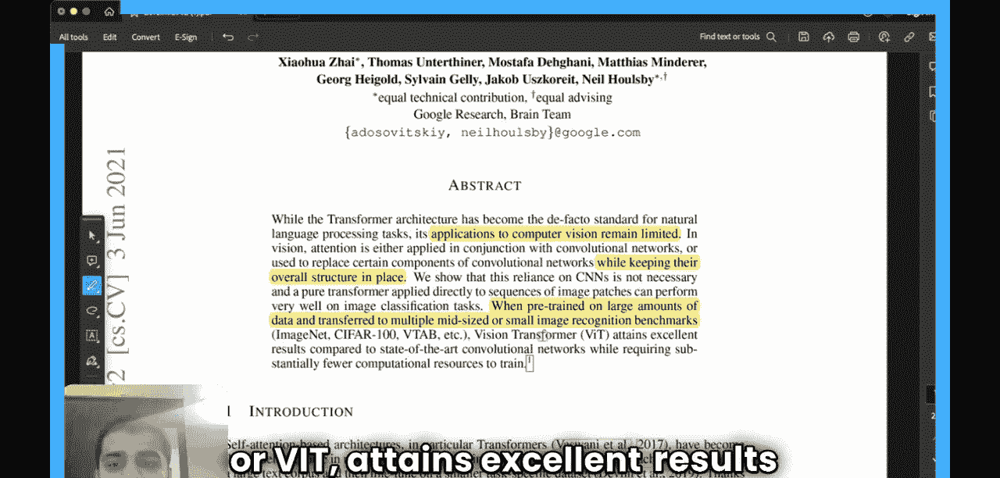
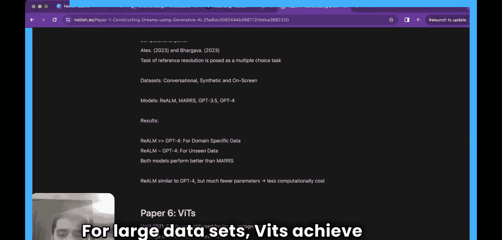

#  003：Vision Transformer基础

在本节课中，我们将学习一篇名为《一张图片值16x16个词：大规模图像识别中的Transformer》的论文。这篇论文探讨了如何将Transformer架构应用于计算机视觉任务，并介绍了Vision Transformer（ViT）模型。我们将逐步解析其架构、工作原理以及它为何如此强大。

## 概述

这篇论文由Google Research的Brain团队完成，并于2021年在ICLR会议上发表。它提出了一种名为Vision Transformer（ViT）的架构，用于图像识别任务。在此之前，Transformer架构虽已成为自然语言处理任务的事实标准，但在计算机视觉领域的应用仍然有限。

## 论文摘要解析

上一节我们介绍了论文的背景，本节中我们来看看摘要部分的核心内容。

摘要指出，在2021年之前，计算机视觉领域仍主要使用卷积神经网络。注意力机制要么与CNN结合使用，要么用于替换CNN的某些组件，但CNN的整体结构仍被保留。Transformer架构自2017年提出后，人们一直在尝试将其引入图像识别，但尚未完全取代CNN。

然而，当在大规模数据上进行预训练，并迁移到多个中等规模或小型的识别基准测试时，Vision Transformer（ViT）取得了优异的结果，其性能优于当时最先进的卷积网络。

以下是摘要中强调的几个关键点：
*   论文发表于2021年ICLR会议。
*   CNN当时仍广泛用于图像识别任务。
*   对于大型数据集，ViT实现了更好的性能。

## 研究动机与挑战

上一节我们了解了ViT的成果，本节中我们来看看研究者面临的挑战和他们的解决思路。

基于自注意力的架构，特别是Transformer，已成为自然语言处理的首选模型。其主流方法是在大型文本语料库上进行预训练，然后在较小的特定任务数据集上进行微调。得益于Transformer的计算效率和可扩展性，训练具有超过千亿参数的模型成为可能。

然而，在计算机视觉领域，卷积神经网络架构仍然占据主导地位。受NLP成功的启发，多项工作尝试将CNN架构与自注意力结合，但并未取得巨大成功。

受Transformer在NLP中缩放成功的启发，本研究尝试以最少的修改将标准Transformer直接应用于图像。具体做法是将图像分割成块（patches），并将这些块的线性嵌入序列作为Transformer的输入。图像块的处理方式与NLP应用中的词元（tokens）相同。

## Vision Transformer的核心思想

上一节我们提到了将图像转化为序列的思路，本节中我们来深入探讨其具体实现和面临的挑战。

当在中等规模数据集（如ImageNet）上训练时，Vision Transformer的准确率比同等规模的ResNet低几个百分点，这看似令人沮丧。然而，对于更大的数据集，它们表现得非常好，情况完全不同。我们将探讨其原因，这与CNN固有的**归纳偏置**有关。

首先，我们需要理解将注意力机制直接应用于图像的基本任务。在NLP中，对于一组词（例如5个词），注意力机制会构建一个5x5的矩阵。每个词都有对应的键、值和查询向量。矩阵中的条目数量（即计算量）随序列长度n呈**平方级**增长，即 `O(n²)`。

现在考虑图像。假设我们有一张5x5的图像。如果对每个像素应用自注意力，每个像素都需要关注图像中的其他所有像素。我们可以将整张图像视为一个长度为25的像素值序列。那么，所需的自注意力计算量将是 `25²`，即 `5⁴`。

因此，当将自注意力机制直接应用于原始图像时，所需的计算量非常巨大，且呈二次方增长。这可能是Transformer架构提出四年后，人们仍未能成功将其完全应用于图像任务的主要原因。

## 总结

本节课中，我们一起学习了Vision Transformer的基础。我们了解到，在ViT出现之前，计算机视觉领域仍严重依赖CNN，而直接应用Transformer到图像上会因计算复杂度（`O(n²)`）过高而难以实现。ViT的创新之处在于将图像分割为块并转换为序列，从而能够利用标准Transformer架构进行处理。我们还了解到，ViT在大型数据集上表现优异，但在中等数据集上可能不如CNN，这与模型的归纳偏置有关。