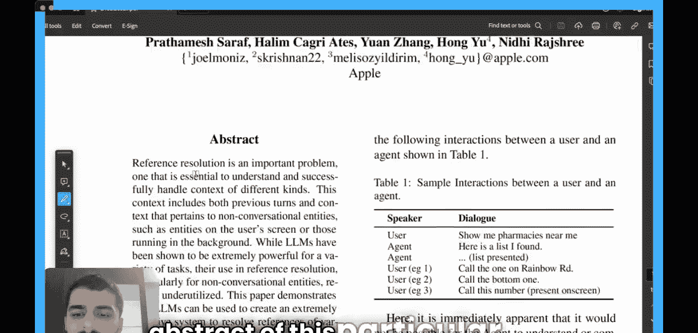
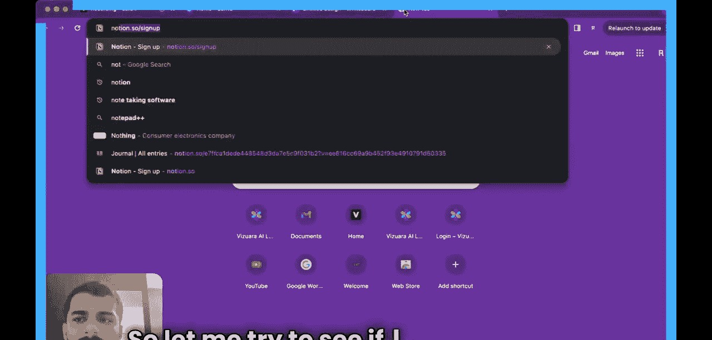
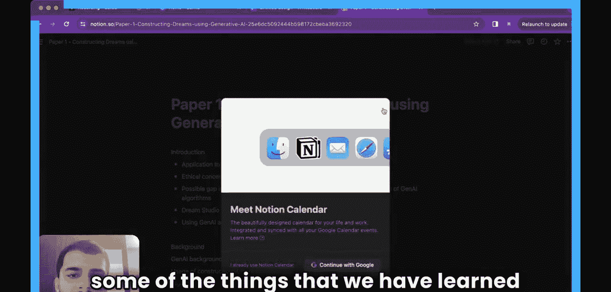
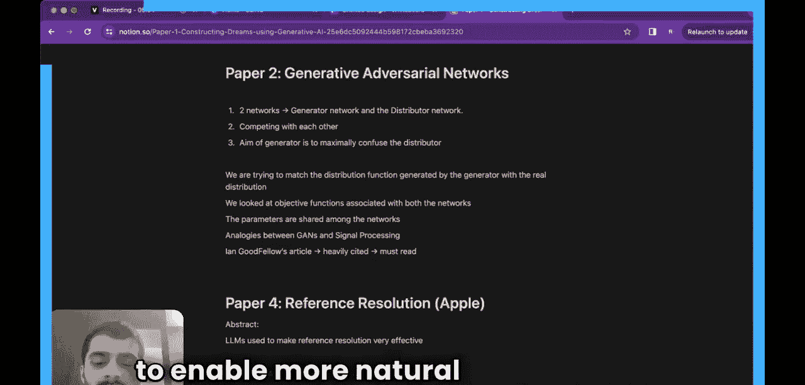
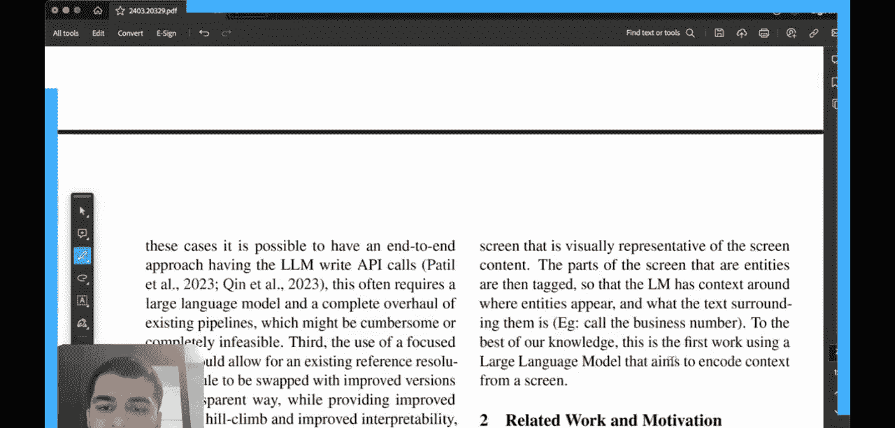
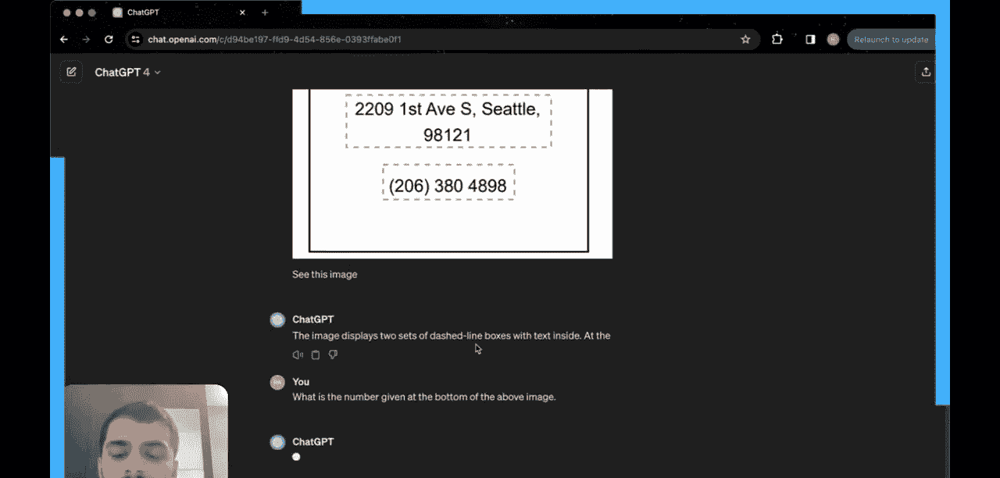
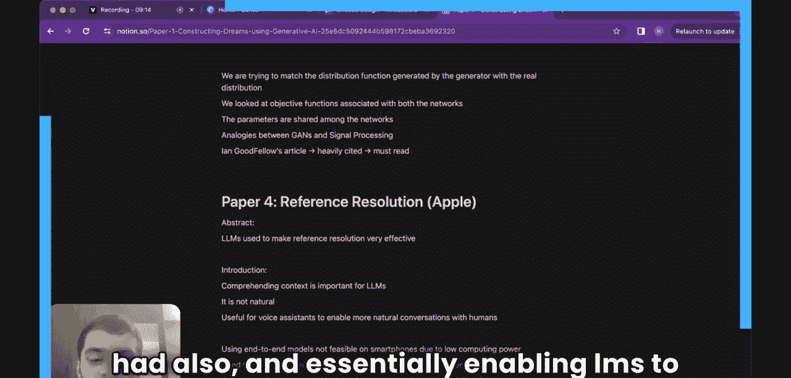

#  004：苹果的参考解析模型 (ReALM)

在本节课中，我们将学习苹果公司近期发布的一篇关于参考解析的论文。参考解析是理解上下文、实现自然对话交互的关键技术。我们将探讨如何利用语言模型来解决屏幕实体和对话中的模糊指代问题。

## 摘要与背景

上一节我们介绍了课程目标，本节中我们来看看论文的摘要和背景。

论文指出，参考解析对于理解和处理各种上下文至关重要。上下文包括先前的对话内容，以及非对话实体，例如用户屏幕上的元素或后台运行的应用。

大型语言模型（LLMs）已在多种任务上展现出强大能力，但它们在参考解析方面的应用仍未得到充分利用。本文展示了如何利用LLM构建一个极其有效的系统，以解析各种类型的指代。

人类语言通常包含模糊的指代，例如“他们”或“那个”。在给定上下文的情况下，其含义对人类来说是显而易见的。对于对话助手而言，理解包含此类指代的上下文至关重要。

例如，考虑以下交互：
1.  用户：“显示我附近的药店。”
2.  助手：提供一个药店列表。
3.  用户：“拨打Rabow路上的那一家。” 或 “拨打最下面那一家。” 或 “拨打屏幕上显示的这个号码。”

在这些后续查询中，用户并未明确提及具体药店名称，而是使用了与上下文相关的指代。这对人类来说很自然，但对AI助手而言，若不理解上下文，则难以完成用户请求。因此，**理解上下文**是实现更自然对话的关键。

## 现有方法的挑战

上一节我们了解了参考解析的重要性，本节中我们来看看当前方法面临的挑战。

论文指出，虽然端到端的大型语言模型体验强大，但在实际应用中存在几个问题：

1.  **设备端部署困难**：在智能手机等计算能力有限、功耗敏感的设备上，运行单个庞大的端到端模型是完全不可行的。
2.  **系统集成复杂**：当模型需要与上游API和组件集成并消费信息时，使用大型语言模型通常需要对现有流程进行全面改造，这可能非常繁琐甚至不可行。
3.  **模型更新不灵活**：使用一个专注的特定任务模型，可以透明地替换现有参考解析模型为改进版本。

因此，论文的核心观点是：在资源受限的设备上，使用**更小、更专注的模型**来完成参考解析任务是更可行的方案。

## 论文的核心创新

上一节我们讨论了现有方法的局限性，本节中我们来看看本文提出的解决方案。

在这项工作中，作者主张使用相对较小的语言模型，但对其进行专门针对参考解析任务的微调。这是本文带来的主要新颖之处。

此前已有一些类似的研究仅依赖于语言建模。这种方法在可以建模为序列到序列的任务上表现优异。然而，在语音助手中采用此技术的最大挑战在于解析对**屏幕上实体**的指代。

换句话说，论文致力于让语言模型能够“看见”。其核心目标是解决对**屏幕上元素**的参考解析，本质上是**赋予语言模型视觉感知能力**。

以下是论文中的一个示例，说明了“屏幕上实体”的含义：

假设上图是用户屏幕上的内容。用户可能会提出一个非直接的问题，而是引用屏幕上的某些信息，例如：“上面图片底部给出的数字是什么？” 模型需要理解“上面图片”和“底部”这些指代，并从提供的屏幕信息中找到正确答案。

本节课中我们一起学习了苹果公司ReALM论文的核心内容。我们了解了参考解析在对话AI中的重要性，分析了在移动设备上部署大型端到端模型面临的挑战，并探讨了本文提出的使用小型化、专门化语言模型来解决屏幕上实体指代问题的创新思路。这为在资源受限环境下实现更自然的对话交互提供了新的方向。