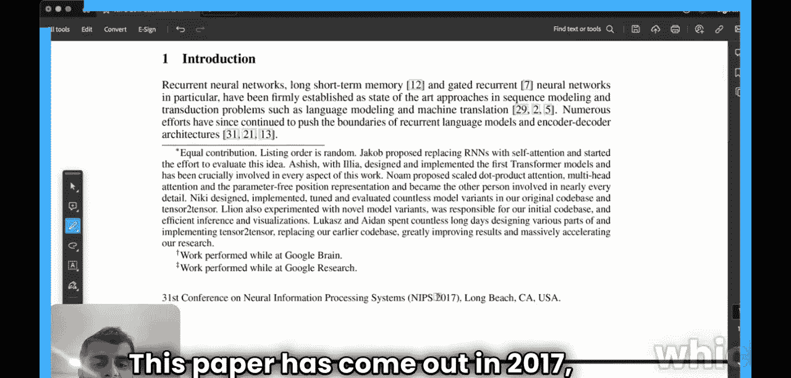
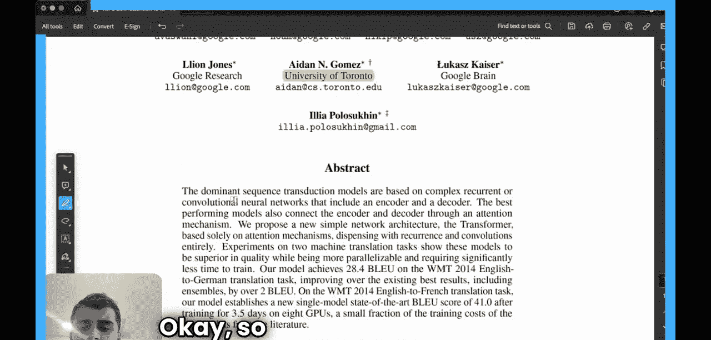

#  005：Transformer是什么？🌟

在本节课中，我们将一起学习一篇名为《Attention Is All You Need》的论文。这篇论文向世界介绍了Transformer的概念，是人工智能领域一篇极具开创性的论文。它推动了整个生成式智能领域的蓬勃发展，我们如今看到的ChatGPT等应用正是其结果。这篇论文初看可能并不起眼，但随着深入阅读，你会发现其精妙之处，正是这种简洁性使其显得优美。阅读后我意识到，论文中提出的模型架构至今仍被广泛沿用，改动甚少，这无疑说明了其工作的稳健性。同时，这也意味着我们在理解和预测语言的方式上，正越来越接近人脑的工作方式。可以说，这篇论文让我们在模仿人脑架构的道路上前进了一大步。它确实改变了整个领域，并提供了巨大的推动力。接下来，我们将详细解读这篇论文，理解其中概述的关键概念、生物机制和图表。我们不会预设任何先验知识，而是从头开始阅读和理解。

## 论文背景与引言

上一节我们提到了这篇论文的重要性，本节中我们来看看论文的基本信息和引言部分。

我们注意到，论文的作者来自Google Brain、Google Research和多伦多大学。这篇论文发表于2017年，距今已有七年。

在深入论文之前，我想提一下，关于“注意力”机制的思想并非首次在这篇论文中提出。实际上，这个概念可以追溯到2014年。当时发表那篇论文的教授并未将其命名为“注意力”，但他引入了这个想法。那篇论文的影响力不及本篇，但据说那位教授的灵感来源于某天在家思考自己如何学习英语的经历，并尝试采纳了那种方法。

无论如何，我们将从论文的引言部分开始。我们不会逐字阅读摘要，而是直接进入引言。

引言中提到：“循环神经网络、长短期记忆网络和门控循环神经网络，在序列建模和语言建模、机器翻译等转换问题中，已被确立为最先进的方法。”

我认为，为了进一步理解这篇论文，我们需要先弄清楚什么是循环神经网络以及它们如何工作。因此，让我们尝试更详细地理解它。

## 理解循环神经网络

上一节我们引出了循环神经网络的概念，本节中我们来详细看看它的工作原理。

假设你对神经网络一无所知。我们以循环神经网络为例来看。比如，我正在写这个句子：“I live in India. My mother tongue is...”，我们希望AI能补全这个句子。

首先，我想强调的是，我们在这里本质上要做的是……好吧，我们先来看看神经网络的基础知识，以便理解一些基本原理。

假设我们有一个变量 **x**。这个变量被输入到神经网络架构中。作为输出，我们得到变量 **y**。这是一个简单的前馈神经网络，其中 **x** 是输入，在这个块内发生了一些处理（即变换操作），然后得到 **y**。这是一个将 **x** 变换为 **y** 的函数。

现在，上面那个句子有8个单词。你可以用嵌入（本质上是一个向量）来表示每个单词。每个单词都可以表示为一个向量，你可以将这个嵌入作为输入传递到这里，并在此处获得输出。

然而，我们正在处理的这类问题与这个简单模型有很大不同。在这种方法中，我们可能有8个不同的单词，你需要8个像这样按顺序排列的网络。然后每个网络将单词作为输入，最后给出相应的输出。

但是，当你试图分析一个完整的句子时，不同单词之间存在相互关联，而这种简单的模型无法捕捉到这些关联。于是人们做了如下改进：

假设 **x** 是一个输入，它进入网络并给出输出 **y**。网络开始计算另一个变量，称为**隐藏状态**。假设第一个隐藏状态是 **h0**。这个隐藏状态被传递给下一个网络。所以现在下一个网络有两个输入：**x** 和 **h0**。它将给出另一个隐藏状态 **h1**，然后传递给下一个网络并产生另一个输出。

本质上，你拥有的函数 **f**，它以时间 **t** 的输入和 **t-1** 时刻的隐藏状态作为输入。公式如下：

**h_t = f(x_t, h_{t-1})**

然后，这个隐藏状态被馈送到下一个时间步 **t+1**。这就是循环神经网络。

在循环神经网络中，如果我要预测这里的某个东西，我就拥有了整个上文的信息。