#  006：卷积神经网络的起源

在本节课中，我们将学习卷积神经网络（CNN）的起源。我们将一起研读该领域的一篇开创性论文，了解其核心思想如何为现代CNN奠定基础。

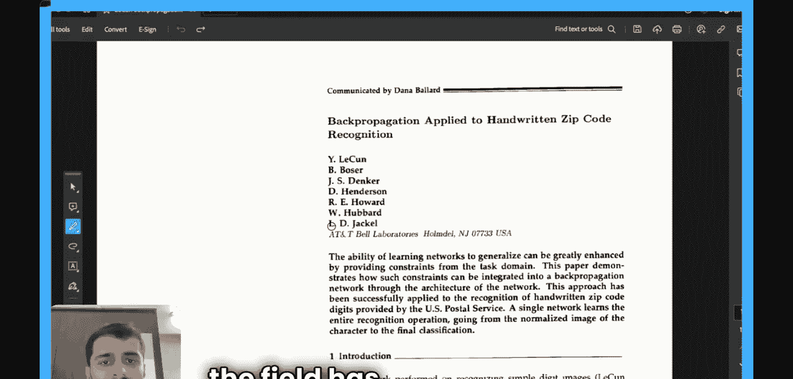

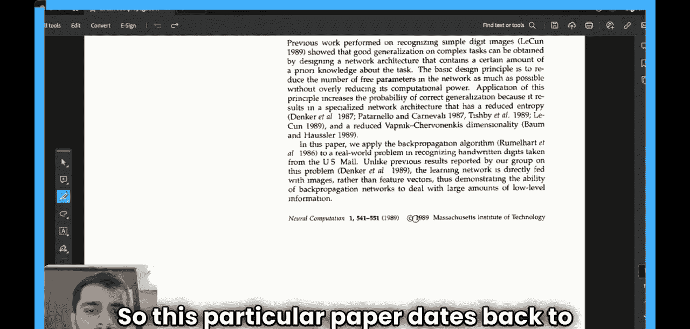

大家好，欢迎来到AI研究员训练营的第三节课。本节课的主题是卷积神经网络。

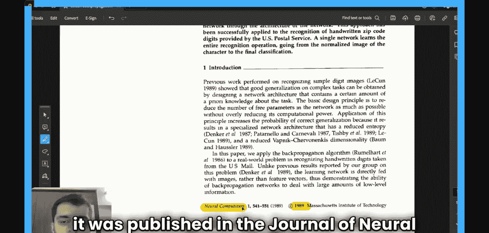

我选择研读该领域最早的一篇开创性论文。

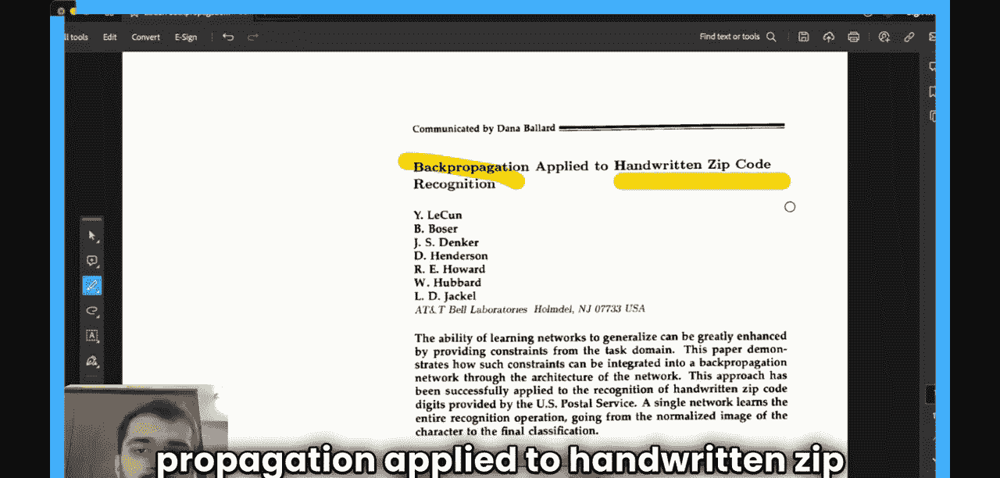

我希望理解自那以后该领域是如何演变的。

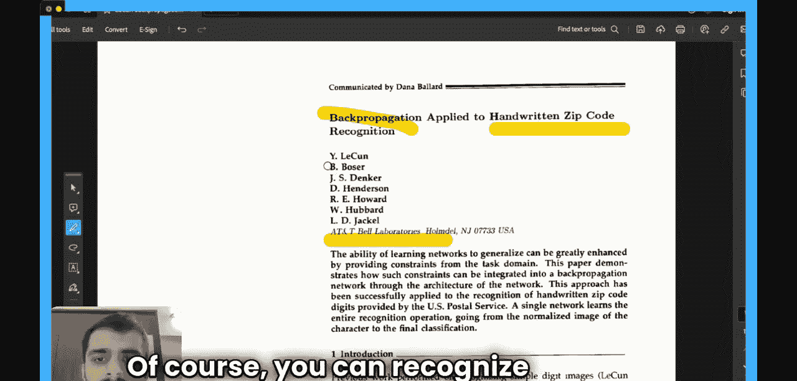

这篇论文发表于1989年。

它发表在《神经计算》期刊上。

论文的标题是《反向传播应用于手写邮政编码识别》。

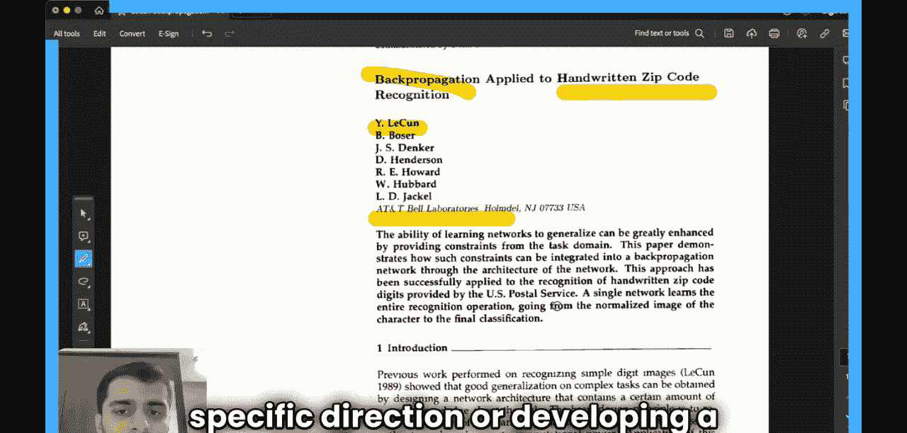

作者们似乎在美国AT&T贝尔实验室工作。当然，你可以认出Yann LeCun是这篇论文的第一作者。

这篇论文让我非常感兴趣，因为它发表于大约三十年前，真正奠定了我们现在经常看到并成为机器学习课程一部分的CNN的基础。但这些人是最早提出这一概念的先驱之一。我希望深入了解他们的思维方式，以及在撰写这篇论文之前的思考过程。显然，在那个时代，AI是一个正在快速发展的领域。没有人知道它将走向何方。因此，当时的研究很大程度上基于过去的成果，并试图改进它，而不是朝着特定方向发展或开发特定应用。

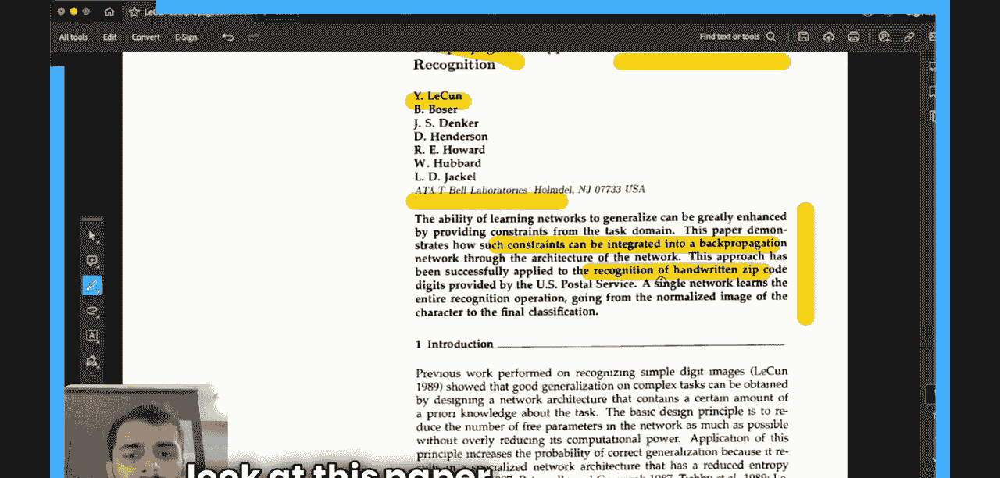

首先，我们来阅读这篇论文的摘要。

论文指出，它展示了如何通过网络架构本身将约束整合到反向传播网络中。

这种方法被用于识别由美国邮政服务提供的手写邮政编码数字。论文本身并未提及“卷积神经网络”这一术语，但作者们的描述方式是，他们希望将约束整合到反向传播网络中，并为此开发了一种全新的架构。

因此，我们将暂时忘记我们所知道的关于CNN的一切，尝试从一个全新的视角来审视这篇论文。

接下来，我们来看引言部分。从这篇论文的引言中，我看到大部分相关工作可追溯到1987年。从某种意义上说，这在当时是一个非常小众的领域，其研究并非始于70年代或60年代，而是可能在85或86年左右才开始。这些人是这个特定领域的先驱之一。

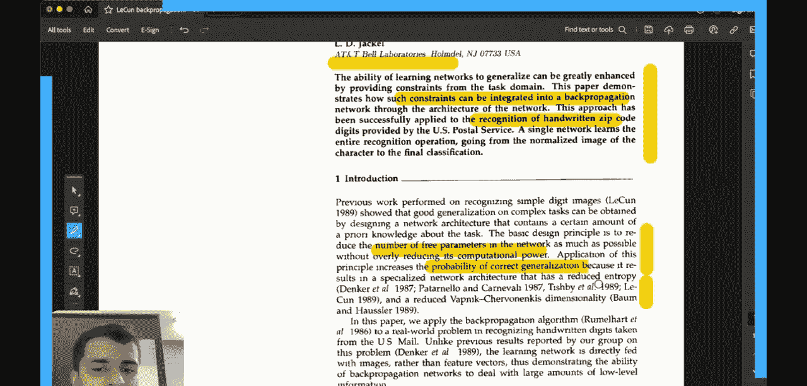

这篇论文的一个主要论点是，在设计神经网络架构时，其设计原则应该是网络中的自由参数数量应尽可能少。

他们认为，应用这一原则增加了正确泛化的可能性，因为它产生了一个具有更低熵的专用网络架构。

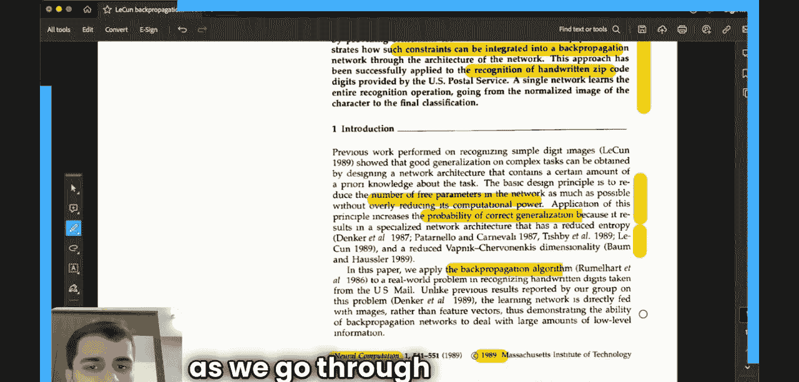

他们将这一原则和反向传播算法应用到了一个现实世界的问题中。他们选择的是手写邮政编码数字，而不是一般的手写数字，这些数字实际上由美国邮政服务提供。

请记住，当时机器的计算能力也不是很高。因此，在我们阅读不同段落时，请将论文发表的时代背景也考虑在内。

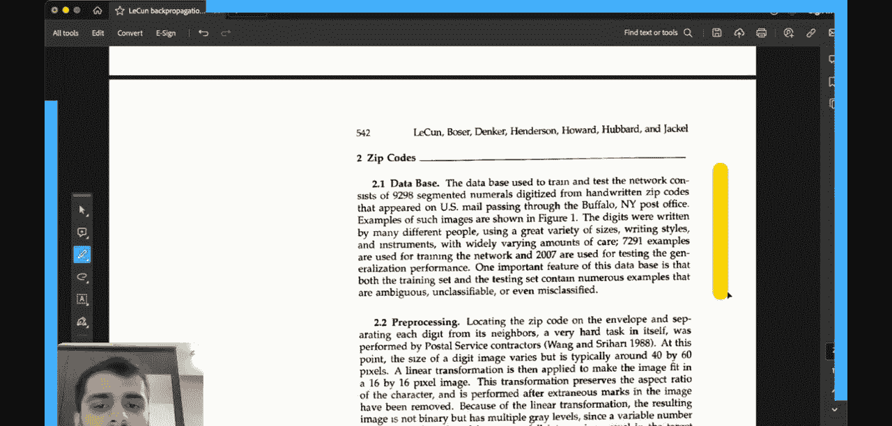

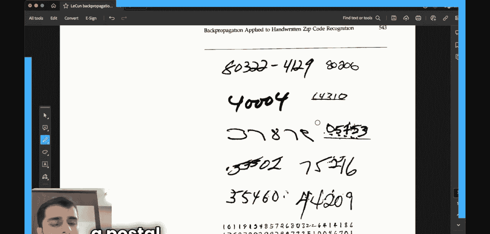

数据来源于经过纽约州布法罗的美国邮件。

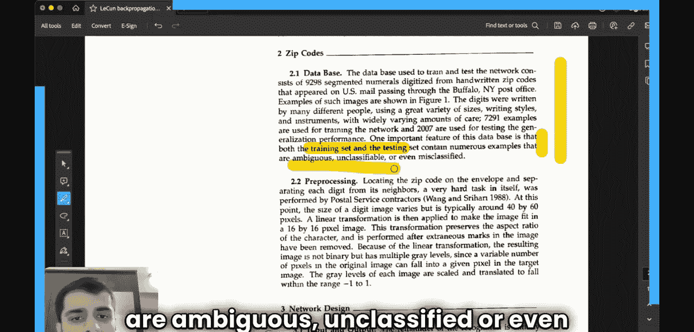

这些图像的示例如下所示，这些是人们在美国邮政系统中手写的邮政编码图像。

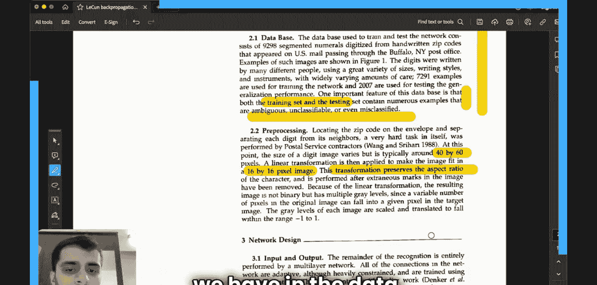

让我们看看这个数据集的最后一点，他们指出训练集和测试集都包含许多模糊、未分类甚至错误分类的样本。

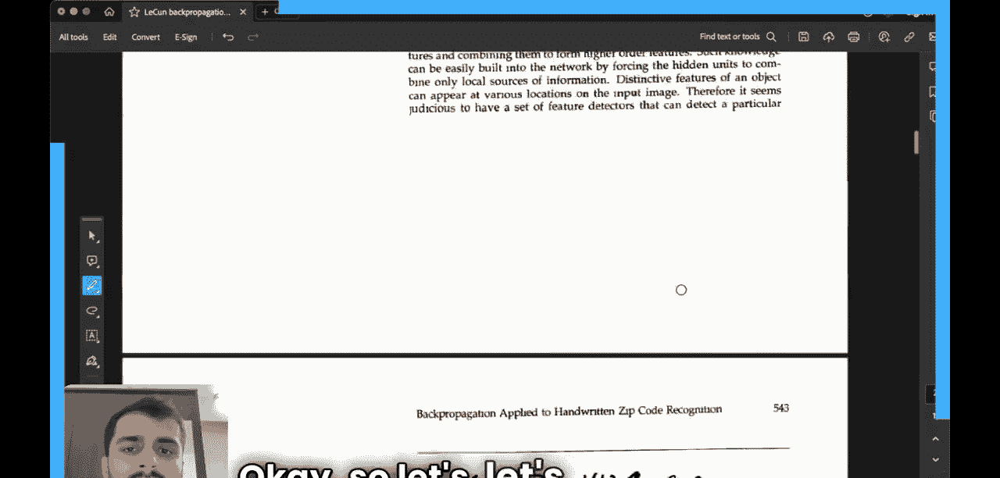

他们在这里进行了一个预处理步骤。每个数字图像通常约为40x60像素，他们执行了一个线性操作，将图像尺寸缩小到16x16像素。这个变换基本上保留了数据中每个图像的纵横比。

你可以参考这个示例图像。它有256个图像输入单元，因为图像已被缩放到16x16像素的尺度。接下来，我们继续看网络设计部分。

识别的其余部分完全由一个多层网络执行。所有的连接都是自适应的、高度受限的，并使用反向传播进行训练。

你可能已经注意到“高度受限”这个词被重复了多次。起初我并不完全理解这个词的含义，但随着深入我们会更详细地了解。另一个有趣的地方是，这个网络的输入是一个16x16的归一化图像。

我认为这可能是神经网络或图像处理历史上第一次将整个图像作为输入。以前，输入是向量或手动提取的特征。这篇论文带来的根本性改变是，它允许你将整个图像作为神经网络的输入。这正是这个设计如此有用的原因，因为它完全消除了手动预处理的需要。

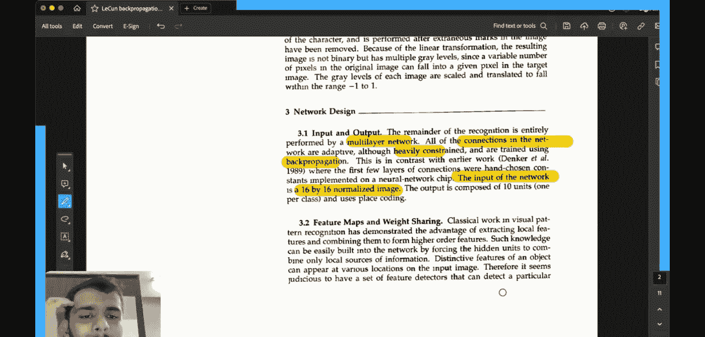

接下来，我们进入下一节：特征图和权重共享。这两个概念的确切含义是什么？

视觉模式识别的经典工作已经证明了提取局部特征并将其组合形成更高阶特征的优势。如果你以前使用过经典的卷积神经网络，你可能熟悉“特征图”这个词。让我尝试用简单的术语解释一下。

特征图是指，假设你有一张手写数字图像，比如1、2、3、4、5等，你试图从这张图像中提取不同的特征，这些特征可能是垂直边缘，或者是图像中存在的不同组件的水平边界。特征是构成整个图像的组成部分。因此，如果我们要对图像进行分类，提取所有特征并理解这些特征是非常有意义的。我们将在后续内容中更详细地探讨这一点。

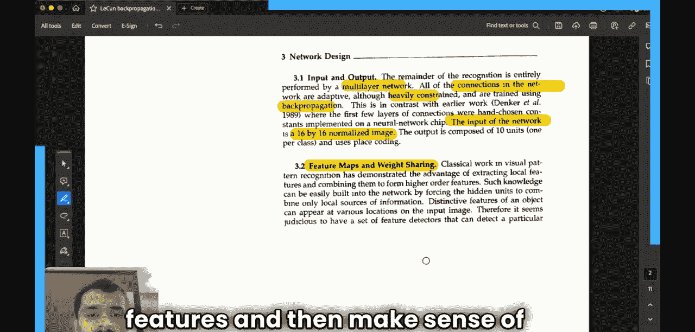

在我们继续之前，请记住“特征图”这个词。

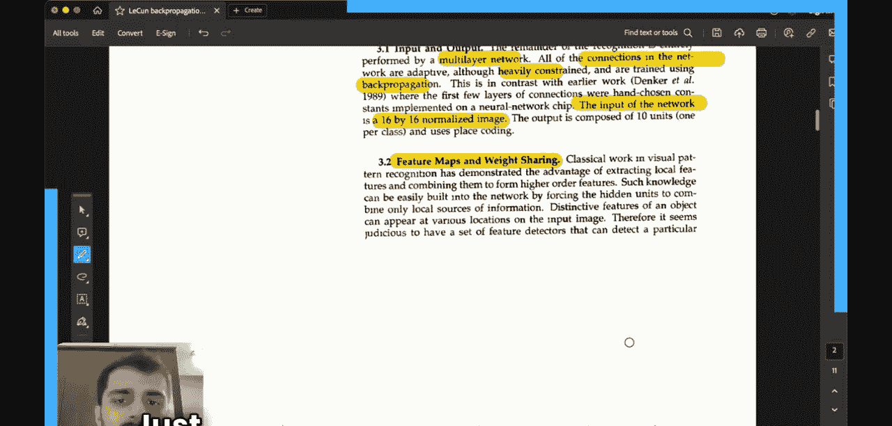

你看到的另一个术语是“权重共享”。我认为这是这篇论文实现的主要创新之一。他们说，权重共享不仅大大减少了自由参数的数量。

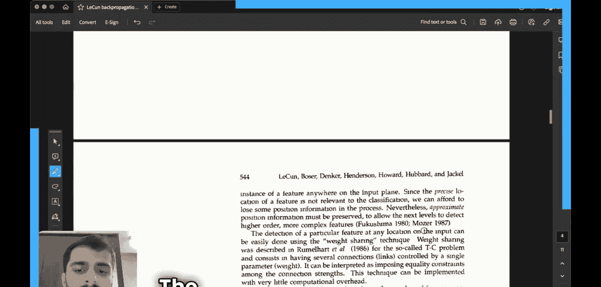

而且可以表达关于任务几何和拓扑结构的信息。我们将详细探讨其含义。

---

**本节课总结**

在本节课中，我们一起学习了卷积神经网络的起源。我们研读了1989年Yann LeCun等人的开创性论文《反向传播应用于手写邮政编码识别》。我们了解到，这篇论文的核心思想是通过设计特定的网络架构（如权重共享和特征提取）来整合约束，从而减少自由参数数量并提高泛化能力。这为现代卷积神经网络奠定了基础，并首次实现了将原始图像直接作为神经网络输入，消除了对手动特征提取的依赖。