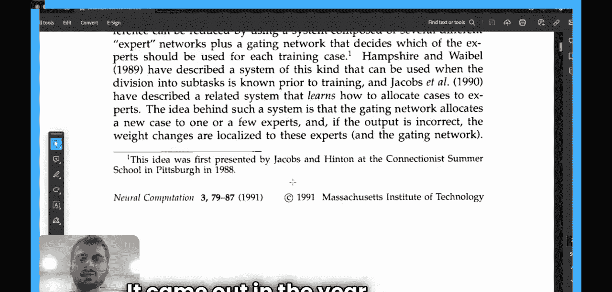
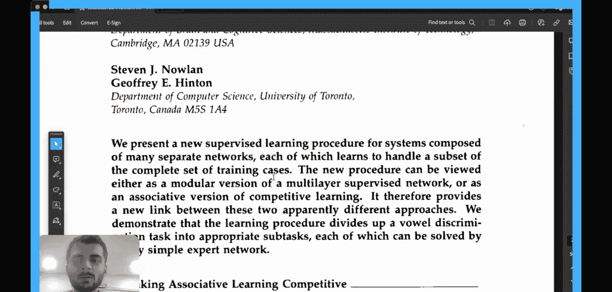
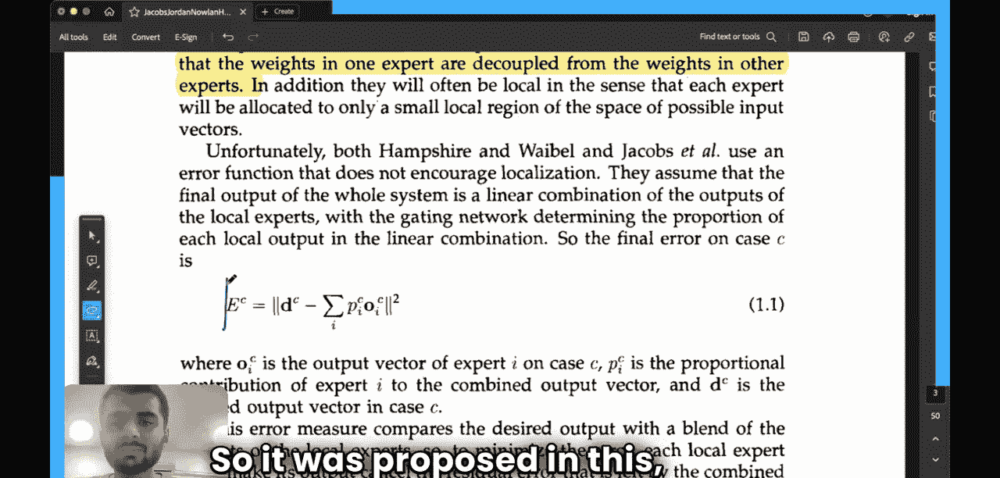

#  007：混合专家模型基础 🧠

在本节课中，我们将学习混合专家模型的基本概念。我们将通过一篇名为《自适应局部专家混合》的开创性论文来理解其核心思想、架构和背后的直觉。混合专家模型近年来变得非常流行，例如一些大型语言模型就采用了此架构。本节课将帮助你理解其基本原理。




## 论文简介



这篇论文由Robert Jacobs、Michael Jordan、Stephen Noland和Geoffrey Hinton共同撰写，发表于1991年的《神经计算》期刊。它是首次系统性地提出“混合专家”思想的奠基性论文之一。

## 核心思想：为何需要混合专家？

上一节我们介绍了论文的背景，本节中我们来看看作者试图解决什么问题。

传统的做法是训练一个单一的多层网络来执行所有任务。然而，当训练集可以自然地划分为对应于不同子任务的子集时，这种方法会产生强烈的“干扰效应”，导致学习速度慢和“过度泛化”。

为了更直观地理解，让我们看一个具体的例子。假设我们要构建一个分类器，用于区分四种类别：小写字母“i”、大写字母“I”、小写字母“m”和大写字母“M”。

*   **传统单一网络方法**：训练一个网络同时学习区分这四种类别。由于“i”和“I”、“m”和“M”在特征表示上非常接近，网络在学习时可能会产生干扰，影响学习效率和精度。
*   **混合专家方法**：我们可以使用两个不同的网络（称为“专家网络”）：
    *   **专家一**：专门负责区分“i”和“I”。
    *   **专家二**：专门负责区分“m”和“M”。

这种方法假设，如果我们能将先验信息（即类别可分组）注入模型，训练可能会更快，且网络间的干扰会减少。因为每个专家只需专注于自己的子任务，无需处理不相关的信息。

那么，对于一个给定的输入（例如一个字母），系统如何决定使用哪个专家呢？这就需要引入一个“门控网络”。

## 关键组件：专家与门控网络

上一节我们提到了使用多个专家的优势，本节中我们来看看系统是如何协调这些专家工作的。

混合专家系统由两个核心部分组成：**专家网络**和**门控网络**。

*   **专家网络**：每个都是专门处理输入空间中某个特定区域的神经网络。在我们的例子中，就是那两个分别处理“i/I”和“m/M”的网络。
*   **门控网络**：它的作用类似于一个“面试官”或“调度员”。它学习观察输入，并决定将多少“权重”或“注意力”分配给每个专家。对于处理“i”或“I”的输入，门控网络会给专家一分配高权重，给专家二分配低权重，反之亦然。

这种设计的核心思想是：门控网络将一个新的输入案例分配给一个或少数几个专家。如果输出不正确，权重的更新将**高度局部化**于这些活跃的专家，而不会影响其他专家的权重。

## 模型架构与公式化描述

理解了基本概念后，我们现在来看看如何用数学公式来描述这个系统。

我们可以将整个输入空间想象成一个区域，并被划分给不同的专家。每个专家负责一个子区域。目标是构建一个架构或定义目标函数，使得每个专家网络的权重更新独立于其他专家。

以下是描述混合专家系统输出的核心公式：

```
y = Σ (g_i * y_i)
```

其中：
*   `y` 是整个混合专家系统的最终输出。
*   `g_i` 是门控网络为第 `i` 个专家生成的权重（或概率），满足 `Σ g_i = 1`。
*   `y_i` 是第 `i` 个专家网络对该输入产生的输出。


这个公式意味着，系统的最终输出是所有专家输出的加权和，权重由门控网络根据当前输入动态决定。

## 总结



本节课中，我们一起学习了混合专家模型的基础知识。我们了解到，与使用单一网络处理所有任务相比，混合专家模型通过使用多个专门的“专家”网络和一个负责调度的“门控”网络，能够减少学习过程中的干扰，实现更快速、更高效的学习。其核心思想是将复杂的任务空间分解，让不同的专家处理不同的子区域，并通过门控机制灵活组合它们的输出。这个在1991年提出的思想，为后来许多高效的机器学习模型奠定了基础。