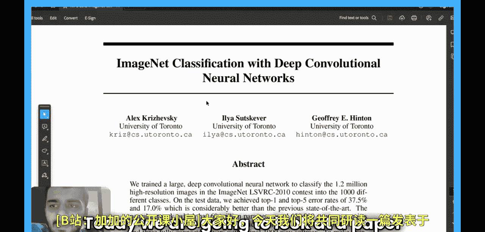
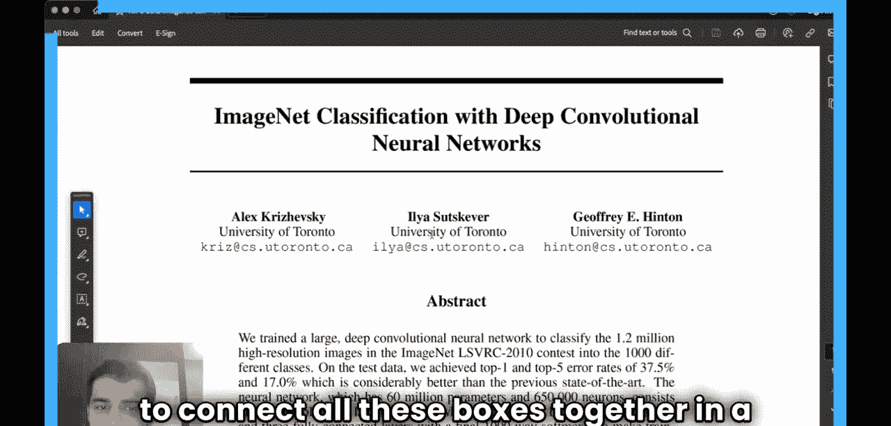
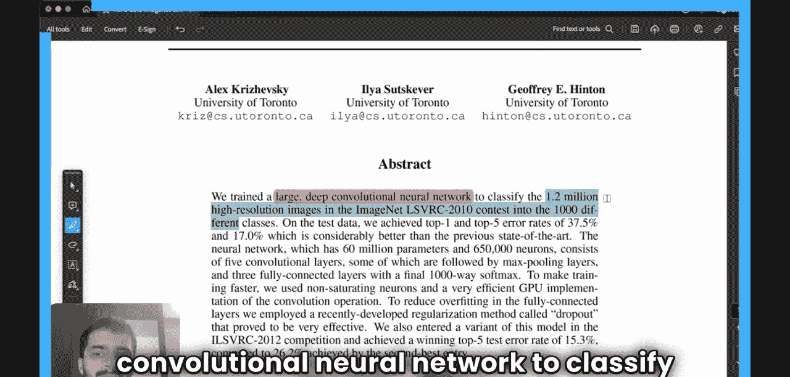
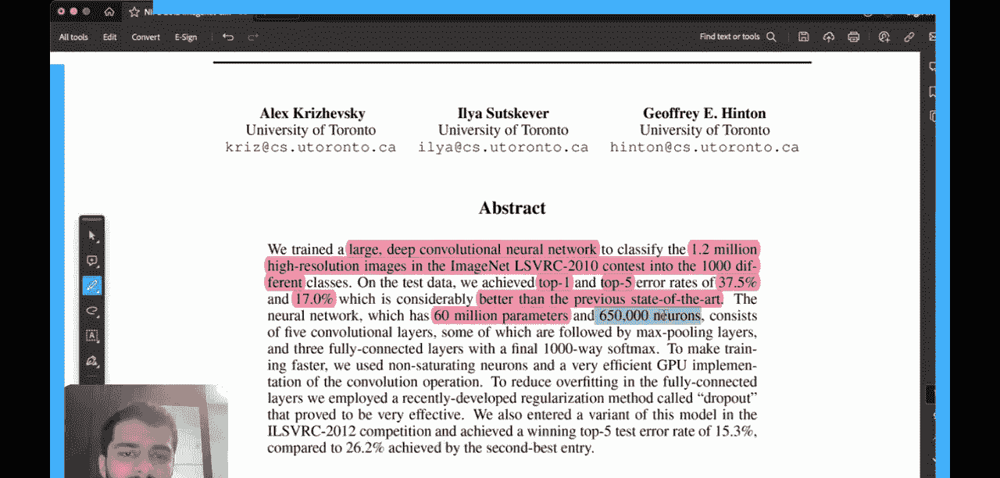
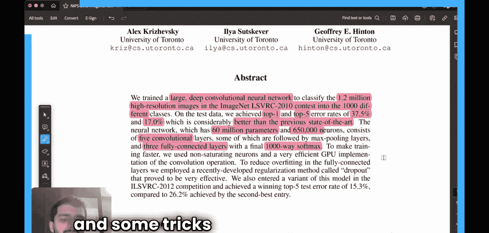
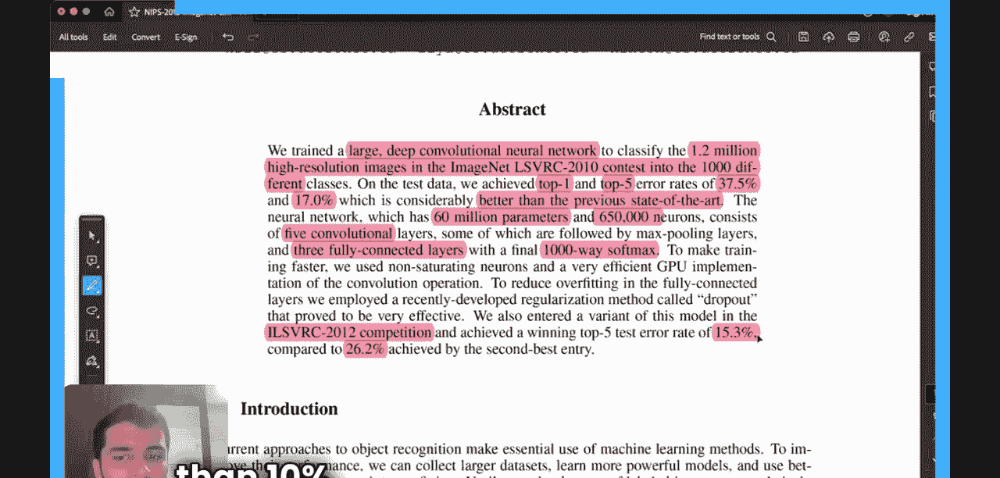
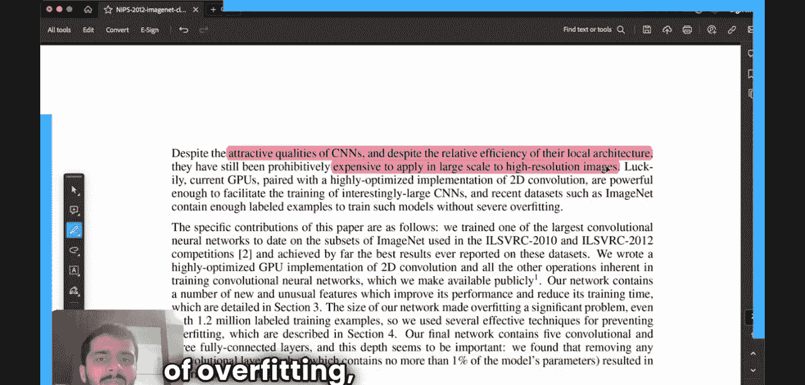

#  008：使用深度卷积神经网络进行ImageNet分类 🖼️

在本节课中，我们将学习一篇发表于2012年的经典人工智能论文。这篇论文的标题是《ImageNet Classification with Deep Convolutional Neural Networks》，作者包括Geoffrey Hinton、Ilya Sutskever和Alex Krizhevsky。这篇论文之所以重要，是因为它首次展示了构建非常深的卷积神经网络（CNN）的可行性，并通过一系列技巧的组合，在ImageNet图像分类挑战赛上取得了突破性的成绩。

## 摘要 📝

论文作者训练了一个大型深度卷积神经网络，用于对ImageNet LSVRC-2010竞赛中的120万张高分辨率图像进行分类。该网络在分类挑战中取得了前1错误率37.5%和前5错误率17.0%的成绩。这个成绩在当时显著超越了之前的最佳水平。

该网络规模庞大，包含约**6000万个参数**和**65万个神经元**。其架构由**5个卷积层**、**3个全连接层**以及一个最终的**1000路softmax分类器**组成。论文还介绍了一些用于提升性能和防止过拟合的技巧。

在2012年的ImageNet竞赛中，该网络的变体取得了**15.3%**的前5测试错误率，以超过10个百分点的优势赢得了比赛。

## 引言 🔍

上一节我们了解了论文的总体成就，本节中我们来看看其研究背景和动机。

当时的物体识别方法主要依赖于机器学习。提升性能的途径包括：收集更大的数据集、学习更强大的模型以及使用更好的技术来防止过拟合。

值得注意的是，直到那时，带标签的大型图像数据集（如LabelMe和ImageNet）才开始出现。ImageNet本身拥有超过1500万张高分辨率图像，涵盖22000多个类别，而LSVRC挑战赛只使用了其中120万张图像和1000个类别，这仍然是一个巨大的数据集。

在2012年之前，神经网络在手写数字识别等任务上已接近人类水平。然而，物体图像识别面临着更大的挑战，因为图像存在巨大的尺度、姿态和光照变化。因此，当时的模型性能并不理想。

论文作者认为，需要一个具有**强大学习能力**的模型来应对这个复杂任务。卷积神经网络（CNN）就是这样一类模型，它通过其结构引入了对图像特性的**归纳偏置**。CNN的能力可以通过调整其**深度**和**宽度**来控制。尽管CNN具有局部连接的效率优势，但由于计算成本过高，此前一直未被大规模应用于高分辨率图像。

阻碍CNN应用于深度网络的主要有两个原因：一是对**过拟合**的担忧，即网络可能只是记住了训练数据而非学习通用特征；二是当时可用的**计算资源**有限。

## 网络架构 🏗️

上一节我们讨论了应用深度CNN的挑战，本节中我们来看看论文提出的具体网络架构，名为“AlexNet”。

该网络架构包含8个学习层：5个卷积层和3个全连接层。以下是其核心设计要点：

*   **ReLU非线性激活函数**：论文采用了修正线性单元（ReLU）作为激活函数。与传统的tanh或sigmoid函数相比，ReLU能大大加速训练。其公式为：`f(x) = max(0, x)`。
*   **多GPU训练**：由于网络规模巨大，单个GPU的内存不足以容纳整个模型。因此，作者将网络分布在两个GPU上进行训练，每个GPU负责一半的神经元（核映射）。GPU间仅在特定的层进行通信。
*   **局部响应归一化（LRN）**：在ReLU激活之后，作者应用了局部响应归一化，旨在帮助泛化。其公式近似为：`b_{x,y}^i = a_{x,y}^i / (k + α * Σ_{j=max(0, i-n/2)}^{min(N-1, i+n/2)} (a_{x,y}^j)^2 )^β`，其中`a`是激活值，`N`是总通道数，`n`是局部归一化范围，`k, α, β`是超参数。
*   **重叠池化**：与传统的无重叠池化不同，该网络使用的池化窗口的步长小于窗口尺寸，导致池化区域重叠。这有助于减轻过拟合。

## 减少过拟合的技巧 🛡️

上一节我们介绍了网络的主体结构，本节中我们来看看论文中用于防止模型过拟合的几种关键技术。

由于网络参数众多（6000万），而训练样本有限（120万），过拟合是一个主要风险。论文采用了两种有效的数据增强方法：

*   **图像变换数据增强**：通过生成图像的变换版本来增加数据多样性。
    *   **第一种形式**是从原始图像（256x256）中随机裁剪出224x224的区域，并进行随机水平翻转。在测试时，对图像的四个角和中心进行裁剪并翻转，共获得10个预测结果，然后取平均。
    *   **第二种形式**是改变训练图像中RGB通道的强度。具体做法是对整个ImageNet训练集的RGB像素值进行主成分分析（PCA），然后在每个训练图像上添加找到的主成分的倍数，其大小与对应的特征值乘以一个服从高斯分布`N(0, 0.1)`的随机变量成正比。
*   **Dropout**：这是一种非常有效的正则化技术。在前两个全连接层中，每个神经元以**0.5的概率**在每次前向传播时被“丢弃”（即将其输出设置为0）。被丢弃的神经元不参与本次的前向和反向传播。这迫使网络不能依赖于任何单个神经元，从而学习到更鲁棒的特征。在测试时，所有神经元都参与预测，但它们的输出要乘以0.5，以近似训练时多个“变薄”网络的几何平均效果。

## 学习细节 📈

现在我们来了解模型的训练过程。网络使用随机梯度下降（SGD）进行训练，具体参数如下：

*   **批量大小**：128
*   **动量**：0.9
*   **权重衰减**：0.0005（一种L2正则化，对所有权重施加惩罚，有助于防止过拟合）
*   **学习率**：初始值为0.01，当验证集错误率停止改善时，手动将学习率除以10。整个训练过程中学习率共降低了3次。
*   **权重初始化**：使用均值为0、标准差为0.01的高斯分布来初始化各层的权重。第二、四、五卷积层以及全连接层的偏置初始化为1（以加速ReLU学习的早期阶段），其他层的偏置初始化为0。

## 结果与讨论 📊

论文展示了在ImageNet 2010和2012数据集上的详细结果。其前1和前5错误率均大幅领先于之前的基于传统计算机视觉方法和较浅神经网络的最佳结果。

论文还进行了大量的消融实验，以验证各个组件的作用：
*   移除任何一个卷积层都会导致性能下降。
*   不使用数据增强会导致严重的过拟合。
*   使用Dropout可以使模型收敛所需的迭代次数增加大约一倍，但显著提升了泛化能力。
*   即使只使用CNN的最后一个全连接层的特征，搭配一个简单的线性分类器，也能取得非常有竞争力的结果，这表明网络学习到的特征是高质量的。

## 总结 🎯

本节课中，我们一起学习了深度学习领域的里程碑式论文——AlexNet。我们回顾了其产生的背景，它证明了构建深度CNN来处理大规模图像分类任务的可行性。

我们详细剖析了其网络架构，包括使用**ReLU激活函数**加速训练、采用**多GPU并行**解决内存限制、以及**局部响应归一化**和**重叠池化**等设计。更重要的是，我们学习了两种防止过拟合的核心技术：**数据增强**（包括随机裁剪、翻转和PCA颜色扰动）和**Dropout**正则化。

最后，我们了解了其训练细节和取得的卓越成果。这篇论文的成功不仅在于其优异的性能，更在于它将一系列有效但并非全新的技巧巧妙地组合在一起，为后续更深、更复杂的神经网络（如VGG、GoogLeNet、ResNet）的研究铺平了道路，正式开启了深度学习在计算机视觉领域的黄金时代。