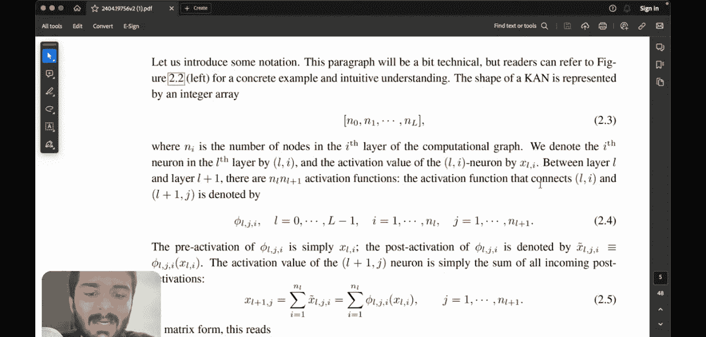

#  010：理解其数学原理

在本节课中，我们将深入探讨Kolmogorov-Arnold网络（KAN）架构背后的数学原理。我们将从回顾基本概念开始，逐步解析其数学表示和核心思想，确保初学者能够理解。

## 概述

上一节我们介绍了KAN与传统多层感知机（MLP）的直观区别。本节中，我们将深入其数学细节，理解其如何作为通用函数逼近器工作。

## 回顾：KAN与MLP的核心区别

在传统MLP中，神经元接收带权重和偏置的输入，通过激活函数决定是否“激活”。其核心公式可表示为：
`y = σ(Wx + b)`
其中，`W`是权重矩阵，`b`是偏置向量，`σ`是激活函数。

KAN架构则移除了神经元上的权重和偏置，取而代之的是在每两个神经元之间的连接上放置一个可学习的激活函数。这个函数用`Φ`表示。

## B样条函数简介

KAN使用B样条函数来近似这些连接上的激活函数。B样条函数是一种强大的工具，可以近似任何函数。以下是其关键参数：
*   **控制点数量**：记为`n+1`。
*   **阶数**：记为`k`。
*   **分段数量**：由公式`n + k - 2`给出。

例如，若`n=5`，`k=3`，则分段数量为`5 + 3 - 2 = 6`。这意味着我们可以在曲线上获得6个独立的可控制分段，类似于CAD软件中通过连接线段来绘制曲线的方式。

B样条基函数通常由一组曲线组成，通过它们的线性组合来构造最终的样条函数。

## Kolmogorov-Arnold定理与KAN的扩展

原始的Kolmogorov-Arnold定理指出，任何连续函数都可以用一个特定结构的两层网络精确表示。该网络第一层有`n`个输入神经元，第二层有`2n+1`个神经元，输出层有1个神经元。

然而，该定理要求函数是平滑的，这限制了其数十年来作为通用函数逼近器的应用。

KAN论文的核心贡献在于扩展了这个思想。作者提出，我们可以构建任意宽度和深度的KAN网络，使其能够作为通用函数逼近器，克服了原始定理的限制。

## 深入KAN的数学表示

现在，让我们深入KAN架构的数学细节。

### 网络层与函数符号

我们用`Φ`表示连接两层神经元的一维函数。具体地，`Φ_{l, j, i}`表示连接第`l`层的第`i`个神经元与第`l+1`层的第`j`个神经元的激活函数。

假设第`l`层有`n_in`个神经元，第`l+1`层有`n_out`个神经元。

在原始Kolmogorov-Arnold定理的语境下：
*   对于内层函数（第一到第二层），`n_in = n`，`n_out = 2n + 1`。
*   对于外层函数（第二到输出层），`n_in = 2n + 1`，`n_out = 1`。

### 网络形状表示

一个KAN网络的形状通常用一个整数数组`[n0, n1, ..., nL]`表示，其中`L`是总层数，`n0`是输入维度，`nL`是输出维度，中间的数字是各隐藏层的宽度。

例如，一个符合原始定理的两层网络（实际为三层：输入、隐藏、输出）可以表示为`[n, 2n+1, 1]`。若`n=2`，则网络形状为`[2, 5, 1]`。

### 激活值计算

我们用`x^{(l)}_i`表示第`l`层第`i`个神经元的激活值。第`l+1`层第`j`个神经元的激活值由前一层所有神经元通过其对应的激活函数`Φ_{l, j, i}`变换后求和得到：

`x^{(l+1)}_j = Σ_{i=1}^{n_l} Φ_{l, j, i}(x^{(l)}_i)`

其中，`n_l`是第`l`层的神经元数量。这个公式是KAN前向传播的核心。

## 总结

本节课我们一起学习了Kolmogorov-Arnold网络的数学基础。我们从其与传统MLP的区别出发，回顾了B样条函数作为其基础构建模块的作用。接着，我们探讨了原始的Kolmogorov-Arnold定理及其局限性，并理解了现代KAN如何通过构建任意深度和宽度的网络来克服这些限制，成为强大的通用函数逼近器。最后，我们深入了KAN的数学表示，包括其层间函数符号、网络形状描述以及核心的前向传播计算公式。掌握这些数学原理是理解和后续实现KAN架构的关键一步。