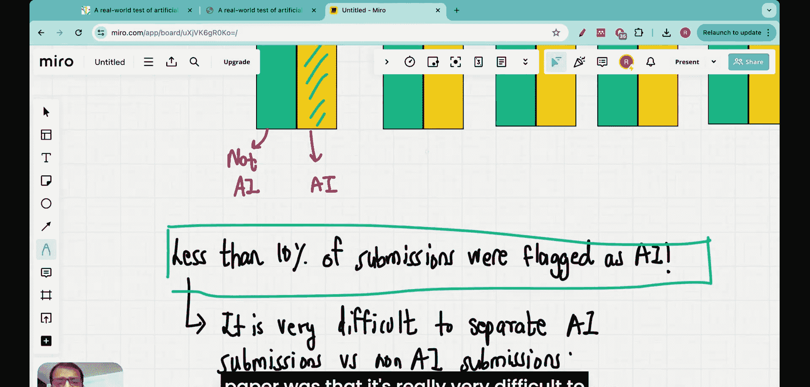
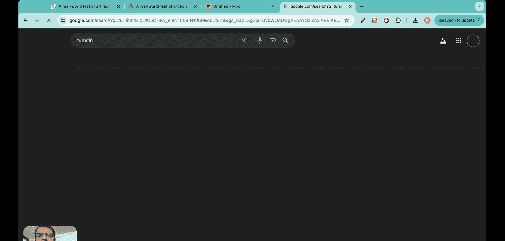
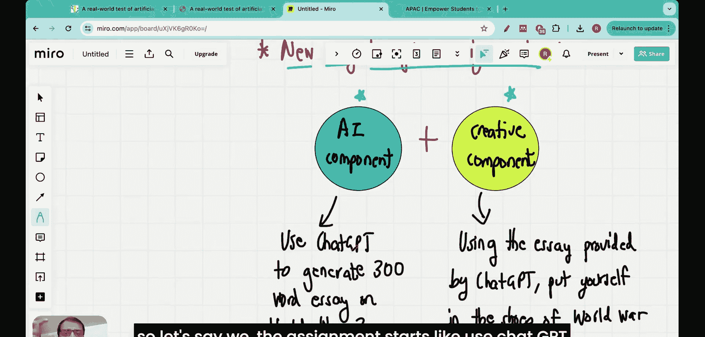

#  012：ChatGPT会终结学校作业吗？一篇研究论文评述

在本节课中，我们将深入探讨一篇近期发表的研究论文，它探讨了人工智能在大学考试系统中的实际渗透情况。我们将分析论文的核心发现，并思考人工智能将如何从根本上改变作业的布置与评估方式。

## 概述

两天前，一篇题为《人工智能对大学考试系统渗透的真实世界测试》的论文发布。阅读这篇论文时，我深感震撼。它清晰地表明，由于人工智能的出现，全球范围内的作业结构和考试结构正在发生彻底改变。我认真思考后认为，在未来五年内，给学生布置作业的方式、作业的评分方式以及家庭作业的批改方式都将完全改变。因此，我决定制作这个视频，分享我从论文中学到的内容，并阐述我对未来作业形式变化的看法。

我是Rajthan Decker博士，2017年毕业于印度理工学院马德拉斯分校，并于2022年在麻省理工学院获得人工智能领域的博士学位。

## 研究设计与方法

这篇论文的核心内容非常简单。作者们与英国一所特定的大学合作，重点研究了该大学的作业情况。他们使用人工智能（如ChatGPT）生成了一些作业答案，并将这些提交所获得的成绩与未使用ChatGPT撰写的正常提交进行了比较。

以下是研究方法的图示说明：

研究将作业分为五个模块：P1 M1, P1 M2, P2 M1, P2 M2, 和 P3 M1。在每个模块中，既包含真实的学生提交（非AI生成），也包含由作者自己使用AI生成的提交。关键之处在于，所有提交在批改时都是匿名的，评分者并不知道哪些提交来自AI，哪些来自学生。

论文中甚至提到了作者给ChatGPT使用的提示词，例如对于基于论文的答案，提示词是：“**包括对学术文献的引用，撰写一篇2000字的论文。**” 作者明确指出，他们并未试图让ChatGPT的答案听起来像人类写的。这些由ChatGPT生成的答案被直接提交给评分者。

## 核心发现：AI作业获得更高分

评分完成后公布的结果令人震惊。AI生成的提交 consistently（持续地）获得了比正常提交更高的分数。

让我们来看这个总结性的图表：

上图展示了五个模块的成绩对比。黄色条形代表AI生成答案的成绩中位数，绿色条形代表非AI生成（人类撰写）答案的成绩中位数。可以清楚地看到，在除模块5外的几乎所有模块中，黄色条形（AI）都高于绿色条形（人类）。这表明，AI生成的作业获得了显著更高的评分。

## 评分者难以识别AI作业

你可能会问：评分者难道分辨不出哪些是AI作业吗？这正是论文的第二个主要发现：评分者极难区分提交是由ChatGPT生成还是由人类撰写。事实上，被标记为疑似AI的提交比例不到10%。

以下是相关数据表格的图示：

在第一个模块中，被标记为AI的提交仅占6%。整体来看，所有被标记为AI的提交比例仅为6%左右。在上方的图表中，黄色条形（被标记为AI的比例）远低于蓝色条形（未被标记的比例）。这几乎意味着，评分者认为所有提交都是人类完成的，并在此基础上给AI作业打了更高的分数。

## 对现有检测工具的挑战

当我读到这些结果时感到极为震惊。想象一下，一个学生回家后用ChatGPT在5秒内完成作业并提交。如果老师无法识别这是AI作品，而这个学生反而获得了最高分，那么作业的意义何在？作业的主要目的是让学生练习并测试他们的理解程度。

这引发了我的思考：是否存在有效的AI文本检测工具？我探索了一些工具，例如著名的剽窃检测系统Turnitin。然而，进一步了解后发现，即使是Turnitin也不擅长识别哪些回答是由ChatGPT生成的。目前，没有任何工具能以100%的准确率区分AI生成数据和人类生成数据。随着GPT-5等更强大模型的出现，这个问题会愈发严重，因为AI生成的内容将越来越像人类。

## 未来作业的新范式

那么，布置作业的更好方式是什么？我认为最佳途径不是害怕AI或假设学生不会使用ChatGPT。相反，我们应该假设每个人都会使用它，并在此基础上构建新的作业形式。

新的教育体系应基于学生将使用大语言模型这一事实。我们需要训练他们高效地使用这些工具，并在其基础上发挥创造力。这类似于绘图员被计算机辅助设计（CAD）取代的过程：它并不意味着工作岗位消失或创造力丧失，而是意味着掌握CAD技能的工程师获得了更多机会。

因此，未来的作业设计应包含两个核心组成部分：

1.  **AI组件**：明确要求学生使用AI工具完成部分基础工作。
2.  **创意组件**：要求学生在AI产出的基础上，进行批判性思考、分析、整合或创新。

例如，一份作业可以这样开始：“**使用ChatGPT生成一篇关于第二次世界大战的300字概述。然后，基于该概述，从以下三个角度中任选一个，撰写一篇500字的分析文：（1）比较AI生成内容与你从教科书中学到信息的异同；（2）指出AI概述中可能存在的史实偏见或遗漏，并说明理由；（3）设计一个AI可能无法回答的、关于二战伦理影响的深入问题，并阐述你的思考过程。**”

## 总结

本节课我们一起探讨了一篇关于AI在大学作业中应用的研究论文。核心发现是：AI生成的作业不仅难以被识别，而且经常获得比人类作业更高的分数。这揭示了当前教育评估体系面临的严峻挑战。作为应对，我们不应禁止AI，而应重新设计作业，将其视为一个“AI+创意”的结合体，从而培养学生驾驭AI工具并在此基础上进行创新思考的能力，为他们适应未来世界做好准备。