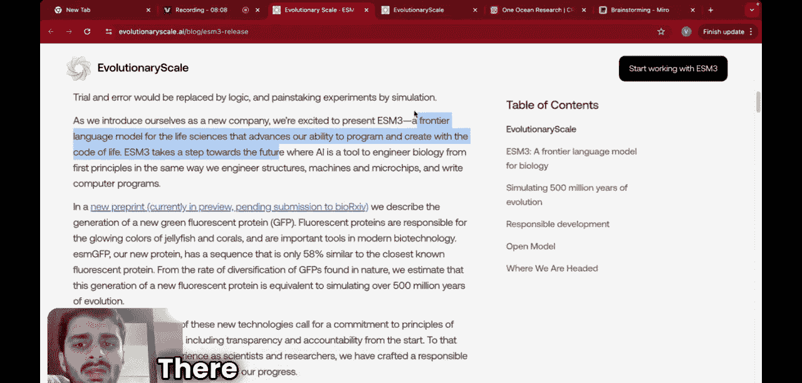

#  014：使用大语言模型模拟进化与合成蛋白质


在本节课中，我们将探讨人工智能与大语言模型领域的一项前沿进展：如何利用这些技术来模拟漫长的生物进化过程，并合成全新的蛋白质。我们将从蛋白质的基础知识开始，逐步理解这一复杂而迷人的研究。

## 蛋白质：生命的基石

首先，我们来了解一下蛋白质。蛋白质是我们身体的基本构成单元，每一种蛋白质都被设计来执行特定的功能。这些功能包括消化食物、驱动肌肉运动、对抗疾病等。身体的每一项功能都可以映射到一个或一系列特定的蛋白质。

蛋白质由一系列氨基酸构成。自然界中存在20种不同的氨基酸，每一种蛋白质都拥有其独特的氨基酸组合与排列顺序，这被称为蛋白质的**序列**。

在我的博士研究后期，我专注于研究一种特殊的蛋白质——**单克隆抗体**。对于无法自行产生足够抗体来抵抗疾病的人群，医生会注射这种人工制造的抗体来帮助对抗疾病，这在COVID-19疫情期间尤为重要。

单克隆抗体具有独特的**Y形结构**。在这个结构中，氨基酸分布在不同的结构域内。我想强调的是，每一种蛋白质都拥有其独特的**序列**、**三维结构**以及**功能**。例如，单克隆抗体的功能就是抵御入侵我们身体的病毒。

## 漫长的进化与当前的挑战

这些蛋白质是通过数百万年甚至数十亿年的进化过程形成的。进化之所以如此漫长，是因为**突变**。以抗体为例，最初可能只有一个结构域，经过数个世纪演化出两个，再慢慢学会连接成Y形，最终形成完整的抗体。这是一个自然选择的过程：每一个突变都被检验，只有有益的突变才会被保留并传递给后代。

这个过程极其耗时。在实验室中，科学家想要合成一个具有全新序列和结构的新蛋白质是非常困难的。此外，另一个关键问题是：如何根据已知的序列来预测其三维结构？这并非易事。谷歌发布的AlphaFold模型利用AI解决了这个问题，是结构预测领域的一次革命。

## 核心问题：能否用AI模拟进化？

现在，我们提出一个核心问题：**我们能否模拟进化？** 这个问题听起来有些奇怪，因为进化是一个极其漫长的自然过程。我的意思是：**我们能否跳过这数百万年的进化时间，仅仅通过理解数据来预测全新的蛋白质？**

其核心概念是：我们收集世界上所有已知蛋白质的**序列**、**结构**和**功能**，构建一个庞大的数据库。然后，我们将这些数据输入一个**大语言模型**，从而开发出预测新蛋白质结构和功能的能力。

## 大语言模型如何应用于蛋白质？

这听起来合理吗？大语言模型通常处理的是句子，例如“I am learning AI”。模型会计算不同单词之间的**注意力**，编码整个句子，然后用于翻译或预测下一个单词等任务。

那么，如何将同样的逻辑应用于具有复杂三维结构的蛋白质呢？本质上，我们希望思考如何利用大语言模型，基于庞大的蛋白质数据仓库来预测新蛋白质，从而模拟进化过程。

我曾认为这不太可能，但最近的一项研究更新解决了这个问题。

## 前沿模型：ESM3

研究人员提出了一个名为 **ESM3** 的模型，这是一个用于生物学的“前沿语言模型”。它提升了我们利用“生命密码”进行编程和创造的能力。简单来说，他们正在使用大语言模型来生成全新的蛋白质。

我想展示一个非常酷的应用实例。有一类蛋白质叫做**绿色荧光蛋白**。当你看到那些拥有美丽色彩的发光水母时，正是这类蛋白质赋予了它们颜色。

这类蛋白质在自然界中很稀有，科学家也一直难以在实验室中合成这类全新的蛋白质。通常，我们只有在自然界中发现时，才知道又出现了一种新的GFP。

而ESM3模型做到了什么？它生成了一种全新的绿色荧光蛋白，其与已知最接近的荧光蛋白的序列相似度**仅有58%**。

## 低相似度的意义

低相似度意味着什么？它意味着我们预测了**进化尚未达到的某种形态**，我们预测了远在未来的事物。如果你观察模型生成的蛋白质结构，会发现它与已知结构有显著差异。相似度越低，意味着需要发生的突变越多、进化所需的时间跨度越长。58%的相似度相当低，这表明该模型在某种程度上模拟了**遥远的未来进化**，这正是ESM3作者们所实现的成就。



## 模型训练与原理

该模型是如何训练的呢？它是在一个规模空前的蛋白质序列、结构和功能数据库上进行训练的。模型学习这些数据中隐含的复杂模式和规则。其核心在于，它将蛋白质的序列和结构信息都转化为一种模型能够处理的“语言”。通过预测被掩盖的氨基酸或结构片段，模型学会了蛋白质构成的“语法”和“语义”，从而能够生成合理且全新的蛋白质设计。


以下是其工作原理的简化示意：
```python
# 概念性伪代码，展示ESM3的生成思路
输入： 已知蛋白质数据库 (序列+结构+功能)
过程： 大语言模型学习蛋白质构成的“语言规则”
输出： 生成全新的、符合生物学规律的蛋白质设计 (新序列 -> 预测新结构 -> 推测新功能)
```

## 总结

本节课我们一起学习了：
1.  **蛋白质的基础**：理解蛋白质是拥有特定序列、结构和功能的生命基本单元。
2.  **进化的挑战**：认识到自然进化蛋白质是一个极其漫长的过程，而实验室合成新蛋白则非常困难。
3.  **AI的新思路**：探讨了能否利用大语言模型，通过分析海量已知蛋白质数据来“模拟进化”，直接预测和设计新蛋白质。
4.  **ESM3模型**：介绍了一个前沿的生物语言模型ESM3，它能够生成与已知蛋白相似度很低的全新蛋白质（如新型绿色荧光蛋白），这相当于在计算中模拟了漫长的进化历程。


这项研究展示了人工智能在理解和创造生命基本组件方面的巨大潜力，为药物研发、材料科学等领域开辟了全新的可能性。