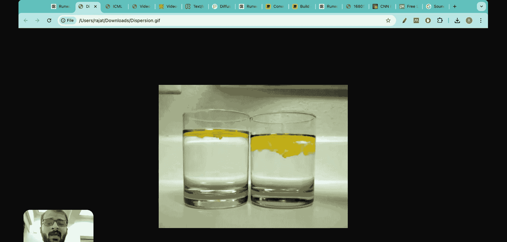
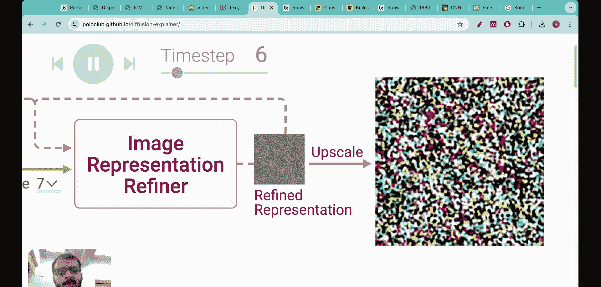
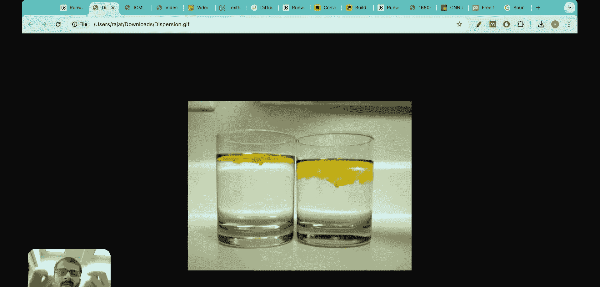
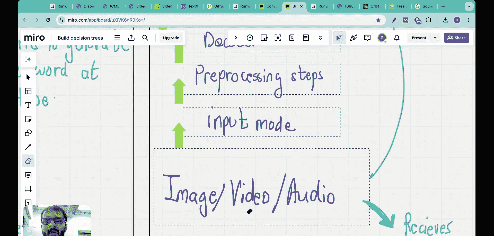
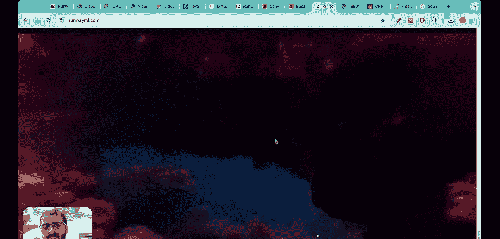
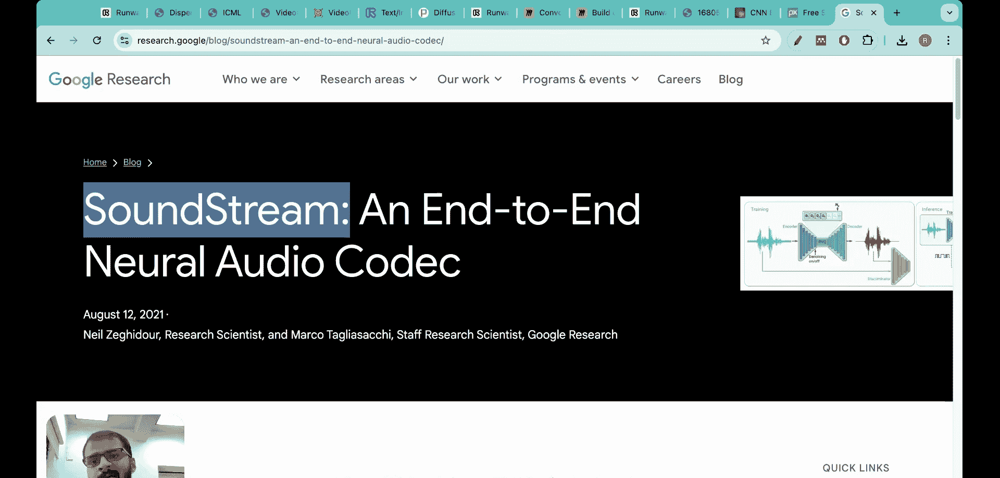
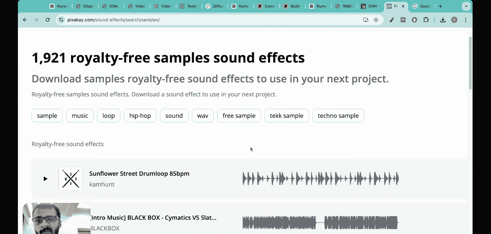
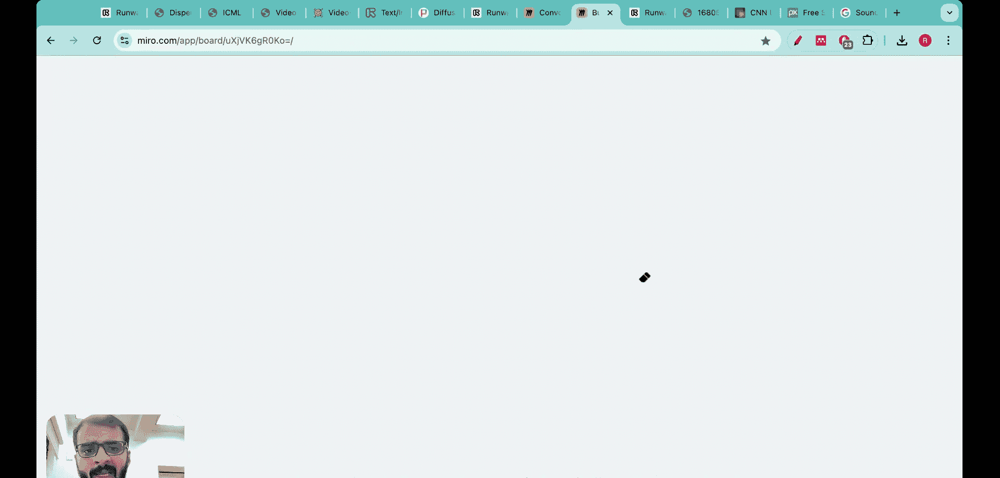

#  015：语言模型能否超越扩散模型？ICML 2024最佳论文解读

在本节课中，我们将要学习一篇获得ICML 2024最佳论文奖的研究《VideoPoet》。这篇论文探讨了使用**大语言模型**来生成视频，并挑战了当前主流的**稳定扩散**技术。我们将以简单直白的方式，拆解其核心技术思想。

观察这段视频。它看起来非常出色。看起来非常逼真。看起来非常具有沉浸感。

这段视频是由AI生成的。目前大多数现代AI生成视频都源自一项名为**稳定扩散**的技术。它之所以被称为“扩散”，是因为生成过程始于一张看起来像随机噪声的图像，然后图像质量逐步提升。将一系列这样的图像堆叠在一起，AI就能生成你所看到的精彩视频。

在机器学习顶级会议ICML 2024上，获得最佳论文奖的论文名为《VideoPoet》。研究者的核心观点是：稳定扩散技术虽然不错，但我们为何不直接使用**大语言模型**来生成基于AI的视频？他们证明了这种方法可以优于稳定扩散。既然语言模型能做得更好，我们为何还需要扩散模型？这就是他们获奖的核心思想。他们还发布了一个名为“Caed VideoPoet”的网站，将其称为“用于零样本视频生成的大语言模型”。你可以看到他们创造的精彩AI视频。这些视频并非基于稳定扩散，而是与ChatGPT生成文本同源，都是通过**大语言模型**生成的。这非常出色。在本视频中，我们将解析这篇论文的工作原理及其开发的技术框架，以便你以一种简化易懂的方式建立理解。让我们开始吧。我是Raj Danandeer博士，于2022年从麻省理工学院获得机器学习博士学位。自那时起，我的使命就是制作这些AI视频，让AI技术对所有人变得触手可及。

这篇名为《VideoPoet》的论文获得了ICML 2024最佳论文奖。它是一篇20页的论文，但写得非常精彩，我阅读时感到十分愉快。

首先，让我从目前最先进的文本生成视频AI软件或公司之一开始介绍，那就是Runway ML。我在这里上传了我的照片，并要求AI让我的头从左向右移动。以下是它生成的结果。看起来不太像我，但这仍然很酷。这是一段看起来有点像我的视频，画面从左向右移动。非常棒。制作这样的视频需要我们依赖一项名为**稳定扩散**的技术。这项技术的工作原理是：首先，将视频分解成一系列图像帧，然后处理每一帧图像。处理单张图像的方式是：首先你有一个提示词，例如“让头从左向右移动”。这个提示词随后被应用于每一张独立的图像。当应用于一张图像时，首先生成一个图像表示，它看起来像随机噪声，如这里所示。然后，随机噪声逐步改善，开始看起来像右边的图像。在右侧，观察这个兔子的动画，它从随机噪声开始，然后变得越来越好。

这种从随机性到更精细、更统一状态的转变，模糊地类似于化学物质在流体中发生的扩散过程。因此，这项技术被称为**稳定扩散**。

大多数现代AI生成视频都基于**稳定扩散**技术。即使是Runway生成的这类视频也基于稳定扩散。

《VideoPoet》论文的作者们提出的核心问题是：我们能否使用**大语言模型**进行视频生成？我们为何必须依赖稳定扩散？让我们进一步深入探讨。

当我们审视大语言模型时，GPT模型的构建有特定的方式。有一个过程称为**预训练**，还有一个过程称为**微调**。首先，有一个庞大的数据语料库，例如互联网文本、书籍、媒体、研究文章等。这些数据被分解成**词元**，目前你可以将它们理解为独立的单词。然后，我们在这些词元上训练一个大语言模型，以便能够预测下一个单词。这个训练过程基于数十亿的数据。给你一个背景信息，GPT-3的训练花费了460万美元。这些预训练模型被称为**基础模型**。之后我们进行微调。例如，如果你是一家生产级公司，想要获得更好的性能，你可以在自己特定的数据集上对预训练的大语言模型进行微调。

因此，这是训练大语言模型的常规步骤序列。在预训练阶段，由于它利用句子本身的结构来构建训练数据，并将下一个词元用作测试，因此通常被称为**自回归方法**。同时，因为它是一种无监督学习，在一次迭代中预测出的下一个单词会在下一次迭代中用于训练，所以它既是自回归的，也是无监督的。

这些是训练大语言模型通常涉及的步骤，其架构本身看起来类似这样。

这里有一个GPT架构的示意图。你有一段示例文本，例如：“This is an example of how LLM can ____”。这段示例文本被转换为词元。这些词元被输入到**解码器**中。解码器生成它预测的输出文本：“This is an example of how LLM can perform.”。这是一个仅包含解码器的Transformer架构，它没有编码器。

现在，《VideoPoet》的作者们提出的想法是：如果我们使用完全相同的方法论，并将其应用于图像、视频和音频，会怎么样？例如，这里不是不完整的文本，而是不完整的图像、视频和音频。然后我们遵循相同的步骤：将它们通过预处理步骤（即**词元化**），然后输入解码器，最后查看生成的最终输出。这就是这篇论文在最基本层面上所做的全部工作。你获取图像、视频和音频，将它们分解成独立的词元，将这些词元传递给解码器，然后得到最终输出，即图像、视频或音频。这非常简单，并且完全遵循了训练如GPT这样的大语言模型所采取的步骤。

但你需要问自己的真正问题是：如何将这些不同的模态转换为词元？因为对于大语言模型使用的大段文本数据，我们可以将词元视为独立的单词，这有一定的理解基础。但是，以视频为例，你如何将其转换为词元？

图像相对容易思考，你只需获取一张图像，它被分解为像素表示，也许这些像素就是词元。但事实果真如此吗？视频和音频的词元化又是怎样的？让我们进一步探讨。

以这段视频为例。

假设我们想要对这段视频进行词元化。具体做法是：首先，将视频分解成一系列图像帧。每一帧图像通过一个**卷积神经网络**。卷积神经网络为每一帧图像生成一个**特征图**。然后，这个特征图本质上被分解成词元。对每一帧图像都进行同样的操作，这就是你获得视频词元化表示的方式。同时，时间戳信息也被编码在这种词元化过程中，你需要知道哪一帧在前，哪一帧在后。这就是图像和视频的编码方式。

对于音频，则有不同的方法。假设你有一段如下所示的音频样本，处理方式是：谷歌开发了一种名为**SoundStream**的音频编码器。你将这段音频样本通过这个SoundStream神经网络，它会将其降维到一个更低维度的空间，然后我们从那里获得编码音频的词元。

因此，通过像SoundStream这样的方法以及我刚才展示的视频处理方法，我们实际上可以将图像、视频和音频全部转换为词元。一旦它们被转换为词元，就被传递到解码器中，然后完全遵循与GPT架构相同的步骤。

这是一个非常简单却又绝妙的想法，这些研究者已经将其实现。当我查看他们生成的视频时，效果确实令人惊叹。看看其中一些视频，这些纯粹是由大语言模型完成的，这里没有使用稳定扩散技术。

本节课中我们一起学习了《VideoPoet》论文的核心思想：将图像、视频和音频等不同模态的数据统一**词元化**，然后利用类似GPT的**仅解码器Transformer架构**进行自回归预测，从而生成高质量视频。这种方法挑战了以**稳定扩散**为代表的现有主流视频生成范式，展示了**大语言模型**在跨模态生成任务中的巨大潜力。其关键在于设计有效的编码器（如CNN用于图像/视频，SoundStream用于音频）将原始数据转换为离散词元序列，从而适配语言模型的训练和推理框架。