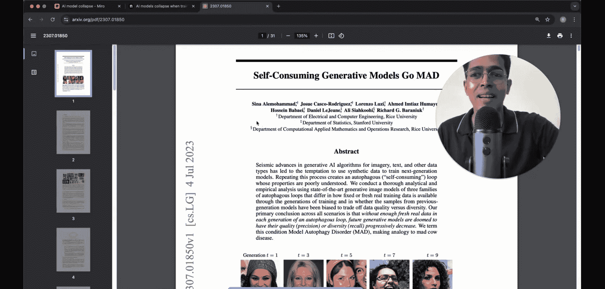
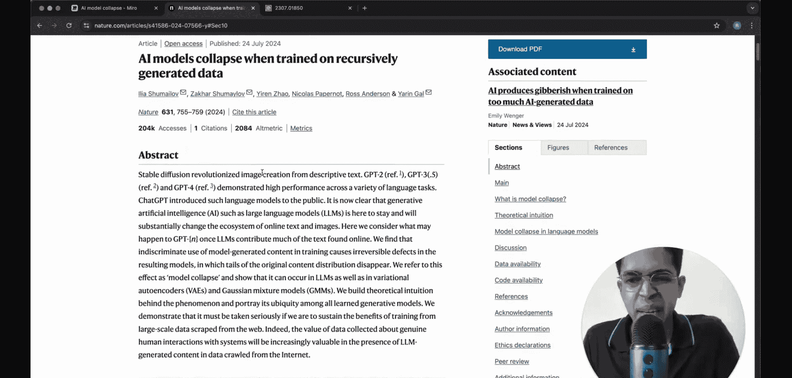
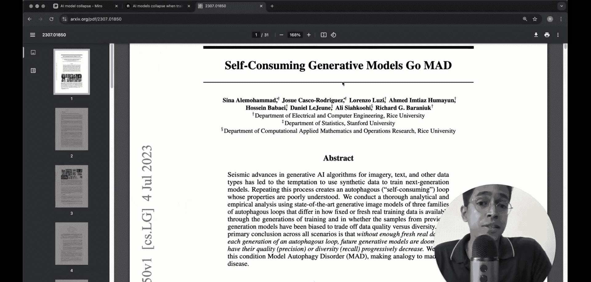
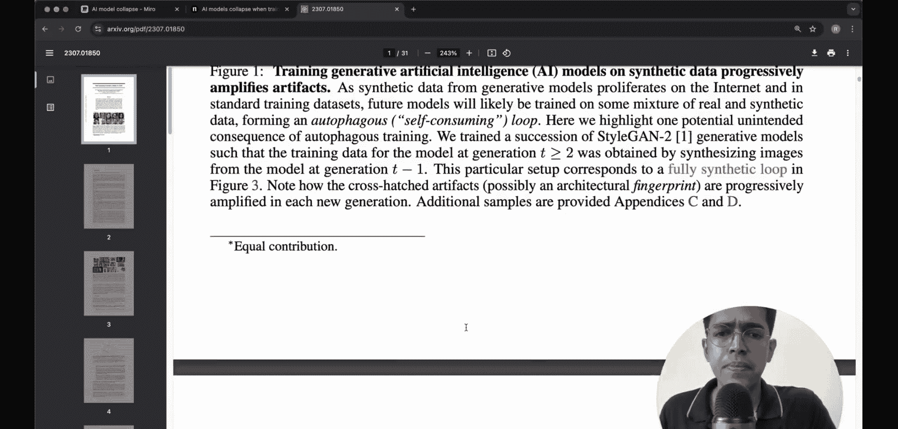

#  016：递归生成数据导致AI模型崩溃

在本节课中，我们将要学习一篇近期发表在顶级期刊《自然》上的论文。这篇论文探讨了一个核心问题：当生成式AI模型在自身递归生成的数据上进行训练时，会发生什么？我们将深入理解“模型崩溃”这一概念，并通过简单的类比和示例，解释其背后的原理与潜在影响。

## 论文背景与核心问题

这篇论文探讨了生成式AI模型在递归生成数据上训练时出现的“模型崩溃”现象。在制作本视频时，该论文仅发表了两周，是一个非常新颖且有趣的研究。

除了这篇《自然》论文，我们还将参考另一篇大约一年前发表在arXiv上的论文，题为“自消耗生成模型如何走向疯狂”。我们将具体解释“疯狂”一词在此语境下的含义。

## 生成式AI的训练数据来源

在深入探讨论文观点之前，我们需要先理解生成式AI模型（如大语言模型或图像生成模型）是如何训练的。

它们大多是在互联网数据上进行训练的。互联网上存在海量的数据，其中一部分被用作生成式AI的训练数据。但真正的问题是：如果互联网数据本身已经包含了大量AI生成的内容呢？

例如，新闻机构使用ChatGPT撰写文章。想象这种情况持续10到20年，互联网数据中AI生成内容的比例可能会非常高。如果达到80%，那么未来的AI模型实质上就是在训练由它们的“父辈”模型生成的数据。这可能会导致某些问题。

## 类比理解：传话游戏与笔记抄袭

我们可以通过两个简单的类比来理解这个问题。

**第一个类比是传话游戏。** 在这个游戏中，第一个人说一句话，然后依次传给下一个人。当这句话传到第15个人时，内容可能已经变得面目全非，与最初版本完全不同。AI生成数据，然后下一代AI在此数据上训练的过程，在某种程度上就类似于这个传话游戏。

**第二个类比是课堂笔记抄袭。** 想象一下，第一个学生听老师讲课并记下笔记。第二个学生抄袭第一个学生的笔记，第三个学生抄袭第二个学生的，以此类推。当第40个学生拿到笔记时，其中可能累积了前面所有学生在抄写过程中产生的错误。AI在自身生成的数据上训练，情况与此非常相似。

## 模型崩溃的机制

现在，让我们具体看看《自然》论文中提出的“AI模型崩溃”概念。

论文提出了一个设想：我们目前有GPT-2、GPT-3、3.5、4等模型。如果我们有第N代GPT或任何其他大语言模型，它会如何表现？

论文中的示意图展示了这个过程：
*   **初始数据**是真实的人类生成数据，用于构建第0代模型。
*   这个模型能够生成新数据。
*   用于训练第1代模型的样本数据将包含一些“虚假”数据（即由生成式AI模型生成的数据）。
*   这个过程持续进行，直到构建第N代模型。

论文假设了两种情景：
1.  下一代模型的训练数据100%是合成的（即由上一代模型生成），不包含任何原始真实数据。
2.  下一代模型的训练数据中，有10%来自上一代的原始训练数据，其余90%是合成数据。

论文探讨的核心问题是：如果这个过程持续N代，模型的性能会发生什么变化？其输出是否还有意义？

## 实际案例：图像生成模型的“疯狂”

一个能让你快速联想到的应用是图像生成模型的训练。去年（2023年）发表的一篇题为《自消耗生成模型走向疯狂》的论文就展示了这一点。

以下是该论文展示的现象：
*   假设一个生成式AI模型能够生成逼真的人脸图像（第一代）。
*   如果使用这些AI生成的人脸图像来训练下一代模型，并持续多代。
*   随着代际推进，图像中会出现并放大某些不自然的伪影或特征。例如，人脸可能出现类似部落纹面或烧伤的、不自然的痕迹。
*   虽然最初几代生成的图像看起来很真实，但后续几代的图像会明显出现问题。

这表明，即使初始的合成数据看起来非常逼真，在递归训练过程中，模型也会逐渐放大数据分布中的微小偏差或错误，最终导致输出质量严重下降。

## 文本生成的例子

这种现象不仅限于图像。论文中也展示了一个文本生成的例子。

他们使用了一个名为OPT-125M的模型。以下是一个原始输入段落：
> “在1360年之前，这通常由一位石匠大师和一小队学徒与石匠完成。”

然后，他们观察基于此输入、在不同代际模型上生成的输出质量。从第1代、第2代到后续代际，生成文本的连贯性和语义质量逐渐恶化，最终可能变得毫无意义。

## 总结

本节课中，我们一起学习了“模型崩溃”这一重要概念。当生成式AI模型在自身递归生成的数据上进行训练时，即使初始数据质量很高，模型也会在迭代过程中逐渐放大数据分布中的错误和偏差。这类似于传话游戏中信息的失真，或笔记抄袭中错误的累积。最终，模型的输出会偏离现实，质量严重下降，甚至产生无意义的“疯狂”结果。理解这一现象对于思考AI数据的长期管理、模型训练策略以及未来人工智能的健康发展至关重要。