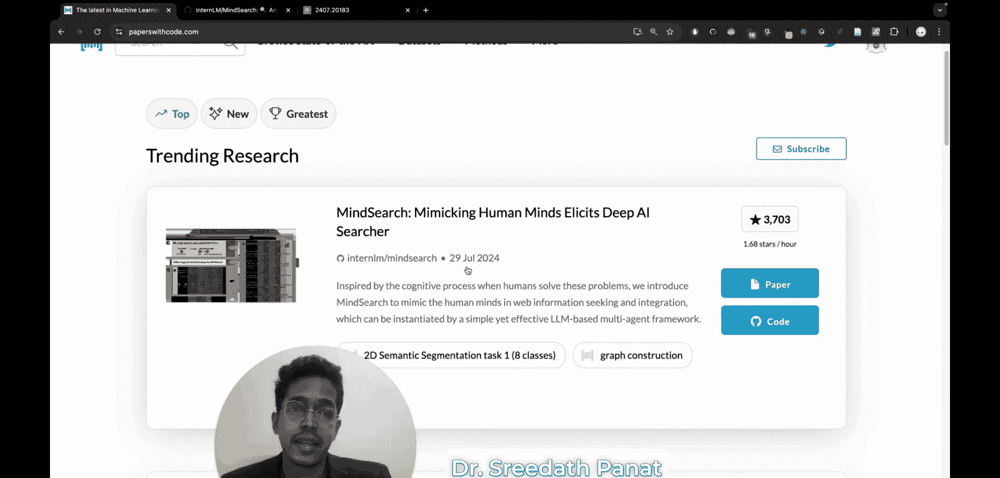
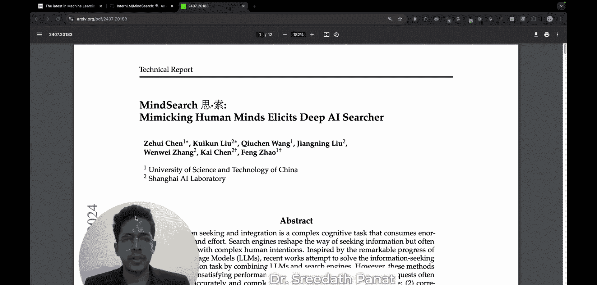
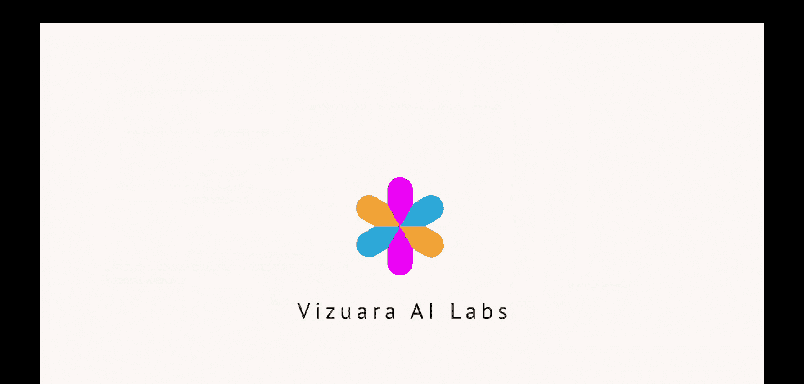

#  017：MindSearch - 模仿人脑以优化AI搜索 | 研究论文解读

## 概述

在本节课中，我们将深入解读一篇名为“MindSearch”的最新研究论文。这篇论文探讨了如何通过模仿人脑处理信息的方式，将搜索引擎与大型语言模型相结合，从而为用户提供更高质量、更高效的搜索答案。我们将解析其核心思想、面临的挑战以及提出的创新解决方案。

---

## 搜索引擎与AI助手的现状

如果你曾使用ChatGPT从互联网获取结构化的答案，那么你本质上是在使用一个结合了搜索引擎和大型语言模型的系统。搜索引擎可能是Bing，而大型语言模型可能是GPT-3.5或你正在使用的任何GPT模型。

本视频旨在解读一篇最近发表在arXiv上的论文。这篇论文研究的是，如何模仿人类思维或大脑的工作方式，并将其与“搜索引擎+大型语言模型”的方法相结合，从而为你的搜索查询提供更高质量的答案。

我是Shida Panak博士，来自MIT的博士。这堂课对我而言非常特别，因为当我在paperswithcode.com上看到这篇出色的论文时，我立刻想深入讨论并制作这个视频。我详细研读了这篇论文。它于7月29日刚刚发表，在录制本视频时还不到两周，但它在paperswithcode.com上已经获得了3.7k星标，其对应的GitHub仓库也获得了3.7k星标和大量的分支。

这篇由一组中国研究人员发表在arXiv上的论文，提出了“思维搜索”的概念。在本讲座中，我们将深入探讨这篇论文，并尽可能以简单易懂的方式讲解，让你也能理解这种模仿人脑以模块化方式搜索信息的“思维搜索”理念。

---

## 谷歌搜索 vs. ChatGPT

谷歌搜索与ChatGPT的主要区别在于，谷歌仅以网页链接的形式提供搜索结果。它不会分析信息并以易于理解的方式呈现给你。但谷歌能从互联网上为你提供最相关的网页，让你可以自行访问网页、阅读信息并理解内容。

另一方面，当你使用结合了大型语言模型的谷歌搜索（如ChatGPT或GPT模型）时，你可以直接从互联网获得搜索查询的答案。谷歌负责搜索，GPT则分析从搜索结果中获得的信息，并以非常易于理解的方式呈现给你。

但是，这种方法存在一些问题，我们稍后将进行讨论。

---

## MindSearch论文的核心目标

这篇关于MindSearch的论文所关注的核心思想是：**如何将搜索引擎、大型语言模型与人脑获取信息的方式三者结合起来**，从而为搜索查询提供更好、更高效的响应？

---

## 传统搜索引擎的优势与局限

如果我们只看谷歌搜索，谷歌所做的伟大之处在于其算法非常出色，无论你的搜索查询是什么，它都能以网页形式从互联网上提供最佳的可能信息。谷歌根据网页与搜索查询的相关性对网页进行排名。

这就是为什么许多公司在搜索引擎优化上投入大量资金，SEO是一个非常重要的事情。谷歌不会篡改信息，因此以网页形式出现的搜索结果，其网页内容会原样呈现。只要这些网页中的内容是准确的，谷歌搜索基本上就能提供高准确度的结果。

但问题是，谷歌搜索引擎**无法整合信息**。这意味着它无法解释这些网页的内容，并直接给出你查询的答案。它做不到这一点。你必须自己阅读和理解信息。你需要从这些网页中解读内容，如果需要花费三小时详细阅读六个相关网页，那也是你需要完成的工作。你必须自己寻找信息，并在搜索某事物以做决策时，自行做出决定。

---

## 结合LLM与搜索引擎

如果将大型语言模型与搜索引擎结合，你就能兼得两者之长。搜索引擎在**寻找信息**方面非常出色，但它们无法整合信息。而大型语言模型在**解释语言和推理**方面具有惊人的能力。将这两者结合，你就能获得最佳效果。

但是，这篇论文讨论了这种结合方式面临的一些挑战，具体如下。

---

## 当前结合方式面临的挑战

在大型语言模型中，存在一个称为**上下文长度**的概念。你可能已经注意到，在ChatGPT中，如果你粘贴一大段文字（甚至是从教科书复制的内容），它很难处理如此大量的信息，这对它来说太大了，无法处理。这就是由于上下文长度的限制。

尽管GPT的后续模型或更现代的大型语言模型的上下文大小在增加，但这仍然是一个限制。基本上，当你在搜索并得到成百上千个网页结果时，不仅存在大量噪音，而且因为这些页面中的信息量巨大，大型语言模型会不堪重负，因为有太多的搜索结果需要处理。

此外，如果出于某种原因，你提出的问题有点复杂，搜索引擎可能无法非常准确地检索结果。它实际上可能误解你的意图。你可能已经注意到，你问的是一件事，但搜索引擎提供的却是另一回事作为回应。

那么，我们能做些什么来解决这个挑战呢？

---

## 模仿人脑的解决方案

我们可以尝试模仿人脑。在这个背景下，人脑有什么特别之处呢？让我们看一个我们生活中可能试图解决的简单问题：假设我们想买一辆新车，我们如何决定买哪辆车？或者我们如何找到与此相关的信息？

让我们看看，作为人类，我们是如何做出这个决定或找到与购车相关的信息的。

1.  **首先定义需求**：这辆车是只为你和你的伴侣或孩子旅行用，还是仅仅用于短距离上下班通勤，或是用于长途旅行？它应该是重型车吗？等等。
2.  **获取初步信息**：然后，你尝试获取与你的每个独立需求相对应的基本信息。
3.  **重新定义约束**：基于获得的信息，你可能会重新定义你的约束条件。例如，你可能说过你想要某个排量的发动机，预算是多少等等，但一旦你获得基本信息，你可能会因为注意到预算超出限制而重新定义对发动机排量的约束。
4.  **学习与迭代**：在你重新定义约束或改变需求后，你会学习到更多信息。
5.  **整合与决策**：在这个迭代过程结束时，你将有很多选项可以比较。你整合所有这些作为迭代过程结果获得的信息，然后做出购买哪辆车的决定。

所以，我们并不是以线性方式进行，也不是一次性考虑所有信息。我们是**顺序地**获取与我们可能拥有的各个需求相关的信息，然后做出决策。

---

## 用图网络表示思维过程

这个完整的过程可以用一种迷人的称为**图网络**的东西来表示。

如果我们的最终目标是确定我们要购买的汽车类型，这个决定可能由几个参数决定：预算可能是一个因素，汽车品牌、汽车功能、转售价值、购买目的等，所有这些都将影响购买哪种车型的决定。

现在，在品牌内部，品牌可以影响功能，功能和品牌可能影响转售价值。你购车的用途将决定所需的功能，因为如果你用于重型任务，你可能需要某些特定的功能集。你需要的功能现在可能影响你的预算，品牌也是如此。

这就像一个复杂的子查询网络，关联着一个简单的查询：“我想买一辆车每天开车上班，我的预算是120万卢比，我想要一辆马鲁蒂汽车，请告诉我该买哪种车型。”这是一个简单的查询，但有许多其他复杂的子查询我们需要寻找答案，而且不知何故，所有这些子查询都以某种方式相互关联。这个相互关联的信息网络最终共同决定了你的决策。

这就是人脑映射信息的方式，它以**模块化**的方式进行组织。

---

## 总结

本节课我们一起学习了“MindSearch”这篇论文的核心思想。我们探讨了传统搜索引擎与结合大型语言模型的AI助手各自的优缺点，指出了当前结合方式在上下文长度和信息过载方面的挑战。论文提出的创新解决方案是模仿人脑处理复杂决策的模块化、迭代式过程，并使用图网络来表示这种复杂的子查询关联关系。通过将人脑的思维模式融入AI搜索，旨在实现更高效、更准确的信息检索与答案生成。